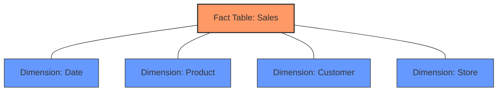
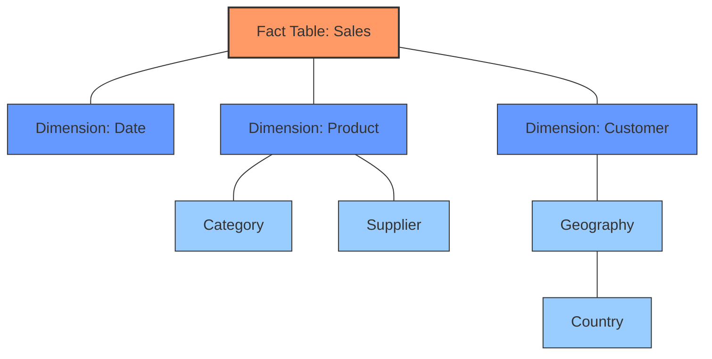

# Star Schema

## Introduction

A Star Schema is a fundamental database design pattern used in data warehousing and business intelligence. Named for its resemblance to a star when visualized, this schema organizes data into one central fact table surrounded by multiple dimension tables. This design optimizes database systems for reporting and analysis rather than transaction processing.

If you're working with data warehouses, understanding the Star Schema is essential as it forms the foundation of dimensional modeling techniques that power efficient data analysis and business intelligence systems.

## What is a Star Schema?

The Star Schema is a specialized database design that:

- Simplifies complex data relationships
- Optimizes query performance for analytical operations
- Organizes data in an intuitive way for business users
- Facilitates faster data retrieval compared to normalized database designs

The structure consists of:

1. A central **fact table** containing business measurements or metrics
2. Multiple **dimension tables** joined to the fact table via foreign keys

Let's visualize this structure:



## Components of a Star Schema

### Fact Table

The fact table is the central table in a star schema that contains:

- **Business measurements** (facts): Quantitative data such as sales amount, quantity sold, profit, etc.
- **Foreign keys**: References to dimension tables
- **High volume data**: Typically contains millions or billions of rows
- **Numeric values**: Mostly contains numeric measures that can be aggregated

Example of a fact table structure:

```sql
CREATE TABLE fact_sales (
    sale_id INT PRIMARY KEY,
    date_key INT FOREIGN KEY REFERENCES dim_date(date_key),
    product_key INT FOREIGN KEY REFERENCES dim_product(product_key),
    customer_key INT FOREIGN KEY REFERENCES dim_customer(customer_key),
    store_key INT FOREIGN KEY REFERENCES dim_store(store_key),
    sales_amount DECIMAL(10,2),
    quantity_sold INT,
    discount_amount DECIMAL(10,2),
    profit_amount DECIMAL(10,2)
);
```

### Dimension Tables

Dimension tables provide the context for the facts and contain:

- **Descriptive attributes**: Textual descriptions and characteristics
- **Primary keys**: Unique identifiers that serve as foreign keys in the fact table
- **Hierarchical relationships**: Often contain hierarchical data (e.g., Country > State > City)
- **Lower volume data**: Generally smaller than fact tables
- **Denormalized data**: Often contain redundant data to improve query performance

Example of a dimension table structure:

```sql
CREATE TABLE dim_product (
    product_key INT PRIMARY KEY,
    product_id VARCHAR(50),
    product_name VARCHAR(100),
    category VARCHAR(50),
    subcategory VARCHAR(50),
    brand VARCHAR(50),
    color VARCHAR(30),
    size VARCHAR(20),
    weight DECIMAL(5,2),
    unit_price DECIMAL(10,2)
);
```

## Real-World Example: Retail Sales Analysis

Let's walk through a complete example of a star schema for a retail business:

### Fact Table: Sales

```sql
CREATE TABLE fact_sales (
    sales_key INT PRIMARY KEY,
    date_key INT,
    product_key INT,
    store_key INT,
    customer_key INT,
    promotion_key INT,
    quantity INT,
    unit_price DECIMAL(10,2),
    discount_percent DECIMAL(5,2),
    total_amount DECIMAL(10,2),
    profit DECIMAL(10,2),
    FOREIGN KEY (date_key) REFERENCES dim_date(date_key),
    FOREIGN KEY (product_key) REFERENCES dim_product(product_key),
    FOREIGN KEY (store_key) REFERENCES dim_store(store_key),
    FOREIGN KEY (customer_key) REFERENCES dim_customer(customer_key),
    FOREIGN KEY (promotion_key) REFERENCES dim_promotion(promotion_key)
);
```

### Dimension Tables

#### Date Dimension

```sql
CREATE TABLE dim_date (
    date_key INT PRIMARY KEY,
    date DATE,
    day_of_week VARCHAR(10),
    day_number_in_month INT,
    day_number_in_year INT,
    week_number_in_year INT,
    month_name VARCHAR(10),
    month_number INT,
    quarter INT,
    year INT,
    is_weekend BOOLEAN,
    is_holiday BOOLEAN,
    holiday_name VARCHAR(50)
);
```

#### Product Dimension

```sql
CREATE TABLE dim_product (
    product_key INT PRIMARY KEY,
    product_id VARCHAR(20),
    product_name VARCHAR(100),
    description TEXT,
    category VARCHAR(50),
    subcategory VARCHAR(50),
    department VARCHAR(50),
    brand VARCHAR(50),
    supplier VARCHAR(100),
    unit_cost DECIMAL(10,2),
    retail_price DECIMAL(10,2),
    weight DECIMAL(5,2),
    weight_unit VARCHAR(5),
    size VARCHAR(20),
    color VARCHAR(20),
    package_type VARCHAR(30),
    introduction_date DATE
);
```

#### Store Dimension

```sql
CREATE TABLE dim_store (
    store_key INT PRIMARY KEY,
    store_id VARCHAR(20),
    store_name VARCHAR(100),
    store_type VARCHAR(30),
    address VARCHAR(100),
    city VARCHAR(50),
    state_province VARCHAR(50),
    postal_code VARCHAR(20),
    country VARCHAR(50),
    phone_number VARCHAR(20),
    open_date DATE,
    close_date DATE,
    square_footage INT,
    region VARCHAR(30),
    district VARCHAR(30),
    manager_name VARCHAR(100)
);
```

#### Customer Dimension

```sql
CREATE TABLE dim_customer (
    customer_key INT PRIMARY KEY,
    customer_id VARCHAR(20),
    first_name VARCHAR(50),
    last_name VARCHAR(50),
    email VARCHAR(100),
    phone VARCHAR(20),
    address VARCHAR(100),
    city VARCHAR(50),
    state_province VARCHAR(50),
    postal_code VARCHAR(20),
    country VARCHAR(50),
    birth_date DATE,
    gender VARCHAR(10),
    registration_date DATE,
    customer_since DATE,
    loyalty_segment VARCHAR(20),
    credit_limit DECIMAL(10,2)
);
```

#### Promotion Dimension

```sql
CREATE TABLE dim_promotion (
    promotion_key INT PRIMARY KEY,
    promotion_id VARCHAR(20),
    promotion_name VARCHAR(100),
    description TEXT,
    discount_type VARCHAR(30),
    discount_amount DECIMAL(5,2),
    start_date DATE,
    end_date DATE,
    minimum_purchase DECIMAL(10,2),
    advertisement_type VARCHAR(30),
    campaign_name VARCHAR(50),
    channel VARCHAR(30)
);
```

## Sample Queries

Now let's look at how we can use this star schema for analysis:

1. **Query to find total sales by product category by month:**

```sql
SELECT 
    d.year, 
    d.month_name, 
    p.category, 
    SUM(f.total_amount) as total_sales,
    SUM(f.profit) as total_profit
FROM 
    fact_sales f
JOIN 
    dim_date d ON f.date_key = d.date_key
JOIN 
    dim_product p ON f.product_key = p.product_key
GROUP BY 
    d.year, d.month_name, p.category
ORDER BY 
    d.year, d.month_number, p.category;
```

2. **Query to analyze sales performance by store and promotion:**

```sql
SELECT 
    s.store_name,
    s.city,
    s.state_province,
    pr.promotion_name,
    COUNT(f.sales_key) as transaction_count,
    SUM(f.quantity) as units_sold,
    SUM(f.total_amount) as total_sales
FROM 
    fact_sales f
JOIN 
    dim_store s ON f.store_key = s.store_key
JOIN 
    dim_promotion pr ON f.promotion_key = pr.promotion_key
WHERE 
    pr.promotion_key <> 1 -- Assuming 1 is "No Promotion"
GROUP BY 
    s.store_name, s.city, s.state_province, pr.promotion_name
ORDER BY 
    total_sales DESC;
```

## Benefits of Star Schema

1. **Simplified Business Reporting**
   - Intuitive structure makes it easier for business users to understand
   - Direct mapping to business processes and metrics

2. **Query Performance**
   - Fewer joins required compared to normalized designs
   - Optimized for read-heavy analytical workloads
   - Predictable query performance

3. **Data Aggregation**
   - Designed for aggregation operations (SUM, AVG, COUNT, etc.)
   - Support for drill-down and roll-up operations

4. **Ease of Maintenance**
   - Clear separation between facts and dimensions
   - Easy to extend with new dimensions or measures

## Limitations of Star Schema

1. **Data Redundancy**
   - Denormalized dimension tables may contain redundant data

2. **Update/Insert Performance**
   - Not optimized for transaction processing
   - Bulk loading is preferred over individual row inserts

3. **Limited Data Integrity Enforcement**
   - Relies more on ETL processes for data quality
   - Less constraint enforcement compared to normalized models

4. **May Not Handle Complex Relationships**
   - Some complex business relationships might require more sophisticated schemas like Snowflake Schema

## Star Schema vs. Snowflake Schema

While the Star Schema uses denormalized dimension tables, the Snowflake Schema normalizes dimensions into multiple related tables:



**Comparison:**
- Star Schema: Simpler, better query performance, more denormalized
- Snowflake Schema: Less redundancy, more normalized, but requires more joins

## Implementation Best Practices

1. **Use Surrogate Keys**
   - Create integer-based surrogate keys for all dimensions
   - Don't rely on business keys which might change

2. **Create Useful Dimension Attributes**
   - Add derived attributes that are useful for analysis
   - Include attributes for all levels of hierarchies

3. **Design for Common Query Patterns**
   - Understand how users will query the data
   - Optimize dimensions and facts for these patterns

4. **Consider Performance**
   - Add appropriate indexes on fact table foreign keys
   - Consider partitioning large fact tables

5. **Include Date Dimensions**
   - Always create comprehensive date dimensions
   - Pre-calculate date-related attributes

## Practical Exercise: Building Your First Star Schema

Let's create a simple star schema for analyzing website visits:

### 1. Define your fact table:

```sql
CREATE TABLE fact_page_visits (
    visit_key INT PRIMARY KEY,
    date_key INT,
    page_key INT,
    visitor_key INT,
    referrer_key INT,
    visit_count INT,
    time_on_page_seconds INT,
    bounce_flag BOOLEAN,
    FOREIGN KEY (date_key) REFERENCES dim_date(date_key),
    FOREIGN KEY (page_key) REFERENCES dim_page(page_key),
    FOREIGN KEY (visitor_key) REFERENCES dim_visitor(visitor_key),
    FOREIGN KEY (referrer_key) REFERENCES dim_referrer(referrer_key)
);
```

### 2. Define your dimension tables:

```sql
-- Other dimension tables similar to examples above
CREATE TABLE dim_page (
    page_key INT PRIMARY KEY,
    page_url VARCHAR(255),
    page_name VARCHAR(100),
    page_category VARCHAR(50),
    content_type VARCHAR(30),
    create_date DATE,
    last_updated_date DATE
);

CREATE TABLE dim_visitor (
    visitor_key INT PRIMARY KEY,
    visitor_id VARCHAR(50),
    first_visit_date DATE,
    country VARCHAR(50),
    device_type VARCHAR(30),
    browser VARCHAR(30),
    operating_system VARCHAR(30),
    is_returning_visitor BOOLEAN
);
```

### 3. Create sample data and test queries:

Try writing an INSERT statement to add records to your dimensions and fact table, then create a query that answers a business question like "Which pages have the highest engagement from returning visitors?"

## Summary

The Star Schema is a powerful database design pattern that optimizes data warehouses for analytical processing and business intelligence. Its structure of a central fact table surrounded by dimension tables enables:

- Fast query performance 
- Intuitive business analysis
- Simplified reporting
- Efficient data aggregation

By understanding how to design and implement star schemas, you can build powerful data warehousing solutions that provide valuable business insights while maintaining good query performance.

## Additional Resources

- **Books:**
  - "The Data Warehouse Toolkit" by Ralph Kimball
  - "Star Schema: The Complete Reference" by Christopher Adamson

- **Practice Exercises:**
  1. Design a star schema for an e-commerce business tracking orders
  2. Create a star schema for a healthcare system tracking patient visits
  3. Implement a star schema for tracking student performance in courses

- **Things to Try:**
  - Convert an existing normalized database to a star schema
  - Experiment with creating hierarchies in dimension tables
  - Practice writing analytical queries against a star schema