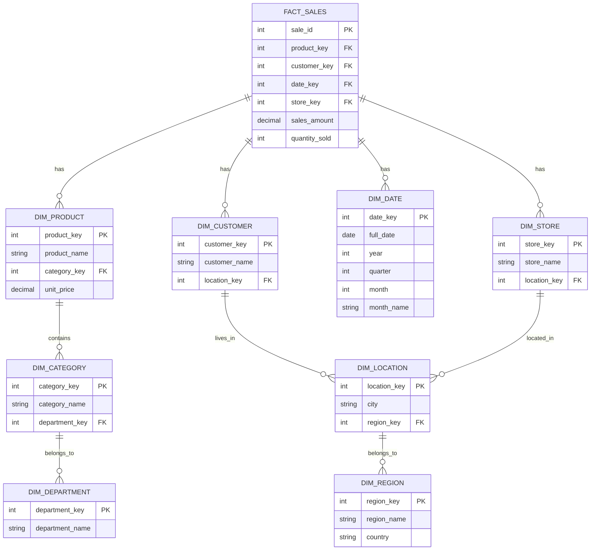

# Snowflake Schema

## Introduction

A **Snowflake Schema** is a logical arrangement of tables in a multidimensional database such that the entity relationship diagram resembles a snowflake shape. It's an extension of the star schema, where the dimensional tables are normalized into multiple related tables. This normalization splits the dimension tables into additional tables, creating a structure that branches out like a snowflake.

Snowflake schemas are particularly important in data warehousing, as they provide an organized way to store and access large volumes of data while maintaining data integrity through normalization.

## Understanding the Snowflake Schema

### Basic Structure

The snowflake schema consists of:

1. A central **fact table** containing business metrics or facts (e.g., sales amount, quantity sold)
2. Multiple **dimension tables** that branch out from the fact table
3. **Normalized dimension tables** that further branch out from the dimension tables

Here's a visual representation of a typical snowflake schema:



### Snowflake vs. Star Schema

While both schemas are used in dimensional modeling, they have key differences:

| Feature | Star Schema | Snowflake Schema |
|---------|-------------|------------------|
| Normalization | Denormalized dimension tables | Normalized dimension tables |
| Table structure | One fact table, multiple dimension tables | One fact table, multiple normalized dimension tables |
| Query complexity | Simpler queries | More complex queries (more joins) |
| Storage | Uses more storage | Uses less storage |
| Performance | Better query performance | Potentially slower query performance |
| Data integrity | Lower (redundant data) | Higher (normalized data) |

## Implementing a Snowflake Schema

Let's implement a simple snowflake schema for a retail sales system. We'll use SQL to create the necessary tables.

### Step 1: Create the Dimension Tables (most granular level first)

```sql
-- Department dimension
CREATE TABLE dim_department (
    department_key INT PRIMARY KEY,
    department_name VARCHAR(50) NOT NULL
);

-- Category dimension
CREATE TABLE dim_category (
    category_key INT PRIMARY KEY,
    category_name VARCHAR(50) NOT NULL,
    department_key INT NOT NULL,
    FOREIGN KEY (department_key) REFERENCES dim_department(department_key)
);

-- Product dimension
CREATE TABLE dim_product (
    product_key INT PRIMARY KEY,
    product_name VARCHAR(100) NOT NULL,
    category_key INT NOT NULL,
    unit_price DECIMAL(10,2) NOT NULL,
    FOREIGN KEY (category_key) REFERENCES dim_category(category_key)
);

-- Region dimension
CREATE TABLE dim_region (
    region_key INT PRIMARY KEY,
    region_name VARCHAR(50) NOT NULL,
    country VARCHAR(50) NOT NULL
);

-- Location dimension
CREATE TABLE dim_location (
    location_key INT PRIMARY KEY,
    city VARCHAR(50) NOT NULL,
    region_key INT NOT NULL,
    FOREIGN KEY (region_key) REFERENCES dim_region(region_key)
);

-- Customer dimension
CREATE TABLE dim_customer (
    customer_key INT PRIMARY KEY,
    customer_name VARCHAR(100) NOT NULL,
    location_key INT NOT NULL,
    FOREIGN KEY (location_key) REFERENCES dim_location(location_key)
);

-- Store dimension
CREATE TABLE dim_store (
    store_key INT PRIMARY KEY,
    store_name VARCHAR(100) NOT NULL,
    location_key INT NOT NULL,
    FOREIGN KEY (location_key) REFERENCES dim_location(location_key)
);

-- Date dimension
CREATE TABLE dim_date (
    date_key INT PRIMARY KEY,
    full_date DATE NOT NULL,
    year INT NOT NULL,
    quarter INT NOT NULL,
    month INT NOT NULL,
    month_name VARCHAR(10) NOT NULL
);
```

### Step 2: Create the Fact Table

```sql
-- Sales fact table
CREATE TABLE fact_sales (
    sale_id INT PRIMARY KEY,
    product_key INT NOT NULL,
    customer_key INT NOT NULL,
    date_key INT NOT NULL,
    store_key INT NOT NULL,
    sales_amount DECIMAL(10,2) NOT NULL,
    quantity_sold INT NOT NULL,
    FOREIGN KEY (product_key) REFERENCES dim_product(product_key),
    FOREIGN KEY (customer_key) REFERENCES dim_customer(customer_key),
    FOREIGN KEY (date_key) REFERENCES dim_date(date_key),
    FOREIGN KEY (store_key) REFERENCES dim_store(store_key)
);
```

### Step 3: Insert Sample Data

```sql
-- Insert sample data into dimension tables
INSERT INTO dim_department VALUES (1, 'Electronics');
INSERT INTO dim_department VALUES (2, 'Clothing');

INSERT INTO dim_category VALUES (1, 'Computers', 1);
INSERT INTO dim_category VALUES (2, 'Phones', 1);
INSERT INTO dim_category VALUES (3, 'Men''s Wear', 2);

INSERT INTO dim_product VALUES (101, 'Laptop Pro', 1, 1200.00);
INSERT INTO dim_product VALUES (102, 'Smartphone X', 2, 800.00);
INSERT INTO dim_product VALUES (103, 'Jeans Classic', 3, 45.00);

-- More dimension data...
```

## Querying a Snowflake Schema

To extract meaningful information from a snowflake schema, you often need to join multiple tables. Here's an example query that calculates total sales by product category and department:

```sql
SELECT 
    d.department_name,
    c.category_name,
    SUM(f.sales_amount) as total_sales
FROM 
    fact_sales f
JOIN 
    dim_product p ON f.product_key = p.product_key
JOIN 
    dim_category c ON p.category_key = c.category_key
JOIN 
    dim_department d ON c.department_key = d.department_key
GROUP BY 
    d.department_name, c.category_name
ORDER BY 
    d.department_name, total_sales DESC;
```

Expected output:

```
department_name | category_name | total_sales
----------------|---------------|------------
Electronics     | Computers     | 24500.00
Electronics     | Phones        | 16800.00
Clothing        | Men's Wear    | 4950.00
```

## Advantages of Snowflake Schema

1. **Reduced storage requirements**: By normalizing dimension tables, data redundancy is minimized.

2. **Improved data integrity**: Normalization helps maintain data consistency and reduces update anomalies.

3. **Flexible dimensional hierarchy**: Allows for representing complex dimensional hierarchies by breaking them into separate tables.

4. **Easier maintenance**: Changes to dimension attributes often only affect a single table.

## Disadvantages of Snowflake Schema

1. **Query complexity**: Requires more joins, making queries more complex and potentially harder to maintain.

2. **Reduced query performance**: Additional joins can impact query performance, especially for large datasets.

3. **More complex ETL processes**: Loading data into normalized dimensions requires more complex transformation logic.

## Real-World Applications

### E-commerce Analytics

An e-commerce platform might use a snowflake schema to analyze sales data:

- **Fact table**: Sales transactions with metrics like revenue, units sold
- **Dimension tables**: Products, customers, time, location
- **Normalized dimensions**: Product categories, subcategories, customer demographics, geographical hierarchies

This allows analysts to answer questions like:
- "What product categories are selling best in each region?"
- "How do sales trends vary by customer demographics across different time periods?"

### Healthcare Data Warehousing

A healthcare system might implement a snowflake schema to analyze patient data:

- **Fact table**: Patient visits with metrics like length of stay, procedures performed
- **Dimension tables**: Patients, providers, facilities, diagnoses
- **Normalized dimensions**: Provider specialties, facility types, diagnosis hierarchies

This enables healthcare analysts to investigate:
- "What are the most common diagnoses by provider specialty?"
- "How do patient outcomes vary by facility type and geographical region?"

## Best Practices for Implementing Snowflake Schemas

1. **Consider performance requirements**: Evaluate the trade-off between storage efficiency and query performance for your specific use case.

2. **Limit normalization levels**: Excessive normalization can lead to too many joins. Consider normalizing only to the level that provides meaningful benefits.

3. **Use appropriate indexing**: Create indexes on join columns to improve query performance.

4. **Document relationships**: Maintain clear documentation of table relationships to help query developers.

5. **Consider denormalizing for reporting**: For frequently accessed reports, consider creating materialized views or pre-aggregated tables.

## Summary

The snowflake schema is a powerful design pattern for data warehousing that offers improved data integrity and reduced storage requirements through normalization. While it introduces some query complexity compared to the star schema, it provides greater flexibility for representing complex dimensional hierarchies.

When deciding between a star schema and a snowflake schema, consider your specific requirements around query performance, storage efficiency, and dimensional complexity. Many real-world implementations actually use a hybrid approach, normalizing some dimensions while keeping others denormalized.

## Exercises

1. Design a snowflake schema for a university database that tracks student enrollments in courses. Include dimensions for students, courses, professors, departments, and time.

2. Write a SQL query for a retail snowflake schema that returns the top-selling products by region and customer age group.

3. Compare the storage requirements for a star schema versus a snowflake schema using a sample dataset of your choice.

4. Create a snowflake schema diagram for a financial data warehouse that tracks investment transactions.

## Additional Resources

- Ralph Kimball and Margy Ross, "The Data Warehouse Toolkit: The Definitive Guide to Dimensional Modeling"
- Bill Inmon, "Building the Data Warehouse"
- Online SQL tutorials for practicing complex joins used in snowflake schema queries