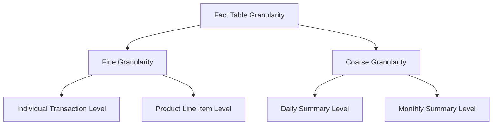

# Fact Tables

## Introduction

In data warehousing, a **fact table** is the central table in a dimensional model that contains the numerical measures or facts about a business process. Fact tables connect to dimension tables to provide context to the measurements. Think of fact tables as the "verbs" of your data model - they represent events, transactions, or measurements that occur within your business.

Fact tables are fundamental to data warehouse design and form the foundation of the popular Star Schema and Snowflake Schema models. They allow organizations to efficiently analyze large volumes of data across multiple dimensions, providing valuable business intelligence.

## Understanding Fact Tables

### What is a Fact Table?

A fact table stores quantitative information for analysis and is typically linked to descriptive dimension tables. The primary characteristics of fact tables include:

- They contain **measurements** or **facts** about business processes
- They include **foreign keys** that connect to dimension tables
- They are usually **normalized** for storage efficiency
- They typically contain the **largest volume** of data in the warehouse

### Structure of a Fact Table

A typical fact table consists of:

1. **Foreign Keys**: References to dimension tables (providing the "who, what, where, when, why, and how" context)
2. **Facts/Measures**: Numerical values that can be aggregated (sum, count, average, etc.)
3. **Degenerate Dimensions**: Attributes that are neither facts nor foreign keys (like transaction IDs)

Here's a simplified example of a fact table structure:

```sql
CREATE TABLE sales_fact (
    date_key INT,          -- Foreign key to date dimension
    product_key INT,       -- Foreign key to product dimension  
    store_key INT,         -- Foreign key to store dimension
    customer_key INT,      -- Foreign key to customer dimension
    promotion_key INT,     -- Foreign key to promotion dimension
    sale_id VARCHAR(20),   -- Degenerate dimension
    quantity_sold INT,     -- Fact/measure
    amount_sold DECIMAL(10,2), -- Fact/measure
    discount_amount DECIMAL(10,2), -- Fact/measure
    PRIMARY KEY (date_key, product_key, store_key, customer_key, promotion_key, sale_id),
    FOREIGN KEY (date_key) REFERENCES date_dim(date_key),
    FOREIGN KEY (product_key) REFERENCES product_dim(product_key),
    FOREIGN KEY (store_key) REFERENCES store_dim(store_key),
    FOREIGN KEY (customer_key) REFERENCES customer_dim(customer_key),
    FOREIGN KEY (promotion_key) REFERENCES promotion_dim(promotion_key)
);
```

### Types of Fact Tables

There are several types of fact tables, each designed for different analytical purposes:

#### 1. Transaction Fact Tables

These capture events occurring at a specific point in time. Each row represents a transaction with a precise date/time stamp.

**Example**: A retail sales fact table where each row represents an individual sale.

```sql
-- Sample data in a transaction fact table
SELECT * FROM sales_fact LIMIT 5;
```

```
date_key | product_key | store_key | customer_key | promotion_key | sale_id      | quantity_sold | amount_sold | discount_amount
---------|-------------|-----------|--------------|---------------|--------------|---------------|-------------|----------------
20230101 | 1045        | 23        | 5437         | 12            | S100045678   | 2             | 45.98       | 0.00
20230101 | 2067        | 23        | 5437         | 0             | S100045678   | 1             | 12.99       | 0.00
20230101 | 3011        | 23        | 8901         | 12            | S100045679   | 3             | 29.97       | 5.00
20230102 | 1045        | 23        | 7432         | 0             | S100045680   | 1             | 22.99       | 0.00
20230102 | 4089        | 25        | 1298         | 15            | S100045681   | 2             | 67.98       | 10.00
```

#### 2. Periodic Snapshot Fact Tables

These capture the state of measurements at regular intervals (daily, weekly, monthly).

**Example**: A monthly inventory fact table showing stock levels at the end of each month.

```sql
CREATE TABLE inventory_snapshot_fact (
    date_key INT,          -- Foreign key to date dimension (monthly granularity)
    product_key INT,       -- Foreign key to product dimension
    store_key INT,         -- Foreign key to store dimension
    quantity_on_hand INT,  -- Fact/measure
    stock_value DECIMAL(10,2), -- Fact/measure
    reorder_flag BOOLEAN,  -- Fact/measure
    PRIMARY KEY (date_key, product_key, store_key),
    FOREIGN KEY (date_key) REFERENCES date_dim(date_key),
    FOREIGN KEY (product_key) REFERENCES product_dim(product_key),
    FOREIGN KEY (store_key) REFERENCES store_dim(store_key)
);
```

#### 3. Accumulating Snapshot Fact Tables

These track the progress of a process over its entire lifecycle, with updates to the same record as the process moves through different stages.

**Example**: An order processing fact table that tracks an order from placement to delivery.

```sql
CREATE TABLE order_process_fact (
    order_key INT,                -- Primary key
    customer_key INT,             -- Foreign key to customer dimension
    product_key INT,              -- Foreign key to product dimension
    order_date_key INT,           -- When the order was placed
    approval_date_key INT,        -- When the order was approved
    shipping_date_key INT,        -- When the order was shipped
    delivery_date_key INT,        -- When the order was delivered
    order_amount DECIMAL(10,2),   -- Fact/measure
    shipping_cost DECIMAL(10,2),  -- Fact/measure
    PRIMARY KEY (order_key),
    FOREIGN KEY (customer_key) REFERENCES customer_dim(customer_key),
    FOREIGN KEY (product_key) REFERENCES product_dim(product_key),
    FOREIGN KEY (order_date_key) REFERENCES date_dim(date_key),
    FOREIGN KEY (approval_date_key) REFERENCES date_dim(date_key),
    FOREIGN KEY (shipping_date_key) REFERENCES date_dim(date_key),
    FOREIGN KEY (delivery_date_key) REFERENCES date_dim(date_key)
);
```

#### 4. Factless Fact Tables

These track events or associations but don't contain any measurable facts. They record the occurrence of an event.

**Example**: A student attendance fact table that records which students attended which classes.

```sql
CREATE TABLE class_attendance_fact (
    student_key INT,      -- Foreign key to student dimension
    class_key INT,        -- Foreign key to class dimension
    date_key INT,         -- Foreign key to date dimension
    attendance_flag BOOLEAN, -- Indicates if student attended (could be considered a fact)
    PRIMARY KEY (student_key, class_key, date_key),
    FOREIGN KEY (student_key) REFERENCES student_dim(student_key),
    FOREIGN KEY (class_key) REFERENCES class_dim(class_key),
    FOREIGN KEY (date_key) REFERENCES date_dim(date_key)
);
```

## Fact Table Design Principles

### 1. Granularity

Granularity refers to the level of detail in your fact table. It's one of the most critical decisions in fact table design.

- **Fine granularity**: More detailed data (e.g., individual transactions)
- **Coarse granularity**: Summarized data (e.g., daily or monthly aggregates)

**Example**: A sales fact table at the transaction level (fine granularity) vs. a sales fact table at the daily level (coarse granularity).



### 2. Additive, Semi-Additive, and Non-Additive Facts

Facts can be categorized based on how they can be aggregated across dimensions:

- **Additive Facts**: Can be summed across all dimensions (e.g., sales amount)
- **Semi-Additive Facts**: Can be summed across some dimensions but not all (e.g., account balances can be summed across accounts but not across time)
- **Non-Additive Facts**: Cannot be summed meaningfully across any dimension (e.g., percentages, ratios)

### 3. Conformed Facts

Conformed facts are measurements that have the same meaning across different fact tables. They enable integrated analysis across multiple business processes.

**Example**: A "revenue" fact should be calculated the same way in both the sales fact table and the financial fact table.

## Implementing Fact Tables

### Step 1: Identify the Business Process

Begin by identifying which business process you want to analyze (e.g., sales, orders, inventory).

### Step 2: Determine the Granularity

Decide on the level of detail for your fact table. This depends on your analytical requirements.

### Step 3: Identify Dimensions

Determine which dimensions provide context to your facts (e.g., date, product, customer).

### Step 4: Identify Facts

Identify the numerical measures that you want to analyze (e.g., quantity, amount, count).

### Step 5: Build the Schema

Create the structure with foreign keys to dimension tables and the appropriate facts.

## Real-World Examples

### E-Commerce Sales Analysis

For an e-commerce platform, a sales fact table might look like this:

```sql
CREATE TABLE ecommerce_sales_fact (
    date_key INT,           -- When the purchase occurred
    product_key INT,        -- What was purchased
    customer_key INT,       -- Who made the purchase
    website_key INT,        -- Where the purchase was made
    promotion_key INT,      -- What promotion was applied
    order_id VARCHAR(20),   -- Degenerate dimension
    quantity INT,           -- How many were purchased
    sales_amount DECIMAL(10,2), -- Total sale amount
    discount_amount DECIMAL(10,2), -- Discount applied
    shipping_amount DECIMAL(10,2), -- Shipping cost
    tax_amount DECIMAL(10,2),      -- Tax applied
    PRIMARY KEY (date_key, product_key, customer_key, website_key, promotion_key, order_id),
    FOREIGN KEY (date_key) REFERENCES date_dim(date_key),
    FOREIGN KEY (product_key) REFERENCES product_dim(product_key),
    FOREIGN KEY (customer_key) REFERENCES customer_dim(customer_key),
    FOREIGN KEY (website_key) REFERENCES website_dim(website_key),
    FOREIGN KEY (promotion_key) REFERENCES promotion_dim(promotion_key)
);
```

This would allow analysts to answer questions like:
- What products are the best sellers?
- Which promotions drive the most revenue?
- How do sales vary by day of week or season?
- What's the average order value by customer segment?

### Healthcare Patient Visits

In a healthcare data warehouse, a patient visit fact table might look like:

```sql
CREATE TABLE patient_visit_fact (
    date_key INT,            -- When the visit occurred
    patient_key INT,         -- Who visited
    provider_key INT,        -- Which doctor
    diagnosis_key INT,       -- What diagnosis
    facility_key INT,        -- Which clinic/hospital
    visit_id VARCHAR(20),    -- Degenerate dimension
    visit_duration INT,      -- How long (in minutes)
    billed_amount DECIMAL(10,2), -- Amount billed
    copay_amount DECIMAL(10,2),  -- Patient's copay
    procedure_count INT,     -- Number of procedures
    medication_count INT,    -- Number of medications prescribed
    PRIMARY KEY (date_key, patient_key, provider_key, diagnosis_key, facility_key, visit_id),
    FOREIGN KEY (date_key) REFERENCES date_dim(date_key),
    FOREIGN KEY (patient_key) REFERENCES patient_dim(patient_key),
    FOREIGN KEY (provider_key) REFERENCES provider_dim(provider_key),
    FOREIGN KEY (diagnosis_key) REFERENCES diagnosis_dim(diagnosis_key),
    FOREIGN KEY (facility_key) REFERENCES facility_dim(facility_key)
);
```

This would enable analysis of:
- Average visit duration by diagnosis
- Provider efficiency and patient load
- Revenue by facility or diagnosis
- Patient visit patterns over time

## Best Practices

1. **Keep fact tables narrow**: Include only necessary measures and foreign keys to dimension tables.
2. **Use surrogate keys**: Use generated integer keys rather than natural business keys.
3. **Establish a consistent grain**: All facts in a table should be at the same level of detail.
4. **Document business rules**: Clearly document how derived facts are calculated.
5. **Consider partitioning**: For very large fact tables, consider partitioning by date for better performance.
6. **Use appropriate data types**: Choose the right data types to balance precision and storage requirements.

## Common Queries

Here are some common SQL queries you might run against a fact table:

### Basic Aggregation

```sql
-- Total sales by product category for the year 2023
SELECT 
    p.category_name,
    SUM(f.sales_amount) as total_sales
FROM 
    sales_fact f
JOIN 
    product_dim p ON f.product_key = p.product_key
JOIN 
    date_dim d ON f.date_key = d.date_key
WHERE 
    d.year = 2023
GROUP BY 
    p.category_name
ORDER BY 
    total_sales DESC;
```

### Time Comparison

```sql
-- Monthly sales comparison: 2023 vs 2022
SELECT 
    d.month_name,
    SUM(CASE WHEN d.year = 2023 THEN f.sales_amount ELSE 0 END) as sales_2023,
    SUM(CASE WHEN d.year = 2022 THEN f.sales_amount ELSE 0 END) as sales_2022,
    (SUM(CASE WHEN d.year = 2023 THEN f.sales_amount ELSE 0 END) - 
     SUM(CASE WHEN d.year = 2022 THEN f.sales_amount ELSE 0 END)) / 
     SUM(CASE WHEN d.year = 2022 THEN f.sales_amount ELSE 0 END) * 100 as percent_change
FROM 
    sales_fact f
JOIN 
    date_dim d ON f.date_key = d.date_key
WHERE 
    d.year IN (2022, 2023)
GROUP BY 
    d.month_name
ORDER BY 
    d.month_num;
```

## Summary

Fact tables are the cornerstone of dimensional data warehousing. They store the numerical metrics that businesses need to analyze, connected to dimensions that provide context. Understanding the different types of fact tables (transaction, periodic snapshot, accumulating snapshot, and factless) allows you to model your data warehouse effectively for various analytical needs.

The key principles to remember when designing fact tables are:
- Choose the appropriate granularity based on your analytical requirements
- Select the right fact table type for your business process
- Ensure your facts are properly classified as additive, semi-additive, or non-additive
- Connect your fact tables to well-designed dimension tables

By following these principles and best practices, you can create a data warehouse that efficiently supports the analytical needs of your organization.

## Exercises

1. Design a fact table for tracking website user activity, including page views, clicks, and time spent on page.
2. Create a star schema for a banking system that includes a transactions fact table and appropriate dimensions.
3. Write SQL queries to answer the following questions using the e-commerce fact table example:
   - Which products have the highest average order value?
   - What day of the week sees the highest sales volume?
   - How do sales of different product categories compare across regions?
4. Convert a transaction fact table design to a periodic snapshot design and explain the trade-offs.
5. Design an accumulating snapshot fact table for a college application process that tracks students from application submission through acceptance or rejection.

## Additional Resources

- **Books**: 
  - "The Data Warehouse Toolkit" by Ralph Kimball
  - "Star Schema: The Complete Reference" by Christopher Adamson
  
- **Online Courses**:
  - Data Warehousing Fundamentals
  - Dimensional Modeling Techniques
  
- **Related Topics**:
  - Star Schema Design
  - ETL Processes
  - OLAP vs. OLTP Systems
  - Data Warehouse Architecture