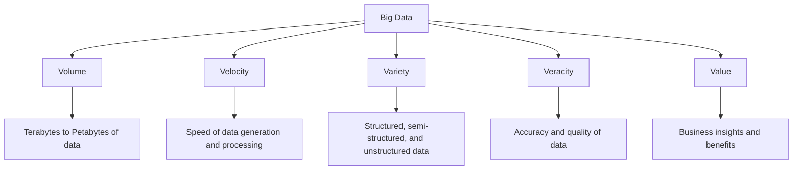
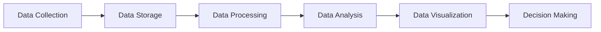

# Big Data Introduction

## What is Big Data?

Big Data refers to extremely large and complex data sets that traditional data processing applications are inadequate to handle. These massive volumes of data require specialized systems and approaches to extract value and insights effectively.

The concept of Big Data isn't just about the size of data; it encompasses the challenges and opportunities associated with collecting, storing, processing, and analyzing these enormous data sets.

## The 5 V's of Big Data

Big Data is commonly characterized by what's known as the "5 V's":



Let's explore each of these characteristics:

### 1. Volume

**Volume** refers to the sheer amount of data being generated. We're talking about:

- Terabytes (TB) - 1,000 gigabytes
- Petabytes (PB) - 1,000,000 gigabytes
- Exabytes (EB) - 1,000,000,000 gigabytes

For context, consider that:
- Facebook processes over 500 terabytes of data daily
- The Large Hadron Collider generates about 30 petabytes of data per year
- All words ever spoken by humans would be about 5 exabytes

### 2. Velocity

**Velocity** refers to the speed at which data is generated, collected, and processed. Modern data comes in at unprecedented speeds:

- Social media generates thousands of posts per second
- IoT sensors continuously stream data
- Stock markets process millions of transactions per minute

Real-time processing has become essential for many applications.

### 3. Variety

**Variety** refers to the different types and formats of data:

- **Structured data**: Organized data like SQL databases or Excel spreadsheets
- **Semi-structured data**: Data with some organizational properties but not rigid structure (JSON, XML)
- **Unstructured data**: Data without predefined format (text, images, videos, social media posts)

### 4. Veracity

**Veracity** refers to the quality and accuracy of data. Challenges include:

- Uncertainty due to data inconsistency
- Incomplete data
- Ambiguity and deception in data sources
- Approximations and imprecisions

### 5. Value

**Value** refers to the worth of data in decision-making. The ultimate goal of Big Data is to extract valuable insights that can:

- Improve business processes
- Identify new opportunities
- Enhance customer experience
- Drive innovation

## Big Data Processing Frameworks

To handle Big Data, specialized frameworks have been developed:

### Apache Hadoop

Hadoop is one of the most popular frameworks for Big Data processing. It consists of:

1. **Hadoop Distributed File System (HDFS)**: For storage
2. **MapReduce**: For processing
3. **YARN**: For resource management

Here's a basic example of a MapReduce word count in Java:

```java
import java.io.IOException;
import java.util.StringTokenizer;

import org.apache.hadoop.conf.Configuration;
import org.apache.hadoop.fs.Path;
import org.apache.hadoop.io.IntWritable;
import org.apache.hadoop.io.Text;
import org.apache.hadoop.mapreduce.Job;
import org.apache.hadoop.mapreduce.Mapper;
import org.apache.hadoop.mapreduce.Reducer;
import org.apache.hadoop.mapreduce.lib.input.FileInputFormat;
import org.apache.hadoop.mapreduce.lib.output.FileOutputFormat;

public class WordCount {

  public static class TokenizerMapper
       extends Mapper<Object, Text, Text, IntWritable>{

    private final static IntWritable one = new IntWritable(1);
    private Text word = new Text();

    public void map(Object key, Text value, Context context
                    ) throws IOException, InterruptedException {
      StringTokenizer itr = new StringTokenizer(value.toString());
      while (itr.hasMoreTokens()) {
        word.set(itr.nextToken());
        context.write(word, one);
      }
    }
  }

  public static class IntSumReducer
       extends Reducer<Text, IntWritable, Text, IntWritable> {
    private IntWritable result = new IntWritable();

    public void reduce(Text key, Iterable<IntWritable> values,
                       Context context
                       ) throws IOException, InterruptedException {
      int sum = 0;
      for (IntWritable val : values) {
        sum += val.get();
      }
      result.set(sum);
      context.write(key, result);
    }
  }

  public static void main(String[] args) throws Exception {
    Configuration conf = new Configuration();
    Job job = Job.getInstance(conf, "word count");
    job.setJarByClass(WordCount.class);
    job.setMapperClass(TokenizerMapper.class);
    job.setCombinerClass(IntSumReducer.class);
    job.setReducerClass(IntSumReducer.class);
    job.setOutputKeyClass(Text.class);
    job.setOutputValueClass(IntWritable.class);
    FileInputFormat.addInputPath(job, new Path(args[0]));
    FileOutputFormat.setOutputPath(job, new Path(args[1]));
    System.exit(job.waitForCompletion(true) ? 0 : 1);
  }
}
```

This program would count how many times each word appears in a text file or set of files.

### Apache Spark

Spark is a more modern framework that processes data in-memory, making it much faster than traditional MapReduce:

```python
from pyspark import SparkContext

# Initialize Spark context
sc = SparkContext("local", "WordCount")

# Read input file
text_file = sc.textFile("input.txt")

# Split lines into words, count them, and sort by count
counts = text_file.flatMap(lambda line: line.split(" ")) \
                 .map(lambda word: (word, 1)) \
                 .reduceByKey(lambda a, b: a + b) \
                 .sortBy(lambda x: x[1], ascending=False)

# Save the results
counts.saveAsTextFile("output")
```

This PySpark code does the same word count task but with much less code and typically executes faster than the Hadoop version.

## Real-World Applications of Big Data

### 1. Healthcare

Big Data in healthcare enables:
- Predictive analytics for disease outbreaks
- Personalized treatment based on patient history
- Efficient hospital resource management
- Medical research and drug discovery

### 2. E-commerce and Retail

Retailers use Big Data for:
- Customer behavior analysis
- Personalized recommendations
- Inventory optimization
- Price optimization
- Supply chain management

### 3. Financial Services

Banks and financial institutions use Big Data for:
- Fraud detection
- Risk assessment
- Algorithmic trading
- Customer segmentation
- Personalized banking experiences

### 4. Smart Cities

Cities leverage Big Data for:
- Traffic management
- Energy consumption optimization
- Public safety
- Urban planning
- Environmental monitoring

## Big Data Processing Pipeline

A typical Big Data processing pipeline consists of the following stages:



### 1. Data Collection

Data is gathered from various sources:
- IoT devices and sensors
- Web scraping
- User-generated content
- Business transactions
- Log files

### 2. Data Storage

Large volumes of data are stored in:
- Distributed file systems (like HDFS)
- NoSQL databases (MongoDB, Cassandra)
- Data lakes (Amazon S3, Azure Data Lake)
- Cloud storage solutions

### 3. Data Processing

Raw data is transformed into a usable format through:
- Cleaning (removing duplicates, fixing errors)
- Transformation (converting formats)
- Aggregation (combining data points)
- Enrichment (adding additional information)

### 4. Data Analysis

Processed data is analyzed to extract insights:
- Descriptive analytics (what happened)
- Diagnostic analytics (why it happened)
- Predictive analytics (what might happen)
- Prescriptive analytics (what should be done)

### 5. Data Visualization

Insights are presented visually through:
- Dashboards
- Charts and graphs
- Heat maps
- Interactive visualizations

### 6. Decision Making

Finally, insights drive action:
- Strategic business decisions
- Process improvements
- New product development
- Customer experience enhancement

## Getting Started with Big Data

If you're new to Big Data, here are some steps to get started:

1. **Learn the basics**:
   - Understand distributed computing concepts
   - Learn about data modeling and database design
   - Familiarize yourself with data processing techniques

2. **Start with a small project**:
   - Set up a single-node Hadoop or Spark environment
   - Process a moderately sized dataset
   - Implement basic analytics

3. **Scale gradually**:
   - Move to a multi-node setup
   - Work with larger datasets
   - Implement more complex analytics

## Challenges in Big Data

Despite its benefits, Big Data comes with challenges:

1. **Privacy and Security**: Ensuring data is protected and complies with regulations like GDPR

2. **Data Quality**: Maintaining accuracy and reliability in large, diverse datasets

3. **Technical Challenges**: Requiring specialized skills and infrastructure

4. **Integration Issues**: Combining data from disparate sources

5. **Scalability**: Ensuring systems can handle growing data volumes

## Summary

Big Data represents a significant shift in how we collect, store, process, and analyze information. The 5 V's (Volume, Velocity, Variety, Veracity, and Value) help us understand the complexity and potential of Big Data.

With frameworks like Hadoop and Spark, organizations can process massive datasets to extract valuable insights. These insights drive innovation and improvements across industries, from healthcare to finance to smart cities.

As data continues to grow exponentially, the field of Big Data will remain crucial for organizations seeking to gain competitive advantages through data-driven decision making.

## Exercises

1. **Concept Application**: Identify a real-world problem in your field of interest that could benefit from Big Data analysis.

2. **Framework Exploration**: Install a single-node Hadoop or Spark environment on your computer and run a simple example.

3. **Data Processing**: Write a MapReduce or Spark program to analyze a dataset of your choice (e.g., public datasets from Kaggle).

4. **Visualization**: Create a dashboard to visualize insights from your analyzed data.

5. **Scale Planning**: Design a hypothetical Big Data architecture for a medium-sized company in an industry of your choice.

## Additional Resources

- Books:
  - "Hadoop: The Definitive Guide" by Tom White
  - "Learning Spark" by Holden Karau, Andy Konwinski, Patrick Wendell, and Matei Zaharia
  - "Big Data: Principles and Best Practices of Scalable Realtime Data Systems" by Nathan Marz

- Online Courses:
  - Coursera's "Big Data Specialization" by University of California San Diego
  - edX's "Big Data Analytics" by Adelaide University
  - Udacity's "Data Engineer Nanodegree"

- Community Resources:
  - Apache Software Foundation projects (Hadoop, Spark, Kafka, etc.)
  - Stack Overflow for specific programming questions
  - GitHub repositories with example projects