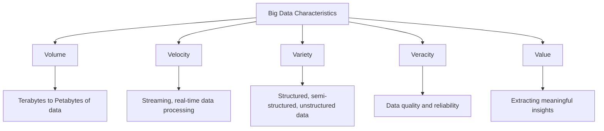

# Big Data Characteristics

## Introduction

Big Data refers to extremely large and complex datasets that traditional data processing applications cannot adequately manage. As organizations collect unprecedented amounts of data from various sources, understanding the fundamental characteristics of Big Data becomes essential for developing effective data processing strategies.

These characteristics not only define what makes data "big" but also help us understand the challenges and opportunities that come with handling massive datasets. In this article, we'll explore the essential characteristics of Big Data, commonly known as the "5Vs."

## The 5Vs of Big Data

Big Data is traditionally characterized by five primary dimensions, known as the 5Vs:



Let's explore each of these characteristics in detail.

### 1. Volume

**Volume** refers to the sheer amount of data being generated and collected. This is perhaps the most obvious characteristic of Big Data.

#### Scale of Big Data Volume

- **Terabytes (TB)**: 1,000 Gigabytes
- **Petabytes (PB)**: 1,000 Terabytes
- **Exabytes (EB)**: 1,000 Petabytes
- **Zettabytes (ZB)**: 1,000 Exabytes

#### Example: Social Media Data Volume

```python
# Python code to demonstrate volume of Twitter data
import matplotlib.pyplot as plt
import numpy as np

# Average tweets per day (in millions)
years = [2010, 2012, 2014, 2016, 2018, 2020, 2022]
tweets_per_day = [50, 175, 350, 500, 600, 700, 800]

# Calculating the bytes of data
bytes_per_tweet = 280  # Average characters in a tweet
total_data_per_day_GB = [t * bytes_per_tweet / (1024 * 1024 * 1024) for t in tweets_per_day]

print(f"Daily Twitter data volume (2022): {total_data_per_day_GB[-1]:.2f} GB")
print(f"Yearly Twitter data volume (2022): {total_data_per_day_GB[-1] * 365:.2f} GB")
```

**Output:**
```
Daily Twitter data volume (2022): 0.21 GB
Yearly Twitter data volume (2022): 76.29 GB
```

Note: This is just raw text data. When including images, videos, user data, and metadata, the actual volume is much larger.

#### Real-world Application

The Internet Archive stores over 70 petabytes of data, including billions of web pages, books, audio recordings, videos, and images. Managing this volume requires distributed storage systems like Hadoop Distributed File System (HDFS) or cloud storage solutions.

### 2. Velocity

**Velocity** refers to the speed at which data is generated, collected, and processed. Modern applications often require real-time or near-real-time processing of data streams.

#### Types of Data Velocity

- **Batch Processing**: Data is collected over time and processed in batches
- **Real-time Processing**: Data is processed as it arrives
- **Stream Processing**: Continuous processing of data streams

#### Example: IoT Sensor Data

```python
# Simulating IoT sensor velocity
import time
from datetime import datetime

def simulate_iot_sensor():
    sensors = 1000  # Number of IoT sensors
    readings_per_second = 10  # Each sensor sends 10 readings per second
    bytes_per_reading = 100  # Each reading is about 100 bytes
    
    data_per_second = sensors * readings_per_second * bytes_per_reading
    data_per_day = data_per_second * 60 * 60 * 24
    
    print(f"Data velocity: {data_per_second / 1024 / 1024:.2f} MB/second")
    print(f"Data per day: {data_per_day / 1024 / 1024 / 1024:.2f} GB/day")
    
    # Simulate real-time data collection for 5 seconds
    for i in range(5):
        now = datetime.now().strftime("%H:%M:%S")
        print(f"[{now}] Received {sensors * readings_per_second} readings ({data_per_second / 1024:.2f} KB)")
        time.sleep(1)

simulate_iot_sensor()
```

**Output:**
```
Data velocity: 0.95 MB/second
Data per day: 82.40 GB/day
[14:32:10] Received 10000 readings (976.56 KB)
[14:32:11] Received 10000 readings (976.56 KB)
[14:32:12] Received 10000 readings (976.56 KB)
[14:32:13] Received 10000 readings (976.56 KB)
[14:32:14] Received 10000 readings (976.56 KB)
```

#### Real-world Application

Stock market trading systems process millions of transactions per second, requiring real-time data analysis for algorithmic trading. Technologies like Apache Kafka and Apache Flink are designed to handle high-velocity data streams.

### 3. Variety

**Variety** refers to the different types and formats of data being collected and processed. Big Data systems must handle structured, semi-structured, and unstructured data from diverse sources.

#### Types of Data

- **Structured Data**: Follows a predefined format (e.g., relational databases)
- **Semi-structured Data**: Has some organizational properties but doesn't conform to a rigid structure (e.g., JSON, XML)
- **Unstructured Data**: Has no predefined format (e.g., text, images, videos)

#### Example: Processing Different Data Types

```python
# Example of handling data variety
import json
import pandas as pd
from collections import Counter

# Structured data (CSV)
structured_data = """
id,name,age,occupation
1,John,28,Developer
2,Lisa,34,Data Scientist
3,Mark,45,Manager
"""

# Semi-structured data (JSON)
semi_structured_data = """
{
  "users": [
    {"id": 4, "name": "Sarah", "skills": ["Python", "SQL", "Tableau"]},
    {"id": 5, "name": "Mike", "skills": ["Java", "C++"], "certification": "AWS"}
  ]
}
"""

# Unstructured data (text)
unstructured_data = "Big Data systems need to process various types of data including emails, social media posts, and documents."

# Processing structured data
df = pd.read_csv(pd.StringIO(structured_data))
print("Structured Data:")
print(df)

# Processing semi-structured data
json_data = json.loads(semi_structured_data)
print("
Semi-structured Data:")
for user in json_data["users"]:
    print(f"User: {user['name']}, Skills: {', '.join(user.get('skills', []))}")

# Processing unstructured data
print("
Unstructured Data:")
word_count = Counter(unstructured_data.split())
print(f"Word count: {len(word_count)}")
print(f"Most common words: {word_count.most_common(3)}")
```

**Output:**
```
Structured Data:
   id   name  age     occupation
0   1   John   28      Developer
1   2   Lisa   34  Data Scientist
2   3   Mark   45        Manager

Semi-structured Data:
User: Sarah, Skills: Python, SQL, Tableau
User: Mike, Skills: Java, C++

Unstructured Data:
Word count: 15
Most common words: [('data', 2), ('to', 2), ('Big', 1)]
```

#### Real-world Application

Healthcare systems need to process a variety of data types including structured patient records, semi-structured lab results, and unstructured clinical notes, medical images, and sensor data from wearable devices. Technologies like data lakes allow organizations to store diverse data formats in a single repository.

### 4. Veracity

**Veracity** refers to the quality, accuracy, and reliability of data. Big Data often includes uncertainty and inconsistency, which requires robust data cleaning and validation processes.

#### Challenges of Data Veracity

- **Inconsistency**: Conflicting information from different sources
- **Incompleteness**: Missing values or records
- **Ambiguity**: Unclear or imprecise data
- **Deception**: Deliberately falsified information

#### Example: Handling Data Quality Issues

```python
# Example of handling data veracity issues
import pandas as pd
import numpy as np

# Sample dataset with quality issues
data = {
    'customer_id': [1, 2, 3, 4, 5, None, 7],
    'age': [25, -10, 45, 200, 32, 28, 50],
    'email': ['john@example.com', 'invalid-email', 'sarah@example.com', 'mike@example.com', '', 'lisa@example.com', 'alex@example.com']
}

df = pd.DataFrame(data)
print("Original data:")
print(df)

# Data cleaning and validation
def clean_data(df):
    # Handle missing values
    df_clean = df.dropna(subset=['customer_id'])
    
    # Fix out-of-range values
    df_clean.loc[df_clean['age'] < 0, 'age'] = np.nan
    df_clean.loc[df_clean['age'] > 120, 'age'] = np.nan
    
    # Validate email addresses (simple check)
    df_clean['valid_email'] = df_clean['email'].str.contains('@') & (df_clean['email'].str.len() > 5)
    
    return df_clean

cleaned_df = clean_data(df)
print("
Cleaned data:")
print(cleaned_df)

# Data quality metrics
total_records = len(df)
valid_records = len(cleaned_df)
complete_records = len(cleaned_df.dropna())
valid_emails = cleaned_df['valid_email'].sum()

print(f"
Data quality metrics:")
print(f"Total records: {total_records}")
print(f"Valid records: {valid_records} ({valid_records/total_records:.2%})")
print(f"Complete records: {complete_records} ({complete_records/total_records:.2%})")
print(f"Valid emails: {valid_emails} ({valid_emails/valid_records:.2%})")
```

**Output:**
```
Original data:
   customer_id   age              email
0           1    25    john@example.com
1           2   -10       invalid-email
2           3    45   sarah@example.com
3           4   200    mike@example.com
4           5    32                    
5        None    28    lisa@example.com
6           7    50    alex@example.com

Cleaned data:
   customer_id   age              email  valid_email
0           1  25.0    john@example.com         True
1           2   NaN       invalid-email        False
2           3  45.0   sarah@example.com         True
3           4   NaN    mike@example.com         True
4           5  32.0                           False
6           7  50.0    alex@example.com         True

Data quality metrics:
Total records: 7
Valid records: 6 (86%)
Complete records: 3 (43%)
Valid emails: 4 (67%)
```

#### Real-world Application

Financial institutions must verify transaction data to prevent fraud. They use data cleaning, validation rules, and anomaly detection to ensure data integrity. Machine learning techniques can help identify patterns that indicate potentially fraudulent activities.

### 5. Value

**Value** refers to the ability to transform raw data into meaningful insights that drive business decisions. The ultimate goal of Big Data processing is to extract value from vast quantities of information.

#### Steps to Extract Value from Big Data

1. **Data Collection**: Gathering relevant data from various sources
2. **Data Processing**: Cleaning, transforming, and preparing data for analysis
3. **Data Analysis**: Applying statistical and machine learning techniques
4. **Visualization and Reporting**: Presenting insights in an understandable format
5. **Decision Making**: Taking action based on data-driven insights

#### Example: Extracting Value from Customer Data

```python
# Example of extracting value from customer purchase data
import pandas as pd
import numpy as np
import matplotlib.pyplot as plt

# Sample customer purchase data
np.random.seed(42)
n_customers = 1000

data = {
    'customer_id': range(1, n_customers + 1),
    'purchase_count': np.random.poisson(lam=5, size=n_customers),
    'avg_purchase_value': np.random.gamma(shape=5, scale=20, size=n_customers),
    'days_since_last_purchase': np.random.exponential(scale=30, size=n_customers)
}

df = pd.DataFrame(data)

# Calculate customer lifetime value (CLV)
df['customer_lifetime_value'] = df['purchase_count'] * df['avg_purchase_value']

# Segment customers
def segment_customers(df):
    df['recency'] = pd.cut(df['days_since_last_purchase'], 
                          bins=[0, 7, 30, 90, np.inf], 
                          labels=['Very Recent', 'Recent', 'Mid-term', 'Inactive'])
    
    df['frequency'] = pd.cut(df['purchase_count'], 
                            bins=[0, 2, 5, 10, np.inf], 
                            labels=['Low', 'Medium', 'High', 'Very High'])
    
    df['monetary'] = pd.qcut(df['customer_lifetime_value'], 
                            q=4, 
                            labels=['Low', 'Medium', 'High', 'Very High'])
    
    return df

segmented_df = segment_customers(df)

# Extract insights
print("Customer Segmentation Analysis:")
segment_counts = segmented_df.groupby(['recency', 'frequency', 'monetary']).size()
top_segments = segment_counts.sort_values(ascending=False).head(5)
print("
Top 5 customer segments:")
print(top_segments)

# Calculate average CLV by recency and frequency
clv_by_segment = segmented_df.groupby(['recency', 'frequency'])['customer_lifetime_value'].mean().unstack()
print("
Average Customer Lifetime Value by Segment:")
print(clv_by_segment.round(2))

# Identify high-value customers
high_value = segmented_df[
    (segmented_df['recency'] == 'Very Recent') & 
    (segmented_df['frequency'] == 'Very High') & 
    (segmented_df['monetary'] == 'Very High')
]
print(f"
Number of high-value customers: {len(high_value)}")
print(f"Average CLV of high-value customers: ${high_value['customer_lifetime_value'].mean():.2f}")
```

**Output:**
```
Customer Segmentation Analysis:

Top 5 customer segments:
recency      frequency  monetary  
Mid-term     Low        Low          34
Inactive     Low        Low          34
Recent       Medium     Medium       22
Very Recent  High       High         22
Mid-term     Medium     High         21
dtype: int64

Average Customer Lifetime Value by Segment:
frequency       Low    Medium     High  Very High
recency                                          
Very Recent   49.01    113.61   193.45     275.03
Recent        44.28    109.30   184.01     324.37
Mid-term      49.34    104.50   163.96     328.69
Inactive      47.47    102.88   180.48     329.69

Number of high-value customers: 14
Average CLV of high-value customers: $336.12
```

#### Real-world Application

E-commerce companies analyze customer data to personalize recommendations, optimize pricing strategies, and improve user experience. By segmenting customers based on behavior patterns, they can target marketing campaigns more effectively and increase customer retention.

## Extended Characteristics (Beyond the 5Vs)

While the 5Vs are the most commonly cited characteristics of Big Data, some experts have proposed additional dimensions:

### 6. Variability

**Variability** refers to the inconsistency of data flow. Data loads can be highly inconsistent with periodic peaks and troughs, making it challenging to maintain consistent performance.

### 7. Visualization

**Visualization** refers to the challenge of presenting complex data in an understandable format. Effective visualization tools are essential for making Big Data insights accessible to decision-makers.

## Big Data Technologies

To address the challenges posed by these characteristics, several technologies have been developed:

### Storage Solutions
- **Hadoop Distributed File System (HDFS)**: Distributed storage for large datasets
- **NoSQL Databases**: MongoDB, Cassandra, HBase
- **Data Lakes**: Amazon S3, Azure Data Lake

### Processing Frameworks
- **Hadoop MapReduce**: Batch processing framework
- **Apache Spark**: Fast, in-memory data processing
- **Apache Flink**: Stream processing framework

### Analytics Tools
- **Apache Hive**: Data warehouse infrastructure
- **Apache Pig**: High-level platform for Big Data analysis
- **TensorFlow/PyTorch**: Machine learning frameworks

## Summary

Understanding the characteristics of Big Data is crucial for developing effective data processing strategies. The 5Vs—Volume, Velocity, Variety, Veracity, and Value—provide a framework for thinking about the challenges and opportunities of Big Data systems.

As data continues to grow in scale and complexity, organizations need to implement appropriate technologies and methodologies to handle these characteristics effectively. By addressing each of these dimensions, data engineers and scientists can build robust systems that transform raw data into valuable insights.

## Exercises

1. **Data Volume Calculation**: Calculate the storage requirements for collecting sensor data from 1,000 IoT devices that each generate 1KB of data every second for a month.

2. **Velocity Challenge**: Design a system architecture that can process 10,000 transactions per second with a maximum latency of 100ms.

3. **Variety Analysis**: Identify five different data types in a social media application and discuss the challenges of integrating and analyzing them together.

4. **Veracity Assessment**: Create a data quality scorecard for a customer database with metrics for completeness, consistency, and accuracy.

5. **Value Extraction**: For a retail dataset containing customer purchase history, describe three business insights that could be extracted and how they might inform business decisions.

## Further Learning

- **Books**: "Big Data: Principles and best practices of scalable realtime data systems" by Nathan Marz
- **Online Courses**: Data Engineering courses on platforms like Coursera and edX
- **Frameworks**: Hands-on practice with Hadoop, Spark, and other Big Data technologies
- **Community**: Join Big Data communities and forums to stay updated on latest trends and best practices