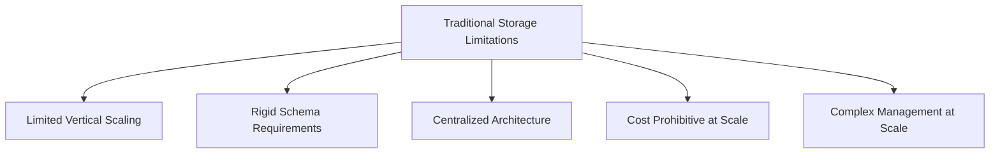
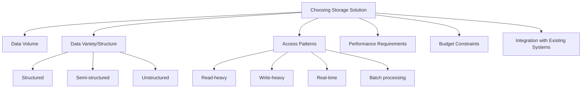
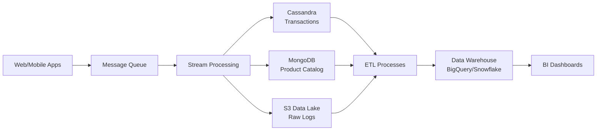

# Big Data Storage Solutions

## Introduction

In the world of big data, one of the most fundamental challenges is simply: "Where do we put all this data?" Traditional storage systems like relational databases were not designed to handle the volume, variety, and velocity of data that modern applications generate. This is where specialized big data storage solutions come into play.

Big data storage solutions are systems designed to store, manage, and retrieve massive amounts of data efficiently. These solutions need to be scalable, fault-tolerant, and capable of handling diverse data types, from structured database records to unstructured text, images, and videos.

In this guide, we'll explore the various big data storage options available, their characteristics, and how to choose the right solution for your specific needs.

## The Challenges of Big Data Storage

Before diving into solutions, let's understand the key challenges:

1. **Volume**: Storing petabytes or even exabytes of data
2. **Variety**: Managing different data formats and structures
3. **Velocity**: Handling high-speed data ingestion and retrieval
4. **Veracity**: Ensuring data quality and reliability
5. **Value**: Organizing data in a way that facilitates extraction of insights

Traditional storage systems struggle with these challenges for several reasons:



## Types of Big Data Storage Solutions

### 1. Distributed File Systems

Distributed file systems split and store data across multiple machines, allowing for horizontal scaling and fault tolerance.

#### Hadoop Distributed File System (HDFS)

HDFS is the storage layer of the Hadoop ecosystem and one of the most popular distributed file systems for big data.

**Key Features:**
- Data is divided into blocks (typically 128MB or 256MB)
- Each block is replicated across multiple nodes for fault tolerance
- Follows write-once-read-many access model
- Optimized for high throughput rather than low latency

**Simple Example:**

Here's a basic example of how to interact with HDFS using the command line:

```bash
# List files in HDFS
hdfs dfs -ls /user/data

# Put a local file into HDFS
hdfs dfs -put localfile.txt /user/data/

# Read a file from HDFS
hdfs dfs -cat /user/data/localfile.txt
```

For programmatic access, you can use the Java API:

```java
// Create a Java program to write to HDFS
import org.apache.hadoop.conf.Configuration;
import org.apache.hadoop.fs.FileSystem;
import org.apache.hadoop.fs.Path;
import java.io.BufferedWriter;
import java.io.OutputStreamWriter;

public class HDFSExample {
    public static void main(String[] args) {
        try {
            Configuration configuration = new Configuration();
            configuration.set("fs.defaultFS", "hdfs://localhost:9000");
            
            FileSystem fileSystem = FileSystem.get(configuration);
            Path path = new Path("/user/data/example.txt");
            
            if (fileSystem.exists(path)) {
                fileSystem.delete(path, true);
            }
            
            BufferedWriter br = new BufferedWriter(
                new OutputStreamWriter(fileSystem.create(path)));
            
            br.write("This is an example text for HDFS.");
            br.close();
            
            System.out.println("File written successfully!");
        } catch (Exception e) {
            e.printStackTrace();
        }
    }
}
```

### 2. NoSQL Databases

NoSQL (Not Only SQL) databases provide flexible schemas and horizontal scalability for different data models.

#### Types of NoSQL Databases

1. **Document Stores** (e.g., MongoDB, Couchbase)
   - Store data as documents (usually JSON or BSON)
   - Good for semi-structured data

2. **Key-Value Stores** (e.g., Redis, Amazon DynamoDB)
   - Simple data model with keys mapped to values
   - Highly scalable and fast

3. **Column-Family Stores** (e.g., Apache Cassandra, HBase)
   - Store data in column families
   - Optimized for reading and writing columns of data

4. **Graph Databases** (e.g., Neo4j, Amazon Neptune)
   - Specialized for data with complex relationships
   - Use nodes and edges to represent data

**Example with MongoDB:**

```javascript
// Connect to MongoDB
const { MongoClient } = require('mongodb');
const uri = 'mongodb://localhost:27017';
const client = new MongoClient(uri);

async function storeData() {
  try {
    await client.connect();
    const database = client.db('bigdatadb');
    const collection = database.collection('sensors');
    
    // Insert a document
    const result = await collection.insertOne({
      sensorId: 'temp-001',
      location: 'Warehouse A',
      readings: [
        { timestamp: new Date(), value: 22.5 },
        { timestamp: new Date(), value: 23.1 }
      ],
      metadata: {
        type: 'temperature',
        unit: 'celsius',
        manufacturer: 'SensorTech'
      }
    });
    
    console.log(`Document inserted with ID: ${result.insertedId}`);
  } finally {
    await client.close();
  }
}

storeData().catch(console.error);
```

**Example with Cassandra (CQL):**

```sql
-- Create a keyspace
CREATE KEYSPACE IF NOT EXISTS sensordata 
WITH REPLICATION = { 'class' : 'SimpleStrategy', 'replication_factor' : 3 };

-- Create a table
CREATE TABLE IF NOT EXISTS sensordata.readings (
  sensor_id text,
  timestamp timestamp,
  temperature float,
  humidity float,
  PRIMARY KEY (sensor_id, timestamp)
) WITH CLUSTERING ORDER BY (timestamp DESC);

-- Insert data
INSERT INTO sensordata.readings (sensor_id, timestamp, temperature, humidity)
VALUES ('temp-001', toTimestamp(now()), 22.5, 45.2);

-- Query data
SELECT * FROM sensordata.readings 
WHERE sensor_id = 'temp-001' 
AND timestamp > '2023-01-01' 
AND timestamp < '2023-12-31';
```

### 3. Data Lakes

Data lakes store vast amounts of raw data in its native format until needed.

**Key Features:**
- Store data in its raw format
- Support structured, semi-structured, and unstructured data
- Schema-on-read approach (define structure when data is used)
- Typically built on cloud storage or HDFS

**Real-world Example - AWS S3 Data Lake:**

```python
import boto3
import pandas as pd
from io import StringIO

# Initialize S3 client
s3 = boto3.client('s3')

# Function to store data in the data lake
def store_in_data_lake(dataframe, bucket, path):
    csv_buffer = StringIO()
    dataframe.to_csv(csv_buffer, index=False)
    s3.put_object(
        Bucket=bucket,
        Key=path,
        Body=csv_buffer.getvalue()
    )
    print(f"Data stored at s3://{bucket}/{path}")

# Example usage
sales_data = pd.DataFrame({
    'date': ['2023-01-01', '2023-01-02', '2023-01-03'],
    'product_id': ['P001', 'P002', 'P001'],
    'quantity': [5, 3, 7],
    'price': [10.99, 24.99, 10.99]
})

# Store raw data in the data lake
store_in_data_lake(
    sales_data,
    'my-data-lake',
    'raw/sales/2023/01/sales-20230103.csv'
)
```

### 4. Cloud Storage Solutions

Cloud providers offer specialized storage services for big data workloads.

**Major cloud storage options:**
- **Amazon S3**: Object storage with unlimited scalability
- **Google Cloud Storage**: Global object storage for unstructured data
- **Azure Blob Storage**: Microsoft's object storage solution
- **Amazon Redshift**: Data warehouse optimized for analytics
- **Google BigQuery**: Serverless data warehouse for analytics
- **Azure Synapse Analytics**: Integrated analytics service

**Example with Google BigQuery:**

```python
from google.cloud import bigquery

# Initialize client
client = bigquery.Client()

# Define the query
query = """
    SELECT 
        date, 
        SUM(revenue) as daily_revenue,
        COUNT(DISTINCT user_id) as unique_users
    FROM 
        `my-project.ecommerce.transactions`
    WHERE 
        date >= '2023-01-01'
    GROUP BY 
        date
    ORDER BY 
        date DESC
    LIMIT 10
"""

# Run the query
query_job = client.query(query)

# Process results
for row in query_job:
    print(f"Date: {row['date']}, Revenue: ${row['daily_revenue']}, Users: {row['unique_users']}")
```

## Choosing the Right Storage Solution

Selecting the appropriate big data storage solution depends on several factors:



### Decision Guidelines

1. **For primarily structured data with complex queries:**
   - Distributed SQL databases like Google Spanner, Amazon Aurora
   - Data warehouses like Snowflake, Amazon Redshift, Google BigQuery

2. **For semi-structured data with flexible schema:**
   - Document stores like MongoDB, Couchbase
   - Cloud-based solutions like Azure Cosmos DB

3. **For time-series or log data:**
   - Column-family stores like Apache Cassandra
   - Specialized time-series databases like InfluxDB, TimescaleDB

4. **For storing diverse raw data:**
   - Data lakes built on HDFS or cloud storage (S3, Azure Blob, Google Cloud Storage)
   - Lake house platforms like Delta Lake, Apache Iceberg

## Performance Optimization Techniques

Regardless of which storage solution you choose, these techniques can help optimize performance:

### 1. Data Partitioning

Divide data into smaller, more manageable pieces based on logical boundaries.

**Example - Partitioning by date in Hive:**

```sql
CREATE TABLE sensor_readings (
  sensor_id STRING,
  reading_value DOUBLE,
  reading_time TIMESTAMP
)
PARTITIONED BY (year INT, month INT, day INT)
STORED AS PARQUET;

-- Insert data with partition specification
INSERT INTO sensor_readings PARTITION (year=2023, month=8, day=15)
SELECT sensor_id, reading_value, reading_time
FROM staging_sensor_data
WHERE YEAR(reading_date) = 2023 AND MONTH(reading_date) = 8 AND DAY(reading_date) = 15;
```

### 2. Data Compression

Compress data to reduce storage requirements and improve I/O performance.

**Common compression formats:**
- Gzip: Good compression ratio but CPU-intensive
- Snappy: Faster decompression, moderate compression ratio
- LZO: Balance between speed and compression
- Parquet: Column-oriented storage with built-in compression

### 3. Caching

Use in-memory caching to speed up access to frequently used data.

**Example with Redis:**

```python
import redis

# Connect to Redis
r = redis.Redis(host='localhost', port=6379, db=0)

# Function to get user data with caching
def get_user_data(user_id):
    # Try to get from cache first
    cached_data = r.get(f"user:{user_id}")
    
    if cached_data:
        print("Cache hit!")
        return json.loads(cached_data)
    
    print("Cache miss! Fetching from database...")
    # Simulate database query
    user_data = fetch_user_from_database(user_id)
    
    # Store in cache for future requests (expire after 1 hour)
    r.setex(f"user:{user_id}", 3600, json.dumps(user_data))
    
    return user_data
```

## Real-world Implementation Examples

### Example 1: E-commerce Data Pipeline

An e-commerce company might implement a hybrid storage solution:

1. **Transaction Data**: Apache Cassandra for high-write throughput
2. **Product Catalog**: MongoDB for flexible schema
3. **User Activity Logs**: Data lake on S3 with Parquet format
4. **Analytics**: Data warehouse like Snowflake or BigQuery



### Example 2: IoT Sensor Network

An IoT platform might use:

1. **Time-series Database**: InfluxDB for sensor readings
2. **Document Store**: MongoDB for device metadata
3. **Object Storage**: S3 for historical data archives
4. **In-memory Database**: Redis for real-time metrics

## Best Practices

1. **Design for scale from the beginning**
   - Horizontal scaling is easier if planned from the start

2. **Plan your data lifecycle**
   - How long to keep data at each tier (hot/warm/cold storage)

3. **Use the right tool for the job**
   - Combine multiple storage systems for different needs

4. **Consider data governance**
   - Implement security, access control, and auditing

5. **Test performance at scale**
   - Pilot with realistic data volumes before production

## Summary

Big data storage solutions have evolved to address the limitations of traditional storage systems. The key options we've explored include:

1. **Distributed File Systems** like HDFS for raw data storage
2. **NoSQL Databases** for flexible, schema-less data storage
3. **Data Lakes** for storing vast amounts of diverse raw data
4. **Cloud Storage Solutions** for scalable, managed storage

When choosing a solution, consider your specific requirements around data volume, variety, velocity, access patterns, and integration needs. Many organizations implement a hybrid approach, using different storage solutions for different types of data and workloads.

Remember that big data storage is just one component of a complete big data architecture. It needs to work seamlessly with data ingestion, processing, and analytics components to deliver value.

## Exercises

1. **Basic Exercise**: Set up a local HDFS instance and practice basic file operations.

2. **Intermediate Exercise**: Create a simple data pipeline that ingests data into MongoDB and queries it for specific insights.

3. **Advanced Exercise**: Design a hybrid storage architecture for a hypothetical application that generates 1TB of data daily, including logs, structured transactions, and media files.

## Additional Resources

- Apache Hadoop Documentation
- MongoDB University (free courses)
- AWS, Google Cloud, and Azure documentation for their respective big data services
- "Designing Data-Intensive Applications" by Martin Kleppmann
- Coursera and edX courses on big data storage

Remember that big data technologies evolve rapidly, so continuous learning is essential to stay current with the latest best practices and tools.