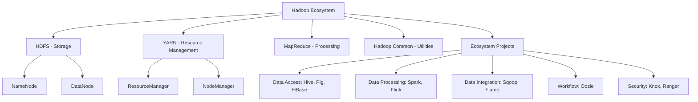

# Hadoop Ecosystem

## Introduction

The Hadoop Ecosystem is a collection of open-source software tools designed to solve the challenges of storing and processing massive amounts of data. Born out of the need to handle data at scales that traditional databases couldn't manage, Hadoop has evolved into a rich ecosystem of interconnected technologies that work together to provide a complete big data solution.

At its core, Hadoop was inspired by Google's papers on the Google File System (GFS) and MapReduce programming paradigm. Today, the ecosystem encompasses dozens of projects that extend Hadoop's capabilities into areas like real-time processing, machine learning, and data governance.

In this guide, we'll explore the fundamental components of the Hadoop Ecosystem and how they work together to handle big data challenges.

## Core Components of the Hadoop Ecosystem

The Hadoop Ecosystem is built around several core components:



Let's examine each of these components in detail:

### 1. HDFS (Hadoop Distributed File System)

HDFS is the primary storage system used by Hadoop applications. It's designed to be highly fault-tolerant and is built to be deployed on low-cost hardware.

#### Key Features of HDFS:

- **Distributed Storage**: Data is stored across multiple machines
- **Fault Tolerance**: Multiple copies of data are stored to ensure reliability
- **High Throughput**: Optimized for large datasets and batch processing
- **Block Storage**: Files are divided into blocks (typically 128MB or 256MB)

#### HDFS Architecture:

- **NameNode**: The master server that manages the file system namespace and regulates access to files
- **DataNodes**: The worker nodes that store the actual data blocks

#### Simple Example of HDFS Commands:

```bash
# List files in HDFS
hadoop fs -ls /

# Create a directory in HDFS
hadoop fs -mkdir /user/example

# Copy a local file to HDFS
hadoop fs -put localfile.txt /user/example/

# View content of a file in HDFS
hadoop fs -cat /user/example/localfile.txt

# Remove a file from HDFS
hadoop fs -rm /user/example/localfile.txt
```

### 2. YARN (Yet Another Resource Negotiator)

YARN is the resource management layer of Hadoop, responsible for allocating compute resources to applications and scheduling tasks.

#### Key Features of YARN:

- **Resource Management**: Manages CPU, memory, and other resources across the cluster
- **Multi-tenancy**: Allows multiple applications to share the same cluster
- **Scalability**: Can scale to thousands of nodes
- **Compatibility**: Supports various processing frameworks beyond MapReduce

#### YARN Architecture:

- **ResourceManager**: Global resource scheduler
- **NodeManager**: Per-node agent responsible for containers and resource usage
- **ApplicationMaster**: Application-specific process that negotiates resources from the ResourceManager

### 3. MapReduce

MapReduce is a programming model and processing technique for distributed computing. It breaks down data processing into two phases: Map and Reduce.

#### How MapReduce Works:

1. **Map Phase**: Data is split and processed in parallel
2. **Shuffle Phase**: Data is sorted and transferred
3. **Reduce Phase**: Results are aggregated

#### Simple MapReduce Example (Word Count in Java):

```java
import java.io.IOException;
import java.util.StringTokenizer;

import org.apache.hadoop.conf.Configuration;
import org.apache.hadoop.fs.Path;
import org.apache.hadoop.io.IntWritable;
import org.apache.hadoop.io.Text;
import org.apache.hadoop.mapreduce.Job;
import org.apache.hadoop.mapreduce.Mapper;
import org.apache.hadoop.mapreduce.Reducer;
import org.apache.hadoop.mapreduce.lib.input.FileInputFormat;
import org.apache.hadoop.mapreduce.lib.output.FileOutputFormat;

public class WordCount {

  public static class TokenizerMapper
       extends Mapper<Object, Text, Text, IntWritable>{

    private final static IntWritable one = new IntWritable(1);
    private Text word = new Text();

    public void map(Object key, Text value, Context context
                    ) throws IOException, InterruptedException {
      StringTokenizer itr = new StringTokenizer(value.toString());
      while (itr.hasMoreTokens()) {
        word.set(itr.nextToken());
        context.write(word, one);
      }
    }
  }

  public static class IntSumReducer
       extends Reducer<Text, IntWritable, Text, IntWritable> {
    private IntWritable result = new IntWritable();

    public void reduce(Text key, Iterable<IntWritable> values,
                       Context context
                       ) throws IOException, InterruptedException {
      int sum = 0;
      for (IntWritable val : values) {
        sum += val.get();
      }
      result.set(sum);
      context.write(key, result);
    }
  }

  public static void main(String[] args) throws Exception {
    Configuration conf = new Configuration();
    Job job = Job.getInstance(conf, "word count");
    job.setJarByClass(WordCount.class);
    job.setMapperClass(TokenizerMapper.class);
    job.setCombinerClass(IntSumReducer.class);
    job.setReducerClass(IntSumReducer.class);
    job.setOutputKeyClass(Text.class);
    job.setOutputValueClass(IntWritable.class);
    FileInputFormat.addInputPath(job, new Path(args[0]));
    FileOutputFormat.setOutputPath(job, new Path(args[1]));
    System.exit(job.waitForCompletion(true) ? 0 : 1);
  }
}
```

**Input**: Text file with multiple sentences and words
**Output**: List of words with their count in the entire file

```
hello    2
world    3
hadoop   8
big      5
data     7
```

## Extended Hadoop Ecosystem Components

The true power of Hadoop comes from its extended ecosystem. Let's explore some key components:

### 1. Hive - SQL on Hadoop

Apache Hive provides a SQL-like interface for querying data stored in HDFS, making it accessible to analysts familiar with SQL.

#### Key Features:
- HiveQL (SQL-like query language)
- Schema on read
- Support for custom functions (UDFs)
- Metadata storage in Hive Metastore

#### Example Hive Query:

```sql
-- Create a table
CREATE TABLE users (
  user_id INT,
  username STRING,
  email STRING,
  signup_date DATE
)
ROW FORMAT DELIMITED
FIELDS TERMINATED BY ',';

-- Load data into the table
LOAD DATA INPATH '/user/data/users.csv' INTO TABLE users;

-- Query the table
SELECT username, signup_date 
FROM users 
WHERE signup_date > '2023-01-01';
```

### 2. Pig - Data Flow Scripting

Apache Pig provides a high-level scripting language called Pig Latin that simplifies the process of creating MapReduce programs.

#### Key Features:
- Procedural data flow language
- Extensible with User Defined Functions
- Handles both structured and unstructured data
- Automatic optimization

#### Example Pig Script:

```
-- Load user data
users = LOAD '/user/data/users.csv' USING PigStorage(',') AS (user_id:int, username:chararray, email:chararray, signup_date:chararray);

-- Filter users who signed up after January 1, 2023
recent_users = FILTER users BY ToDate(signup_date, 'yyyy-MM-dd') > ToDate('2023-01-01', 'yyyy-MM-dd');

-- Group users by signup month
users_by_month = GROUP recent_users BY SUBSTRING(signup_date, 0, 7);

-- Count users per month
monthly_counts = FOREACH users_by_month GENERATE group AS month, COUNT(recent_users) AS user_count;

-- Store the results
STORE monthly_counts INTO '/user/output/monthly_user_counts';
```

### 3. Spark - In-memory Processing

Apache Spark is a fast, in-memory data processing engine that provides an alternative to MapReduce with better performance for many workloads.

#### Key Features:
- In-memory computation
- Support for multiple languages (Scala, Java, Python, R)
- Advanced analytics through Spark SQL, Spark Streaming, MLlib, and GraphX
- Both batch and stream processing

#### Example Spark Program (Word Count in Python):

```python
from pyspark import SparkContext, SparkConf

# Initialize Spark context
conf = SparkConf().setAppName("WordCount")
sc = SparkContext(conf=conf)

# Load data
text_file = sc.textFile("hdfs:///user/data/sample.txt")

# Calculate word count
word_counts = text_file.flatMap(lambda line: line.split(" ")) \
                      .map(lambda word: (word, 1)) \
                      .reduceByKey(lambda a, b: a + b)

# Save the results
word_counts.saveAsTextFile("hdfs:///user/output/word_count_results")

# Stop the Spark context
sc.stop()
```

### 4. HBase - NoSQL Database

Apache HBase is a distributed, scalable, NoSQL database that runs on top of HDFS, designed for random, real-time read/write access to big data.

#### Key Features:
- Column-oriented data model
- Strong consistency
- Automatic sharding
- Linear and modular scalability

#### Example HBase Shell Commands:

```bash
# Create a table
create 'users', 'info', 'logs'

# Insert data
put 'users', 'user123', 'info:name', 'John Doe'
put 'users', 'user123', 'info:email', 'john@example.com'
put 'users', 'user123', 'logs:last_login', '2023-05-15 14:22:31'

# Get a row
get 'users', 'user123'

# Scan the table
scan 'users', {LIMIT => 10}

# Delete data
delete 'users', 'user123', 'logs:last_login'
```

### 5. Data Ingestion Tools

#### Sqoop - Database Import/Export

Apache Sqoop is designed to efficiently transfer bulk data between Hadoop and structured datastores like relational databases.

```bash
# Import data from MySQL to HDFS
sqoop import \
  --connect jdbc:mysql://database_server/database_name \
  --username username \
  --password password \
  --table employees \
  --target-dir /user/hadoop/employee_data

# Export data from HDFS to MySQL
sqoop export \
  --connect jdbc:mysql://database_server/database_name \
  --username username \
  --password password \
  --table employees \
  --export-dir /user/hadoop/employee_data
```

#### Flume - Log Collection

Apache Flume is designed for efficiently collecting, aggregating, and moving large amounts of log data from many sources to HDFS.

```
# Example Flume configuration file
agent.sources = webserver
agent.channels = memoryChannel
agent.sinks = hdfs-sink

# Define the source
agent.sources.webserver.type = exec
agent.sources.webserver.command = tail -F /var/log/apache/access.log
agent.sources.webserver.channels = memoryChannel

# Define the channel
agent.channels.memoryChannel.type = memory
agent.channels.memoryChannel.capacity = 10000
agent.channels.memoryChannel.transactionCapacity = 1000

# Define the sink
agent.sinks.hdfs-sink.type = hdfs
agent.sinks.hdfs-sink.hdfs.path = hdfs://namenode:8020/user/flume/logs/%Y/%m/%d
agent.sinks.hdfs-sink.hdfs.fileType = DataStream
agent.sinks.hdfs-sink.hdfs.writeFormat = Text
agent.sinks.hdfs-sink.hdfs.rollInterval = 300
agent.sinks.hdfs-sink.channel = memoryChannel
```

## Real-World Use Cases

The Hadoop Ecosystem is versatile and can be applied to numerous real-world scenarios:

### 1. Log Analysis for E-commerce

An e-commerce company needs to analyze user behavior across its website to improve user experience and increase conversions.

**Solution:**
- Use Flume to collect web server logs
- Store data in HDFS
- Process using Spark to identify patterns
- Use Hive for analysts to query user behavior

### 2. Financial Data Processing

A financial institution needs to process millions of transactions daily for fraud detection and regulatory compliance.

**Solution:**
- Ingest transaction data using Sqoop or Kafka
- Store historical transactions in HDFS
- Use Spark Streaming for real-time fraud detection
- Use HBase for quick lookups of customer profiles
- Run batch analytics using MapReduce or Spark

### 3. Healthcare Data Analytics

A healthcare provider wants to analyze patient data to improve care quality and reduce costs.

**Solution:**
- Store anonymized patient records in HDFS
- Use Hive for data warehousing
- Apply machine learning using Spark MLlib to predict patient readmissions
- Visualize results using tools like Zeppelin or Tableau connected to Hive

## Setting Up a Basic Hadoop Cluster

For beginners who want to experiment with Hadoop, here's how to set up a simple single-node cluster:

### 1. Install Java

```bash
sudo apt-get update
sudo apt-get install openjdk-8-jdk
```

### 2. Create a Hadoop User

```bash
sudo addgroup hadoop
sudo adduser --ingroup hadoop hduser
```

### 3. Download and Extract Hadoop

```bash
wget https://dlcdn.apache.org/hadoop/common/hadoop-3.3.4/hadoop-3.3.4.tar.gz
tar -xzf hadoop-3.3.4.tar.gz
sudo mv hadoop-3.3.4 /usr/local/hadoop
sudo chown -R hduser:hadoop /usr/local/hadoop
```

### 4. Configure Hadoop

Edit `core-site.xml`:

```xml
<configuration>
  <property>
    <name>fs.defaultFS</name>
    <value>hdfs://localhost:9000</value>
  </property>
</configuration>
```

Edit `hdfs-site.xml`:

```xml
<configuration>
  <property>
    <name>dfs.replication</name>
    <value>1</value>
  </property>
  <property>
    <name>dfs.namenode.name.dir</name>
    <value>file:/usr/local/hadoop/hadoopdata/hdfs/namenode</value>
  </property>
  <property>
    <name>dfs.datanode.data.dir</name>
    <value>file:/usr/local/hadoop/hadoopdata/hdfs/datanode</value>
  </property>
</configuration>
```

### 5. Format HDFS

```bash
hdfs namenode -format
```

### 6. Start Hadoop Services

```bash
start-dfs.sh
start-yarn.sh
```

## Advanced Topics

As you grow more comfortable with the Hadoop Ecosystem, consider exploring these advanced topics:

### 1. Data Governance with Apache Atlas and Apache Ranger

These tools help manage data security, lineage, and compliance across the Hadoop ecosystem.

### 2. Real-time Processing with Kafka and Spark Streaming

For applications requiring real-time insights, combining Kafka with Spark Streaming provides a powerful solution.

### 3. Machine Learning at Scale with Spark MLlib

Apply machine learning algorithms to massive datasets using Spark's built-in library.

### 4. Cloud-based Hadoop with AWS EMR, Azure HDInsight, or Google Dataproc

Leverage cloud providers' managed Hadoop services to avoid infrastructure management.

## Summary

The Hadoop Ecosystem represents a powerful collection of tools for big data processing and analytics. From its core components (HDFS, YARN, and MapReduce) to its extended ecosystem (Hive, Pig, Spark, HBase, etc.), Hadoop provides solutions for storing, processing, and analyzing massive datasets.

Key takeaways:
- HDFS provides reliable, distributed storage
- YARN manages compute resources across the cluster
- MapReduce offers a programming model for parallel processing
- The extended ecosystem includes specialized tools for SQL queries, scripting, in-memory processing, and more
- Real-world applications span industries from e-commerce to finance to healthcare

As you continue your journey with Hadoop, remember that different components excel at different tasks. Understanding when to use each tool is as important as knowing how to use them.

## Additional Resources

### Practice Exercises

1. Set up a single-node Hadoop cluster on your machine
2. Write a MapReduce job to analyze a dataset of your choice
3. Create Hive tables and write queries to analyze structured data
4. Use Spark to perform the same analysis and compare performance
5. Design a data pipeline that ingests data with Sqoop or Flume, processes it with Spark, and makes it queryable with Hive

### Further Learning

- Apache Hadoop Official Documentation
- "Hadoop: The Definitive Guide" by Tom White
- "Learning Spark" by Holden Karau, Andy Konwinski, Patrick Wendell, and Matei Zaharia
- Cloudera and Hortonworks tutorials
- Online courses on platforms like Coursera, Udemy, and edX

Remember that the Hadoop ecosystem continues to evolve, with new tools and capabilities being added regularly. Stay curious and keep exploring!