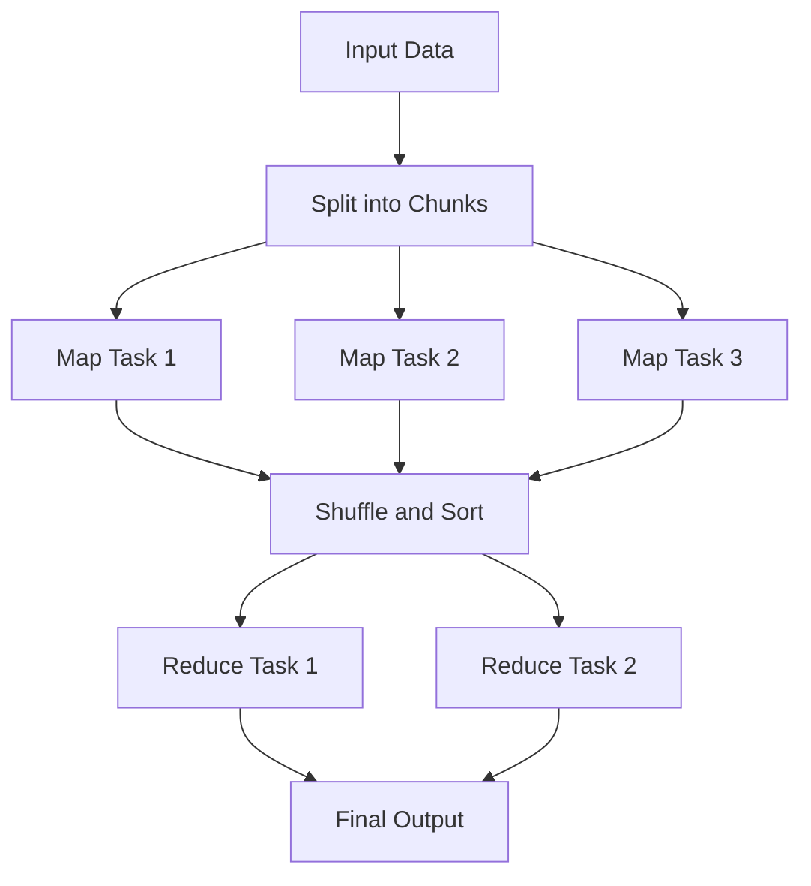

# MapReduce Paradigm

## Introduction

MapReduce is a programming paradigm and processing model designed to process vast amounts of data in parallel across a distributed cluster of computers. Developed by Google in 2004, MapReduce has become a fundamental concept in big data processing, allowing developers to write programs that can handle petabytes of data distributed across thousands of machines.

The beauty of MapReduce lies in its simplicity: it breaks down complex data processing tasks into two basic operations—**Map** and **Reduce**—that are inspired by functional programming concepts. This approach abstracts away the complexities of parallel and distributed computation, making it accessible even to programmers without extensive experience in distributed systems.

## Understanding the MapReduce Model

MapReduce operates on data structured as key-value pairs and transforms these pairs through a sequence of operations. Let's examine the core components of this paradigm:

### Key Components

1. **Input Data**: Large dataset split into chunks
2. **Map Function**: Processes input key-value pairs to generate intermediate key-value pairs
3. **Shuffle and Sort**: System groups all intermediate values by key
4. **Reduce Function**: Processes intermediate values for a single key to produce output
5. **Output Data**: Collection of values produced by the Reduce functions

### The MapReduce Workflow



## How MapReduce Works: Step by Step

Let's break down the MapReduce process in detail:

### 1. Input Phase

The system splits the input data into fixed-size chunks called **splits** or **input splits**. Each split is assigned to a Map task.

### 2. Map Phase

The Map function processes each input record independently and in parallel:

```javascript
function map(key, value) {
  // Process input
  // Emit intermediate key-value pairs
  emit(intermediateKey, intermediateValue);
}
```

For each input key-value pair, the Map function produces zero or more intermediate key-value pairs.

### 3. Shuffle and Sort Phase

The MapReduce framework:
- Collects all intermediate key-value pairs from all mappers
- Groups pairs with the same key
- Sorts them by key
- Transfers the data to the reducers

This phase happens automatically—developers don't need to write code for it.

### 4. Reduce Phase

The Reduce function processes each unique key and its associated values:

```javascript
function reduce(intermediateKey, listOfValues) {
  // Process values associated with this key
  // Produce output
  emit(outputKey, outputValue);
}
```

Each Reduce task works on a subset of keys, producing zero or more output key-value pairs.

### 5. Output Phase

The final output is written to the storage system (often a distributed file system like HDFS).

## A Simple MapReduce Example: Word Count

Let's explore the classic "Hello World" of MapReduce: counting word occurrences in a text.

### Problem Statement

Count how many times each word appears in a collection of documents.

### Input Data

```
Document 1: "Hello world hello MapReduce"
Document 2: "MapReduce is powerful world"
Document 3: "Hello big data world"
```

### Map Function

The Map function emits each word with a count of 1:

```python
def map_function(document_id, document_text):
    words = document_text.lower().split()
    for word in words:
        emit(word, 1)
```

### Map Output (Intermediate Key-Value Pairs)

```
("hello", 1)
("world", 1)
("hello", 1)
("mapreduce", 1)
("mapreduce", 1)
("is", 1)
("powerful", 1)
("world", 1)
("hello", 1)
("big", 1)
("data", 1)
("world", 1)
```

### Shuffle and Sort

The framework groups by key:

```
("big", [1])
("data", [1])
("hello", [1, 1, 1])
("is", [1])
("mapreduce", [1, 1])
("powerful", [1])
("world", [1, 1, 1])
```

### Reduce Function

The Reduce function sums the counts for each word:

```python
def reduce_function(word, counts):
    total_count = sum(counts)
    emit(word, total_count)
```

### Reduce Output (Final Result)

```
("big", 1)
("data", 1)
("hello", 3)
("is", 1)
("mapreduce", 2)
("powerful", 1)
("world", 3)
```

## Real-World Applications of MapReduce

MapReduce's power extends far beyond simple counting examples. Here are some practical applications:

### 1. Log Analysis

System administrators can use MapReduce to analyze large log files:

```python
def map_function(log_file_id, log_line):
    if "ERROR" in log_line:
        date = extract_date(log_line)
        error_type = extract_error_type(log_line)
        emit((date, error_type), 1)

def reduce_function(date_error_pair, counts):
    total = sum(counts)
    emit(date_error_pair, total)
```

This helps identify patterns in system errors across vast amounts of log data.

### 2. Inverted Index Creation

Search engines use inverted indices to quickly look up which documents contain specific words:

```python
def map_function(document_id, content):
    words = tokenize(content)
    for word in words:
        emit(word, document_id)

def reduce_function(word, document_list):
    unique_docs = list(set(document_list))
    emit(word, unique_docs)
```

### 3. Genomic Data Analysis

Scientists use MapReduce to process DNA sequencing data:

```python
def map_function(sequence_id, dna_fragment):
    for i in range(len(dna_fragment) - k + 1):
        k_mer = dna_fragment[i:i+k]
        emit(k_mer, 1)

def reduce_function(k_mer, counts):
    frequency = sum(counts)
    emit(k_mer, frequency)
```

This helps identify patterns within genetic sequences across large datasets.

## Implementing MapReduce

There are several frameworks for implementing MapReduce applications:

### 1. Apache Hadoop

The most popular open-source implementation of MapReduce:

```java
public class WordCount {
  public static class TokenizerMapper extends Mapper<Object, Text, Text, IntWritable> {
    private final static IntWritable one = new IntWritable(1);
    private Text word = new Text();

    public void map(Object key, Text value, Context context) throws IOException, InterruptedException {
      StringTokenizer itr = new StringTokenizer(value.toString());
      while (itr.hasMoreTokens()) {
        word.set(itr.nextToken());
        context.write(word, one);
      }
    }
  }

  public static class IntSumReducer extends Reducer<Text, IntWritable, Text, IntWritable> {
    private IntWritable result = new IntWritable();

    public void reduce(Text key, Iterable<IntWritable> values, Context context) 
      throws IOException, InterruptedException {
      int sum = 0;
      for (IntWritable val : values) {
        sum += val.get();
      }
      result.set(sum);
      context.write(key, result);
    }
  }
}
```

### 2. MapReduce in Python with Hadoop Streaming

```python
#!/usr/bin/env python
# mapper.py
import sys

for line in sys.stdin:
    line = line.strip()
    words = line.split()
    for word in words:
        print(f"{word}\t1")
```

```python
#!/usr/bin/env python
# reducer.py
import sys

current_word = None
current_count = 0
word = None

for line in sys.stdin:
    line = line.strip()
    word, count = line.split('\t', 1)
    count = int(count)

    if current_word == word:
        current_count += count
    else:
        if current_word:
            print(f"{current_word}\t{current_count}")
        current_count = count
        current_word = word

if current_word == word:
    print(f"{current_word}\t{current_count}")
```

## Advantages of MapReduce

- **Scalability**: Scales horizontally by adding more machines to the cluster
- **Fault Tolerance**: Automatically handles machine failures
- **Simplicity**: Abstracts complex distributed programming details
- **Locality of Data**: Moves computation to data, reducing network congestion

## Limitations of MapReduce

- **Not Ideal for Iterative Algorithms**: Multiple MapReduce jobs must be chained
- **Latency**: Batch-oriented processing not suitable for real-time analytics
- **No Interactive Queries**: Not designed for interactive data exploration
- **I/O Intensive**: Writes intermediate results to disk between phases

## Beyond Traditional MapReduce

The big data ecosystem has evolved beyond traditional MapReduce with frameworks like:

- **Apache Spark**: In-memory processing and a richer API
- **Apache Flink**: Stream processing capabilities
- **Apache Beam**: Unified batch and stream processing

While these newer frameworks address some of MapReduce's limitations, they still build upon its fundamental concepts.

## Summary

The MapReduce paradigm revolutionized big data processing by providing a simple programming model for distributed computing. By breaking down complex data processing into Map and Reduce operations, it enables engineers to process massive datasets across clusters of commodity hardware.

Understanding MapReduce is essential for anyone working with big data systems, as its concepts underpin many modern data processing frameworks, even those that have moved beyond the original implementation.

## Exercises

1. Implement a MapReduce algorithm to find the average temperature for each month from a weather dataset.
2. Design a MapReduce solution to identify mutual friends in a social network.
3. Write a MapReduce program to calculate the frequency of each character in a large text corpus.
4. Create a MapReduce job to find the top 10 most frequent words in a collection of documents.
5. Implement a MapReduce pipeline to join two large datasets based on a common key.

## Further Reading

- "MapReduce: Simplified Data Processing on Large Clusters" (original Google paper)
- "Hadoop: The Definitive Guide" by Tom White
- "Data-Intensive Text Processing with MapReduce" by Jimmy Lin and Chris Dyer
- Apache Hadoop Documentation