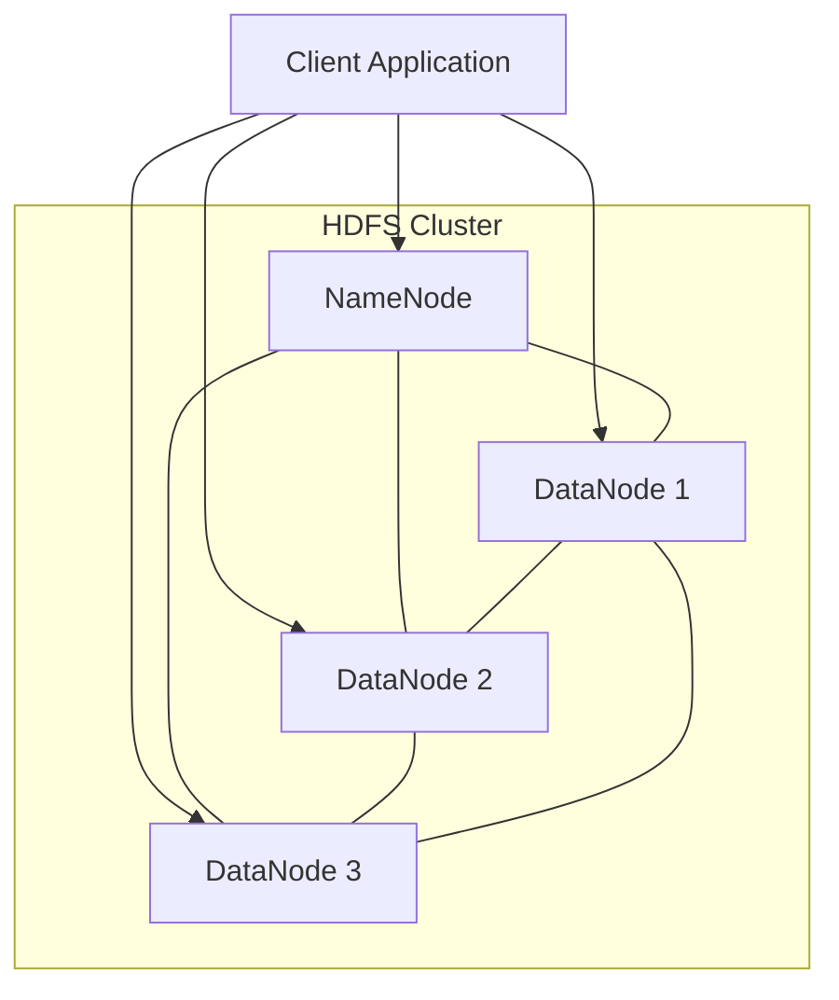
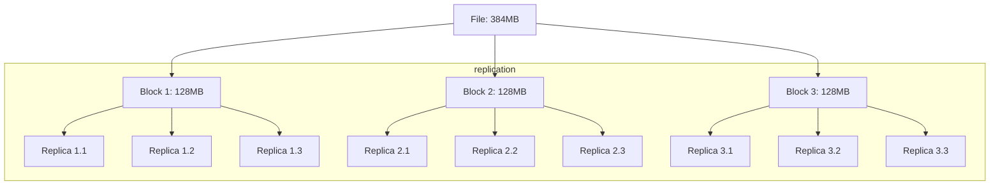

# HDFS Basics

## Introduction

The Hadoop Distributed File System (HDFS) is the primary storage system of the Apache Hadoop ecosystem. Designed to run on commodity hardware, HDFS provides high-throughput access to application data and is suitable for applications with large datasets. In this guide, we'll explore the fundamental concepts of HDFS, its architecture, and how it works to store and process massive amounts of data reliably.

## What is HDFS?

HDFS (Hadoop Distributed File System) is a distributed file system designed to store very large datasets reliably and to stream those datasets at high bandwidth to user applications. It was inspired by Google's File System (GFS) paper and is built to handle the following challenges:

- **Hardware Failure**: Hardware failure is the norm rather than the exception in large clusters. HDFS is designed to detect and recover from such failures automatically.
- **Streaming Data Access**: HDFS is designed more for batch processing rather than interactive use. It emphasizes high throughput of data access rather than low latency.
- **Large Datasets**: HDFS is designed to handle applications that have datasets typically gigabytes to terabytes in size.
- **Simple Coherency Model**: HDFS applications need a write-once-read-many access model for files. A file once created, written, and closed doesn't need to be changed.

## HDFS Architecture

HDFS follows a master/slave architecture, consisting of two main components:

1. **NameNode (Master)**: Manages the file system namespace and regulates access to files
2. **DataNodes (Slaves)**: Store the actual data blocks and serve read/write requests

Let's visualize this architecture:



### The NameNode

The NameNode is the centerpiece of HDFS. It:

- Maintains the file system namespace (directory structure, file metadata)
- Stores the mapping of file blocks to DataNodes
- Records changes to the file system namespace
- Regulates client access to files
- Manages DataNode registration and heartbeats

### The DataNodes

DataNodes are the workhorses of HDFS:

- Store actual data blocks
- Serve read/write requests from clients
- Perform block creation, deletion, and replication upon instruction from NameNode
- Send heartbeats and block reports to NameNode periodically

## How HDFS Works

### Data Storage Model

HDFS stores files in blocks, which are typically 128MB in size (configurable). If a file is smaller than 128MB, it occupies only the required space. Files larger than 128MB are split into 128MB blocks and stored across multiple DataNodes.

For example, a 384MB file would be stored as three 128MB blocks. Each block is replicated multiple times (default replication factor is 3) and stored on different DataNodes for reliability.



### Reading a File in HDFS

When a client wants to read a file from HDFS, the following process takes place:

1. The client contacts the NameNode to retrieve the locations of the blocks for the file.
2. For each block, the NameNode returns a list of DataNodes that have a copy of that block.
3. The client contacts the DataNodes directly to read the blocks, preferring the nearest DataNode.
4. The client assembles the blocks to reconstruct the complete file.

### Writing a File to HDFS

Writing to HDFS follows a pipeline approach:

1. The client requests the NameNode to create a new file in the file system namespace.
2. The NameNode checks permissions and if the file doesn't already exist.
3. The client starts writing data to HDFS, which is first cached locally in a temporary file.
4. When the temporary file accumulates a full block of data, the client requests block locations from the NameNode.
5. The NameNode allocates a block ID and provides a list of DataNodes to store the replicas.
6. The client establishes a pipeline with the DataNodes and streams the data.
7. Once the file is completely written, the client signals the NameNode to close the file.

## HDFS Command-Line Interface

Let's look at some common HDFS commands with examples.

### Basic File Operations

**List files in HDFS directory:**
```bash
hdfs dfs -ls /user/hadoop
```

Output:
```
Found 3 items
drwxr-xr-x   - hadoop hadoop          0 2023-05-15 14:20 /user/hadoop/data
-rw-r--r--   3 hadoop hadoop    1048576 2023-05-15 14:25 /user/hadoop/file1.txt
-rw-r--r--   3 hadoop hadoop     524288 2023-05-15 14:30 /user/hadoop/file2.txt
```

**Create a directory:**
```bash
hdfs dfs -mkdir /user/hadoop/new_directory
```

**Copy a file from local to HDFS:**
```bash
hdfs dfs -put localfile.txt /user/hadoop/
```

**Copy a file from HDFS to local:**
```bash
hdfs dfs -get /user/hadoop/file1.txt local_copy.txt
```

**Display content of a file:**
```bash
hdfs dfs -cat /user/hadoop/file1.txt
```

**Delete a file:**
```bash
hdfs dfs -rm /user/hadoop/file2.txt
```

### Getting File Information

**Check file size and other information:**
```bash
hdfs dfs -stat "%r %o %u %g %b %n" /user/hadoop/file1.txt
```

Output:
```
3 134217728 hadoop hadoop 1048576 file1.txt
```

This shows replication factor (3), block size (128MB), owner (hadoop), group (hadoop), file size (1MB), and filename.

**Check disk usage:**
```bash
hdfs dfs -du -h /user/hadoop
```

Output:
```
1.0M  3.0M  /user/hadoop/file1.txt
512K  1.5M  /user/hadoop/file2.txt
```

This shows actual size and size with replication.

## Practical Example: Using HDFS in a Big Data Pipeline

Let's look at a practical example of using HDFS in a real-world data processing scenario.

### Scenario: Processing Web Server Logs

Imagine you have a web application generating large amounts of log data. You want to store these logs in HDFS and analyze them to extract meaningful insights.

#### Step 1: Set up a log collection system

Create a simple script to transfer logs to HDFS:

```bash
#!/bin/bash
# Script to move web server logs to HDFS

# Today's date in YYYY-MM-DD format
TODAY=$(date +%Y-%m-%d)

# Create directory structure for logs
hdfs dfs -mkdir -p /data/logs/$TODAY

# Copy logs to HDFS
hdfs dfs -put /var/log/apache/access.log /data/logs/$TODAY/access.log

# Keep logs organized - delete logs older than 30 days
OLD_DATE=$(date -d "30 days ago" +%Y-%m-%d)
hdfs dfs -rm -r -f /data/logs/$OLD_DATE
```

#### Step 2: Process log data with a simple MapReduce job

Here's a basic Java program to analyze log data stored in HDFS:

```java
import org.apache.hadoop.conf.Configuration;
import org.apache.hadoop.fs.Path;
import org.apache.hadoop.io.IntWritable;
import org.apache.hadoop.io.Text;
import org.apache.hadoop.mapreduce.Job;
import org.apache.hadoop.mapreduce.Mapper;
import org.apache.hadoop.mapreduce.Reducer;
import org.apache.hadoop.mapreduce.lib.input.FileInputFormat;
import org.apache.hadoop.mapreduce.lib.output.FileOutputFormat;

import java.io.IOException;
import java.util.regex.Matcher;
import java.util.regex.Pattern;

public class LogAnalyzer {

  public static class LogMapper extends Mapper<Object, Text, Text, IntWritable> {

    private final static IntWritable one = new IntWritable(1);
    private Text ipAddress = new Text();
    
    // Pattern to extract IP address from log entry
    private Pattern pattern = Pattern.compile("^(\\S+)");

    public void map(Object key, Text value, Context context) throws IOException, InterruptedException {
      String line = value.toString();
      Matcher matcher = pattern.matcher(line);
      
      if (matcher.find()) {
        String ip = matcher.group(1);
        ipAddress.set(ip);
        context.write(ipAddress, one);
      }
    }
  }

  public static class IntSumReducer extends Reducer<Text, IntWritable, Text, IntWritable> {
    private IntWritable result = new IntWritable();

    public void reduce(Text key, Iterable<IntWritable> values, Context context) 
        throws IOException, InterruptedException {
      int sum = 0;
      for (IntWritable val : values) {
        sum += val.get();
      }
      result.set(sum);
      context.write(key, result);
    }
  }

  public static void main(String[] args) throws Exception {
    Configuration conf = new Configuration();
    Job job = Job.getInstance(conf, "log analyzer");
    job.setJarByClass(LogAnalyzer.class);
    job.setMapperClass(LogMapper.class);
    job.setCombinerClass(IntSumReducer.class);
    job.setReducerClass(IntSumReducer.class);
    job.setOutputKeyClass(Text.class);
    job.setOutputValueClass(IntWritable.class);
    FileInputFormat.addInputPath(job, new Path(args[0]));
    FileOutputFormat.setOutputPath(job, new Path(args[1]));
    System.exit(job.waitForCompletion(true) ? 0 : 1);
  }
}
```

To run this job:
```bash
hadoop jar LogAnalyzer.jar LogAnalyzer /data/logs/2023-05-15/access.log /data/logs/output/ip-counts
```

After running, you can check the results:
```bash
hdfs dfs -cat /data/logs/output/ip-counts/part-r-00000
```

This might output:
```
192.168.1.15    45
192.168.1.23    32
203.0.113.42    186
```

This shows the count of requests from each IP address in the logs.

## HDFS Configuration

HDFS configuration is primarily handled through XML files, notably `hdfs-site.xml` and `core-site.xml`. Here are some important configuration parameters:

### Core Configuration (core-site.xml)

```xml
<configuration>
  <property>
    <name>fs.defaultFS</name>
    <value>hdfs://localhost:9000</value>
    <description>The name of the default file system</description>
  </property>
</configuration>
```

### HDFS Configuration (hdfs-site.xml)

```xml
<configuration>
  <property>
    <name>dfs.replication</name>
    <value>3</value>
    <description>Default block replication factor</description>
  </property>
  <property>
    <name>dfs.blocksize</name>
    <value>134217728</value>
    <description>Block size in bytes (128MB)</description>
  </property>
  <property>
    <name>dfs.namenode.handler.count</name>
    <value>100</value>
    <description>Number of server threads for the NameNode</description>
  </property>
</configuration>
```

## Common Challenges and Best Practices

### Small Files Problem

HDFS is optimized for large files, but often applications generate many small files. This creates challenges as each file, regardless of size, occupies a block in the NameNode's memory.

**Solutions:**
- Use HAR (Hadoop Archive) files to pack small files
- Use SequenceFiles to combine small files
- Use CombineFileInputFormat for processing

### Balancing Storage Across DataNodes

Over time, data distribution can become unbalanced.

**Solution:**
```bash
hdfs balancer -threshold 10
```

This command attempts to balance blocks across DataNodes so that no DataNode is more than 10% over or under the cluster average.

### HDFS Federation

For very large clusters, a single NameNode can become a bottleneck.

**Solution:**
HDFS Federation allows multiple independent NameNodes, each managing a portion of the filesystem namespace.

## Summary

In this guide, we've covered the fundamental concepts of HDFS, including:

- The architecture and components of HDFS (NameNode and DataNodes)
- How data is stored and processed in HDFS
- Basic HDFS commands for file operations
- A practical example of using HDFS in a big data processing pipeline
- Configuration options and best practices

HDFS forms the foundation of the Hadoop ecosystem and understanding its concepts is crucial for working with big data. Its design principles of fault tolerance, high throughput, and scalability make it suitable for storing and processing massive datasets across commodity hardware.

## Additional Resources

### Exercises

1. Set up a single-node HDFS cluster on your computer and practice basic file operations.
2. Write a simple program to count the number of words in a text file stored in HDFS.
3. Experiment with different block sizes and replication factors to understand their impact.
4. Create a script to monitor the health of your HDFS cluster.

### Further Reading

- Apache Hadoop Documentation: [https://hadoop.apache.org/docs/current/](https://hadoop.apache.org/docs/current/)
- HDFS Design: [https://hadoop.apache.org/docs/current/hadoop-project-dist/hadoop-hdfs/HdfsDesign.html](https://hadoop.apache.org/docs/current/hadoop-project-dist/hadoop-hdfs/HdfsDesign.html)
- HDFS Architecture: [https://hadoop.apache.org/docs/current/hadoop-project-dist/hadoop-hdfs/HdfsUserGuide.html](https://hadoop.apache.org/docs/current/hadoop-project-dist/hadoop-hdfs/HdfsUserGuide.html)