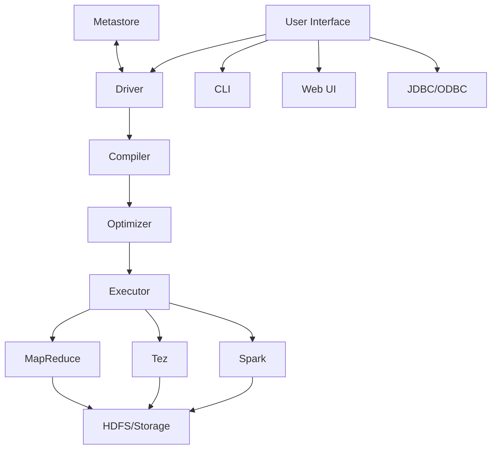

# Hive Introduction

## What is Apache Hive?

Apache Hive is a data warehouse infrastructure built on top of Hadoop that facilitates reading, writing, and managing large datasets residing in distributed storage using SQL-like syntax. Developed initially by Facebook in 2007, Hive was designed to make Hadoop more accessible to users familiar with SQL, allowing them to query and analyze petabytes of data without writing complex MapReduce programs.

Hive provides a mechanism to project structure onto the data in Hadoop and query that data using a SQL-like language called HiveQL (HQL). This makes it an excellent bridge between traditional relational database knowledge and the big data world.

## Why Use Hive?

Hive is particularly valuable in the big data ecosystem for several reasons:

1. **SQL-like Interface**: Allows data analysts and SQL developers to leverage their existing skills
2. **Batch Processing**: Optimized for large-scale batch processing of historical data
3. **Schema on Read**: Imposes structure on data at query time, not when storing it
4. **Scalability**: Designed to handle petabytes of data across distributed clusters
5. **Integration**: Works well within the Hadoop ecosystem and with other big data tools

## Hive Architecture

Hive consists of several components that work together to provide SQL capabilities on top of Hadoop:



The key components include:

1. **User Interfaces**: Command-line interface (CLI), web UI, and JDBC/ODBC drivers
2. **Driver**: Manages the lifecycle of a HiveQL statement
3. **Compiler**: Parses the query and performs semantic analysis
4. **Optimizer**: Creates an efficient execution plan
5. **Executor**: Executes the tasks using available execution engines
6. **Metastore**: Stores metadata about Hive tables, partitions, and schemas

## Getting Started with Hive

### Installation

To start using Hive, you'll need a Hadoop cluster or a local Hadoop setup. Here's a basic installation process:

1. Download Apache Hive from the [official website](https://hive.apache.org/downloads.html)
2. Extract the tarball: `tar -xzvf apache-hive-x.y.z-bin.tar.gz`
3. Set environment variables:

```bash
export HIVE_HOME=/path/to/hive
export PATH=$PATH:$HIVE_HOME/bin
```

4. Configure Hive by editing `$HIVE_HOME/conf/hive-site.xml`
5. Initialize the metastore: `schematool -dbType derby -initSchema`

### Starting Hive

Once installed, you can start the Hive CLI:

```bash
hive
```

This will open the Hive command-line interface where you can start entering HiveQL commands.

## Hive Data Model

Hive organizes data into:

1. **Databases**: Namespaces that group tables together
2. **Tables**: Similar to tables in relational databases, they have columns with types and can store data
3. **Partitions**: Divide tables into parts based on the values of particular columns
4. **Buckets**: Further divide data using hash functions on table columns

### Creating a Database

```sql
CREATE DATABASE retail_db;
USE retail_db;
```

### Creating Tables

Hive supports two types of tables:

1. **Managed tables**: Hive manages both the data and metadata
2. **External tables**: Hive manages only the metadata, while data can exist independently

#### Creating a Managed Table:

```sql
CREATE TABLE customers (
  customer_id INT,
  name STRING,
  email STRING,
  join_date DATE
)
ROW FORMAT DELIMITED
FIELDS TERMINATED BY ',';
```

#### Creating an External Table:

```sql
CREATE EXTERNAL TABLE sales (
  order_id INT,
  customer_id INT,
  product_id INT,
  quantity INT,
  price DECIMAL(10,2),
  order_date DATE
)
ROW FORMAT DELIMITED
FIELDS TERMINATED BY ','
LOCATION '/user/hadoop/sales_data';
```

### Loading Data

You can load data into Hive tables in several ways:

```sql
-- From a local file
LOAD DATA LOCAL INPATH '/path/to/customers.csv' INTO TABLE customers;

-- From HDFS
LOAD DATA INPATH '/hdfs/path/sales.csv' INTO TABLE sales;

-- From query results
CREATE TABLE active_customers AS
SELECT * FROM customers WHERE last_order_date > '2023-01-01';
```

## Querying Data with HiveQL

HiveQL is similar to SQL but has some differences due to the distributed nature of Hadoop:

### Basic Queries

```sql
-- Select all columns
SELECT * FROM customers LIMIT 10;

-- Select specific columns
SELECT customer_id, name FROM customers;

-- Filtering data
SELECT * FROM sales WHERE price > 100.00;

-- Aggregations
SELECT customer_id, SUM(price) as total_spent
FROM sales
GROUP BY customer_id;
```

### Input and Output Example

Query:
```sql
SELECT product_id, COUNT(*) as times_sold, SUM(quantity) as total_quantity
FROM sales
GROUP BY product_id
ORDER BY total_quantity DESC
LIMIT 5;
```

Output:
```
+-----------+------------+---------------+
| product_id | times_sold | total_quantity |
+-----------+------------+---------------+
| 10234     | 1024       | 5127          |
| 8792      | 895        | 4512          |
| 1478      | 742        | 3218          |
| 9245      | 654        | 2891          |
| 3471      | 532        | 2745          |
+-----------+------------+---------------+
```

### Joins

```sql
-- Join customers and sales
SELECT c.name, SUM(s.price) as total_spent
FROM customers c
JOIN sales s ON c.customer_id = s.customer_id
GROUP BY c.name
ORDER BY total_spent DESC;
```

### Partitioning

Partitioning improves query performance by organizing data physically based on column values:

```sql
-- Create a partitioned table
CREATE TABLE sales_partitioned (
  order_id INT,
  customer_id INT,
  product_id INT,
  quantity INT,
  price DECIMAL(10,2)
)
PARTITIONED BY (order_date DATE)
ROW FORMAT DELIMITED
FIELDS TERMINATED BY ',';

-- Load data into a specific partition
INSERT OVERWRITE TABLE sales_partitioned
PARTITION (order_date='2023-04-01')
SELECT order_id, customer_id, product_id, quantity, price
FROM sales
WHERE order_date = '2023-04-01';
```

## Practical Real-World Examples

### Example 1: E-commerce Data Analysis

An e-commerce company could use Hive to analyze customer behavior:

```sql
-- Find top-selling products by category
SELECT c.category_name, p.product_name, SUM(s.quantity) as units_sold
FROM sales s
JOIN products p ON s.product_id = p.product_id
JOIN categories c ON p.category_id = c.category_id
WHERE s.order_date BETWEEN '2023-01-01' AND '2023-03-31'
GROUP BY c.category_name, p.product_name
ORDER BY c.category_name, units_sold DESC;

-- Customer cohort analysis
SELECT 
  DATE_FORMAT(c.join_date, 'yyyy-MM') as cohort,
  DATE_FORMAT(s.order_date, 'yyyy-MM') as order_month,
  COUNT(DISTINCT s.customer_id) as active_customers
FROM customers c
JOIN sales s ON c.customer_id = s.customer_id
GROUP BY DATE_FORMAT(c.join_date, 'yyyy-MM'), DATE_FORMAT(s.order_date, 'yyyy-MM')
ORDER BY cohort, order_month;
```

### Example 2: Log Analysis

Many organizations use Hive for analyzing server logs:

```sql
-- Create an external table for web logs
CREATE EXTERNAL TABLE web_logs (
  ip STRING,
  timestamp STRING,
  request STRING,
  status INT,
  size INT,
  referer STRING,
  user_agent STRING
)
ROW FORMAT SERDE 'org.apache.hadoop.hive.serde2.RegexSerDe'
WITH SERDEPROPERTIES (
  "input.regex" = "([^ ]*) - - \\[([^\\]]*)] \"([^\"]*)\" ([0-9]*) ([0-9]*) \"([^\"]*)\" \"([^\"]*)\""
)
LOCATION '/user/hadoop/weblogs';

-- Find 404 errors
SELECT request, COUNT(*) as error_count
FROM web_logs
WHERE status = 404
GROUP BY request
ORDER BY error_count DESC
LIMIT 10;

-- Traffic by hour
SELECT HOUR(FROM_UNIXTIME(UNIX_TIMESTAMP(timestamp, '[dd/MMM/yyyy:HH:mm:ss'))) as hour,
       COUNT(*) as requests
FROM web_logs
GROUP BY HOUR(FROM_UNIXTIME(UNIX_TIMESTAMP(timestamp, '[dd/MMM/yyyy:HH:mm:ss')))
ORDER BY hour;
```

## Hive Performance Optimization

To improve Hive query performance:

1. **Partitioning**: Divide tables by frequently filtered columns
2. **Bucketing**: Hash-based partitioning for better join performance
3. **File Formats**: Use columnar formats like ORC or Parquet
4. **Compression**: Enable compression for reduced storage and I/O
5. **Execution Engines**: Use Tez or Spark instead of MapReduce

Example of optimized table creation:

```sql
CREATE TABLE sales_optimized (
  order_id INT,
  customer_id INT,
  product_id INT,
  quantity INT,
  price DECIMAL(10,2),
  order_date DATE
)
PARTITIONED BY (year INT, month INT)
CLUSTERED BY (customer_id) INTO 16 BUCKETS
STORED AS ORC
TBLPROPERTIES ("orc.compress"="SNAPPY");
```

## Limitations of Hive

While Hive is powerful, it has some limitations:

1. **Latency**: Not suitable for real-time queries or OLTP workloads
2. **ACID Support**: Limited support for ACID transactions (improving in recent versions)
3. **Complex Queries**: Some complex SQL features may be unavailable or perform poorly
4. **Schema Changes**: Altering table structure can be challenging

## Summary

Apache Hive provides a SQL-like interface to query and analyze large datasets stored in Hadoop, making big data processing accessible to those with SQL skills. Key advantages include:

- SQL-like querying capability on petabytes of data
- Integration with the Hadoop ecosystem
- Support for partitioning, bucketing, and various file formats
- Ability to handle structured and semi-structured data

As the volume of data continues to grow, Hive remains a valuable tool in the big data landscape, especially for batch processing and data warehousing scenarios.

## Additional Resources

### Further Learning
- Apache Hive Documentation
- "Programming Hive" book by Edward Capriolo, Dean Wampler, and Jason Rutherglen
- "Hadoop: The Definitive Guide" by Tom White

### Practice Exercises

1. Create a Hive database and tables to model a retail business with customers, products, and orders.
2. Write queries to find the top 5 customers by total spending.
3. Implement partitioning on a large table and compare query performance.
4. Use Hive functions to perform date-based analysis on order data.
5. Create a bucketed table and practice joining it with another bucketed table.