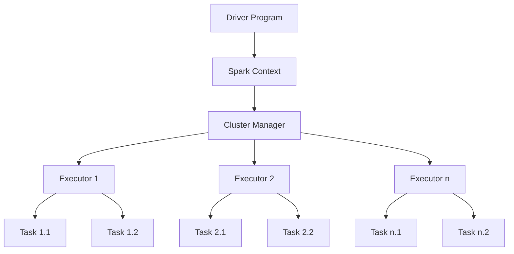

# Spark Overview

## Introduction

Apache Spark is a powerful open-source distributed computing system designed for big data processing. It was developed to address the limitations of Hadoop's MapReduce by offering faster computation through in-memory processing and a more flexible programming model. Since its inception at UC Berkeley in 2009, Spark has become one of the most important tools in the big data ecosystem.

In this guide, we'll explore the fundamentals of Apache Spark, its architecture, key features, and how it can be used to process large datasets efficiently.

## What Makes Spark Special?

Spark offers several advantages over traditional big data processing frameworks:

- **Speed**: Spark can be up to 100x faster than Hadoop MapReduce for certain workloads thanks to its in-memory computation capabilities.
- **Ease of Use**: Spark provides high-level APIs in Java, Scala, Python, and R, making it accessible to a wider range of developers.
- **Versatility**: Unlike specialized systems, Spark offers a unified platform for batch processing, streaming, machine learning, and graph processing.
- **Compatibility**: Spark integrates well with various data sources including HDFS, Cassandra, HBase, and S3.

## Spark Architecture

Spark follows a master-worker architecture with two main components:

1. **Driver Program**: Contains the main application and creates a SparkContext that coordinates the execution.
2. **Executors**: Worker processes that run computations and store data.



The **Cluster Manager** (which can be Spark's standalone manager, YARN, or Mesos) allocates resources across applications.

## Core Concepts

### RDDs (Resilient Distributed Datasets)

RDDs are Spark's fundamental data structure - immutable, distributed collections of objects that can be processed in parallel.

```python
# Creating an RDD
data = [1, 2, 3, 4, 5]
rdd = sc.parallelize(data)

# Basic RDD operations
squared = rdd.map(lambda x: x * x)
# Result: [1, 4, 9, 16, 25]

filtered = rdd.filter(lambda x: x % 2 == 0)
# Result: [2, 4]

sum_value = rdd.reduce(lambda a, b: a + b)
# Result: 15
```

RDDs provide two types of operations:

- **Transformations**: Create a new RDD from an existing one (e.g., `map`, `filter`, `flatMap`)
- **Actions**: Return values to the driver program after computation (e.g., `reduce`, `collect`, `count`)

### DataFrames and Datasets

While RDDs provide low-level functionality, Spark also offers higher-level abstractions:

- **DataFrames**: Distributed collections of data organized into named columns (similar to tables in a relational database)
- **Datasets**: Extension of DataFrames with type-safety features (primarily used in Scala and Java)

```python
# Creating a DataFrame from a list
from pyspark.sql import SparkSession

spark = SparkSession.builder.appName("DataFrameExample").getOrCreate()

data = [("Alice", 25), ("Bob", 30), ("Charlie", 35)]
df = spark.createDataFrame(data, ["Name", "Age"])

# DataFrame operations
df.show()
# +-------+---+
# |   Name|Age|
# +-------+---+
# |  Alice| 25|
# |    Bob| 30|
# |Charlie| 35|
# +-------+---+

df.select("Name").show()
# +-------+
# |   Name|
# +-------+
# |  Alice|
# |    Bob|
# |Charlie|
# +-------+

df.filter(df.Age > 30).show()
# +-------+---+
# |   Name|Age|
# +-------+---+
# |Charlie| 35|
# +-------+---+
```

## Spark Ecosystem Components

Spark's ecosystem consists of specialized libraries built on top of the core engine:

### Spark SQL

Spark SQL enables querying structured data using SQL or a DataFrame API.

```python
# Register DataFrame as a SQL temporary view
df.createOrReplaceTempView("people")

# Run SQL queries
result = spark.sql("SELECT * FROM people WHERE Age > 25")
result.show()
# +-------+---+
# |   Name|Age|
# +-------+---+
# |    Bob| 30|
# |Charlie| 35|
# +-------+---+
```

### Spark Streaming

Spark Streaming allows processing of real-time data streams.

```python
from pyspark.streaming import StreamingContext

# Create a streaming context with batch interval of 1 second
ssc = StreamingContext(sc, 1)

# Create a DStream from TCP source
lines = ssc.socketTextStream("localhost", 9999)

# Count words
word_counts = lines.flatMap(lambda line: line.split(" ")) \
                   .map(lambda word: (word, 1)) \
                   .reduceByKey(lambda a, b: a + b)

# Print the first ten elements of each RDD
word_counts.pprint()

# Start the computation
ssc.start()
ssc.awaitTermination()
```

### MLlib (Machine Learning)

MLlib provides machine learning algorithms and utilities.

```python
from pyspark.ml.classification import LogisticRegression
from pyspark.ml.feature import VectorAssembler

# Prepare training data
data = [(1.0, 0.0, 1.0, 0), (0.0, 1.0, 1.0, 1), (1.0, 2.0, 1.0, 1), (0.0, 0.0, 1.0, 0)]
df = spark.createDataFrame(data, ["feature1", "feature2", "feature3", "label"])

# Combine features into a single vector column
assembler = VectorAssembler(inputCols=["feature1", "feature2", "feature3"], outputCol="features")
training_data = assembler.transform(df)

# Create and train the model
lr = LogisticRegression(maxIter=10, regParam=0.01)
model = lr.fit(training_data)

# Make predictions
predictions = model.transform(training_data)
predictions.select("features", "label", "prediction").show()
```

### GraphX

GraphX is a graph processing library for Spark.

```python
from pyspark.sql import SparkSession
from graphframes import GraphFrame

# Create vertices DataFrame
vertices = spark.createDataFrame([
  ("1", "Alice", 34),
  ("2", "Bob", 36),
  ("3", "Charlie", 30),
], ["id", "name", "age"])

# Create edges DataFrame
edges = spark.createDataFrame([
  ("1", "2", "friend"),
  ("2", "3", "colleague"),
  ("3", "1", "neighbor")
], ["src", "dst", "relationship"])

# Create a graph
g = GraphFrame(vertices, edges)

# Find paths
paths = g.bfs("name = 'Alice'", "age > 30")
paths.show()
```

## Real-World Applications

Spark's versatility makes it suitable for a wide range of applications:

### Example 1: Log Analysis

Analyzing server logs to identify errors and performance issues:

```python
# Read log files into an RDD
logs = sc.textFile("hdfs://log_directory/")

# Filter error logs
error_logs = logs.filter(lambda line: "ERROR" in line)

# Count errors by type
error_types = error_logs.map(lambda line: (line.split(":")[1].strip(), 1)) \
                       .reduceByKey(lambda a, b: a + b)

# Get top 5 most frequent errors
top_errors = error_types.sortBy(lambda x: -x[1]).take(5)

for error, count in top_errors:
    print(f"Error: {error}, Count: {count}")
```

### Example 2: E-commerce Recommendation System

Building a simple recommendation engine for an online store:

```python
from pyspark.ml.recommendation import ALS
from pyspark.ml.evaluation import RegressionEvaluator

# Sample user-product ratings
data = [(1, 101, 5.0), (1, 102, 3.0), (2, 101, 4.0), (2, 103, 5.0), (3, 102, 4.0)]
ratings = spark.createDataFrame(data, ["userId", "productId", "rating"])

# Build the recommendation model using ALS
als = ALS(maxIter=5, regParam=0.01, userCol="userId", itemCol="productId", ratingCol="rating")
model = als.fit(ratings)

# Generate top 3 product recommendations for each user
userRecs = model.recommendForAllUsers(3)
userRecs.show(truncate=False)

# Generate top 3 user recommendations for each product
productRecs = model.recommendForAllItems(3)
productRecs.show(truncate=False)
```

### Example 3: Real-time Dashboard

Creating a real-time analytics dashboard for website traffic:

```python
from pyspark.streaming import StreamingContext
import json

# Create streaming context
ssc = StreamingContext(sc, 10)  # 10-second batch interval

# Receive streaming data from Kafka
from pyspark.streaming.kafka import KafkaUtils
kafka_stream = KafkaUtils.createStream(ssc, "zookeeper:2181", "spark-streaming", {"pageviews": 1})

# Parse JSON messages
pageviews = kafka_stream.map(lambda x: json.loads(x[1]))

# Count views by page
page_counts = pageviews.map(lambda view: (view["page"], 1)) \
                      .reduceByKeyAndWindow(lambda a, b: a + b, lambda a, b: a - b, 300, 10)

# Identify trending pages
trending = page_counts.transform(lambda rdd: rdd.sortBy(lambda x: -x[1]).take(10))
trending.pprint()

# Start the computation
ssc.start()
ssc.awaitTermination()
```

## Setting Up Spark

To get started with Spark:

1. **Download and Install**: Get Spark from the [Apache Spark website](https://spark.apache.org/downloads.html)

2. **Configure Spark**: Set up with a suitable cluster manager (standalone, YARN, or Mesos)

3. **Start Using Spark**:

```bash
# Start Spark shell (Scala)
./bin/spark-shell

# Start PySpark (Python)
./bin/pyspark

# Submit an application
./bin/spark-submit --class org.example.MyApp --master local[4] path/to/myapp.jar
```

## Performance Optimization Tips

To get the most out of Spark:

1. **Proper Partitioning**: Choose the right number of partitions for your data size
2. **Persistence Levels**: Use appropriate storage levels (`.persist()` or `.cache()`)
3. **Avoid Shuffling**: Minimize operations that require shuffling data between partitions
4. **Broadcast Variables**: Use broadcast variables for shared data
5. **Kryo Serialization**: Enable Kryo serialization for better performance

```python
# Example: Using broadcast variables
countries_dict = {"US": "United States", "UK": "United Kingdom", "FR": "France"}
broadcast_countries = sc.broadcast(countries_dict)

# Use the broadcast variable in transformations
def expand_country(row):
    country_code = row["country_code"]
    full_name = broadcast_countries.value.get(country_code, "Unknown")
    return (row["user_id"], full_name)

result = user_data.map(expand_country)
```

## Summary

Apache Spark is a powerful distributed computing framework that excels at processing large datasets. Its in-memory processing model makes it significantly faster than traditional MapReduce approaches, while its unified API makes it versatile enough to handle batch processing, streaming, machine learning, and graph computations.

Key takeaways:

- Spark's core abstractions (RDDs, DataFrames, and Datasets) provide flexible ways to work with distributed data
- The Spark ecosystem includes specialized libraries for SQL, streaming, machine learning, and graph processing
- Spark's high-level APIs make it accessible to developers who work with Java, Scala, Python, or R
- Proper configuration and optimization are essential for getting the best performance out of Spark

## Further Learning

To continue your Spark journey:

1. **Practice Exercises**:
   - Try processing a large dataset (like public datasets from Kaggle) using Spark
   - Implement a simple streaming application to process real-time data
   - Build a basic machine learning pipeline using MLlib

2. **Advanced Topics to Explore**:
   - Spark Structured Streaming
   - Spark MLlib pipelines and model tuning
   - Spark integration with other big data tools like Kafka and Cassandra
   - Performance tuning and debugging Spark applications