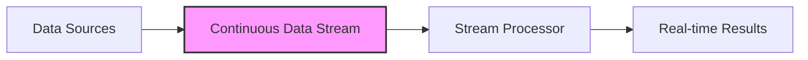
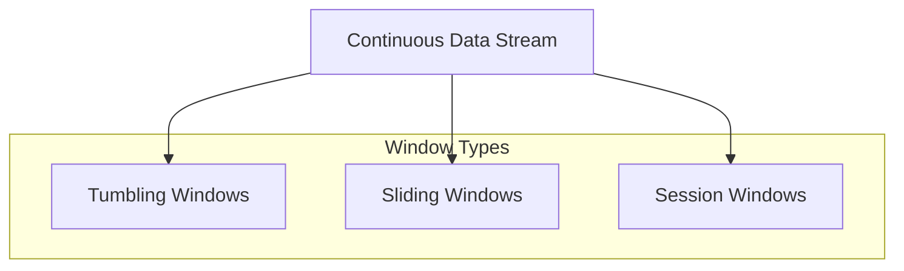
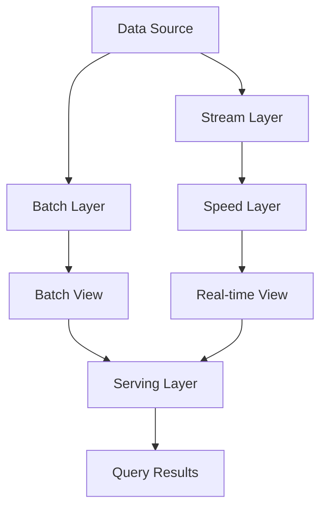
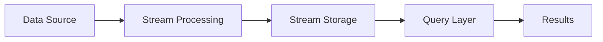

# Stream Processing

## Introduction

Stream processing is a powerful programming paradigm that deals with continuous data streams rather than finite, static datasets. Unlike batch processing, which operates on chunks of data at scheduled intervals, stream processing handles data in real-time as it arrives. This makes it ideal for applications requiring immediate insights, such as fraud detection, monitoring systems, or real-time analytics.

In today's world where data is generated continuously at unprecedented rates from IoT devices, social media, financial transactions, and more, the ability to process and analyze this data in real-time has become increasingly important. Stream processing systems are designed specifically to meet this need.

## Core Concepts of Stream Processing

### What is a Data Stream?

A data stream is a continuous, potentially unbounded sequence of data records that are generated in real-time. These records typically have timestamps and arrive in a sequential order.



### Key Characteristics of Stream Processing

1. **Real-time Processing**: Data is processed as it arrives, with minimal latency.
2. **Unbounded Data**: Unlike batch processing, streams have no defined beginning or end.
3. **Sequential Processing**: Data records are typically processed in the order they arrive.
4. **Stateful Computation**: Many stream processing operations need to maintain state across multiple events.
5. **Continuous Queries**: Operations run continuously over time rather than being executed once.

## Stream Processing vs. Batch Processing

Let's compare these two fundamental approaches to data processing:

| Characteristic | Stream Processing | Batch Processing |
|----------------|------------------|------------------|
| Data Size | Processes individual records or micro-batches | Processes large chunks of data at once |
| Latency | Low (milliseconds to seconds) | High (minutes to hours) |
| Throughput | Lower | Higher |
| Processing Time | Continuous | Scheduled intervals |
| Use Case | Real-time analytics, monitoring | Historical analysis, reporting |
| Complexity | More complex | Simpler |

## Stream Processing Operations

Stream processing systems support various operations on data streams:

### Basic Operations

1. **Filter**: Select records that meet specific criteria
2. **Map**: Transform each record individually
3. **Reduce**: Aggregate records over a window of time
4. **Join**: Combine records from multiple streams

### Windows in Stream Processing

Since streams are unbounded, we often need to define "windows" or time intervals to perform meaningful aggregations:

1. **Tumbling Windows**: Fixed-size, non-overlapping time intervals
2. **Sliding Windows**: Fixed-size windows that overlap
3. **Session Windows**: Dynamic windows based on activity periods



## Stream Processing Architecture

A typical stream processing system has these components:

1. **Data Sources**: Systems generating continuous data (sensors, logs, etc.)
2. **Message Broker**: Software that temporarily stores and forwards messages (Kafka, RabbitMQ)
3. **Stream Processor**: The engine that processes the data (Spark Streaming, Flink)
4. **Storage**: Databases that store processed results
5. **Visualization**: Tools to display real-time insights

## Code Example: Simple Stream Processing with Python

Let's implement a simple stream processor that calculates a moving average of numbers:

```python
class StreamProcessor:
    def __init__(self, window_size=5):
        self.window = []
        self.window_size = window_size
    
    def process(self, value):
        # Add new value to window
        self.window.append(value)
        
        # Keep window at fixed size
        if len(self.window) > self.window_size:
            self.window.pop(0)
        
        # Calculate moving average
        moving_avg = sum(self.window) / len(self.window)
        return moving_avg

# Example usage
processor = StreamProcessor()
input_stream = [1, 3, 5, 7, 9, 11, 13, 15]

print("Input\tMoving Average")
print("-----\t--------------")
for value in input_stream:
    result = processor.process(value)
    print(f"{value}\t{result:.2f}")
```

Output:
```
Input	Moving Average
-----	--------------
1	1.00
3	2.00
5	3.00
7	4.00
9	5.00
11	7.00
13	9.00
15	11.00
```

## Popular Stream Processing Frameworks

Several frameworks have emerged to help build stream processing applications:

### Apache Kafka Streams

Kafka Streams is a client library for building applications that process and analyze data stored in Kafka.

```java
StreamsBuilder builder = new StreamsBuilder();
KStream<String, String> textLines = builder.stream("input-topic");

KTable<String, Long> wordCounts = textLines
    .flatMapValues(value -> Arrays.asList(value.toLowerCase().split("\\W+")))
    .groupBy((key, word) -> word)
    .count();

wordCounts.toStream().to("output-topic");
```

### Apache Flink

Apache Flink is a distributed processing engine for stateful computations over unbounded and bounded data streams.

```java
StreamExecutionEnvironment env = StreamExecutionEnvironment.getExecutionEnvironment();

DataStream<String> text = env.readTextFile("input.txt");

DataStream<Tuple2<String, Integer>> wordCounts = text
    .flatMap(new Tokenizer())
    .keyBy(value -> value.f0)
    .sum(1);

wordCounts.print();
```

### Apache Spark Streaming

Spark Streaming is an extension of the core Spark API that enables scalable, high-throughput, fault-tolerant stream processing.

```python
from pyspark.streaming import StreamingContext
from pyspark import SparkContext

sc = SparkContext("local[2]", "WordCount")
ssc = StreamingContext(sc, 1)  # 1-second batch interval

lines = ssc.socketTextStream("localhost", 9999)

# Count words in each batch
words = lines.flatMap(lambda line: line.split(" "))
pairs = words.map(lambda word: (word, 1))
word_counts = pairs.reduceByKey(lambda x, y: x + y)

# Print the results
word_counts.pprint()

ssc.start()
ssc.awaitTermination()
```

## Real-World Applications of Stream Processing

### Fraud Detection

Financial institutions use stream processing to detect fraudulent transactions in real-time by analyzing patterns and anomalies as transactions occur.

```python
def detect_fraud(transaction):
    # Extract features
    amount = transaction['amount']
    location = transaction['location']
    time = transaction['timestamp']
    user_id = transaction['user_id']
    
    # Get user profile
    user_profile = get_user_profile(user_id)
    
    # Check for suspicious patterns
    if (amount > user_profile['average_amount'] * 3 and
        location != user_profile['home_location'] and
        time_difference(time, user_profile['last_transaction']) < 60):  # Less than 60 seconds
        
        # Flag as potentially fraudulent
        return True
    
    return False
```

### IoT Monitoring

Stream processing enables real-time monitoring of IoT devices, allowing for immediate responses to critical events.

```python
def process_sensor_data(sensor_reading):
    device_id = sensor_reading['device_id']
    temperature = sensor_reading['temperature']
    pressure = sensor_reading['pressure']
    timestamp = sensor_reading['timestamp']
    
    # Check if temperature exceeds threshold
    if temperature > TEMPERATURE_THRESHOLD:
        alert_system(f"High temperature detected on device {device_id}: {temperature}°C")
    
    # Store the reading in time-series database
    store_reading(device_id, temperature, pressure, timestamp)
    
    # Update real-time dashboard
    update_dashboard(device_id, temperature, pressure)
```

### Social Media Analytics

Companies analyze social media streams to understand trends and sentiment in real-time.

```python
def analyze_tweet(tweet):
    # Extract relevant information
    text = tweet['text']
    user = tweet['user']
    hashtags = tweet['hashtags']
    
    # Perform sentiment analysis
    sentiment = sentiment_analysis(text)
    
    # Extract keywords
    keywords = extract_keywords(text)
    
    # Update trend counters
    for hashtag in hashtags:
        increment_hashtag_counter(hashtag)
    
    for keyword in keywords:
        increment_keyword_counter(keyword)
    
    # Update sentiment aggregations
    update_sentiment_metrics(sentiment)
    
    return {
        'sentiment': sentiment,
        'keywords': keywords,
        'hashtags': hashtags
    }
```

## Challenges in Stream Processing

While stream processing offers many benefits, it also comes with challenges:

1. **Handling Late Data**: In distributed systems, data might arrive out of order or late.
2. **Exactly-Once Processing**: Ensuring each record is processed exactly once, even in failure scenarios.
3. **State Management**: Efficiently managing state across a distributed system.
4. **Scaling**: Dynamically scaling processing capacity based on input volume.
5. **Fault Tolerance**: Recovering from failures without data loss.

## Stream Processing Design Patterns

### The Lambda Architecture

A hybrid approach combining batch and stream processing:



### The Kappa Architecture

A simplified approach that treats all data as streams:



## Summary

Stream processing is a powerful paradigm for handling real-time data in modern applications. By processing data as it arrives, organizations can gain immediate insights and respond to events as they happen. Key concepts include:

- Continuous processing of unbounded data streams
- Windowing techniques for aggregating streaming data
- Stateful operations that maintain context across events
- Various frameworks like Kafka Streams, Flink, and Spark Streaming
- Real-world applications in fraud detection, IoT, and analytics

As data generation continues to grow exponentially, stream processing will become increasingly important in building responsive, real-time systems.

## Exercises

1. Implement a simple stream processor that detects outliers in a stream of numbers.
2. Extend the moving average example to handle different window types.
3. Design a stream processing pipeline for a real-time dashboard showing website traffic.
4. Compare the performance of different window sizes in a stream processing application.
5. Build a simple anomaly detection system using stream processing techniques.

## Further Resources

- [Apache Kafka Documentation](https://kafka.apache.org/documentation/)
- [Apache Flink Training](https://flink.apache.org/learn-flink/)
- [Spark Streaming Programming Guide](https://spark.apache.org/docs/latest/streaming-programming-guide.html)
- [Designing Data-Intensive Applications](https://dataintensive.net/) by Martin Kleppmann
- [Streaming Systems](https://www.oreilly.com/library/view/streaming-systems/9781491983867/) by Tyler Akidau, Slava Chernyak, and Reuven Lax