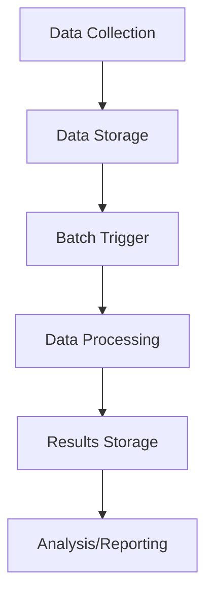

# Batch Processing

## Introduction

Batch processing is a fundamental approach in big data systems where a collection of data (a batch) is processed as a single unit at a scheduled time, rather than processing data continuously in real-time. This method efficiently handles large volumes of data where immediate results aren't critical, allowing for optimized resource usage and high throughput.

Think of batch processing like doing laundry once your hamper is full, rather than washing each item immediately after it gets dirty. It's more efficient to process everything in one go when resources (like your washing machine) can be fully utilized.

## Core Concepts of Batch Processing

### What is a "Batch"?

A batch is a collection of data gathered over a period of time and processed together. Batches can be defined by:

- **Time intervals**: Processing all data collected during a day, week, or month
- **Size thresholds**: Processing when data reaches a certain volume (e.g., 1GB)
- **Record count**: Processing a specific number of records together

### Key Characteristics

- **High latency**: Results aren't available immediately
- **High throughput**: Processes large volumes of data efficiently
- **Resource optimization**: Efficiently utilizes system resources
- **Scheduled execution**: Runs at predetermined times
- **Fault tolerance**: Can recover from failures without losing data

## How Batch Processing Works

Let's break down the typical batch processing workflow:



1. **Data Collection**: Data is gathered from various sources
2. **Data Storage**: Raw data is stored in a file system or database
3. **Batch Trigger**: Processing begins based on schedule or other criteria
4. **Data Processing**: The entire batch is processed
5. **Results Storage**: Processed results are stored
6. **Analysis/Reporting**: Results are analyzed or used for reporting

## Batch Processing vs. Stream Processing

Here's a comparison to help understand where batch processing fits in the big data ecosystem:

| Characteristic | Batch Processing | Stream Processing |
|----------------|------------------|-------------------|
| Data handling | Processes finite data sets | Processes continuous data flows |
| Latency | High (minutes to hours) | Low (milliseconds to seconds) |
| Throughput | Very high | Moderate |
| Complexity | Simpler | More complex |
| Use case | Historical analysis, reports | Real-time dashboards, alerts |
| Example tools | Hadoop MapReduce, Apache Spark | Apache Kafka, Apache Flink |

## Implementing Batch Processing

Let's explore how to implement batch processing with some common technologies.

### MapReduce Example

MapReduce is a programming model for processing large data sets, popularized by Hadoop. Here's a simple word count example in Python that follows the MapReduce pattern:

```python
# Mapper function
def mapper(document):
    words = document.split()
    for word in words:
        # Emit (word, 1) for each word
        yield (word.lower(), 1)

# Reducer function
def reducer(word, counts):
    # Sum all counts for each word
    yield (word, sum(counts))

# Example usage
documents = [
    "Hello world",
    "Hello big data world",
    "Batch processing is powerful"
]

# Map phase
mapped_results = []
for doc in documents:
    mapped_results.extend(mapper(doc))

# Group by key
grouped_results = {}
for word, count in mapped_results:
    if word not in grouped_results:
        grouped_results[word] = []
    grouped_results[word].append(count)

# Reduce phase
reduced_results = []
for word, counts in grouped_results.items():
    reduced_results.extend(reducer(word, counts))

# Sort results
reduced_results.sort()
for word, count in reduced_results:
    print(f"{word}: {count}")
```

Output:
```
batch: 1
big: 1
data: 1
hello: 2
is: 1
powerful: 1
processing: 1
world: 2
```

### Apache Spark Example

Apache Spark makes batch processing more concise and efficient. Here's the same word count example using PySpark:

```python
from pyspark.sql import SparkSession

# Initialize Spark session
spark = SparkSession.builder.appName("WordCount").getOrCreate()

# Create an RDD from the sample text
documents = [
    "Hello world",
    "Hello big data world",
    "Batch processing is powerful"
]
rdd = spark.sparkContext.parallelize(documents)

# Perform word count operation
word_counts = (rdd
               .flatMap(lambda line: line.lower().split())  # Split into words
               .map(lambda word: (word, 1))                # Create (word, 1) pairs
               .reduceByKey(lambda a, b: a + b)            # Sum counts for each word
               .sortByKey())                               # Sort by word

# Collect and print results
for word, count in word_counts.collect():
    print(f"{word}: {count}")

# Stop Spark session
spark.stop()
```

Output:
```
batch: 1
big: 1
data: 1
hello: 2
is: 1
powerful: 1
processing: 1
world: 2
```

## Real-World Applications

### ETL Processes

Extract, Transform, Load (ETL) processes often use batch processing to move data from operational systems to data warehouses.

```python
# Simplified ETL batch process example
def extract_data():
    print("Extracting data from source systems...")
    # Code to extract data from various sources
    return [{"id": 1, "sale_amount": 100.50, "date": "2023-01-15"},
            {"id": 2, "sale_amount": 200.75, "date": "2023-01-15"},
            {"id": 3, "sale_amount": 50.25, "date": "2023-01-16"}]

def transform_data(raw_data):
    print("Transforming data...")
    # Apply transformations
    transformed_data = []
    for record in raw_data:
        # Add tax calculation
        record["tax"] = round(record["sale_amount"] * 0.08, 2)
        # Convert date format
        date_parts = record["date"].split("-")
        record["formatted_date"] = f"{date_parts[1]}/{date_parts[2]}/{date_parts[0]}"
        transformed_data.append(record)
    return transformed_data

def load_data(transformed_data):
    print("Loading data into data warehouse...")
    # Code to load data into target system
    for record in transformed_data:
        print(f"Inserted record ID {record['id']} with sale amount {record['sale_amount']} and tax {record['tax']}")
    print(f"Successfully loaded {len(transformed_data)} records")

def run_batch_etl():
    print("Starting nightly ETL batch process...")
    raw_data = extract_data()
    transformed_data = transform_data(raw_data)
    load_data(transformed_data)
    print("ETL batch process completed successfully")

# Execute the batch ETL process
run_batch_etl()
```

Output:
```
Starting nightly ETL batch process...
Extracting data from source systems...
Transforming data...
Loading data into data warehouse...
Inserted record ID 1 with sale amount 100.5 and tax 8.04
Inserted record ID 2 with sale amount 200.75 and tax 16.06
Inserted record ID 3 with sale amount 50.25 and tax 4.02
Successfully loaded 3 records
ETL batch process completed successfully
```

### Daily Financial Reconciliation

Banks and financial institutions use batch processing for end-of-day reconciliation:

```python
def daily_account_reconciliation():
    print("Starting daily account reconciliation batch job...")
    
    # Step 1: Collect all transactions for the day
    print("Collecting all transactions from the last 24 hours...")
    transactions = [
        {"account": "A1001", "type": "deposit", "amount": 500.00},
        {"account": "B2002", "type": "withdrawal", "amount": 200.00},
        {"account": "A1001", "type": "fee", "amount": 25.00},
        {"account": "C3003", "type": "transfer_in", "amount": 1000.00},
        {"account": "B2002", "type": "interest", "amount": 1.50}
    ]
    
    # Step 2: Group transactions by account
    print("Grouping transactions by account...")
    account_transactions = {}
    for transaction in transactions:
        if transaction["account"] not in account_transactions:
            account_transactions[transaction["account"]] = []
        account_transactions[transaction["account"]].append(transaction)
    
    # Step 3: Calculate net changes for each account
    print("Calculating net changes for each account...")
    account_summaries = {}
    for account, txns in account_transactions.items():
        net_change = 0
        for txn in txns:
            if txn["type"] in ["deposit", "transfer_in", "interest"]:
                net_change += txn["amount"]
            else:
                net_change -= txn["amount"]
        account_summaries[account] = net_change
    
    # Step 4: Update account balances in master database
    print("Updating account balances in master database...")
    for account, net_change in account_summaries.items():
        print(f"Account {account}: Net change of ${net_change:.2f}")
    
    print("Daily reconciliation batch job completed")

# Run the daily reconciliation
daily_account_reconciliation()
```

Output:
```
Starting daily account reconciliation batch job...
Collecting all transactions from the last 24 hours...
Grouping transactions by account...
Calculating net changes for each account...
Updating account balances in master database...
Account A1001: Net change of $475.00
Account B2002: Net change of $-198.50
Account C3003: Net change of $1000.00
Daily reconciliation batch job completed
```

## Advantages and Disadvantages

### Advantages

- **Resource efficiency**: Optimizes system resource usage
- **Cost-effective**: Processes large data volumes economically
- **Reliability**: Well-established, mature technology
- **Simplicity**: Conceptually straightforward to implement
- **Consistency**: Ensures all data is processed with the same logic

### Disadvantages

- **High latency**: Not suitable for real-time needs
- **Resource intensive**: May require significant computing power for large batches
- **Complexity of scheduling**: Determining optimal batch timing can be challenging
- **Potential for bottlenecks**: Large batch jobs can overload systems

## Best Practices

1. **Set appropriate batch sizes**: Too small means overhead; too large means longer processing time
2. **Implement checkpointing**: Allow restart from the most recent checkpoint after failures
3. **Monitor thoroughly**: Track execution time, resource usage, and error rates
4. **Plan for failures**: Implement retry mechanisms and error handling
5. **Schedule wisely**: Avoid peak system usage times
6. **Parallelize where possible**: Break batches into independent units that can be processed concurrently
7. **Test with realistic data volumes**: Performance can change dramatically at scale

## Tools and Frameworks

Several technologies have evolved to support batch processing in big data environments:

- **Apache Hadoop**: The original big data batch processing framework
- **Apache Spark**: In-memory batch processing with higher performance than Hadoop
- **Apache Hive**: SQL-like querying on top of Hadoop
- **Apache Pig**: Scripting language for Hadoop data flows
- **AWS Glue**: Managed ETL service on AWS
- **Google Cloud Dataflow**: Unified batch and stream processing
- **Azure Data Factory**: Cloud-based data integration service

## Summary

Batch processing remains a cornerstone approach in big data systems, offering efficient handling of large volumes of data when real-time results aren't critical. By collecting data into batches and processing it at scheduled intervals, organizations can optimize resource usage and achieve high throughput.

While stream processing has gained popularity for real-time use cases, batch processing continues to excel in scenarios like ETL workflows, financial reconciliation, report generation, and other applications where processing efficiency is prioritized over immediate results.

As you advance in your big data journey, you'll likely use both batch and stream processing, choosing the appropriate approach based on your specific requirements for latency, throughput, and resource efficiency.

## Exercises

1. Write a simple batch processing script that counts the frequency of each word in a collection of text files.
2. Design a batch processing workflow for analyzing daily e-commerce sales data.
3. Compare the performance of processing 1GB of data as a single batch versus ten 100MB batches.
4. Implement a simple ETL process using Apache Spark to transform CSV data into a structured format.
5. Create a scheduling system that triggers batch processing jobs based on both time and data volume conditions.

## Additional Resources

- [Apache Hadoop Documentation](https://hadoop.apache.org/docs/)
- [Apache Spark Programming Guide](https://spark.apache.org/docs/latest/)
- [Understanding Big Data: Batch Processing](https://www.ibm.com/cloud/learn/batch-processing)
- [ETL vs ELT: Understanding the Difference](https://www.integrate.io/blog/etl-vs-elt/)
- [Design Patterns for Efficient Batch Processing](https://www.oreilly.com/library/view/big-data/9781449363598/)