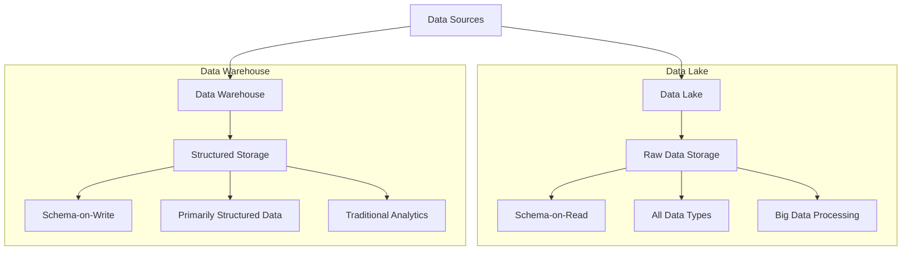
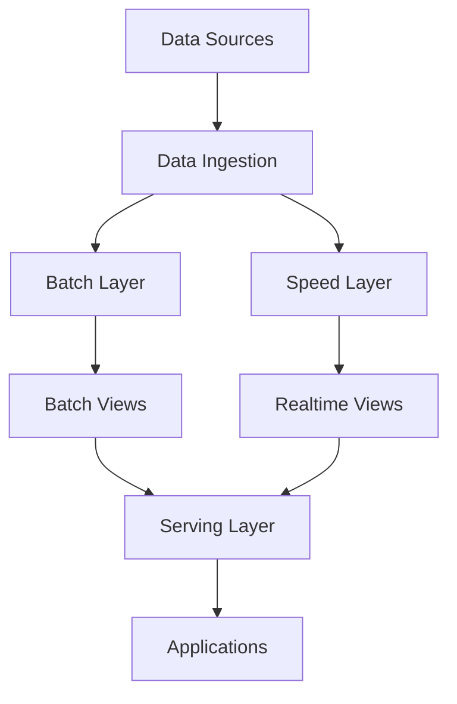
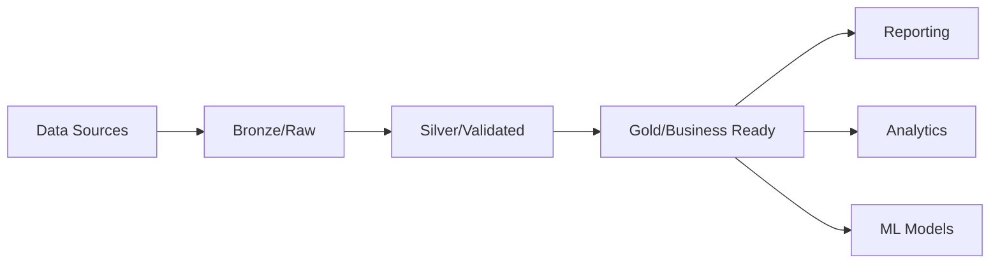
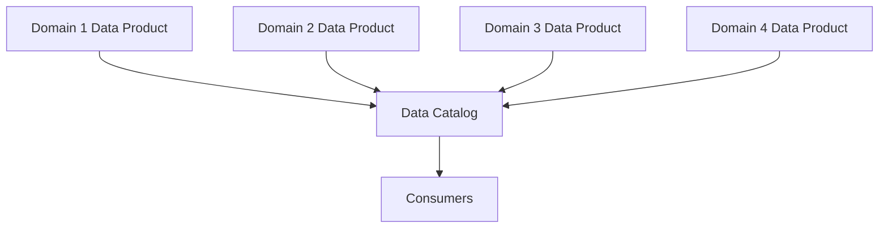

# Data Lakes

## Introduction

A data lake is a centralized repository designed to store, process, and secure large amounts of structured, semi-structured, and unstructured data. Unlike traditional data warehouses that store data in files or folders, data lakes use a flat architecture to store data in its raw, native format. This approach enables organizations to capture a wide range of data types at scale while postponing the need to define structure and schema until the data is needed.

In today's data-driven world, organizations generate and collect massive amounts of data from various sources. Data lakes emerged as a solution to handle this data explosion, providing a flexible and scalable approach to data storage and analytics.

## Key Concepts of Data Lakes

### What Makes a Data Lake Different?

To understand data lakes better, let's compare them with traditional data warehouses:



Key differences include:

| Feature | Data Lake | Data Warehouse |
|---------|-----------|----------------|
| Data Structure | Raw, unprocessed | Processed, structured |
| Schema | Schema-on-read | Schema-on-write |
| Data Types | All types (structured, semi-structured, unstructured) | Primarily structured |
| Users | Data scientists, analysts, developers | Business analysts, executives |
| Agility | High | Lower |
| Storage Cost | Lower | Higher |
| Processing | Varied (batch, real-time, etc.) | Primarily batch |

### Core Components of a Data Lake

A typical data lake architecture consists of several key components:

1. **Ingestion Layer**: Collects data from various sources.
2. **Storage Layer**: Stores raw data in its native format.
3. **Processing Layer**: Transforms and processes the data.
4. **Access Layer**: Provides interfaces for querying and analyzing data.
5. **Management Layer**: Handles metadata, security, and governance.

## Building a Data Lake

Let's walk through the process of setting up a simple data lake using AWS S3 and some Python tools.

### Step 1: Setting Up Storage

Amazon S3 is a popular choice for data lake storage due to its scalability and low cost. Here's how you can create a basic structure:

```python
import boto3

# Initialize S3 client
s3_client = boto3.client(
    's3',
    aws_access_key_id='YOUR_ACCESS_KEY',
    aws_secret_access_key='YOUR_SECRET_KEY'
)

# Create a bucket for our data lake
bucket_name = 'my-first-data-lake'
s3_client.create_bucket(Bucket=bucket_name)

# Create folders for different data zones
zones = ['raw-zone', 'processed-zone', 'curated-zone']
for zone in zones:
    s3_client.put_object(Bucket=bucket_name, Key=f"{zone}/")

print("Data lake storage structure created successfully!")
```

**Output:**
```
Data lake storage structure created successfully!
```

### Step 2: Data Ingestion

Now, let's ingest some sample data into our data lake:

```python
import pandas as pd
from io import StringIO

# Sample structured data (CSV)
sales_data = pd.DataFrame({
    'date': ['2023-01-01', '2023-01-02', '2023-01-03'],
    'product': ['Widget A', 'Widget B', 'Widget A'],
    'quantity': [10, 15, 8],
    'price': [25.99, 34.50, 25.99]
})

# Convert to CSV and upload to S3
csv_buffer = StringIO()
sales_data.to_csv(csv_buffer, index=False)
s3_client.put_object(
    Bucket=bucket_name,
    Key='raw-zone/sales_data.csv',
    Body=csv_buffer.getvalue()
)

# Sample unstructured data (JSON logs)
log_data = """
{"timestamp": "2023-01-01T12:34:56", "user_id": "user123", "action": "login", "status": "success"}
{"timestamp": "2023-01-01T12:35:22", "user_id": "user123", "action": "view_product", "product_id": "Widget A"}
{"timestamp": "2023-01-01T12:36:45", "user_id": "user123", "action": "add_to_cart", "product_id": "Widget A", "quantity": 1}
"""

s3_client.put_object(
    Bucket=bucket_name,
    Key='raw-zone/user_logs.json',
    Body=log_data
)

print("Data successfully ingested into the data lake!")
```

**Output:**
```
Data successfully ingested into the data lake!
```

### Step 3: Processing Data

Once data is in the data lake, we can process it using various tools. Here's a simple example using Python:

```python
# Read CSV data from S3
response = s3_client.get_object(Bucket=bucket_name, Key='raw-zone/sales_data.csv')
sales_data = pd.read_csv(response['Body'])

# Process the data - calculate total sales value
sales_data['total_value'] = sales_data['quantity'] * sales_data['price']

# Save processed data back to S3
processed_csv_buffer = StringIO()
sales_data.to_csv(processed_csv_buffer, index=False)
s3_client.put_object(
    Bucket=bucket_name,
    Key='processed-zone/processed_sales.csv',
    Body=processed_csv_buffer.getvalue()
)

print("Data processing complete!")
```

**Output:**
```
Data processing complete!
```

For larger-scale processing, you would typically use tools like Apache Spark, AWS Glue, or Apache Hadoop.

## Data Lake Best Practices

Building an effective data lake requires careful planning and implementation:

1. **Define a clear data organization strategy**:
   - Use meaningful prefixes and partitioning
   - Implement consistent naming conventions
   - Organize by data type, date, source, etc.

2. **Implement robust metadata management**:
   - Track data lineage
   - Document data formats and schemas
   - Maintain data dictionaries

3. **Ensure proper security and governance**:
   - Implement access controls
   - Set up data encryption
   - Create audit logs for compliance

4. **Plan for performance optimization**:
   - Use appropriate file formats (Parquet, ORC)
   - Implement data partitioning
   - Consider data compression

5. **Avoid creating a "data swamp"**:
   - Don't store data without proper documentation
   - Implement data quality checks
   - Set up data lifecycle policies

## Real-World Applications

Let's explore how data lakes are used in different industries:

### E-commerce

An e-commerce company might use a data lake to:
- Store customer browsing behavior, purchase history, and product data
- Analyze customer journeys across devices and channels
- Personalize product recommendations using machine learning
- Optimize inventory management and supply chain operations

**Example Implementation**:

```python
# Example code for a simple product recommendation system
from pyspark.sql import SparkSession
from pyspark.ml.recommendation import ALS

# Initialize Spark session
spark = SparkSession.builder.appName("ProductRecommendations").getOrCreate()

# Load user purchase data from data lake
purchases = spark.read.parquet("s3://ecommerce-data-lake/processed-zone/user_purchases/")

# Train a recommendation model using Alternating Least Squares
als = ALS(
    maxIter=5,
    regParam=0.01,
    userCol="user_id",
    itemCol="product_id",
    ratingCol="purchase_amount"
)
model = als.fit(purchases)

# Generate top 5 product recommendations for each user
user_recommendations = model.recommendForAllUsers(5)
user_recommendations.write.mode("overwrite").parquet(
    "s3://ecommerce-data-lake/curated-zone/user_recommendations/"
)
```

### Healthcare

Healthcare organizations can leverage data lakes to:
- Store and analyze electronic health records, medical images, and sensor data
- Enable population health management and epidemiological studies
- Enhance clinical decision support systems
- Optimize hospital operations and resource allocation

### Financial Services

Banks and financial institutions use data lakes for:
- Risk analysis and fraud detection
- Customer 360-degree view
- Regulatory compliance and reporting
- Algorithmic trading and market analysis

## Common Data Lake Architectures

Different organizations implement data lakes in various ways. Here are three common architectures:

### 1. Lambda Architecture

This architecture processes data through both batch and stream processing paths:



### 2. Medallion Architecture

Often used in cloud-based data lakes, this approach organizes data into different quality tiers:



### 3. Data Mesh Architecture

This modern approach treats data as a product and distributes ownership to domain teams:



## Tools and Technologies

Several tools are commonly used to build and manage data lakes:

| Category | Tools |
|----------|-------|
| Storage | Amazon S3, Azure Data Lake Storage, Google Cloud Storage, HDFS |
| Processing | Apache Spark, Amazon EMR, Azure Databricks, Apache Flink |
| Orchestration | Apache Airflow, AWS Step Functions, Azure Data Factory |
| Catalog & Governance | AWS Glue, Apache Atlas, Collibra, Azure Purview |
| Query & Analysis | Amazon Athena, Presto, Apache Drill, BigQuery |

## Challenges and Limitations

While data lakes offer many benefits, they also come with challenges:

1. **Data quality and governance**: Without proper controls, data lakes can become "data swamps" full of unusable data.
2. **Security and privacy concerns**: Storing all data in one place creates security challenges.
3. **Skills gap**: Organizations need specialized skills to effectively work with data lake technologies.
4. **Cost management**: While storage is cheap, compute costs can escalate quickly.
5. **Performance for certain workloads**: Some queries might be slower compared to traditional data warehouses.

## Hands-on Exercise: Creating a Mini Data Lake

Let's create a simple mini data lake project that you can run locally:

```python
import os
import json
import pandas as pd
from datetime import datetime

# Create basic directory structure for our mini data lake
def create_mini_data_lake():
    base_dir = "mini_data_lake"
    zones = ["landing", "raw", "processed", "curated"]
    
    for zone in zones:
        os.makedirs(os.path.join(base_dir, zone), exist_ok=True)
    
    return base_dir

# Generate some sample data
def generate_sample_data(base_dir):
    # Sample sales data (CSV)
    sales_data = pd.DataFrame({
        'date': ['2023-01-01', '2023-01-02', '2023-01-03'],
        'store_id': [1, 2, 1],
        'product_id': [101, 102, 101],
        'quantity': [5, 3, 2],
        'price': [10.99, 25.50, 10.99]
    })
    
    sales_data.to_csv(os.path.join(base_dir, "landing", "sales.csv"), index=False)
    
    # Sample customer data (JSON)
    customers = [
        {"customer_id": 1001, "name": "Alice Smith", "email": "alice@example.com", "registration_date": "2022-11-15"},
        {"customer_id": 1002, "name": "Bob Johnson", "email": "bob@example.com", "registration_date": "2022-12-03"},
        {"customer_id": 1003, "name": "Charlie Brown", "email": "charlie@example.com", "registration_date": "2023-01-07"}
    ]
    
    with open(os.path.join(base_dir, "landing", "customers.json"), 'w') as f:
        json.dump(customers, f)
    
    # Sample product data (CSV)
    products_data = pd.DataFrame({
        'product_id': [101, 102, 103],
        'name': ['Basic Widget', 'Premium Widget', 'Deluxe Widget'],
        'category': ['Widgets', 'Widgets', 'Widgets'],
        'cost': [5.25, 12.75, 18.25]
    })
    
    products_data.to_csv(os.path.join(base_dir, "landing", "products.csv"), index=False)
    
    return "Sample data generated in the landing zone"

# Process the data
def process_data(base_dir):
    # Move raw data from landing to raw zone (in real world, you might validate/clean here)
    sales_data = pd.read_csv(os.path.join(base_dir, "landing", "sales.csv"))
    products_data = pd.read_csv(os.path.join(base_dir, "landing", "products.csv"))
    
    with open(os.path.join(base_dir, "landing", "customers.json"), 'r') as f:
        customers_data = json.load(f)
    
    # Save to raw zone
    sales_data.to_csv(os.path.join(base_dir, "raw", "sales.csv"), index=False)
    products_data.to_csv(os.path.join(base_dir, "raw", "products.csv"), index=False)
    
    with open(os.path.join(base_dir, "raw", "customers.json"), 'w') as f:
        json.dump(customers_data, f)
    
    # Process data - calculate sales metrics
    sales_data['total_value'] = sales_data['quantity'] * sales_data['price']
    sales_data.to_csv(os.path.join(base_dir, "processed", "sales_with_totals.csv"), index=False)
    
    # Convert customers to dataframe and process
    customers_df = pd.DataFrame(customers_data)
    
    # Create business-ready views in curated zone
    # Join sales with products to get product names
    sales_with_products = sales_data.merge(
        products_data[['product_id', 'name']], 
        on='product_id',
        how='left'
    )
    
    sales_with_products.to_csv(os.path.join(base_dir, "curated", "sales_with_product_names.csv"), index=False)
    
    # Save summary by product
    product_summary = sales_with_products.groupby(['product_id', 'name']).agg({
        'quantity': 'sum',
        'total_value': 'sum'
    }).reset_index()
    
    product_summary.to_csv(os.path.join(base_dir, "curated", "product_sales_summary.csv"), index=False)
    
    return "Data processing complete"

# Run the mini data lake demo
def run_data_lake_demo():
    print("Creating mini data lake structure...")
    base_dir = create_mini_data_lake()
    
    print("Generating sample data...")
    print(generate_sample_data(base_dir))
    
    print("Processing data through the lake...")
    print(process_data(base_dir))
    
    print(f"Mini data lake created at '{base_dir}' directory")
    print("You can explore the different zones to see how data transforms as it moves through the lake")

# To run this exercise, uncomment the line below
# run_data_lake_demo()
```

To execute this exercise:
1. Copy the code into a Python file (e.g., `mini_data_lake.py`)
2. Uncomment the last line (`run_data_lake_demo()`)
3. Run the script with Python

This will create a local directory structure mimicking a data lake and demonstrate the flow of data through different zones.

## Summary

Data lakes have become an essential component of modern data architectures, providing organizations with a flexible, scalable solution for managing large volumes of diverse data. Key takeaways include:

- Data lakes store raw data in its native format, enabling schema-on-read approaches
- They support all data types: structured, semi-structured, and unstructured
- Effective data lakes require careful attention to organization, metadata, governance, and security
- Different architectural patterns (Lambda, Medallion, Data Mesh) suit different organizational needs
- Various tools and technologies support data lake implementation, from storage to processing to governance

As data volumes continue to grow and organizational data needs become more complex, data lakes will remain a critical tool for data-driven organizations seeking to extract value from their data assets.

## Additional Resources

To deepen your understanding of data lakes, consider exploring these resources:

1. **Books**:
   - "Designing Data-Intensive Applications" by Martin Kleppmann
   - "The Enterprise Big Data Lake" by Alex Gorelik

2. **Online Courses**:
   - AWS Data Analytics Specialty certification courses
   - Azure Data Engineer courses
   - Databricks Lakehouse Platform courses

3. **Further Learning Exercises**:
   - Implement a data lake using a cloud provider (AWS, Azure, GCP)
   - Build ETL pipelines using Apache Spark
   - Experiment with different file formats (Parquet, Avro, ORC) and compare performance
   - Implement a metadata catalog for your data lake