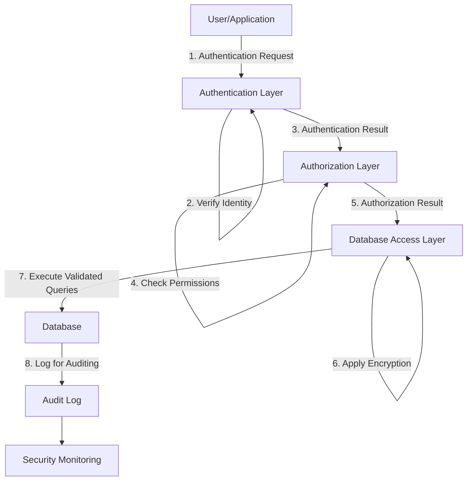

# Database Security Concepts

## Introduction

In our increasingly data-driven world, protecting the information stored in databases is critical. Database security involves the various measures and techniques designed to ensure data confidentiality, integrity, and availability while preventing unauthorized access and malicious attacks.

This guide introduces foundational database security concepts that every developer should understand before working with any database system. Whether you're building a simple web application or managing enterprise data, these concepts will help you establish a strong security foundation.

## Why Database Security Matters

Databases often store sensitive information such as:
- Personal user details
- Financial data
- Authentication credentials 
- Proprietary business information

A security breach can lead to:
- Data theft
- Identity fraud
- Financial losses
- Legal consequences
- Damaged reputation

## Core Database Security Concepts

### 1. Authentication

Authentication is the process of verifying the identity of users or systems attempting to access a database.

#### Key Authentication Methods:

- **Username and Password**: The most common authentication method
- **Multi-factor Authentication (MFA)**: Requires multiple verification methods
- **Certificate-based Authentication**: Uses digital certificates
- **Biometric Authentication**: Uses physical characteristics like fingerprints

#### Example: Setting up a database user with password authentication in MySQL

```sql
-- Create a new user with password authentication
CREATE USER 'app_user'@'localhost' IDENTIFIED BY 'strong_password_here';

-- Grant specific privileges to this user
GRANT SELECT, INSERT, UPDATE ON application_db.* TO 'app_user'@'localhost';

-- Apply the changes
FLUSH PRIVILEGES;
```

### 2. Authorization

After authentication confirms identity, authorization determines what actions the authenticated user can perform within the database.

#### Authorization Principles:

- **Principle of Least Privilege**: Users should have only the minimum privileges necessary
- **Role-Based Access Control (RBAC)**: Permissions assigned to roles, then roles assigned to users
- **Attribute-Based Access Control (ABAC)**: Permissions based on user attributes and context

#### Example: Implementing RBAC in PostgreSQL

```sql
-- Create roles for different user types
CREATE ROLE readonly;
CREATE ROLE dataentry;
CREATE ROLE admin;

-- Assign permissions to roles
GRANT SELECT ON ALL TABLES IN SCHEMA public TO readonly;

GRANT SELECT, INSERT, UPDATE ON ALL TABLES IN SCHEMA public TO dataentry;
GRANT USAGE, SELECT ON ALL SEQUENCES IN SCHEMA public TO dataentry;

GRANT ALL PRIVILEGES ON ALL TABLES IN SCHEMA public TO admin;
GRANT ALL PRIVILEGES ON ALL SEQUENCES IN SCHEMA public TO admin;

-- Create users and assign roles
CREATE USER viewer WITH PASSWORD 'viewer_password';
CREATE USER editor WITH PASSWORD 'editor_password';
CREATE USER administrator WITH PASSWORD 'admin_password';

GRANT readonly TO viewer;
GRANT dataentry TO editor;
GRANT admin TO administrator;
```

### 3. Data Encryption

Encryption transforms data into an unreadable format that can only be deciphered with the appropriate decryption key.

#### Types of Database Encryption:

- **Data at Rest**: Encrypting stored data
- **Data in Transit**: Encrypting data being transmitted
- **Transparent Data Encryption (TDE)**: Encrypts database files automatically
- **Column-level Encryption**: Encrypts specific sensitive columns

#### Example: Implementing Column-level Encryption in MySQL

```sql
-- Create a table with an encrypted column
CREATE TABLE customers (
  customer_id INT PRIMARY KEY,
  name VARCHAR(100),
  -- Encrypt the credit card column
  credit_card VARCHAR(255),
  email VARCHAR(100)
);

-- Insert with encryption using AES_ENCRYPT
INSERT INTO customers VALUES (
  1, 
  'John Doe', 
  AES_ENCRYPT('4111-1111-1111-1111', 'encryption_key_here'), 
  'john@example.com'
);

-- Query with decryption
SELECT 
  customer_id, 
  name, 
  AES_DECRYPT(credit_card, 'encryption_key_here') AS decrypted_cc,
  email 
FROM customers;
```

### 4. SQL Injection Prevention

SQL injection is one of the most common database attack vectors, where malicious SQL code is inserted into application queries.

#### Prevention Techniques:

- **Parameterized Queries**: Use prepared statements with bound parameters
- **Input Validation**: Validate and sanitize all user inputs
- **Stored Procedures**: Use database stored procedures
- **ORM Frameworks**: Leverage Object-Relational Mapping frameworks

#### Example: Vulnerable vs. Secure Code

Vulnerable code (PHP):

```php
// VULNERABLE - DO NOT USE THIS APPROACH
$username = $_POST['username'];
$query = "SELECT * FROM users WHERE username = '$username'";
$result = mysqli_query($connection, $query);
```

Secure code using parameterized queries (PHP with PDO):

```php
// SECURE - USE THIS APPROACH
$username = $_POST['username'];
$stmt = $pdo->prepare("SELECT * FROM users WHERE username = ?");
$stmt->execute([$username]);
$result = $stmt->fetchAll();
```

### 5. Database Auditing

Auditing involves tracking and logging database activities to detect suspicious behavior and maintain compliance.

#### Auditing Features:

- **Login/Logout Tracking**: Record authentication attempts
- **DDL/DML Changes**: Log schema and data modifications
- **Privileged Operations**: Monitor administrative actions
- **Query Logging**: Record executed queries

#### Example: Setting up Basic Auditing in Oracle Database

```sql
-- Enable auditing
ALTER SYSTEM SET AUDIT_TRAIL = DB SCOPE = SPFILE;
SHUTDOWN IMMEDIATE;
STARTUP;

-- Audit specific actions
AUDIT SELECT TABLE, UPDATE TABLE, DELETE TABLE BY SESSION;
AUDIT ALTER USER, CREATE USER, DROP USER BY ACCESS;

-- Query audit trail
SELECT username, action_name, timestamp, obj_name 
FROM dba_audit_trail 
ORDER BY timestamp DESC;
```

### 6. Data Masking

Data masking replaces sensitive data with realistic but fictional data for testing and development environments.

#### Masking Techniques:

- **Substitution**: Replace values with fictional equivalents
- **Shuffling**: Rearrange data within a column
- **Nulling**: Replace with NULL values
- **Encryption**: Encrypt sensitive fields

#### Example: Data Masking in PostgreSQL

```sql
-- Create a view that masks sensitive data for non-admin users
CREATE OR REPLACE VIEW masked_customers AS
SELECT
  customer_id,
  CASE 
    WHEN current_user = 'admin' THEN name
    ELSE regexp_replace(name, '(.)[^@]+', '\1******')
  END AS name,
  CASE
    WHEN current_user = 'admin' THEN credit_card
    ELSE 'XXXX-XXXX-XXXX-' || RIGHT(credit_card, 4)
  END AS credit_card,
  CASE
    WHEN current_user = 'admin' THEN email
    ELSE regexp_replace(email, '(.)[^@]+(@.*)', '\1****\2')
  END AS email
FROM customers;

-- Grant access to the view instead of the base table
REVOKE ALL ON customers FROM readonly, dataentry;
GRANT SELECT ON masked_customers TO readonly, dataentry;
```

## Database Security Implementation Flow

The following diagram illustrates how these security concepts work together:



## Best Practices for Database Security

1. **Use Strong Authentication**
   - Implement MFA where possible
   - Enforce strong password policies
   - Regularly rotate credentials

2. **Apply Least Privilege**
   - Grant minimum necessary permissions
   - Regularly review and revoke unnecessary privileges
   - Use roles instead of direct user permissions

3. **Encrypt Sensitive Data**
   - Implement both at-rest and in-transit encryption
   - Securely manage encryption keys
   - Consider using a Hardware Security Module (HSM)

4. **Secure Development**
   - Use parameterized queries consistently
   - Validate all inputs
   - Implement proper error handling that doesn't expose sensitive information

5. **Regular Maintenance**
   - Keep database software updated with security patches
   - Run security assessments
   - Review audit logs

6. **Defense in Depth**
   - Implement network segregation
   - Use firewalls to restrict database access
   - Consider Data Loss Prevention (DLP) solutions

## Real-World Application: Securing a Web Application Database

Let's walk through a practical example of implementing database security for a simple web application:

1. **Network Setup**:
   - Place database in a private subnet
   - Allow connections only from application servers
   - Implement a VPN for admin access

2. **Database Configuration**:
   ```sql
   -- Disable public network access
   ALTER SYSTEM SET remote_access = FALSE;
   
   -- Enable TLS/SSL
   ALTER SYSTEM SET ssl = TRUE;
   ALTER SYSTEM SET ssl_cert_file = '/path/to/cert.pem';
   ALTER SYSTEM SET ssl_key_file = '/path/to/key.pem';
   ```

3. **User Management**:
   ```sql
   -- Application service account with limited privileges
   CREATE USER 'app_service'@'app-server-ip' IDENTIFIED BY 'strong_random_password';
   GRANT SELECT, INSERT, UPDATE ON app_db.customers TO 'app_service'@'app-server-ip';
   GRANT SELECT, INSERT ON app_db.orders TO 'app_service'@'app-server-ip';
   
   -- Read-only account for reporting
   CREATE USER 'reporter'@'reporting-server-ip' IDENTIFIED BY 'different_strong_password';
   GRANT SELECT ON app_db.* TO 'reporter'@'reporting-server-ip';
   
   -- Admin account with IP restriction
   CREATE USER 'db_admin'@'admin-vpn-ip' IDENTIFIED BY 'admin_strong_password';
   GRANT ALL PRIVILEGES ON app_db.* TO 'db_admin'@'admin-vpn-ip';
   ```

4. **Sensitive Data Protection**:
   ```sql
   -- Create encrypted table for sensitive data
   CREATE TABLE customer_payment_info (
     customer_id INT PRIMARY KEY,
     card_number VARBINARY(255),
     expiration_date VARBINARY(255),
     cvv VARBINARY(255),
     FOREIGN KEY (customer_id) REFERENCES customers(id)
   );
   
   -- Insert encrypted data
   INSERT INTO customer_payment_info VALUES (
     1,
     AES_ENCRYPT('4111-1111-1111-1111', 'encryption_key_here'),
     AES_ENCRYPT('12/25', 'encryption_key_here'),
     AES_ENCRYPT('123', 'encryption_key_here')
   );
   ```

5. **Application Code** (Node.js with prepared statements):
   ```javascript
   // Secure database query using prepared statements
   const mysql = require('mysql2/promise');
   
   async function getUserData(userId) {
     try {
       const connection = await mysql.createConnection({
         host: 'db-server',
         user: 'app_service',
         password: process.env.DB_PASSWORD, // Store in environment variable
         database: 'app_db',
         ssl: {
           ca: fs.readFileSync('/path/to/ca-cert.pem')
         }
       });
       
       // Prepared statement prevents SQL injection
       const [rows] = await connection.execute(
         'SELECT id, name, email FROM customers WHERE id = ?',
         [userId]
       );
       
       await connection.end();
       return rows[0];
     } catch (error) {
       console.error('Database error:', error.message);
       throw new Error('Error retrieving user data');
     }
   }
   ```

6. **Audit Configuration**:
   ```sql
   -- Set up auditing for sensitive operations
   CREATE TABLE audit_log (
     id INT AUTO_INCREMENT PRIMARY KEY,
     action VARCHAR(100),
     user VARCHAR(100),
     table_name VARCHAR(100),
     record_id INT,
     old_value TEXT,
     new_value TEXT,
     timestamp DATETIME DEFAULT CURRENT_TIMESTAMP
   );
   
   -- Create trigger for auditing changes
   DELIMITER $$
   CREATE TRIGGER customer_audit_trigger
   AFTER UPDATE ON customers
   FOR EACH ROW
   BEGIN
     INSERT INTO audit_log (action, user, table_name, record_id, old_value, new_value)
     VALUES (
       'UPDATE',
       CURRENT_USER(),
       'customers',
       NEW.id,
       JSON_OBJECT('name', OLD.name, 'email', OLD.email),
       JSON_OBJECT('name', NEW.name, 'email', NEW.email)
     );
   END$$
   DELIMITER ;
   ```

## Summary

Database security is a multi-layered approach that combines:

- **Authentication**: Verifying who can access the database
- **Authorization**: Controlling what they can do
- **Encryption**: Protecting sensitive data
- **SQL Injection Prevention**: Safeguarding against common attacks
- **Auditing**: Tracking and monitoring activities
- **Data Masking**: Protecting sensitive data in non-production environments

Implementing these concepts helps create a robust security posture that protects your valuable data assets against a wide range of threats. Remember that database security is not a one-time implementation but an ongoing process requiring regular reviews, updates, and improvements.

## Exercises

1. Configure a local database with role-based access control for three user types: admin, developer, and read-only user.

2. Write a function that safely stores and retrieves encrypted sensitive user data.

3. Analyze a piece of application code to identify potential SQL injection vulnerabilities and fix them.

4. Set up basic database auditing and perform a security review of the audit logs.

5. Design a security strategy for a scenario where a company needs to provide database access to third-party contractors.

## Additional Resources

- OWASP Database Security Cheat Sheet
- Database vendor security documentation:
  - MySQL Security Guide
  - PostgreSQL Security Best Practices
  - SQL Server Security Guide
  - Oracle Database Security Guide
- Books:
  - "Database Security: Concepts, Approaches, and Challenges"
  - "Securing SQL Server"
  - "Oracle Database Security Handbook"

Remember that database security is most effective when applied as part of a broader security strategy that includes application security, network security, and organizational security policies.