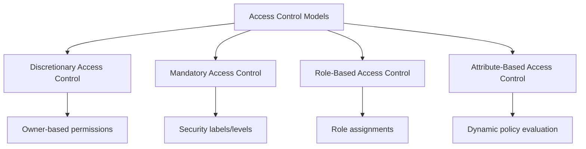

# Access Control Models

## Introduction

Access control is a fundamental aspect of database security that determines who can access what data and what operations they can perform. Think of it as the gatekeeper for your database – ensuring only authorized users can view, modify, or delete specific information.

In this guide, we'll explore different access control models used in database systems. Understanding these models is crucial for implementing proper security measures in any application that handles sensitive data.

## Why Access Control Matters

Before diving into specific models, let's understand why proper access control is essential:

- **Data Protection**: Prevents unauthorized access to sensitive information
- **Regulatory Compliance**: Helps meet legal requirements like GDPR, HIPAA, etc.
- **Breach Prevention**: Minimizes the impact of security breaches
- **Operational Integrity**: Ensures data remains accurate and reliable

## Common Access Control Models

Let's explore the four primary access control models used in database systems:



### 1. Discretionary Access Control (DAC)

DAC is one of the oldest and most common access control models. In this model, the owner of a resource controls who can access it and what operations they can perform.

#### How DAC Works

1. Each database object (table, view, procedure, etc.) has an owner
2. Owners grant specific permissions to users or groups
3. Permissions can often be transferred or delegated

#### Example in SQL

Here's how DAC works in a SQL database:

```sql
-- Create a new table (the creator becomes the owner)
CREATE TABLE customer_data (
    customer_id INT PRIMARY KEY,
    name VARCHAR(100),
    email VARCHAR(100),
    credit_score INT
);

-- Grant SELECT permission to a specific user
GRANT SELECT ON customer_data TO user_bob;

-- Grant INSERT and UPDATE permissions to another user
GRANT INSERT, UPDATE ON customer_data TO user_alice;

-- Revoke permissions
REVOKE UPDATE ON customer_data FROM user_alice;
```

#### Real-World Application

A small business database where the database administrator creates tables for different departments and assigns permissions to department heads, who can then assign permissions to their team members.

#### Pros and Cons of DAC

**Advantages:**
- Simple to implement and understand
- Flexible for changing environments
- Gives control to data owners

**Disadvantages:**
- Risk of excessive privilege grants
- No centralized policy management
- Potential for permission inconsistencies
- Vulnerable to Trojan horse attacks

### 2. Mandatory Access Control (MAC)

MAC enforces access control through a central authority based on security classification levels, not at the discretion of data owners.

#### How MAC Works

1. Each database object is assigned a sensitivity label (e.g., Confidential, Secret, Top Secret)
2. Each user is assigned a clearance level
3. Access is permitted only if the user's clearance level is appropriate for the object's sensitivity

#### Example Implementation

While SQL doesn't directly implement MAC, we can illustrate with a conceptual example:

```sql
-- Conceptual representation of MAC (not standard SQL)
-- Create a table with sensitivity label
CREATE TABLE financial_data (
    transaction_id INT PRIMARY KEY,
    amount DECIMAL(10,2),
    account_number VARCHAR(20),
    SECURITY_LABEL 'TOP_SECRET'
);

-- User with 'SECRET' clearance trying to access 'TOP_SECRET' data
-- This would be denied by the system
```

#### Real-World Application

Government or military database systems where data is classified according to national security levels, and users only have access based on their security clearance.

#### Pros and Cons of MAC

**Advantages:**
- High security for sensitive environments
- Centralized policy enforcement
- Protection against malicious insiders

**Disadvantages:**
- Complex to implement and administer
- Less flexible than other models
- Can be restrictive for normal business operations

### 3. Role-Based Access Control (RBAC)

RBAC assigns permissions to roles rather than individual users. Users are then assigned to appropriate roles.

#### How RBAC Works

1. Define roles based on job functions or responsibilities
2. Assign permissions to roles
3. Assign users to roles
4. Users inherit permissions from their roles

#### Example in SQL

```sql
-- Create roles
CREATE ROLE data_analyst;
CREATE ROLE marketing_manager;
CREATE ROLE customer_service;

-- Assign permissions to roles
GRANT SELECT ON customer_data TO data_analyst;
GRANT SELECT, INSERT, UPDATE ON marketing_campaigns TO marketing_manager;
GRANT SELECT, UPDATE ON customer_service_tickets TO customer_service;

-- Assign users to roles
GRANT data_analyst TO user_jane;
GRANT marketing_manager TO user_mike;
GRANT customer_service TO user_sarah;
```

#### Implementing RBAC in PostgreSQL

Here's a more concrete example using PostgreSQL:

```sql
-- Create application roles
CREATE ROLE app_readonly;
CREATE ROLE app_readwrite;
CREATE ROLE app_admin;

-- Create user accounts
CREATE USER analyst_user WITH PASSWORD 'secure_password';
CREATE USER manager_user WITH PASSWORD 'very_secure_password';

-- Grant role memberships
GRANT app_readonly TO analyst_user;
GRANT app_readwrite TO manager_user;

-- Set up permissions for roles
GRANT SELECT ON ALL TABLES IN SCHEMA public TO app_readonly;
GRANT SELECT, INSERT, UPDATE ON ALL TABLES IN SCHEMA public TO app_readwrite;
GRANT ALL PRIVILEGES ON ALL TABLES IN SCHEMA public TO app_admin;

-- Check user's roles
SELECT rolname FROM pg_roles WHERE pg_has_role('analyst_user', oid, 'member');
```

#### Real-World Application

A hospital database where doctors, nurses, administrators, and billing staff all need different levels of access to patient records based on their job functions.

#### Pros and Cons of RBAC

**Advantages:**
- Simplified administration
- Follows principle of least privilege
- Easier compliance auditing
- Reduces risk of error in permission assignment

**Disadvantages:**
- Can become complex with many roles
- May require role hierarchies for larger organizations
- Less flexible for exceptions to standard roles

### 4. Attribute-Based Access Control (ABAC)

ABAC makes access decisions based on attributes of users, resources, actions, and environment conditions.

#### How ABAC Works

1. Define attributes for users (department, job level, etc.)
2. Define attributes for resources (sensitivity, owner, etc.)
3. Define attributes for environment (time, location, etc.)
4. Create policies using these attributes
5. Evaluate policies dynamically at access time

#### Example ABAC Policy (Pseudocode)

```
POLICY: AccessFinancialData
IF:
  - User.Department = "Finance" OR User.Role = "Executive"
  - AND Resource.Type = "Financial Report"
  - AND Environment.Time BETWEEN 9AM AND 5PM
  - AND Environment.NetworkLocation = "Corporate Office"
THEN:
  - ALLOW READ ACCESS
```

#### Real-World Application

A cloud-based enterprise system where access depends on multiple factors including the user's role, department, time of access, location, device type, and the sensitivity of the data being accessed.

#### Pros and Cons of ABAC

**Advantages:**
- Highly flexible and fine-grained control
- Can implement complex business rules
- Adaptable to changing requirements
- Considers context for access decisions

**Disadvantages:**
- Complex to implement and maintain
- Performance overhead for policy evaluation
- Difficult to audit and visualize permissions

## Implementing Access Control in Practice

Let's see how to implement practical access control in a real database scenario:

### Example: E-commerce Database Security

Imagine an e-commerce platform with the following requirements:

1. Customer service reps can view order data but not change it
2. Warehouse staff can update order status but not see payment details
3. Accounting can see payment data but not customer contact info
4. System admins need full access for maintenance

Here's how to implement this using RBAC in MySQL:

```sql
-- Create the necessary roles
CREATE ROLE customer_service_role;
CREATE ROLE warehouse_role;
CREATE ROLE accounting_role;
CREATE ROLE sysadmin_role;

-- Assign appropriate permissions to roles
-- For customer service
GRANT SELECT ON orders TO customer_service_role;
GRANT SELECT ON customers TO customer_service_role;

-- For warehouse staff
GRANT SELECT, UPDATE (status, shipping_date) ON orders TO warehouse_role;
GRANT SELECT ON inventory TO warehouse_role;

-- For accounting
GRANT SELECT ON orders TO accounting_role;
GRANT SELECT ON payments TO accounting_role;
-- Restrict view of sensitive data
CREATE VIEW accounting_customer_view AS
SELECT customer_id, company_name, purchase_history
FROM customers;
GRANT SELECT ON accounting_customer_view TO accounting_role;

-- For system admins (with all privileges)
GRANT ALL PRIVILEGES ON *.* TO sysadmin_role;

-- Now assign users to roles
CREATE USER 'cs_rep1'@'localhost' IDENTIFIED BY 'password123';
GRANT customer_service_role TO 'cs_rep1'@'localhost';

CREATE USER 'warehouse_staff1'@'localhost' IDENTIFIED BY 'password456';
GRANT warehouse_role TO 'warehouse_staff1'@'localhost';
```

## Best Practices for Database Access Control

Regardless of which model you implement, follow these best practices:

1. **Principle of Least Privilege**: Grant only the permissions necessary for users to perform their jobs
2. **Separation of Duties**: Ensure critical operations require multiple users
3. **Regular Auditing**: Review access rights periodically to identify and remove unnecessary permissions
4. **Strong Authentication**: Pair access control with strong user authentication
5. **Use Views**: Create restricted views of sensitive tables
6. **Document Policies**: Maintain clear documentation of your access control policies
7. **Automated Monitoring**: Implement monitoring to detect unusual access patterns

## Access Control Model Selection

How do you choose the right model? Consider these factors:

1. **Organizational Size**: Small organizations may work fine with DAC, while larger ones benefit from RBAC or ABAC
2. **Regulatory Requirements**: Some industries have specific requirements that may dictate your model
3. **Sensitivity of Data**: More sensitive data requires stricter models like MAC or ABAC
4. **Administrative Overhead**: Consider the resources needed to maintain your chosen model

## Practical Exercise: Implementing RBAC in Your Database

Let's practice implementing RBAC in a simple database:

```sql
-- Create a simple database for a blog platform
CREATE DATABASE blog_platform;
USE blog_platform;

-- Create tables
CREATE TABLE articles (
    id INT PRIMARY KEY AUTO_INCREMENT,
    title VARCHAR(200) NOT NULL,
    content TEXT NOT NULL,
    author_id INT NOT NULL,
    published BOOLEAN DEFAULT FALSE,
    created_at TIMESTAMP DEFAULT CURRENT_TIMESTAMP
);

CREATE TABLE users (
    id INT PRIMARY KEY AUTO_INCREMENT,
    username VARCHAR(50) NOT NULL UNIQUE,
    password_hash VARCHAR(255) NOT NULL,
    email VARCHAR(100) NOT NULL UNIQUE
);

-- Create roles for the blog platform
CREATE ROLE reader_role;       -- Can only read published articles
CREATE ROLE author_role;       -- Can create and edit own articles
CREATE ROLE editor_role;       -- Can edit and publish any articles
CREATE ROLE admin_role;        -- Full access

-- Assign permissions to roles
GRANT SELECT ON articles WHERE published = TRUE TO reader_role;

GRANT SELECT, INSERT ON articles TO author_role;
GRANT UPDATE ON articles WHERE author_id = USER_ID() TO author_role;

GRANT SELECT, UPDATE ON articles TO editor_role;

GRANT ALL PRIVILEGES ON blog_platform.* TO admin_role;

-- Exercise: Now try creating users and assigning them to these roles!
```

## Summary

Access control models provide the framework for securing database systems by controlling who can access what data and under what conditions:

- **DAC** provides flexibility but can lead to permission management challenges
- **MAC** offers high security for sensitive environments but is rigid
- **RBAC** simplifies administration through role assignments
- **ABAC** provides dynamic, context-aware access decisions

The right model depends on your organization's specific needs, regulatory requirements, and security goals. In practice, many systems use hybrid approaches combining elements from multiple models.

Understanding these models empowers you to implement appropriate security measures for your database applications and protect sensitive information effectively.

## Additional Resources

To deepen your knowledge of database access control:

- **Books**:
  - "Database Security" by Alfred Basta and Melissa Zgola
  - "SQL Server Security Distilled" by Richard Waymire

- **Online Courses**:
  - Database Security Fundamentals on major learning platforms
  - Advanced SQL Security Techniques

- **Practice**:
  - Try implementing different access control models in your test database
  - Audit an existing database's permission structure
  - Create a security policy document for a fictional application

Remember that database security is not a one-time setup but an ongoing process that requires regular reviews and updates to address new threats and changing requirements.