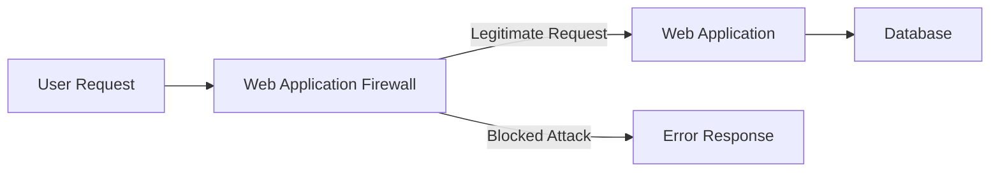

# SQL Injection Prevention

## Introduction

SQL injection is one of the most common and dangerous web application vulnerabilities. It occurs when an attacker is able to insert or "inject" malicious SQL code into queries that your application sends to its database. A successful SQL injection attack can lead to unauthorized access to sensitive data, data corruption, or even complete system compromise.

In this tutorial, we'll explore what SQL injection attacks are, how they work, and most importantly, how to prevent them in your applications. Whether you're building a simple personal project or an enterprise application, these security practices are essential knowledge for every developer working with databases.

## What is SQL Injection?

SQL injection occurs when user-supplied data is not properly validated and is directly included in SQL queries. The injected SQL commands can alter the logic of the original query, potentially allowing attackers to:

- Access unauthorized data
- Bypass authentication
- Modify database content
- Execute administrative operations
- In extreme cases, issue commands to the operating system

Let's look at a simple example of vulnerable code:

```javascript
// Vulnerable code - DO NOT USE
const username = request.body.username;
const query = `SELECT * FROM users WHERE username = '${username}'`;
db.execute(query);
```

If a user enters a normal username like "john_doe", the query would be:

```sql
SELECT * FROM users WHERE username = 'john_doe'
```

But what if someone enters this as their username?

```
' OR '1'='1
```

The resulting query becomes:

```sql
SELECT * FROM users WHERE username = '' OR '1'='1'
```

Since `'1'='1'` is always true, this query returns all records from the users table, potentially leaking sensitive information.

## Common SQL Injection Attack Vectors

### 1. Basic SQL Injection

The simplest form involves injecting SQL code that changes the query's logic:

```
Username: admin' --
```

This turns a query like:

```sql
SELECT * FROM users WHERE username = 'admin' -- ' AND password = 'password'
```

The double dash (`--`) comments out the rest of the query, bypassing the password check.

### 2. UNION-Based Attacks

Attackers can use UNION statements to combine the results of the original query with a second query:

```
Username: ' UNION SELECT username, password FROM users --
```

This could return all usernames and passwords from the database.

### 3. Blind SQL Injection

When error messages are suppressed, attackers can still extract information using boolean-based or time-based techniques:

```
Username: admin' AND (SELECT SUBSTR(password,1,1) FROM users WHERE username='admin') = 'a
```

By systematically trying different characters and observing the application's behavior, attackers can extract data character by character.

## Preventing SQL Injection Attacks

### 1. Use Parameterized Queries (Prepared Statements)

Parameterized queries separate SQL code from data, preventing injected SQL from changing the query structure:

```javascript
// Safe code using parameterized query
const username = request.body.username;
const query = "SELECT * FROM users WHERE username = ?";
db.execute(query, [username]);
```

Different programming languages and database libraries have their own syntax for parameterized queries:

**Node.js with MySQL:**

```javascript
const mysql = require('mysql2');
const connection = mysql.createConnection({/*connection details*/});

// Using placeholders (?) for parameters
const query = "SELECT * FROM users WHERE username = ? AND password = ?";
connection.execute(query, [username, password], (err, results) => {
  // Handle results
});
```

**Python with SQLite:**

```python
import sqlite3
conn = sqlite3.connect('mydb.db')
cursor = conn.cursor()

# Using placeholders (?) for parameters
cursor.execute("SELECT * FROM users WHERE username = ? AND password = ?", 
               (username, password))
results = cursor.fetchall()
```

**PHP with PDO:**

```php
$pdo = new PDO('mysql:host=localhost;dbname=myapp', $user, $pass);
$stmt = $pdo->prepare("SELECT * FROM users WHERE username = :username");
$stmt->execute(['username' => $username]);
$user = $stmt->fetch();
```

### 2. Use ORMs (Object-Relational Mappers)

ORMs abstract SQL queries and often include protection against SQL injection:

```javascript
// Example using Sequelize ORM in Node.js
const user = await User.findOne({
  where: {
    username: username
  }
});
```

```python
# Example using SQLAlchemy in Python
user = session.query(User).filter(User.username == username).first()
```

### 3. Input Validation and Sanitization

While parameterized queries are the primary defense, always validate user input:

```javascript
// Input validation example
function isValidUsername(username) {
  // Alphanumeric, underscores, 3-20 characters
  const pattern = /^[a-zA-Z0-9_]{3,20}$/;
  return pattern.test(username);
}

if (!isValidUsername(req.body.username)) {
  return res.status(400).send("Invalid username format");
}
```

### 4. Database Account Privileges

Follow the principle of least privilege:

```sql
-- Create a restricted database user for your application
CREATE USER 'app_user'@'localhost' IDENTIFIED BY 'password';
GRANT SELECT, INSERT, UPDATE ON myapp.* TO 'app_user'@'localhost';
-- Do NOT grant administrative privileges
```

### 5. Error Handling

Don't expose SQL error messages to users:

```javascript
try {
  // Database operations
} catch (error) {
  // Log the detailed error for developers
  console.error("Database error:", error);
  
  // Return a generic error to the user
  return res.status(500).send("An error occurred while processing your request");
}
```

## Real-World Application: Building a Secure User Registration System

Let's see how to implement a simple but secure user registration system:

### Backend (Node.js with Express)

```javascript
const express = require('express');
const mysql = require('mysql2/promise');
const bcrypt = require('bcrypt');
const { body, validationResult } = require('express-validator');

const app = express();
app.use(express.json());

// Database connection
const pool = mysql.createPool({
  host: 'localhost',
  user: 'app_user',
  password: 'secure_password',
  database: 'myapp'
});

// User registration endpoint with validation
app.post('/register', [
  // Input validation
  body('username').isAlphanumeric().isLength({ min: 3, max: 20 }),
  body('email').isEmail(),
  body('password').isLength({ min: 8 })
], async (req, res) => {
  // Check for validation errors
  const errors = validationResult(req);
  if (!errors.isEmpty()) {
    return res.status(400).json({ errors: errors.array() });
  }
  
  try {
    // Hash the password
    const hashedPassword = await bcrypt.hash(req.body.password, 10);
    
    // Insert new user with parameterized query
    const [result] = await pool.execute(
      "INSERT INTO users (username, email, password) VALUES (?, ?, ?)",
      [req.body.username, req.body.email, hashedPassword]
    );
    
    res.status(201).json({ 
      message: "User registered successfully",
      userId: result.insertId 
    });
  } catch (error) {
    console.error("Registration error:", error);
    
    // Check for duplicate entry
    if (error.code === 'ER_DUP_ENTRY') {
      return res.status(409).json({ 
        message: "Username or email already exists" 
      });
    }
    
    // Generic error for other cases
    res.status(500).json({ 
      message: "Registration failed due to server error" 
    });
  }
});

app.listen(3000, () => {
  console.log('Server running on port 3000');
});
```

### Database Schema

```sql
CREATE TABLE users (
  id INT AUTO_INCREMENT PRIMARY KEY,
  username VARCHAR(20) NOT NULL UNIQUE,
  email VARCHAR(100) NOT NULL UNIQUE,
  password VARCHAR(60) NOT NULL,
  created_at TIMESTAMP DEFAULT CURRENT_TIMESTAMP
);

-- Restrict permissions
GRANT SELECT, INSERT ON myapp.users TO 'app_user'@'localhost';
```

### What Makes This Implementation Secure?

1. **Parameterized queries** for all database operations
2. **Input validation** using express-validator
3. **Password hashing** with bcrypt
4. **Proper error handling** without exposing sensitive details
5. **Limited database privileges** for the application user

## Additional Defense Strategies

### Web Application Firewalls (WAFs)

WAFs can detect and block common SQL injection patterns before they reach your application:



### Content Security Policy (CSP)

Adding security headers helps mitigate various attacks:

```javascript
// Express middleware for security headers
app.use((req, res, next) => {
  res.setHeader('Content-Security-Policy', "default-src 'self'");
  res.setHeader('X-Content-Type-Options', 'nosniff');
  next();
});
```

### Database Activity Monitoring

Monitor for suspicious queries:

```sql
-- Example: Create an audit log
CREATE TABLE query_audit_log (
  id INT AUTO_INCREMENT PRIMARY KEY,
  user_id INT,
  query_text TEXT,
  execution_time TIMESTAMP DEFAULT CURRENT_TIMESTAMP
);

-- Trigger to log queries (simplified example)
DELIMITER //
CREATE TRIGGER before_user_update
BEFORE UPDATE ON users
FOR EACH ROW
BEGIN
  INSERT INTO query_audit_log (user_id, query_text)
  VALUES (CURRENT_USER(), CONCAT('UPDATE users SET ... WHERE id = ', NEW.id));
END; //
DELIMITER ;
```

## Common Mistakes to Avoid

1. **String concatenation** in SQL queries
2. **Blacklist filtering** instead of whitelist validation
3. **Excessive error information** exposed to users
4. **Using root/admin database accounts** for applications
5. **Trusting client-side validation** alone

## Summary

SQL injection remains one of the most dangerous vulnerabilities in web applications, but it's also one of the most preventable. By consistently using parameterized queries, validating input, implementing proper error handling, and following the principle of least privilege, you can protect your applications from these attacks.

Remember that security is a multi-layered approach - no single technique provides complete protection. Combine the strategies discussed in this tutorial to build robust defenses against SQL injection attacks.

## Exercise: Test Your Knowledge

1. Take the following vulnerable code and rewrite it to be secure:

```javascript
// Vulnerable code
function getUserData(userId) {
  const query = `SELECT name, email FROM users WHERE id = ${userId}`;
  return db.execute(query);
}
```

2. Create a simple login form and implement secure authentication logic that prevents SQL injection.

3. Research and implement a prepared statement in a programming language of your choice that wasn't covered in this tutorial.

## Additional Resources

- [OWASP SQL Injection Prevention Cheat Sheet](https://cheatsheetseries.owasp.org/cheatsheets/SQL_Injection_Prevention_Cheat_Sheet.html)
- [OWASP Top Ten](https://owasp.org/www-project-top-ten/)
- [PortSwigger Web Security Academy: SQL Injection](https://portswigger.net/web-security/sql-injection)
- [The Bobby Tables Guide to SQL Injection](https://bobby-tables.com/)

By implementing the techniques covered in this tutorial, you'll be well on your way to building more secure database-driven applications that can withstand SQL injection attempts.