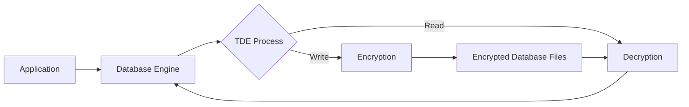

# Database Encryption

## Introduction

Database encryption is a critical security measure that protects sensitive information stored in databases from unauthorized access. By converting plaintext data into ciphertext (encrypted form), encryption ensures that even if someone gains access to your database files, they cannot read the actual data without the proper decryption keys.

As organizations collect and store increasingly sensitive information—from personal details to financial records—database encryption has become an essential component of a comprehensive security strategy rather than an optional feature.

## Why Database Encryption Matters

Database encryption is vital for several reasons:

- **Data Protection**: Protects sensitive information from unauthorized access
- **Regulatory Compliance**: Helps meet requirements from regulations like GDPR, HIPAA, and PCI DSS
- **Breach Mitigation**: Reduces the impact of a data breach
- **Customer Trust**: Demonstrates commitment to protecting user data

## Types of Database Encryption

There are several approaches to database encryption, each with different security levels and performance implications.

### Transparent Data Encryption (TDE)

Transparent Data Encryption operates at the file level, encrypting the entire database, including logs and backups. It's called "transparent" because it requires no changes to existing applications.



**Advantages:**
- Simple to implement
- Transparent to applications
- Protects against physical theft

**Disadvantages:**
- Does not protect against authorized users
- Performance overhead
- Database administrators can still access data

### Column-Level Encryption

Instead of encrypting the entire database, column-level encryption targets specific columns containing sensitive data.

```sql
-- Example of encrypting a column with sensitive data in SQL Server
CREATE TABLE Customers (
    CustomerID INT PRIMARY KEY,
    FirstName NVARCHAR(50),
    LastName NVARCHAR(50),
    -- Encrypt the SSN column
    SSN VARBINARY(128) ENCRYPTED WITH (
        COLUMN_ENCRYPTION_KEY = MyCEK,
        ENCRYPTION_TYPE = Deterministic,
        ALGORITHM = 'AEAD_AES_256_CBC_HMAC_SHA_256'
    )
);
```

**Advantages:**
- Granular control over what gets encrypted
- Potentially lower performance impact
- Access controls at the data level

**Disadvantages:**
- Requires application changes
- More complex key management
- Potential for logic errors exposing data

### Application-Level Encryption

Application-level encryption moves the encryption process to the application before data is sent to the database.

```javascript
// Example of application-level encryption in Node.js
const crypto = require('crypto');

function encryptData(data, key) {
  const algorithm = 'aes-256-cbc';
  const iv = crypto.randomBytes(16);
  
  const cipher = crypto.createCipheriv(algorithm, Buffer.from(key, 'hex'), iv);
  let encrypted = cipher.update(data);
  encrypted = Buffer.concat([encrypted, cipher.final()]);
  
  return {
    iv: iv.toString('hex'),
    encryptedData: encrypted.toString('hex')
  };
}

// Encrypt sensitive data before storing it
const sensitiveData = "123-45-6789"; // SSN example
const encryptionKey = "5f1c7b1e8a4c3d5e6f7g8h9i0j1k2l3m"; // Store safely!
const encryptedData = encryptData(sensitiveData, encryptionKey);

// Now store encryptedData.iv and encryptedData.encryptedData in the database
```

**Advantages:**
- Strong security (database never sees plaintext)
- Protection against database admin access
- Fine-grained control

**Disadvantages:**
- Complex implementation
- Key management responsibility on application
- Performance overhead
- Limited query functionality on encrypted data

## Encryption Algorithms

Several encryption algorithms are commonly used for database encryption:

### AES (Advanced Encryption Standard)

AES is the most widely used symmetric encryption algorithm, endorsed by the U.S. government for classified information.

- **Key sizes**: 128, 192, or 256 bits
- **Security**: Very strong, especially with 256-bit keys
- **Performance**: Relatively fast
- **Usage**: General purpose encryption for most database systems

### RSA (Rivest-Shamir-Adleman)

RSA is an asymmetric encryption algorithm that uses a public-private key pair.

- **Key sizes**: Typically 2048 or 4096 bits
- **Security**: Strong for key encryption
- **Performance**: Slower than symmetric algorithms
- **Usage**: Usually used for encrypting symmetric keys rather than large data sets

### SHA (Secure Hash Algorithm)

While not encryption per se, SHA algorithms are often used alongside encryption for integrity checking.

- **Output sizes**: SHA-256 produces a 256-bit hash
- **Security**: Strong integrity protection
- **Usage**: Creating checksums to verify data hasn't been tampered with

## Implementing Database Encryption

Let's examine how to implement encryption in different database systems.

### MySQL/MariaDB Encryption

```sql
-- Create a table with encrypted columns
CREATE TABLE sensitive_data (
    id INT AUTO_INCREMENT PRIMARY KEY,
    username VARCHAR(50),
    credit_card VARCHAR(255),
    -- Function to encrypt credit card number
    CONSTRAINT cc_encrypted CHECK (credit_card = AES_ENCRYPT(credit_card, 'encryption_key'))
);

-- Insert encrypted data
INSERT INTO sensitive_data (username, credit_card) 
VALUES ('user1', AES_ENCRYPT('1234-5678-9012-3456', 'encryption_key'));

-- Query encrypted data
SELECT username, AES_DECRYPT(credit_card, 'encryption_key') as decrypted_cc 
FROM sensitive_data;
```

### PostgreSQL Encryption with pgcrypto

First, enable the pgcrypto extension:

```sql
CREATE EXTENSION pgcrypto;

-- Create a table with encrypted columns
CREATE TABLE customer_data (
    id SERIAL PRIMARY KEY,
    name TEXT NOT NULL,
    -- Encrypted column
    credit_card BYTEA
);

-- Insert with encryption
INSERT INTO customer_data (name, credit_card)
VALUES (
    'John Doe',
    pgp_sym_encrypt('4111-1111-1111-1111', 'encryption_key')
);

-- Query with decryption
SELECT name, pgp_sym_decrypt(credit_card, 'encryption_key') as decrypted_cc
FROM customer_data;
```

### MongoDB Encryption

MongoDB supports client-side field level encryption. Here's an example using the Node.js driver:

```javascript
const { MongoClient, ClientEncryption } = require('mongodb');
const fs = require('fs');

async function encryptAndStore() {
  // Set up the key vault for key management
  const keyVaultNamespace = 'encryption.__keyVault';
  
  // Connection to MongoDB
  const client = new MongoClient('mongodb://localhost:27017', {
    useNewUrlParser: true,
    useUnifiedTopology: true
  });

  await client.connect();
  
  // Create a master key
  const masterKey = crypto.randomBytes(96);
  fs.writeFileSync('master-key.txt', masterKey);
  
  // Create a client encryption instance
  const clientEncryption = new ClientEncryption(client, {
    keyVaultNamespace,
    kmsProviders: {
      local: {
        key: masterKey
      }
    }
  });
  
  // Create a data encryption key
  const dataEncryptionKey = await clientEncryption.createDataKey('local');
  
  // Configure encryption schema
  const encryptedFieldsMap = {
    'myDatabase.customers': {
      fields: [
        {
          keyId: dataEncryptionKey,
          path: 'creditCard',
          bsonType: 'string',
          queries: { equalityMatch: true }
        }
      ]
    }
  };
  
  // Create a client with encryption configuration
  const encryptedClient = new MongoClient('mongodb://localhost:27017', {
    useNewUrlParser: true,
    useUnifiedTopology: true,
    autoEncryption: {
      keyVaultNamespace,
      kmsProviders: {
        local: {
          key: masterKey
        }
      },
      encryptedFieldsMap
    }
  });
  
  await encryptedClient.connect();
  const encryptedCollection = encryptedClient.db('myDatabase').collection('customers');
  
  // Insert document with automatic encryption
  await encryptedCollection.insertOne({
    name: 'John Smith',
    creditCard: '4111-1111-1111-1111' // This will be encrypted automatically
  });
  
  await client.close();
  await encryptedClient.close();
}

encryptAndStore().catch(console.error);
```

## Best Practices for Database Encryption

To maximize the effectiveness of your database encryption:

### 1. Encrypt Data Both At Rest and In Transit

- **At Rest**: Encrypt stored data in the database
- **In Transit**: Use TLS/SSL for data transmission

### 2. Implement Proper Key Management

- **Rotation**: Change encryption keys periodically
- **Storage**: Never store encryption keys in the same database as the encrypted data
- **Backup**: Keep secure backups of encryption keys
- **Access Control**: Limit who can access encryption keys

### 3. Use Appropriate Encryption Types

- Use **deterministic encryption** when you need to query on encrypted fields
- Use **randomized encryption** for maximum security when queries aren't needed

### 4. Minimize Encryption Performance Impact

- Only encrypt truly sensitive data
- Use hardware acceleration when available
- Consider caching strategies for frequently accessed encrypted data

### 5. Test Encryption Failure Scenarios

- What happens if keys are lost?
- How will backups be restored?
- How to handle encryption errors?

## Real-World Application Example

Let's walk through a real-world example of implementing database encryption for a healthcare application that must comply with HIPAA regulations.

### Scenario: Patient Records System

A medical clinic needs to store patient information including:
- Personal identification
- Medical history
- Insurance details
- Payment information

### Solution Implementation

Here's how we might implement encryption for this system using Node.js and PostgreSQL:

```javascript
// health_records_system.js
const { Pool } = require('pg');
const crypto = require('crypto');

// Database connection
const pool = new Pool({
  user: 'healthcare_app',
  host: 'localhost',
  database: 'patient_records',
  password: 'secure_password',
  port: 5432,
  ssl: true // Enforce SSL for in-transit encryption
});

// Encryption functions
const ENCRYPTION_KEY = process.env.ENCRYPTION_KEY; // Store in secure environment variable
const IV_LENGTH = 16;

function encrypt(text) {
  const iv = crypto.randomBytes(IV_LENGTH);
  const cipher = crypto.createCipheriv(
    'aes-256-cbc', 
    Buffer.from(ENCRYPTION_KEY, 'hex'), 
    iv
  );
  let encrypted = cipher.update(text);
  encrypted = Buffer.concat([encrypted, cipher.final()]);
  return iv.toString('hex') + ':' + encrypted.toString('hex');
}

function decrypt(text) {
  const parts = text.split(':');
  const iv = Buffer.from(parts[0], 'hex');
  const encryptedText = Buffer.from(parts[1], 'hex');
  const decipher = crypto.createDecipheriv(
    'aes-256-cbc', 
    Buffer.from(ENCRYPTION_KEY, 'hex'), 
    iv
  );
  let decrypted = decipher.update(encryptedText);
  decrypted = Buffer.concat([decrypted, decipher.final()]);
  return decrypted.toString();
}

// Example patient record functions
async function addPatient(patientData) {
  // Encrypt sensitive fields
  const encryptedSSN = encrypt(patientData.ssn);
  const encryptedInsuranceId = encrypt(patientData.insuranceId);

  const query = `
    INSERT INTO patients 
    (name, date_of_birth, ssn, insurance_id, medical_conditions) 
    VALUES ($1, $2, $3, $4, $5)
    RETURNING id`;

  const values = [
    patientData.name,
    patientData.dateOfBirth,
    encryptedSSN,
    encryptedInsuranceId,
    patientData.medicalConditions // Not encrypted as needed for medical queries
  ];

  try {
    const result = await pool.query(query, values);
    return result.rows[0].id;
  } catch (err) {
    console.error('Error saving patient data:', err);
    throw err;
  }
}

async function getPatient(patientId) {
  const query = 'SELECT * FROM patients WHERE id = $1';
  
  try {
    const result = await pool.query(query, [patientId]);
    if (result.rows.length > 0) {
      const patient = result.rows[0];
      
      // Decrypt sensitive fields
      patient.ssn = decrypt(patient.ssn);
      patient.insurance_id = decrypt(patient.insurance_id);
      
      return patient;
    }
    return null;
  } catch (err) {
    console.error('Error retrieving patient data:', err);
    throw err;
  }
}

module.exports = {
  addPatient,
  getPatient
};
```

Database schema setup:

```sql
-- Initial database setup with encryption extension
CREATE EXTENSION pgcrypto;

-- Patients table
CREATE TABLE patients (
  id SERIAL PRIMARY KEY,
  name VARCHAR(100) NOT NULL,
  date_of_birth DATE NOT NULL,
  ssn TEXT NOT NULL, -- Will store encrypted SSN
  insurance_id TEXT NOT NULL, -- Will store encrypted insurance ID
  medical_conditions TEXT[] -- Not encrypted for medical querying
);

-- Audit log for access tracking (HIPAA requirement)
CREATE TABLE access_logs (
  id SERIAL PRIMARY KEY,
  user_id INTEGER NOT NULL,
  patient_id INTEGER REFERENCES patients(id),
  access_time TIMESTAMP DEFAULT CURRENT_TIMESTAMP,
  action VARCHAR(50) NOT NULL
);

-- Create indices (avoid creating indices on encrypted columns)
CREATE INDEX idx_patient_name ON patients(name);
CREATE INDEX idx_patient_dob ON patients(date_of_birth);
```

## Performance Considerations

Encryption adds computational overhead to your database operations. Here's what to expect:

### Read/Write Impact

- Writes usually experience 10-30% performance decrease
- Reads can see similar performance impacts
- Column-level encryption has less impact than full database encryption

### Query Limitations

- You can't use standard indexing on encrypted columns
- Range queries don't work with standard encryption
- Full-text search doesn't work on encrypted text

### Mitigation Strategies

- Use hardware acceleration
- Implement caching for frequently accessed encrypted data
- Only encrypt truly sensitive columns
- Consider using specialized encryption techniques that preserve some query capabilities

## Summary

Database encryption is a fundamental security measure that protects sensitive information from unauthorized access. We've explored:

- Different types of encryption: transparent, column-level, and application-level
- Common encryption algorithms like AES and RSA
- Implementation examples for popular database systems
- Best practices for secure key management
- Real-world applications with sample code
- Performance considerations and trade-offs

As data privacy regulations become stricter and data breaches more common, database encryption is no longer optional for most applications. By implementing appropriate encryption strategies, you can significantly reduce your risk profile and protect your users' sensitive information.

## Exercises

1. Set up a simple database with a table containing sensitive information, then implement column-level encryption for that table.
2. Create a key rotation system that allows you to re-encrypt your database with a new key without downtime.
3. Compare the performance impact of different encryption methods on a sample database.
4. Implement a secure key management solution that doesn't store the encryption key alongside the database.
5. Design a database schema for a financial application that uses appropriate encryption for different types of sensitive data.

## Additional Resources

- [OWASP Database Security Cheat Sheet](https://cheatsheetseries.owasp.org/cheatsheets/Database_Security_Cheat_Sheet.html)
- [NIST Guidelines for Database Security](https://csrc.nist.gov/publications/detail/sp/800-123/final)
- Official documentation for database encryption:
  - [MySQL Encryption and Compression Functions](https://dev.mysql.com/doc/refman/8.0/en/encryption-functions.html)
  - [PostgreSQL pgcrypto Module](https://www.postgresql.org/docs/current/pgcrypto.html)
  - [MongoDB Client-Side Field Level Encryption](https://docs.mongodb.com/manual/core/security-client-side-encryption/)