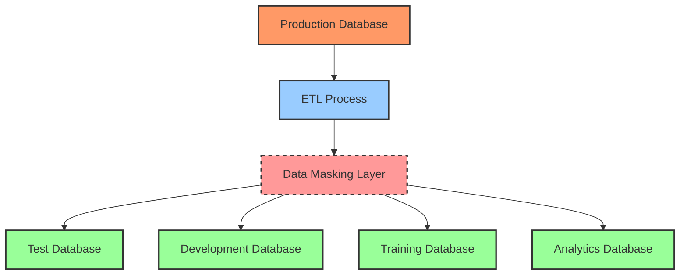

# Data Masking

## Introduction

Data masking is a security technique used to create a structurally similar but inauthentic version of an organization's sensitive data. The primary goal is to protect the actual data while providing a functional alternative for situations such as software testing, user training, or third-party access. 

Think of data masking like creating a realistic movie prop - it looks authentic enough to serve its purpose, but doesn't contain the actual valuable item it represents.

## Why Data Masking Matters

In database security, protecting sensitive information is crucial, especially when:

- Developers need realistic data for testing applications
- Third-party vendors require access to your systems
- Training environments need to mimic production data
- Compliance regulations like GDPR, HIPAA, or PCI DSS must be maintained

Without data masking, organizations often resort to using actual production data in non-production environments, creating significant security and compliance risks.

## Basic Data Masking Techniques

Let's explore some common techniques used in data masking:

### 1. Substitution

Substitution replaces sensitive data with realistic but fake alternatives.

```sql
-- Original data
SELECT customer_id, full_name, credit_card_number 
FROM customers 
LIMIT 3;

-- Output:
-- 101, "Jane Smith", "4532-1542-3214-8743"
-- 102, "John Doe", "5412-8732-1234-5678"
-- 103, "Alice Johnson", "6011-2345-6789-1234"

-- Masked data (after substitution)
SELECT customer_id, full_name, 
       CONCAT(SUBSTRING(credit_card_number, 1, 4), '-XXXX-XXXX-', 
              SUBSTRING(credit_card_number, 16, 4)) AS masked_cc
FROM customers 
LIMIT 3;

-- Output:
-- 101, "Jane Smith", "4532-XXXX-XXXX-8743"
-- 102, "John Doe", "5412-XXXX-XXXX-5678"
-- 103, "Alice Johnson", "6011-XXXX-XXXX-1234"
```

### 2. Shuffling

Shuffling rearranges values within a column across different rows, maintaining distribution and referential integrity.

```sql
-- Original salary data
SELECT employee_id, name, salary 
FROM employees 
LIMIT 5;

-- Output:
-- 1, "Frank Miller", 85000
-- 2, "Susan Jones", 65000
-- 3, "David Kim", 72000
-- 4, "Maria Garcia", 61000
-- 5, "Robert Chen", 93000

-- Masked data (after shuffling)
-- The salaries have been shuffled among employees
SELECT employee_id, name, masked_salary 
FROM masked_employees 
LIMIT 5;

-- Output:
-- 1, "Frank Miller", 72000  -- Different salary
-- 2, "Susan Jones", 93000   -- Different salary
-- 3, "David Kim", 61000     -- Different salary
-- 4, "Maria Garcia", 85000  -- Different salary
-- 5, "Robert Chen", 65000   -- Different salary
```

### 3. Encryption

Encryption transforms data using an algorithm and key, making it unreadable without decryption.

```sql
-- In PostgreSQL, using pgcrypto extension
CREATE EXTENSION IF NOT EXISTS pgcrypto;

-- Original data
SELECT customer_id, email 
FROM customers 
LIMIT 3;

-- Output:
-- 101, "jane.smith@example.com"
-- 102, "john.doe@example.com"
-- 103, "alice.johnson@example.com"

-- Encrypting with a key
SELECT customer_id, 
       encode(encrypt(email::bytea, 'encryption_key', 'aes'), 'hex') AS masked_email
FROM customers 
LIMIT 3;

-- Output:
-- 101, "8a7b3c9d2e1f4a5b6c7d8e9f0a1b2c3d"
-- 102, "5f4e3d2c1b0a9f8e7d6c5b4a3f2e1d0c"
-- 103, "3c4d5e6f7a8b9c0d1e2f3a4b5c6d7e8f"
```

### 4. Nulling Out

Simply replacing sensitive data with NULL values.

```sql
-- Original data
SELECT customer_id, name, social_security_number
FROM customers 
LIMIT 3;

-- Output:
-- 101, "Jane Smith", "123-45-6789"
-- 102, "John Doe", "987-65-4321"
-- 103, "Alice Johnson", "456-78-9012"

-- Masked data
SELECT customer_id, name, NULL AS social_security_number
FROM customers 
LIMIT 3;

-- Output:
-- 101, "Jane Smith", NULL
-- 102, "John Doe", NULL
-- 103, "Alice Johnson", NULL
```

### 5. Randomization

Replacing sensitive data with random values that maintain the same format.

```sql
-- In PostgreSQL
-- Original phone numbers
SELECT customer_id, name, phone_number
FROM customers 
LIMIT 3;

-- Output:
-- 101, "Jane Smith", "(555) 123-4567"
-- 102, "John Doe", "(555) 987-6543"
-- 103, "Alice Johnson", "(555) 456-7890"

-- Masked with randomized phone numbers
SELECT customer_id, name,
       '(' || (FLOOR(RANDOM() * 900) + 100)::TEXT || ') ' ||
       (FLOOR(RANDOM() * 900) + 100)::TEXT || '-' ||
       (FLOOR(RANDOM() * 9000) + 1000)::TEXT AS masked_phone
FROM customers 
LIMIT 3;

-- Output:
-- 101, "Jane Smith", "(347) 281-6392"
-- 102, "John Doe", "(826) 519-2748"
-- 103, "Alice Johnson", "(593) 742-1895"
```

## Implementing Data Masking in Practice

Let's build a simple example of how to implement data masking in a Python application using a popular library called `Faker`:

```python
import sqlite3
import pandas as pd
from faker import Faker

# Initialize Faker
fake = Faker()

# Connect to database
conn = sqlite3.connect('original_database.db')
cursor = conn.cursor()

# Create a new database for the masked data
masked_conn = sqlite3.connect('masked_database.db')
masked_cursor = masked_conn.cursor()

# Copy the schema from the original database
cursor.execute("SELECT sql FROM sqlite_master WHERE type='table'")
tables = cursor.fetchall()

for table in tables:
    masked_cursor.execute(table[0])

# Let's mask a customer table
cursor.execute("SELECT * FROM customers")
columns = [description[0] for description in cursor.description]
data = cursor.fetchall()

# Create masked data
masked_data = []
for row in data:
    masked_row = list(row)
    
    # Find and mask sensitive columns
    email_index = columns.index('email')
    credit_card_index = columns.index('credit_card')
    ssn_index = columns.index('ssn')
    
    # Replace with fake but realistic data
    masked_row[email_index] = fake.email()
    masked_row[credit_card_index] = fake.credit_card_number()
    masked_row[ssn_index] = fake.ssn()
    
    masked_data.append(tuple(masked_row))

# Insert masked data into the new database
placeholders = ', '.join(['?'] * len(columns))
masked_cursor.executemany(
    f"INSERT INTO customers VALUES ({placeholders})",
    masked_data
)

# Commit changes and close connections
masked_conn.commit()
masked_conn.close()
conn.close()

print("Data masking complete!")
```

This script:
1. Connects to your original database
2. Creates a new database with the same schema
3. Reads customer data
4. Replaces sensitive information with realistic fake data
5. Writes the masked data to the new database

## Data Masking Architecture

Data masking can be implemented in different ways within your infrastructure:



## Best Practices for Data Masking

1. **Identify Sensitive Data**: Create a comprehensive inventory of sensitive data in your databases.

2. **Maintain Referential Integrity**: Ensure masked data preserves relationships between tables.

3. **Preserve Data Format and Character**: Masked data should maintain the same format, type, and characteristics as the original.

4. **Irreversibility**: Masking should be irreversible - it should not be possible to derive the original data from the masked version.

5. **Consistency**: If the same value appears in multiple places, consider masking it consistently.

6. **Test Thoroughly**: Validate that applications function correctly with masked data.

7. **Automate the Process**: Build repeatable, automated processes for data masking.

## Real-world Example: Healthcare Database

Consider a healthcare database containing patient information. Here's how we might apply data masking:

| Original Data | Masked Data | Technique Used |
|---------------|-------------|---------------|
| Patient Name: "John Smith" | "Robert Johnson" | Substitution |
| DOB: "1975-06-12" | "1978-03-24" | Randomization (preserving age range) |
| SSN: "123-45-6789" | "XXX-XX-1234" | Partial Redaction |
| Email: "john.smith@email.com" | "masked_user27@example.com" | Substitution |
| Phone: "(555) 123-4567" | "(555) 987-6543" | Randomization |
| Diagnosis: "Type 2 Diabetes" | "Type 2 Diabetes" | Unchanged (not PII) |
| Address: "123 Main St, Boston, MA" | "789 Oak Dr, Boston, MA" | Substitution (preserving city/state) |

This approach allows developers to work with realistic data while protecting patient privacy and maintaining HIPAA compliance.

## SQL Data Masking Functions

Many database systems have built-in functions for data masking. Here's how to use some common ones:

### Oracle Data Redaction

```sql
-- Create a redaction policy in Oracle
BEGIN
  DBMS_REDACT.ADD_POLICY(
    object_schema       => 'HR',
    object_name         => 'EMPLOYEES',
    column_name         => 'SALARY',
    policy_name         => 'MASK_EMPLOYEE_SALARIES',
    function_type       => DBMS_REDACT.PARTIAL,
    function_parameters => '9,1,*,1,5',
    expression          => '1=1'
  );
END;
/

-- This masks the salary as: 9****5 when queried by non-privileged users
```

### SQL Server Dynamic Data Masking

```sql
-- Create a table with masked columns in SQL Server
CREATE TABLE Customers (
    CustomerID INT IDENTITY PRIMARY KEY,
    FirstName VARCHAR(100) MASKED WITH (FUNCTION = 'partial(1,"XXXXXXX",0)') NULL,
    LastName VARCHAR(100) NOT NULL,
    Email VARCHAR(100) MASKED WITH (FUNCTION = 'email()') NULL,
    CreditCard VARCHAR(19) MASKED WITH (FUNCTION = 'partial(0,"XXXX-XXXX-XXXX-",4)') NULL,
    SSN VARCHAR(11) MASKED WITH (FUNCTION = 'default()') NULL
);

-- Insert sample data
INSERT INTO Customers (FirstName, LastName, Email, CreditCard, SSN)
VALUES ('John', 'Doe', 'john.doe@example.com', '4321-8765-9012-3456', '123-45-6789');

-- Regular users will see masked data
-- J******* Doe, mXXX@XXXX.com, XXXX-XXXX-XXXX-3456, XXXXXXXXXXXX
```

## Challenges and Considerations

While implementing data masking, be aware of these common challenges:

1. **Performance Impact**: Masking large datasets can be resource-intensive. Consider incremental masking for very large databases.

2. **Complex Data Relationships**: Maintaining referential integrity across tables can be challenging.

3. **Free-form Text Fields**: These may contain hidden sensitive data and require advanced techniques like Natural Language Processing to identify and mask.

4. **Business Rules Preservation**: Masked data should still behave similarly enough to support application functionality and testing.

5. **Data Aging**: Consider whether masked data should reflect the same temporal patterns as production data.

## Summary

Data masking is an essential technique in database security that balances the need for data privacy with the practical requirements of software development, testing, and third-party access. By replacing sensitive information with realistic but fake data, organizations can:

- Protect personally identifiable information (PII)
- Comply with data privacy regulations
- Reduce the risk of data breaches
- Enable safe use of production-like data in non-production environments

In this guide, we've covered the fundamentals of data masking, including common techniques, implementation approaches, and best practices. As data privacy concerns continue to grow, mastering these techniques becomes increasingly valuable for database professionals and developers.

## Exercises

1. Implement a simple data masking script using Python and the Faker library to mask a CSV file containing customer information.

2. Create a SQL function that masks credit card numbers while preserving the first and last four digits.

3. Design a data masking strategy for a healthcare application that complies with HIPAA regulations.

4. Compare the performance of different masking techniques on a large dataset and document your findings.

5. Implement a consistent masking approach that preserves relationships between a customer table and an orders table.

## Further Reading

- Data Privacy Regulations (GDPR, CCPA, HIPAA)
- Advanced Masking Techniques and Algorithms
- Database-specific Masking Features (Oracle, SQL Server, PostgreSQL)
- Data Anonymization vs. Pseudonymization
- Privacy-Preserving Data Mining