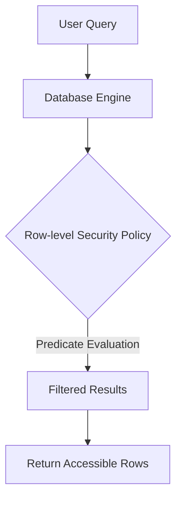

# Row-level Security

## Introduction

Row-level Security (RLS) is a database security feature that allows database administrators to control which users can access specific rows in a database table. Unlike traditional database access controls that operate at the table level, RLS enables more granular security policies by restricting access at the individual row level.

Think of it this way: if traditional database permissions are like allowing someone into a room full of filing cabinets, Row-level Security is like specifying which individual files in those cabinets each person is allowed to open.

## Why Use Row-level Security?

Row-level Security helps organizations:

- **Enhance data protection**: Limit access to sensitive data based on user roles or attributes
- **Implement multi-tenancy**: Allow multiple customers to share the same database tables while keeping their data separate
- **Simplify application code**: Move security logic from the application layer to the database layer
- **Ensure consistent enforcement**: Apply security rules uniformly across all access points to the database

## How Row-level Security Works

RLS works by automatically applying a security predicate to all queries on a protected table. This predicate filters the rows that a user can see or modify.



When Row-level Security is enabled:

1. A user submits a query to access or modify data in a table
2. The database automatically applies the security policy (predicate)
3. Only rows that satisfy the predicate are included in the query results
4. All other rows are invisible to the user, as if they don't exist

## Implementing Row-level Security in PostgreSQL

PostgreSQL provides built-in support for Row-level Security through its `CREATE POLICY` statement. Let's explore how to implement it.

### Step 1: Create a Table

First, let's create a simple table to demonstrate RLS:

```sql
CREATE TABLE customer_data (
    id SERIAL PRIMARY KEY,
    customer_id INTEGER NOT NULL,
    customer_name TEXT NOT NULL,
    email TEXT,
    account_balance DECIMAL(10,2),
    last_login_date TIMESTAMP
);

-- Insert some sample data
INSERT INTO customer_data (customer_id, customer_name, email, account_balance, last_login_date)
VALUES 
    (101, 'Acme Corp', 'contact@acme.com', 5000.00, '2023-05-10 14:30:00'),
    (102, 'Globex Inc', 'info@globex.com', 7500.50, '2023-05-11 09:15:00'),
    (103, 'Smith LLC', 'hello@smith.com', 2300.75, '2023-05-09 16:45:00');
```

### Step 2: Create Database Roles

Next, let's create roles for different users who will access the data:

```sql
-- Create roles for different users
CREATE ROLE acme_user;
CREATE ROLE globex_user;
CREATE ROLE admin_user;

-- Grant usage on the schema and select permission on the table to all roles
GRANT USAGE ON SCHEMA public TO acme_user, globex_user, admin_user;
GRANT SELECT, INSERT, UPDATE, DELETE ON customer_data TO acme_user, globex_user, admin_user;
```

### Step 3: Enable Row-level Security

Now, let's enable RLS on our table:

```sql
-- Enable row-level security on the customer_data table
ALTER TABLE customer_data ENABLE ROW LEVEL SECURITY;
```

### Step 4: Create Security Policies

Next, we'll create policies that determine which rows each role can access:

```sql
-- Create policy for acme_user to see only Acme Corp data
CREATE POLICY acme_data_policy ON customer_data
    FOR ALL
    TO acme_user
    USING (customer_id = 101);

-- Create policy for globex_user to see only Globex Inc data
CREATE POLICY globex_data_policy ON customer_data
    FOR ALL
    TO globex_user
    USING (customer_id = 102);

-- Create policy for admin_user to see all data
CREATE POLICY admin_data_policy ON customer_data
    FOR ALL
    TO admin_user
    USING (true);
```

### Step 5: Test the Policies

Now, let's see how RLS works by testing with different users:

When connected as `acme_user`:

```sql
SET ROLE acme_user;
SELECT * FROM customer_data;
```

Output:
```
 id | customer_id | customer_name |       email       | account_balance |    last_login_date     
----+-------------+---------------+-------------------+-----------------+------------------------
  1 |         101 | Acme Corp     | contact@acme.com  |         5000.00 | 2023-05-10 14:30:00
```

When connected as `globex_user`:

```sql
SET ROLE globex_user;
SELECT * FROM customer_data;
```

Output:
```
 id | customer_id | customer_name |       email      | account_balance |    last_login_date     
----+-------------+---------------+------------------+-----------------+------------------------
  2 |         102 | Globex Inc    | info@globex.com  |         7500.50 | 2023-05-11 09:15:00
```

When connected as `admin_user`:

```sql
SET ROLE admin_user;
SELECT * FROM customer_data;
```

Output:
```
 id | customer_id | customer_name |       email       | account_balance |    last_login_date     
----+-------------+---------------+-------------------+-----------------+------------------------
  1 |         101 | Acme Corp     | contact@acme.com  |         5000.00 | 2023-05-10 14:30:00
  2 |         102 | Globex Inc    | info@globex.com   |         7500.50 | 2023-05-11 09:15:00
  3 |         103 | Smith LLC     | hello@smith.com   |         2300.75 | 2023-05-09 16:45:00
```

## Advanced Row-level Security Features

### Using Current User Functions

Instead of hardcoding customer IDs in policies, we can use database functions to make policies more dynamic:

```sql
-- Create a mapping table to associate database users with customer_ids
CREATE TABLE user_customer_mapping (
    username TEXT PRIMARY KEY,
    customer_id INTEGER NOT NULL
);

-- Insert mappings
INSERT INTO user_customer_mapping VALUES 
    ('acme_user', 101),
    ('globex_user', 102);

-- Create a dynamic policy using the mapping table
CREATE POLICY dynamic_customer_policy ON customer_data
    FOR ALL
    USING (
        customer_id = (
            SELECT customer_id 
            FROM user_customer_mapping 
            WHERE username = current_user
        )
    );
```

### Row-level Security for Different Operations

You can create different policies for different SQL operations:

```sql
-- Separate policies for SELECT, INSERT, UPDATE, and DELETE
CREATE POLICY select_customer_policy ON customer_data
    FOR SELECT
    USING (customer_id = 101);

CREATE POLICY insert_customer_policy ON customer_data
    FOR INSERT
    WITH CHECK (customer_id = 101);

CREATE POLICY update_customer_policy ON customer_data
    FOR UPDATE
    USING (customer_id = 101)
    WITH CHECK (customer_id = 101);

CREATE POLICY delete_customer_policy ON customer_data
    FOR DELETE
    USING (customer_id = 101);
```

## Row-level Security in Other Database Systems

While the syntax differs, many popular database systems support Row-level Security:

### Microsoft SQL Server

```sql
-- Enable RLS in SQL Server
CREATE SECURITY POLICY CustomerFilterPolicy
ADD FILTER PREDICATE dbo.fn_securitypredicate(CustomerID) ON dbo.Customers;
```

### Oracle Database

```sql
-- Enable RLS in Oracle using Virtual Private Database (VPD)
BEGIN
  DBMS_RLS.ADD_POLICY (
    object_schema   => 'app_schema',
    object_name     => 'customer_data',
    policy_name     => 'customer_policy',
    function_schema => 'app_schema',
    policy_function => 'get_customer_predicate',
    statement_types => 'SELECT, INSERT, UPDATE, DELETE'
  );
END;
```

## Real-world Applications

### Multi-tenant SaaS Application

In a Software-as-a-Service (SaaS) application where multiple customers share the same database:

```sql
-- Create a table for customer data in a multi-tenant application
CREATE TABLE customer_records (
    id SERIAL PRIMARY KEY,
    tenant_id INTEGER NOT NULL,
    record_name TEXT NOT NULL,
    record_data JSONB
);

-- Enable RLS
ALTER TABLE customer_records ENABLE ROW LEVEL SECURITY;

-- Create a policy that restricts access based on tenant_id
CREATE POLICY tenant_isolation_policy ON customer_records
    FOR ALL
    USING (tenant_id = current_setting('app.current_tenant_id')::INTEGER);

-- In your application code, set the tenant context before queries
-- PostgreSQL example:
SELECT set_config('app.current_tenant_id', '42', false);
```

### Healthcare Data System

In a healthcare application managing patient records with strict privacy requirements:

```sql
-- Create a table for patient records
CREATE TABLE patient_records (
    id SERIAL PRIMARY KEY,
    patient_id INTEGER NOT NULL,
    doctor_id INTEGER NOT NULL,
    diagnosis TEXT,
    treatment TEXT,
    notes TEXT
);

-- Enable RLS
ALTER TABLE patient_records ENABLE ROW LEVEL SECURITY;

-- Doctors can only see their own patients
CREATE POLICY doctor_policy ON patient_records
    FOR SELECT
    USING (doctor_id = current_setting('app.current_doctor_id')::INTEGER);

-- Patients can only see their own records
CREATE POLICY patient_policy ON patient_records
    FOR SELECT
    USING (patient_id = current_setting('app.current_patient_id')::INTEGER);
```

## Performance Considerations

While Row-level Security enhances data protection, it can impact performance:

1. **Query complexity**: RLS adds predicates to queries, potentially making them more complex
2. **Optimization challenges**: Some query optimizers may struggle with RLS predicates
3. **Index usage**: Ensure proper indexing on columns used in RLS policies
4. **Cached queries**: Be aware that query caching might be less effective with RLS

To mitigate performance issues:

```sql
-- Create indexes on columns used in security policies
CREATE INDEX idx_customer_data_customer_id ON customer_data(customer_id);
```

## Common Pitfalls and Limitations

1. **Superusers bypass RLS**: In PostgreSQL, superusers bypass RLS by default
   ```sql
   -- Force superusers to obey RLS
   ALTER TABLE customer_data FORCE ROW LEVEL SECURITY;
   ```

2. **Table owners bypass RLS**: Table owners may also bypass RLS unless explicitly prevented
   
3. **Data leakage through joins**: Be careful with joins to tables without RLS
   
4. **Function execution context**: Functions might execute with the privileges of their creator rather than the caller

5. **Application roles**: If your application uses a single database role for all connections, RLS based on database roles won't work effectively

## Summary

Row-level Security provides a powerful mechanism for implementing fine-grained access control directly at the database level. By moving security logic from the application to the database, you can ensure consistent enforcement of security policies across all access paths.

Key takeaways:

- RLS restricts which rows users can see or modify based on defined policies
- Policies can be dynamic, using functions and current user context
- Different policies can be applied for different operations (SELECT, INSERT, UPDATE, DELETE)
- RLS is available in most major database systems but with different syntax
- Consider performance implications when implementing RLS in production systems

## Exercises

1. Create a table with sensitive information and implement RLS to restrict access based on department.
2. Modify the policies to allow managers to see data from all departments.
3. Implement dynamic RLS using a user-to-department mapping table.
4. Test your policies with different user roles to verify they work as expected.
5. Create separate policies for different operations (SELECT vs UPDATE).

## Additional Resources

- PostgreSQL Documentation on RLS
- Microsoft SQL Server Security Guide
- Oracle Virtual Private Database Documentation
- Database Security Best Practices