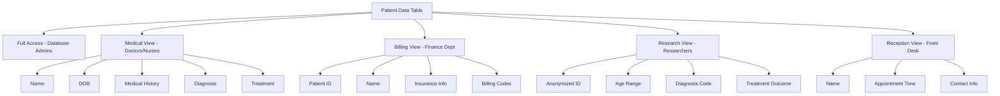

# Column-level Security

## Introduction

Column-level security is a crucial database security mechanism that allows database administrators to control access to specific columns within database tables. Unlike table-level security, which restricts access to entire tables, column-level security provides finer granularity by allowing certain users to view some columns while restricting access to others within the same table.

This approach is particularly valuable when tables contain a mix of sensitive and non-sensitive information. For example, a customer table might include both basic contact information and sensitive data like credit card numbers or social security numbers.

## Why Column-level Security Matters

Implementing column-level security helps organizations:

1. **Comply with data privacy regulations** like GDPR, HIPAA, or CCPA
2. **Follow the principle of least privilege** by giving users access only to the data they need
3. **Protect sensitive information** without redesigning database schemas
4. **Maintain data integrity** while still allowing necessary access

## Common Implementation Methods

Let's explore the most common methods for implementing column-level security across different database systems.

### 1. Views

One of the simplest approaches to column-level security is creating database views that include only the columns users are permitted to access.

#### Example: Creating a View for HR Staff

```sql
-- Original employees table with sensitive data
CREATE TABLE employees (
    employee_id INT PRIMARY KEY,
    first_name VARCHAR(50),
    last_name VARCHAR(50),
    email VARCHAR(100),
    phone VARCHAR(20),
    salary DECIMAL(10,2),
    ssn VARCHAR(11),
    performance_rating INT
);

-- Create a view for general staff that excludes sensitive columns
CREATE VIEW employees_general AS
SELECT 
    employee_id,
    first_name,
    last_name,
    email,
    phone
FROM employees;

-- Create a view for HR staff that includes salary but not SSN
CREATE VIEW employees_hr AS
SELECT 
    employee_id,
    first_name,
    last_name,
    email,
    phone,
    salary,
    performance_rating
FROM employees;

-- Only database admins can access the full table with SSN information
```

After creating these views, you would grant different user groups access to the appropriate view:

```sql
-- Grant access to general staff
GRANT SELECT ON employees_general TO general_staff_role;

-- Grant access to HR personnel
GRANT SELECT ON employees_hr TO hr_role;
```

### 2. Row-and-Column Access Control (RCAC)

Modern database systems like PostgreSQL, Oracle, SQL Server, and DB2 offer built-in row and column level security mechanisms.

#### Example: Using PostgreSQL's Column Privileges

```sql
-- Create a table with sensitive data
CREATE TABLE patient_records (
    patient_id SERIAL PRIMARY KEY,
    name VARCHAR(100),
    date_of_birth DATE,
    address VARCHAR(200),
    medical_condition VARCHAR(200),
    treatment_plan TEXT,
    billing_info JSONB
);

-- Create roles for different staff types
CREATE ROLE medical_staff;
CREATE ROLE billing_staff;

-- Grant column-specific privileges
GRANT SELECT (patient_id, name, date_of_birth, medical_condition, treatment_plan) 
ON patient_records TO medical_staff;

GRANT SELECT (patient_id, name, date_of_birth, address, billing_info)
ON patient_records TO billing_staff;
```

### 3. Dynamic Data Masking

Some database systems provide dynamic data masking, which doesn't restrict access to columns but instead masks sensitive data for unauthorized users.

#### Example: Using SQL Server's Dynamic Data Masking

```sql
-- Create a table with masked columns
CREATE TABLE customers (
    customer_id INT PRIMARY KEY,
    name VARCHAR(100),
    email VARCHAR(100) MASKED WITH (FUNCTION = 'email()'),
    credit_card VARCHAR(19) MASKED WITH (FUNCTION = 'partial(0, "XXXX-XXXX-XXXX-", 4)'),
    phone_number VARCHAR(15) MASKED WITH (FUNCTION = 'default()')
);

-- Create roles
CREATE ROLE general_users;
CREATE ROLE financial_analysts;

-- Grant SELECT to general users (they'll see masked data)
GRANT SELECT ON customers TO general_users;

-- Grant UNMASK permission to financial analysts
GRANT UNMASK TO financial_analysts;
```

With this setup:
- General users will see masked data: `email: aXXX@XXXX.com`, `credit_card: XXXX-XXXX-XXXX-1234`
- Financial analysts with UNMASK permission will see the actual data

## Implementation in Popular Database Systems

Different database systems implement column-level security with varying approaches:

### MySQL

MySQL implements column privileges directly:

```sql
-- Grant select access to specific columns
GRANT SELECT (customer_id, name, email) ON database.customers TO 'app_user'@'localhost';
```

### Oracle Database

Oracle uses Virtual Private Database (VPD) or Oracle Label Security:

```sql
-- Create a policy function
CREATE OR REPLACE FUNCTION auth_cols(
    schema_name IN VARCHAR2,
    table_name IN VARCHAR2
)
RETURN VARCHAR2
AS
BEGIN
    IF (SYS_CONTEXT('USERENV', 'SESSION_USER') = 'HR_CLERK') THEN
        RETURN 'employee_id,first_name,last_name,email,department_id';
    ELSE
        RETURN NULL; -- Full access for other users
    END IF;
END;
/

-- Apply the policy
BEGIN
    DBMS_RLS.ADD_POLICY(
        object_schema => 'HR',
        object_name => 'EMPLOYEES',
        policy_name => 'EMPLOYEES_COL_POLICY',
        policy_function => 'AUTH_COLS',
        sec_relevant_cols => 'salary,commission_pct,manager_id',
        sec_relevant_cols_opt => DBMS_RLS.ALL_ROWS
    );
END;
/
```

### MongoDB

For NoSQL databases like MongoDB, column-level security is implemented through projection:

```javascript
// Create a role with specific field access
db.createRole({
    role: "readRestrictedData",
    privileges: [{
        resource: { db: "mydb", collection: "users" },
        actions: ["find"]
    }],
    roles: []
})

// Define a view that restricts columns
db.createView(
    "users_safe",
    "users",
    [{ $project: { username: 1, email: 1, firstName: 1, lastName: 1, _id: 1 } }]
)

// Grant access to the view
db.grantPrivilegesToRole(
    "readRestrictedData",
    [{ resource: { db: "mydb", collection: "users_safe" }, actions: ["find"] }]
)
```

## Best Practices

To implement effective column-level security:

1. **Identify sensitive data** - Classify your data to determine which columns contain sensitive information.

2. **Document access policies** - Clearly document which roles should have access to which columns.

3. **Regularly audit access** - Monitor who is accessing sensitive columns and review permissions regularly.

4. **Layer security measures** - Combine column-level security with other security measures like encryption and row-level security.

5. **Consider performance impact** - Some column-level security implementations can impact query performance, so test thoroughly.

6. **Implement query analysis** - Set up monitoring to detect attempts to access restricted columns.

7. **Train your team** - Ensure developers and administrators understand the importance of respecting column-level restrictions.

## Real-world Example: Healthcare Database

Let's look at a practical example of implementing column-level security in a healthcare database system.



### Implementation in SQL

```sql
-- Create the main patients table
CREATE TABLE patients (
    patient_id SERIAL PRIMARY KEY,
    mrn VARCHAR(20) UNIQUE,
    first_name VARCHAR(50),
    last_name VARCHAR(50),
    dob DATE,
    address TEXT,
    phone VARCHAR(15),
    email VARCHAR(100),
    ssn VARCHAR(11),
    insurance_provider VARCHAR(50),
    insurance_id VARCHAR(30),
    primary_diagnosis TEXT,
    treatment_plan TEXT,
    medication_list TEXT,
    billing_status VARCHAR(20),
    payment_info JSONB,
    consent_research BOOLEAN
);

-- Create role-specific views
-- Medical staff view
CREATE VIEW patients_medical AS
SELECT 
    patient_id, mrn, first_name, last_name, dob,
    phone, email, primary_diagnosis, treatment_plan, medication_list
FROM patients;

-- Billing department view
CREATE VIEW patients_billing AS
SELECT 
    patient_id, mrn, first_name, last_name,
    insurance_provider, insurance_id, billing_status, payment_info
FROM patients;

-- Researchers view (anonymized)
CREATE VIEW patients_research AS
SELECT 
    patient_id % 10000 AS research_id, -- Anonymized ID
    DATE_PART('year', AGE(CURRENT_DATE, dob))/10*10 AS age_range, -- Age in decades
    primary_diagnosis, treatment_plan, 
    consent_research
FROM patients
WHERE consent_research = TRUE;

-- Reception desk view
CREATE VIEW patients_reception AS
SELECT 
    patient_id, mrn, first_name, last_name,
    phone, email, address
FROM patients;

-- Assign permissions
GRANT SELECT ON patients_medical TO role_medical_staff;
GRANT SELECT ON patients_billing TO role_billing_staff;
GRANT SELECT ON patients_research TO role_researchers;
GRANT SELECT ON patients_reception TO role_reception;
```

## Troubleshooting Common Issues

When implementing column-level security, you might encounter these common challenges:

### 1. Application Layer Bypass

**Problem**: Applications accessing the database might have hardcoded queries that bypass security measures.

**Solution**: Use application roles with limited privileges and ensure all database access goes through secure, parameterized queries.

### 2. Performance Degradation

**Problem**: Excessive view usage or complex security policies can impact performance.

**Solution**: Benchmark your queries, consider materialized views where appropriate, and optimize your security policies.

### 3. Privilege Escalation

**Problem**: Users might gain access to columns through indirect means, such as functions or procedures.

**Solution**: Regularly audit all database objects and ensure they operate with proper permission checks.

## Summary

Column-level security provides granular access control to protect sensitive data within your database tables. By implementing column-level security, you can:

- Protect sensitive data from unauthorized access
- Comply with data privacy regulations
- Follow the principle of least privilege
- Maintain data integrity

The most common implementation methods include:
- Using database views
- Applying native column-level permissions
- Implementing dynamic data masking
- Utilizing row and column access control features

Remember that column-level security should be part of a comprehensive security strategy that includes authentication, encryption, auditing, and other security measures.

## Exercises

1. Create a `customers` table with sensitive information and implement column-level security to restrict access to credit card and social security numbers.

2. Implement dynamic data masking for a user table to hide full email addresses and phone numbers from general users.

3. Design a role-based access control system for a school database that restricts access to student grades based on teacher roles.

4. Create a column-level security policy that allows accounting to see employee salaries but not personal contact information, while allowing HR to see both.

5. Implement column-level security in a NoSQL database using document projections.

## Additional Resources

- Your database vendor's security documentation
- OWASP Database Security Cheat Sheet
- Data privacy regulation guidelines (GDPR, HIPAA, etc.)
- Database security certification courses