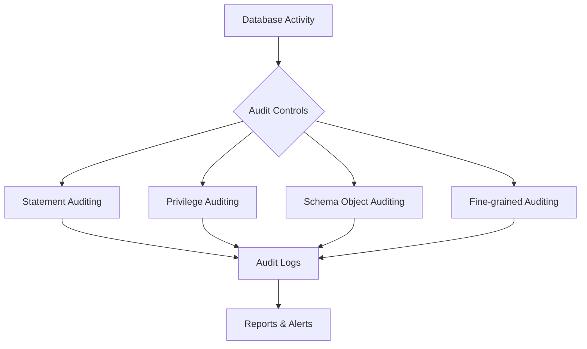

# Auditing Database Activities

## Introduction

Database auditing is a security measure that tracks and logs database activities to maintain data integrity, enhance security, and meet regulatory compliance requirements. By implementing database auditing, you can monitor who accessed your database, what changes they made, and when these actions occurred. This is especially crucial for applications handling sensitive information like financial data, personal information, or healthcare records.

In this tutorial, we'll explore the fundamentals of database auditing, how to set it up in various database management systems, and best practices for effective implementation.

## Why Audit Database Activities?

Database auditing serves several important purposes:

1. **Security Enhancement**: Detect suspicious activities and potential security breaches
2. **Compliance Requirements**: Meet regulatory standards like GDPR, HIPAA, or SOX
3. **Accountability**: Track who performed what actions in the database
4. **Forensic Analysis**: Investigate incidents after they occur
5. **Performance Monitoring**: Identify resource-intensive queries

## Types of Database Auditing

Before diving into implementation, let's understand the different types of auditing:

### 1. Statement Auditing

Monitors SQL statements executed against the database.

### 2. Privilege Auditing

Tracks usage of system privileges like CREATE TABLE, ALTER USER, etc.

### 3. Schema Object Auditing

Records operations performed on specific database objects.

### 4. Fine-grained Auditing

Provides detailed auditing policies based on content or context conditions.

Let's visualize how these different auditing types work together:



## Setting Up Database Auditing

Let's explore how to implement auditing in some popular database systems.

### MySQL Auditing

MySQL offers auditing through its Enterprise Audit plugin. Here's how to enable it:

```sql
-- Install the audit plugin
INSTALL PLUGIN audit_log SONAME 'audit_log.so';

-- Configure audit logging
SET GLOBAL audit_log_format = 'JSON';
SET GLOBAL audit_log_policy = 'ALL';
```

You can also configure MySQL auditing in the configuration file:

```
[mysqld]
audit_log=FORCE_PLUS_PERMANENT
audit_log_format=JSON
audit_log_policy=ALL
```

### PostgreSQL Auditing

PostgreSQL provides auditing capabilities through its built-in logging features and extensions.

Basic logging configuration in `postgresql.conf`:

```
# Enable logging
log_statement = 'all'           # Log all SQL statements
log_destination = 'csvlog'      # Log format
logging_collector = on          # Enable log collection
log_directory = 'pg_log'        # Directory for log files
log_filename = 'postgresql-%Y-%m-%d_%H%M%S.log' # Log file name pattern
```

For more comprehensive auditing, you can use the `pgAudit` extension:

```sql
-- Install pgAudit extension
CREATE EXTENSION pgaudit;

-- Configure session auditing
ALTER SYSTEM SET pgaudit.log = 'write, ddl';
ALTER SYSTEM SET pgaudit.log_catalog = on;

-- Reload configuration
SELECT pg_reload_conf();
```

### SQL Server Auditing

SQL Server provides a robust auditing framework:

```sql
-- Create server audit
CREATE SERVER AUDIT DataAccessAudit
TO FILE (FILEPATH = 'C:\SQLAudit\')
WITH (ON_FAILURE = CONTINUE);

-- Enable the audit
ALTER SERVER AUDIT DataAccessAudit
WITH (STATE = ON);

-- Create database audit specification
USE YourDatabase;
CREATE DATABASE AUDIT SPECIFICATION UserActivityAudit
FOR SERVER AUDIT DataAccessAudit
ADD (SELECT, INSERT, UPDATE, DELETE ON SCHEMA::dbo BY public)
WITH (STATE = ON);
```

### Oracle Database Auditing

Oracle provides comprehensive auditing capabilities:

```sql
-- Enable unified auditing
ALTER SYSTEM SET AUDIT_TRAIL=DB, EXTENDED SCOPE=SPFILE;

-- Create audit policy
CREATE AUDIT POLICY data_access_policy
ACTIONS SELECT, INSERT, UPDATE, DELETE ON schema.table_name;

-- Enable audit policy
AUDIT POLICY data_access_policy;
```

## Example: Creating a Comprehensive Audit Strategy

Let's walk through a complete example of implementing auditing for a banking application database:

1. **Identify sensitive tables**:

```sql
-- These tables contain sensitive information
CREATE TABLE customers (
    customer_id INT PRIMARY KEY,
    name VARCHAR(100),
    ssn VARCHAR(11),  -- Sensitive personal data
    credit_score INT  -- Sensitive financial data
);

CREATE TABLE transactions (
    transaction_id INT PRIMARY KEY,
    customer_id INT,
    amount DECIMAL(15,2),
    transaction_date DATETIME,
    FOREIGN KEY (customer_id) REFERENCES customers(customer_id)
);
```

2. **Create audit tables**:

```sql
CREATE TABLE audit_log (
    audit_id INT AUTO_INCREMENT PRIMARY KEY,
    table_name VARCHAR(100),
    operation VARCHAR(10),
    record_id INT,
    changed_fields TEXT,
    old_values TEXT,
    new_values TEXT,
    user_id VARCHAR(50),
    client_ip VARCHAR(15),
    timestamp DATETIME
);
```

3. **Create audit triggers**:

```sql
DELIMITER //
CREATE TRIGGER customers_audit_trigger
AFTER UPDATE ON customers
FOR EACH ROW
BEGIN
    DECLARE changed VARCHAR(1000);
    DECLARE old_vals VARCHAR(1000);
    DECLARE new_vals VARCHAR(1000);
    
    SET changed = '';
    SET old_vals = '';
    SET new_vals = '';
    
    IF NEW.name != OLD.name THEN
        SET changed = CONCAT(changed, 'name,');
        SET old_vals = CONCAT(old_vals, OLD.name, ',');
        SET new_vals = CONCAT(new_vals, NEW.name, ',');
    END IF;
    
    IF NEW.credit_score != OLD.credit_score THEN
        SET changed = CONCAT(changed, 'credit_score,');
        SET old_vals = CONCAT(old_vals, OLD.credit_score, ',');
        SET new_vals = CONCAT(new_vals, NEW.credit_score, ',');
    END IF;
    
    -- Skip auditing if nothing changed
    IF LENGTH(changed) > 0 THEN
        INSERT INTO audit_log (
            table_name, operation, record_id, 
            changed_fields, old_values, new_values,
            user_id, client_ip, timestamp
        ) VALUES (
            'customers', 'UPDATE', NEW.customer_id,
            changed, old_vals, new_vals,
            CURRENT_USER(), (SELECT host FROM information_schema.processlist WHERE id = CONNECTION_ID()),
            NOW()
        );
    END IF;
END //
DELIMITER ;
```

4. **Test the audit functionality**:

```sql
-- Before update
SELECT * FROM customers WHERE customer_id = 101;
-- Result: 
-- customer_id | name        | ssn         | credit_score
-- 101         | John Smith  | 123-45-6789 | 720

-- Perform update
UPDATE customers SET credit_score = 750 WHERE customer_id = 101;

-- Check audit log
SELECT * FROM audit_log;
-- Result:
-- audit_id | table_name | operation | record_id | changed_fields | old_values | new_values | user_id | client_ip    | timestamp
-- 1        | customers  | UPDATE    | 101       | credit_score,  | 720,       | 750,       | admin   | 192.168.1.10 | 2023-06-15 14:32:45
```

## Analyzing Audit Data

Collecting audit data is just the first step. The real value comes from analyzing this data to detect security issues or compliance violations.

### Creating Audit Reports

```sql
-- Report of all activities by a specific user
SELECT 
    table_name,
    operation,
    COUNT(*) as operation_count
FROM 
    audit_log
WHERE 
    user_id = 'admin' AND
    timestamp BETWEEN '2023-06-01' AND '2023-06-30'
GROUP BY 
    table_name, operation
ORDER BY 
    operation_count DESC;

-- Report of after-hours activities
SELECT 
    user_id,
    COUNT(*) as suspicious_activities
FROM 
    audit_log
WHERE 
    HOUR(timestamp) NOT BETWEEN 9 AND 17 AND
    DAYOFWEEK(timestamp) BETWEEN 2 AND 6
GROUP BY 
    user_id
HAVING 
    COUNT(*) > 5;
```

### Setting Up Alerts

You can create scheduled jobs or triggers that send alerts when suspicious activities are detected:

```sql
DELIMITER //
CREATE PROCEDURE check_suspicious_activity()
BEGIN
    DECLARE suspicious_count INT;
    
    -- Check for multiple failed logins
    SELECT COUNT(*) INTO suspicious_count
    FROM audit_log
    WHERE operation = 'LOGIN_FAILED'
    AND timestamp > DATE_SUB(NOW(), INTERVAL 1 HOUR)
    AND user_id = 'admin';
    
    IF suspicious_count > 5 THEN
        -- In a real system, this would send an email or notification
        INSERT INTO alert_log (alert_type, message, timestamp)
        VALUES ('SUSPICIOUS_LOGIN', 'Multiple failed login attempts for admin', NOW());
    END IF;
END //
DELIMITER ;
```

## Best Practices for Database Auditing

1. **Determine What to Audit**: Audit only what's necessary to avoid performance issues and storage bloat

2. **Separate Audit Logs**: Store audit data in a separate database or schema

3. **Protect Audit Logs**: Ensure audit logs themselves are secure from tampering

4. **Retention Policy**: Define how long to store audit data based on compliance requirements

5. **Regular Monitoring**: Set up automated analysis and alerts for suspicious activities

6. **Performance Considerations**: Balance comprehensive auditing with database performance

7. **Documentation**: Document your auditing strategy, including what's being audited and why

## Real-world Application: Healthcare Database Auditing

Healthcare applications must comply with regulations like HIPAA, which require tracking who accessed patient information.

```sql
-- Creating a healthcare audit policy
CREATE AUDIT POLICY patient_data_access_policy
ACTIONS SELECT, UPDATE ON patients_schema.medical_records;

-- Enable the policy for all users
AUDIT POLICY patient_data_access_policy BY users;

-- Sample audit report query for HIPAA compliance
SELECT
    al.user_id,
    p.patient_name,
    al.operation,
    al.timestamp
FROM
    audit_log al
JOIN
    patients p ON al.record_id = p.patient_id
WHERE
    al.table_name = 'medical_records' AND
    al.timestamp BETWEEN '2023-01-01' AND '2023-12-31'
ORDER BY
    al.timestamp DESC;
```

## Summary

Database auditing is an essential component of a comprehensive database security strategy. It helps organizations:

- Track access to sensitive data
- Detect unauthorized activities
- Meet regulatory compliance requirements
- Investigate security incidents

By implementing proper auditing mechanisms, you can significantly enhance the security of your database systems while ensuring accountability for all database operations.

## Additional Resources and Exercises

### Resources
- Oracle Database Security Guide
- MySQL Enterprise Audit documentation
- SQL Server Auditing documentation
- PostgreSQL pgAudit extension documentation

### Exercises

1. Set up basic statement auditing in your preferred database system
2. Create custom audit tables and triggers for a table with sensitive information
3. Write queries to analyze audit logs for suspicious patterns
4. Develop a complete auditing strategy for a fictional e-commerce application
5. Research compliance requirements (like GDPR or HIPAA) and implement appropriate auditing to meet them

Remember that effective database auditing is about finding the right balance between security, compliance, and performance. Start with a clear understanding of your requirements, implement appropriate controls, and regularly review your audit data for potential security issues.