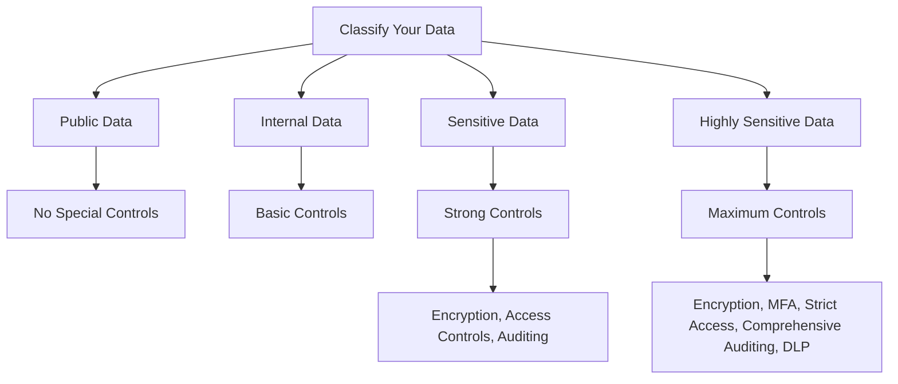
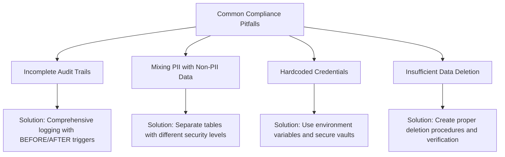

# Compliance Requirements in Database Security

## Introduction

Database security isn't just about implementing technical measures—it's also about adhering to established laws, regulations, and industry standards. Compliance requirements provide a framework that organizations must follow to ensure their database systems properly protect sensitive information. For beginners in programming and database management, understanding these compliance aspects is just as important as learning the technical implementation details.

This guide will walk you through the essential compliance requirements in database security, explaining what they are, why they matter, and how you can implement them in your projects.

## Why Compliance Matters

Before diving into specific requirements, let's understand why compliance is critical:

1. **Legal obligations**: Organizations face legal consequences if they fail to protect data according to applicable laws.
2. **Customer trust**: Demonstrating compliance builds confidence among users that their data is safe.
3. **Business protection**: Compliance frameworks help prevent data breaches and associated costs.
4. **Global operations**: Different regions have different requirements, and compliance enables global business.

## Key Database Compliance Regulations

### GDPR (General Data Protection Regulation)

The GDPR is a comprehensive data protection law that applies to organizations handling the personal data of EU residents.

#### Key Database Requirements:

- **Right to Access**: Users can request all data you store about them
- **Right to be Forgotten**: Users can request deletion of their data
- **Data Portability**: Users can request their data in a common format
- **Privacy by Design**: Security must be built into database systems from the start

#### Example: Implementing "Right to be Forgotten"

```sql
-- Create a procedure to handle GDPR deletion requests
CREATE PROCEDURE delete_user_data(user_id INT)
BEGIN
    -- Start transaction to ensure all or nothing is deleted
    START TRANSACTION;
    
    -- Delete user's personal data
    DELETE FROM user_profiles WHERE user_id = user_id;
    DELETE FROM user_preferences WHERE user_id = user_id;
    
    -- Anonymize data in tables where complete deletion isn't possible
    UPDATE user_transactions 
    SET user_name = 'ANONYMIZED', 
        email = 'ANONYMIZED', 
        address = 'ANONYMIZED'
    WHERE user_id = user_id;
    
    -- Insert record of deletion for compliance auditing
    INSERT INTO compliance_log (action, user_id, timestamp, notes)
    VALUES ('GDPR_DELETE_REQUEST', user_id, NOW(), 'User data deleted or anonymized');
    
    COMMIT;
END;
```

### HIPAA (Health Insurance Portability and Accountability Act)

HIPAA regulates the use and disclosure of Protected Health Information (PHI) in the United States.

#### Key Database Requirements:

- **Access Controls**: Limit database access to authorized personnel
- **Audit Controls**: Track all database activities and access
- **Integrity Controls**: Ensure data isn't altered improperly
- **Transmission Security**: Encrypt data during transmission

#### Example: Implementing HIPAA Audit Logging

```sql
-- Create a trigger for audit logging of patient data access
CREATE TRIGGER patient_data_access_log
AFTER SELECT ON patient_records
FOR EACH ROW
BEGIN
    INSERT INTO hipaa_audit_log 
    (user_id, action, record_id, timestamp, access_location)
    VALUES 
    (CURRENT_USER(), 'SELECT', NEW.patient_id, NOW(), CONNECTION_ID());
END;
```

### PCI DSS (Payment Card Industry Data Security Standard)

PCI DSS applies to organizations that handle credit card information.

#### Key Database Requirements:

- **Encryption**: Sensitive cardholder data must be encrypted
- **Access Restriction**: Strict access control to cardholder data
- **Regular Testing**: Penetration testing and vulnerability scanning
- **Monitoring**: Continuous monitoring of access to network and data

#### Example: Implementing PCI DSS Encryption

```sql
-- Example of how to store encrypted credit card data
-- First, create a table with encrypted fields
CREATE TABLE payment_info (
    id INT PRIMARY KEY AUTO_INCREMENT,
    customer_id INT NOT NULL,
    cardholder_name VARCHAR(255) NOT NULL,
    card_number_encrypted VARBINARY(255),
    expiration_date_encrypted VARBINARY(255),
    cvv_encrypted VARBINARY(255),
    date_added TIMESTAMP DEFAULT CURRENT_TIMESTAMP,
    FOREIGN KEY (customer_id) REFERENCES customers(id)
);

-- Then use encryption functions when inserting data
INSERT INTO payment_info 
(customer_id, cardholder_name, card_number_encrypted, expiration_date_encrypted, cvv_encrypted)
VALUES 
(
    1001, 
    'John Smith', 
    AES_ENCRYPT('4111-1111-1111-1111', 'encryption_key'), 
    AES_ENCRYPT('12/25', 'encryption_key'), 
    AES_ENCRYPT('123', 'encryption_key')
);

-- When retrieving, decrypt the data
SELECT 
    customer_id, 
    cardholder_name, 
    AES_DECRYPT(card_number_encrypted, 'encryption_key') as card_number,
    AES_DECRYPT(expiration_date_encrypted, 'encryption_key') as expiration_date
FROM payment_info
WHERE customer_id = 1001;
```

> **Important Note**: In a real production environment, never store the encryption key in your code or database. Use a secure key management system instead.

## Implementing Compliance in Your Database Systems

### 1. Data Classification

Before implementing security controls, you need to classify your data based on sensitivity levels:



### 2. Role-Based Access Control (RBAC)

Implement RBAC to limit database access based on job roles:

```sql
-- Create database roles
CREATE ROLE 'readonly_user';
CREATE ROLE 'data_analyst';
CREATE ROLE 'database_admin';

-- Grant appropriate permissions
GRANT SELECT ON app_database.* TO 'readonly_user';

GRANT SELECT, CREATE TEMPORARY TABLES ON app_database.* TO 'data_analyst';
GRANT SELECT ON app_database.pii_table TO 'data_analyst';

GRANT ALL PRIVILEGES ON app_database.* TO 'database_admin';

-- Assign roles to users
GRANT 'readonly_user' TO 'intern'@'localhost';
GRANT 'data_analyst' TO 'analyst'@'localhost';
GRANT 'database_admin' TO 'dba'@'localhost';
```

### 3. Audit Trail Implementation

Create comprehensive audit trails:

```sql
-- Create an audit table
CREATE TABLE audit_log (
    log_id INT AUTO_INCREMENT PRIMARY KEY,
    user_id VARCHAR(50) NOT NULL,
    action VARCHAR(50) NOT NULL,
    table_name VARCHAR(50) NOT NULL,
    record_id INT NOT NULL,
    old_value TEXT,
    new_value TEXT,
    timestamp DATETIME DEFAULT CURRENT_TIMESTAMP,
    client_ip VARCHAR(50),
    application VARCHAR(100)
);

-- Create a trigger for UPDATE operations
DELIMITER //
CREATE TRIGGER users_update_audit
AFTER UPDATE ON users
FOR EACH ROW
BEGIN
    INSERT INTO audit_log 
    (user_id, action, table_name, record_id, old_value, new_value, client_ip, application)
    VALUES 
    (
        CURRENT_USER(), 
        'UPDATE', 
        'users', 
        NEW.id, 
        JSON_OBJECT('name', OLD.name, 'email', OLD.email, 'status', OLD.status), 
        JSON_OBJECT('name', NEW.name, 'email', NEW.email, 'status', NEW.status), 
        CONNECTION_ID(), 
        'db_app'
    );
END//
DELIMITER ;
```

### 4. Data Retention and Deletion Policies

Implement automated processes for data retention compliance:

```sql
-- Create a scheduled event to anonymize old data
DELIMITER //
CREATE EVENT anonymize_old_data
ON SCHEDULE EVERY 1 DAY
DO
BEGIN
    -- Anonymize user data older than retention period (e.g., 7 years)
    UPDATE users 
    SET 
        name = CONCAT('Former User ', id),
        email = CONCAT('anonymous_', id, '@example.com'),
        address = 'ANONYMIZED',
        phone = 'ANONYMIZED'
    WHERE last_activity_date < DATE_SUB(NOW(), INTERVAL 7 YEAR);
    
    -- Log the anonymization action
    INSERT INTO compliance_log (action, affected_rows, timestamp, notes)
    VALUES ('DATA_RETENTION_CLEANUP', ROW_COUNT(), NOW(), 'Anonymized user data beyond retention period');
END//
DELIMITER ;
```

## Real-World Application: Building a Compliance-Ready Database

Let's put everything together with a practical example of a customer database that meets various compliance requirements:

```sql
-- Create a schema with compliance in mind
CREATE DATABASE secure_customer_db;
USE secure_customer_db;

-- Create tables with appropriate security features
CREATE TABLE customers (
    id INT AUTO_INCREMENT PRIMARY KEY,
    first_name VARCHAR(50) NOT NULL,
    last_name VARCHAR(50) NOT NULL,
    date_of_birth DATE,
    email VARCHAR(100) UNIQUE NOT NULL,
    phone VARCHAR(20),
    address TEXT,
    consent_timestamp DATETIME,
    marketing_consent BOOLEAN DEFAULT FALSE,
    data_processing_consent BOOLEAN DEFAULT FALSE,
    last_updated TIMESTAMP DEFAULT CURRENT_TIMESTAMP ON UPDATE CURRENT_TIMESTAMP,
    created_at TIMESTAMP DEFAULT CURRENT_TIMESTAMP
);

-- Create table for storing consent history (GDPR requirement)
CREATE TABLE consent_log (
    id INT AUTO_INCREMENT PRIMARY KEY,
    customer_id INT NOT NULL,
    consent_type ENUM('marketing', 'data_processing', 'cookies', 'third_party') NOT NULL,
    consent_given BOOLEAN NOT NULL,
    ip_address VARCHAR(50) NOT NULL,
    user_agent TEXT,
    timestamp DATETIME DEFAULT CURRENT_TIMESTAMP,
    FOREIGN KEY (customer_id) REFERENCES customers(id)
);

-- Create comprehensive audit log
CREATE TABLE access_log (
    id INT AUTO_INCREMENT PRIMARY KEY,
    user_id VARCHAR(100) NOT NULL,
    action ENUM('SELECT', 'INSERT', 'UPDATE', 'DELETE') NOT NULL,
    table_name VARCHAR(100) NOT NULL,
    record_id INT,
    timestamp DATETIME DEFAULT CURRENT_TIMESTAMP,
    client_ip VARCHAR(50),
    success BOOLEAN DEFAULT TRUE
);

-- Set up encryption for sensitive data
CREATE TABLE payment_methods (
    id INT AUTO_INCREMENT PRIMARY KEY,
    customer_id INT NOT NULL,
    payment_type ENUM('credit_card', 'bank_account') NOT NULL,
    payment_details VARBINARY(255), -- Encrypted storage
    is_default BOOLEAN DEFAULT FALSE,
    expiry_date DATE,
    created_at TIMESTAMP DEFAULT CURRENT_TIMESTAMP,
    FOREIGN KEY (customer_id) REFERENCES customers(id)
);

-- Create stored procedure for retrieving data with proper access checks
DELIMITER //
CREATE PROCEDURE get_customer_data(IN p_user_id VARCHAR(100), IN p_customer_id INT)
BEGIN
    DECLARE has_access BOOLEAN;
    
    -- Check if user has access to this customer record
    SELECT COUNT(*) > 0 INTO has_access
    FROM user_permissions
    WHERE user_id = p_user_id 
    AND (customer_id = p_customer_id OR has_admin_access = TRUE);
    
    -- Log the access attempt
    INSERT INTO access_log (user_id, action, table_name, record_id, client_ip, success)
    VALUES (p_user_id, 'SELECT', 'customers', p_customer_id, CONNECTION_ID(), has_access);
    
    -- Return data only if user has access
    IF has_access THEN
        SELECT id, first_name, last_name, email, phone, address
        FROM customers
        WHERE id = p_customer_id;
    ELSE
        SIGNAL SQLSTATE '42000' SET MESSAGE_TEXT = 'Access denied';
    END IF;
END//
DELIMITER ;

-- Create data export procedure for GDPR compliance
DELIMITER //
CREATE PROCEDURE export_customer_data(IN p_customer_id INT)
BEGIN
    -- Verify the request is legitimate (would be more complex in production)
    -- ...
    
    -- Export all customer data
    SELECT 'CUSTOMER_PROFILE' as data_section, 
           c.*
    FROM customers c
    WHERE c.id = p_customer_id
    
    UNION ALL
    
    SELECT 'CONSENT_HISTORY' as data_section,
           cl.*
    FROM consent_log cl
    WHERE cl.customer_id = p_customer_id
    
    UNION ALL
    
    SELECT 'PAYMENT_METHODS' as data_section,
           pm.id, pm.customer_id, pm.payment_type, 
           'REDACTED' as payment_details, -- Redact sensitive data in exports
           pm.is_default, pm.expiry_date, pm.created_at
    FROM payment_methods pm
    WHERE pm.customer_id = p_customer_id;
    
    -- Log the export for compliance
    INSERT INTO compliance_log (action, user_id, related_id, notes)
    VALUES ('DATA_EXPORT', CURRENT_USER(), p_customer_id, 'GDPR data export executed');
END//
DELIMITER ;
```

## Compliance Testing and Validation

To ensure your database meets compliance requirements, implement these testing techniques:

1. **Automated Compliance Scans**:
   ```bash
   # Example using a hypothetical compliance scanning tool
   $ compliance-scanner --database=mydb --standard=pci-dss
   $ compliance-scanner --database=mydb --standard=gdpr
   ```

2. **Access Control Testing**:
   ```sql
   -- Test if unauthorized users can access sensitive data
   -- Should return 0 rows if properly configured
   SELECT COUNT(*) 
   FROM information_schema.role_table_grants 
   WHERE grantee = 'readonly_user' 
   AND privilege_type IN ('INSERT', 'UPDATE', 'DELETE')
   AND table_name = 'customers';
   ```

3. **Encryption Validation**:
   ```sql
   -- Verify that sensitive columns are properly encrypted
   -- Should return encrypted binary data, not plaintext
   SELECT payment_details FROM payment_methods LIMIT 1;
   ```

4. **Audit Log Verification**:
   ```sql
   -- Verify that actions are properly logged
   INSERT INTO customers (first_name, last_name, email) 
   VALUES ('Test', 'User', 'test@example.com');
   
   -- Check if the insertion was logged
   SELECT * FROM access_log WHERE action = 'INSERT' ORDER BY timestamp DESC LIMIT 1;
   ```

## Common Compliance Pitfalls and How to Avoid Them



### Avoiding Incomplete Audit Trails

Instead of only logging some operations, set up triggers for all tables containing sensitive data:

```sql
-- Create a generator for comprehensive audit triggers
DELIMITER //
CREATE PROCEDURE generate_audit_triggers(IN p_table_name VARCHAR(100))
BEGIN
    SET @sql = CONCAT('
    CREATE TRIGGER ', p_table_name, '_insert_audit
    AFTER INSERT ON ', p_table_name, '
    FOR EACH ROW
    BEGIN
        INSERT INTO audit_log (user_id, action, table_name, record_id, new_value)
        VALUES (CURRENT_USER(), "INSERT", "', p_table_name, '", NEW.id, JSON_OBJECT("data", JSON_OBJECT()));
    END;
    
    CREATE TRIGGER ', p_table_name, '_update_audit
    AFTER UPDATE ON ', p_table_name, '
    FOR EACH ROW
    BEGIN
        INSERT INTO audit_log (user_id, action, table_name, record_id, old_value, new_value)
        VALUES (
            CURRENT_USER(), 
            "UPDATE", 
            "', p_table_name, '", 
            NEW.id, 
            JSON_OBJECT("data", JSON_OBJECT()),
            JSON_OBJECT("data", JSON_OBJECT())
        );
    END;
    
    CREATE TRIGGER ', p_table_name, '_delete_audit
    BEFORE DELETE ON ', p_table_name, '
    FOR EACH ROW
    BEGIN
        INSERT INTO audit_log (user_id, action, table_name, record_id, old_value)
        VALUES (
            CURRENT_USER(), 
            "DELETE", 
            "', p_table_name, '", 
            OLD.id, 
            JSON_OBJECT("data", JSON_OBJECT())
        );
    END;
    ');
    
    PREPARE stmt FROM @sql;
    EXECUTE stmt;
    DEALLOCATE PREPARE stmt;
END//
DELIMITER ;

-- Usage
CALL generate_audit_triggers('customers');
CALL generate_audit_triggers('payment_methods');
```

## Summary

Database compliance requirements are essential aspects of database security that organizations must adhere to. Key points to remember:

1. **Multiple Frameworks**: Different regulations (GDPR, HIPAA, PCI DSS) may apply simultaneously.
2. **Technical Implementation**: Compliance requires specific database features such as encryption, access controls, and audit logging.
3. **Process-Oriented**: Beyond technology, compliance involves processes for data handling, user rights management, and incident response.
4. **Documentation**: Always document your compliance measures for audit purposes.
5. **Continuous Process**: Compliance is not a one-time task but requires regular updates as regulations evolve.

By implementing the techniques covered in this guide, you'll have a solid foundation for building database systems that comply with major regulatory requirements while maintaining strong security.

## Additional Resources

- **Tools for Database Compliance**:
  - Database vulnerability scanners
  - Access control management systems
  - Encryption key management solutions
  - Audit log analyzers

- **Exercises to Practice**:
  1. Set up a database with GDPR-compliant user data management
  2. Implement a PCI DSS compliant payment storage system
  3. Create a comprehensive audit logging system with alerts
  4. Build a data retention policy with automated enforcement

Remember that compliance requirements evolve over time, so staying updated with the latest regulations is crucial for maintaining database security.