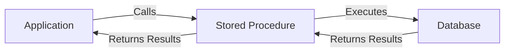

# Stored Procedures

## Introduction

Stored procedures are precompiled collections of SQL statements and procedural logic saved in a database for repeated execution. Think of them as functions or methods for your database - they allow you to encapsulate complex operations, perform business logic, and enhance the security and performance of your database applications.

In this tutorial, we'll explore what stored procedures are, why they're useful, and how to create and use them in popular database systems.

## What are Stored Procedures?

A stored procedure is a prepared SQL code that you can save and reuse. Instead of writing the same SQL queries over and over again, you can call a stored procedure with a simple command. You can also pass parameters to a stored procedure, making them flexible and adaptable to different situations.



## Why Use Stored Procedures?

Stored procedures offer several advantages:

1. **Improved Performance**: Stored procedures are compiled once and stored in executable form, which reduces query parsing and compilation overhead.

2. **Reduced Network Traffic**: Instead of sending multiple SQL statements across the network, applications can make a single call to a stored procedure.

3. **Enhanced Security**: Stored procedures can restrict direct access to tables and provide a controlled interface to the data.

4. **Code Reusability**: The same stored procedure can be used by multiple applications.

5. **Easier Maintenance**: Changes to a stored procedure automatically apply to all applications that use it, without requiring client-side code changes.

6. **Transaction Management**: Stored procedures can include transaction control statements to ensure data integrity.

## Creating Stored Procedures

Let's look at how to create stored procedures in different database systems:

### MySQL

```sql
DELIMITER //

CREATE PROCEDURE GetAllEmployees()
BEGIN
    SELECT * FROM employees;
END //

DELIMITER ;
```

### SQL Server

```sql
CREATE PROCEDURE GetAllEmployees
AS
BEGIN
    SELECT * FROM employees;
END;
```

### PostgreSQL

```sql
CREATE OR REPLACE FUNCTION get_all_employees()
RETURNS TABLE(id INT, name VARCHAR, department VARCHAR) AS
$$
BEGIN
    RETURN QUERY SELECT employee_id, employee_name, dept_name FROM employees;
END;
$$ LANGUAGE plpgsql;
```

### Oracle PL/SQL

```sql
CREATE OR REPLACE PROCEDURE get_all_employees AS
BEGIN
    SELECT * FROM employees;
END;
/
```

## Parameters in Stored Procedures

Stored procedures become more powerful when they accept parameters. Here are examples of parameterized stored procedures:

### MySQL Example

```sql
DELIMITER //

CREATE PROCEDURE GetEmployeesByDepartment(IN deptName VARCHAR(50))
BEGIN
    SELECT * FROM employees WHERE department = deptName;
END //

DELIMITER ;
```

To call this procedure:

```sql
CALL GetEmployeesByDepartment('Engineering');
```

### SQL Server Example with Output Parameter

```sql
CREATE PROCEDURE CalculateEmployeeSalarySum
    @DeptID INT,
    @TotalSalary DECIMAL(10,2) OUTPUT
AS
BEGIN
    SELECT @TotalSalary = SUM(salary)
    FROM employees
    WHERE department_id = @DeptID;
END;
```

To call this procedure:

```sql
DECLARE @Result DECIMAL(10,2);
EXEC CalculateEmployeeSalarySum @DeptID = 10, @TotalSalary = @Result OUTPUT;
SELECT @Result AS 'Total Salary';
```

## Input and Output Results

When we execute a stored procedure, here's what the input and output might look like:

**Input:**
```sql
CALL GetEmployeesByDepartment('Engineering');
```

**Output:**
```
+----+------------------+-------------+------------+
| ID | Name             | Department  | Salary     |
+----+------------------+-------------+------------+
| 1  | John Smith       | Engineering | 85000.00   |
| 5  | Maria Rodriguez  | Engineering | 92000.00   |
| 8  | David Chen       | Engineering | 78500.00   |
+----+------------------+-------------+------------+
```

## Conditional Logic in Stored Procedures

Stored procedures can include conditional logic to make decisions:

```sql
DELIMITER //

CREATE PROCEDURE GiveRaise(IN empID INT)
BEGIN
    DECLARE currentSalary DECIMAL(10,2);
    
    -- Get the current salary
    SELECT salary INTO currentSalary FROM employees WHERE employee_id = empID;
    
    -- Apply different raise percentages based on current salary
    IF currentSalary < 50000 THEN
        UPDATE employees SET salary = salary * 1.10 WHERE employee_id = empID;
    ELSEIF currentSalary < 80000 THEN
        UPDATE employees SET salary = salary * 1.07 WHERE employee_id = empID;
    ELSE
        UPDATE employees SET salary = salary * 1.05 WHERE employee_id = empID;
    END IF;
    
    SELECT CONCAT('Salary updated for employee ID ', empID) AS Result;
END //

DELIMITER ;
```

## Error Handling in Stored Procedures

Error handling is crucial for robust stored procedures:

### MySQL Example

```sql
DELIMITER //

CREATE PROCEDURE InsertEmployee(
    IN empName VARCHAR(100),
    IN empDept VARCHAR(50),
    IN empSalary DECIMAL(10,2)
)
BEGIN
    DECLARE EXIT HANDLER FOR SQLEXCEPTION
    BEGIN
        ROLLBACK;
        SELECT 'An error occurred. Employee not added.' AS Result;
    END;
    
    START TRANSACTION;
    
    INSERT INTO employees(name, department, salary)
    VALUES(empName, empDept, empSalary);
    
    COMMIT;
    
    SELECT 'Employee added successfully' AS Result;
END //

DELIMITER ;
```

## Real-world Example: Customer Order Management

Let's create a more complex stored procedure for a real-world scenario: managing customer orders.

```sql
DELIMITER //

CREATE PROCEDURE CreateOrder(
    IN customerID INT,
    IN productID INT,
    IN quantity INT,
    OUT orderID INT
)
BEGIN
    DECLARE productPrice DECIMAL(10,2);
    DECLARE totalAmount DECIMAL(10,2);
    DECLARE currentStock INT;
    
    -- Error handling
    DECLARE EXIT HANDLER FOR SQLEXCEPTION
    BEGIN
        ROLLBACK;
        SET orderID = -1;
        SELECT 'Order creation failed' AS Result;
    END;
    
    -- Start transaction
    START TRANSACTION;
    
    -- Check if there's enough stock
    SELECT price, stock INTO productPrice, currentStock
    FROM products
    WHERE product_id = productID;
    
    IF currentStock < quantity THEN
        SIGNAL SQLSTATE '45000'
        SET MESSAGE_TEXT = 'Insufficient stock';
    END IF;
    
    -- Calculate total amount
    SET totalAmount = productPrice * quantity;
    
    -- Create order header
    INSERT INTO orders(customer_id, order_date, total_amount)
    VALUES(customerID, NOW(), totalAmount);
    
    -- Get the new order ID
    SET orderID = LAST_INSERT_ID();
    
    -- Create order detail
    INSERT INTO order_details(order_id, product_id, quantity, unit_price)
    VALUES(orderID, productID, quantity, productPrice);
    
    -- Update product stock
    UPDATE products
    SET stock = stock - quantity
    WHERE product_id = productID;
    
    -- Commit transaction
    COMMIT;
    
    SELECT CONCAT('Order #', orderID, ' created successfully') AS Result;
END //

DELIMITER ;
```

To use this stored procedure:

```sql
DECLARE @NewOrderID INT;
CALL CreateOrder(101, 204, 5, @NewOrderID);
SELECT @NewOrderID AS 'New Order ID';
```

## Best Practices for Stored Procedures

1. **Use Clear Naming Conventions**: Choose descriptive names that indicate the procedure's purpose.

2. **Include Comments**: Document what the procedure does, its parameters, and return values.

3. **Handle Errors**: Implement proper error handling to manage exceptions.

4. **Use Transactions**: Wrap database modifications in transactions to ensure data integrity.

5. **Avoid Too Much Logic**: Keep business logic in the application when appropriate; use stored procedures for data-intensive operations.

6. **Parameterize Queries**: Always use parameters instead of concatenating strings to prevent SQL injection.

7. **Test Thoroughly**: Test with various inputs including edge cases and error conditions.

8. **Monitor Performance**: Review execution plans and analyze performance regularly.

## Summary

Stored procedures are powerful database objects that can enhance the performance, security, and maintainability of your database applications. They allow you to encapsulate complex SQL operations and business logic into reusable units.

In this tutorial, we explored:
- What stored procedures are and their benefits
- How to create stored procedures in different database systems
- Working with parameters
- Implementing conditional logic and error handling
- A real-world example of a stored procedure for order management
- Best practices for developing stored procedures

## Exercises

1. Create a stored procedure named `GetEmployeesByHireDate` that accepts a date range and returns all employees hired within that range.

2. Modify the `CreateOrder` procedure to include a discount parameter that applies a percentage discount to the total amount.

3. Create a stored procedure that transfers money between two bank accounts, ensuring that the transaction is atomic (either completes fully or not at all).

4. Write a stored procedure that generates a report of the top 5 selling products for a given date range.

## Additional Resources

- [MySQL Stored Procedure Documentation](https://dev.mysql.com/doc/refman/8.0/en/stored-programs-defining.html)
- [PostgreSQL Functions and Procedures](https://www.postgresql.org/docs/current/sql-createprocedure.html)
- [SQL Server Stored Procedures](https://docs.microsoft.com/en-us/sql/relational-databases/stored-procedures/create-a-stored-procedure)
- [Oracle PL/SQL Procedures](https://docs.oracle.com/en/database/oracle/oracle-database/19/lnpls/CREATE-PROCEDURE-statement.html)