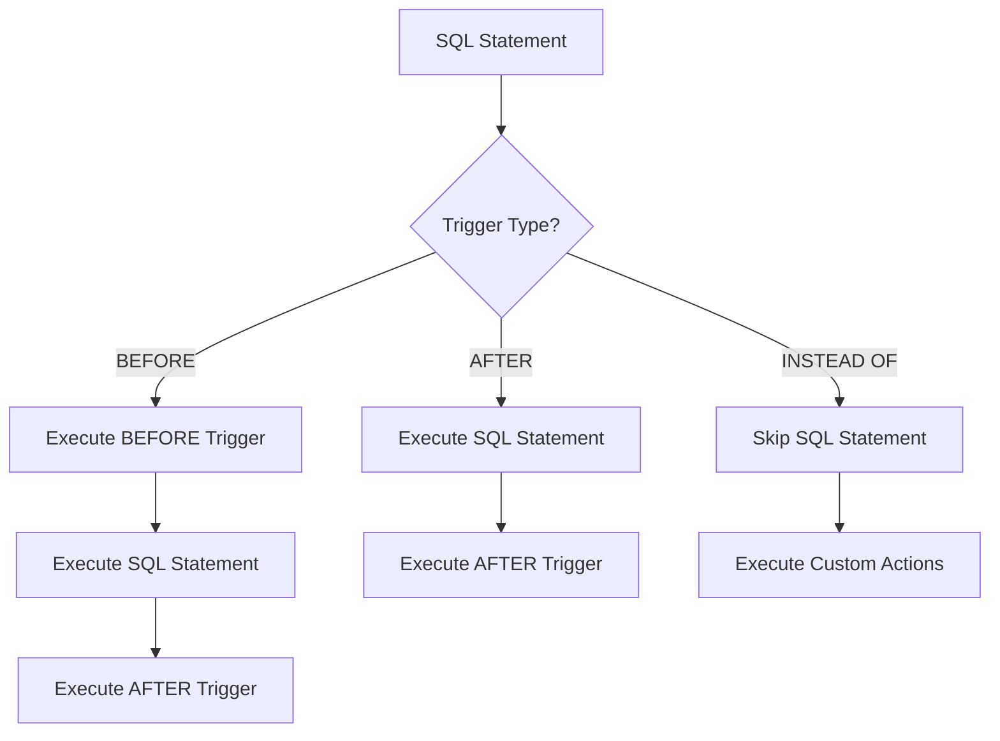

# Understanding Database Triggers

## Introduction

Database triggers are special types of stored procedures that automatically execute in response to specific events on a database table. Think of triggers as the database's way of saying, "When *this* happens, automatically do *that*." They act as guardians and automators for your database, helping maintain data integrity, enforce business rules, and automate repetitive tasks.

Unlike regular stored procedures which must be explicitly called, triggers are implicitly executed when a specified database event occurs, such as inserting, updating, or deleting records.

## Why Use Triggers?

Triggers serve several important purposes in database management:

- **Enforcing Data Integrity**: Beyond basic constraints, triggers can implement complex validation rules
- **Maintaining Audit Trails**: Automatically log changes to data
- **Implementing Business Rules**: Ensure business logic is consistently applied
- **Automating Cross-Table Updates**: Keep related tables in sync
- **Event Logging**: Record system events for monitoring purposes

## Types of Triggers

Triggers can be classified based on when and how they execute:

### Based on Timing

- **BEFORE Triggers**: Execute before the triggering event
- **AFTER Triggers**: Execute after the triggering event
- **INSTEAD OF Triggers**: Replace the triggering event with alternative actions (mainly in views)

### Based on Event Level

- **Row-Level Triggers**: Execute once for each affected row
- **Statement-Level Triggers**: Execute once per triggering SQL statement, regardless of how many rows are affected

### Based on Triggering Event

- **INSERT Triggers**: Activate when new data is added
- **UPDATE Triggers**: Activate when existing data is modified
- **DELETE Triggers**: Activate when data is removed
- **TRUNCATE Triggers**: Activate when a table is truncated (not supported in all database systems)

Let's visualize the trigger execution flow:



## Basic Trigger Syntax

While the exact syntax varies between database systems, here's a general pattern:

```sql
CREATE TRIGGER trigger_name
{BEFORE | AFTER | INSTEAD OF} {INSERT | UPDATE | DELETE}
ON table_name
[FOR EACH ROW]
BEGIN
    -- Trigger logic goes here
END;
```

Let's look at implementations in different popular database systems:

### MySQL Trigger Example

```sql
DELIMITER //
CREATE TRIGGER before_employee_update
BEFORE UPDATE ON employees
FOR EACH ROW
BEGIN
    IF NEW.salary < OLD.salary THEN
        SIGNAL SQLSTATE '45000' 
        SET MESSAGE_TEXT = 'Salary cannot be decreased';
    END IF;
    
    -- Log the change to an audit table
    INSERT INTO salary_changes 
    (employee_id, old_salary, new_salary, change_date)
    VALUES 
    (NEW.id, OLD.salary, NEW.salary, NOW());
END //
DELIMITER ;
```

### PostgreSQL Trigger Example

In PostgreSQL, we first create a function, then associate it with a trigger:

```sql
-- Create the function
CREATE OR REPLACE FUNCTION log_employee_changes()
RETURNS TRIGGER AS $$
BEGIN
    IF NEW.salary < OLD.salary THEN
        RAISE EXCEPTION 'Salary cannot be decreased';
    END IF;
    
    INSERT INTO employee_audit
    (employee_id, changed_on, action, old_data, new_data)
    VALUES
    (NEW.id, NOW(), 'UPDATE', row_to_json(OLD), row_to_json(NEW));
    
    RETURN NEW;
END;
$$ LANGUAGE plpgsql;

-- Create the trigger
CREATE TRIGGER employee_changes
BEFORE UPDATE ON employees
FOR EACH ROW
EXECUTE PROCEDURE log_employee_changes();
```

### SQL Server Trigger Example

```sql
CREATE TRIGGER trg_PreventSalaryDecrease
ON employees
AFTER UPDATE
AS
BEGIN
    IF EXISTS (
        SELECT 1 
        FROM inserted i
        JOIN deleted d ON i.id = d.id
        WHERE i.salary < d.salary
    )
    BEGIN
        RAISERROR('Salary cannot be decreased', 16, 1);
        ROLLBACK TRANSACTION;
        RETURN;
    END
    
    INSERT INTO audit_log
    (employee_id, action_type, action_date, old_value, new_value)
    SELECT 
        i.id, 
        'SALARY_UPDATE', 
        GETDATE(), 
        d.salary, 
        i.salary
    FROM inserted i
    JOIN deleted d ON i.id = d.id
    WHERE i.salary <> d.salary;
END;
```

## Practical Applications of Triggers

Let's explore some real-world scenarios where triggers are invaluable:

### 1. Maintaining Audit Trails

Automatically tracking changes to sensitive data is a common requirement in many applications:

```sql
-- MySQL audit trigger example
CREATE TRIGGER audit_customer_changes
AFTER UPDATE ON customers
FOR EACH ROW
BEGIN
    INSERT INTO customer_audit
    (customer_id, field_changed, old_value, new_value, changed_by, change_timestamp)
    VALUES
    (NEW.id, 'email', OLD.email, NEW.email, CURRENT_USER(), NOW());
END;
```

### 2. Implementing Complex Business Rules

Ensuring business policies are enforced consistently:

```sql
-- PostgreSQL example: Prevent orders outside business hours
CREATE OR REPLACE FUNCTION validate_order_time()
RETURNS TRIGGER AS $$
BEGIN
    -- Check if order is placed during business hours (9 AM to 5 PM)
    IF EXTRACT(HOUR FROM CURRENT_TIME) < 9 OR EXTRACT(HOUR FROM CURRENT_TIME) >= 17 THEN
        RAISE EXCEPTION 'Orders can only be placed during business hours (9 AM - 5 PM)';
    END IF;
    
    RETURN NEW;
END;
$$ LANGUAGE plpgsql;

CREATE TRIGGER check_order_hours
BEFORE INSERT ON orders
FOR EACH ROW
EXECUTE PROCEDURE validate_order_time();
```

### 3. Cascading Updates

Maintaining data consistency across related tables:

```sql
-- MySQL example: Update product status across related tables
CREATE TRIGGER update_product_status
AFTER UPDATE ON products
FOR EACH ROW
BEGIN
    IF NEW.status <> OLD.status THEN
        -- Update status in related inventory table
        UPDATE inventory 
        SET status = NEW.status
        WHERE product_id = NEW.id;
        
        -- Update status in product_catalog
        UPDATE product_catalog
        SET availability = CASE 
            WHEN NEW.status = 'active' THEN 'in stock'
            ELSE 'unavailable'
        END
        WHERE product_id = NEW.id;
    END IF;
END;
```

### 4. Calculating Derived Data

Automatically maintaining computed values:

```sql
-- SQL Server example: Keep total updated in orders table
CREATE TRIGGER update_order_total
AFTER INSERT, UPDATE, DELETE ON order_items
AS
BEGIN
    -- Update the order totals for affected orders
    UPDATE orders
    SET total_amount = (
        SELECT SUM(price * quantity)
        FROM order_items
        WHERE order_id = orders.id
    )
    FROM orders
    WHERE id IN (
        SELECT DISTINCT order_id FROM inserted
        UNION
        SELECT DISTINCT order_id FROM deleted
    );
END;
```

## Best Practices for Using Triggers

While triggers are powerful, they should be used judiciously:

1. **Keep Triggers Lightweight**: Avoid complex processing that could impact performance
2. **Document Thoroughly**: Since triggers execute implicitly, document their existence and purpose
3. **Handle Errors Properly**: Implement error handling to prevent failed operations
4. **Avoid Trigger Chains**: Be cautious about triggers that might activate other triggers
5. **Consider Alternatives**: Sometimes constraints or application logic are better solutions
6. **Test Thoroughly**: Triggers can have unexpected side effects

## Potential Pitfalls

Be aware of these common issues when working with triggers:

- **Hidden Logic**: Triggers execute "behind the scenes" and may confuse developers unfamiliar with the database
- **Performance Impact**: Poorly designed triggers can significantly slow down database operations
- **Debugging Challenges**: Trigger-related issues can be harder to troubleshoot
- **Recursive Triggers**: Triggers that modify the same table they're monitoring can cause infinite loops if not carefully designed

## Real-World Example: Customer Relationship Management System

Let's look at a comprehensive example for a CRM system:

```sql
-- PostgreSQL example for a CRM system

-- 1. Audit trail trigger
CREATE OR REPLACE FUNCTION audit_contact_changes()
RETURNS TRIGGER AS $$
BEGIN
    INSERT INTO contact_history
    (contact_id, field_name, old_value, new_value, changed_at, changed_by)
    SELECT 
        NEW.id,
        col.column_name,
        row_to_json(OLD)->>col.column_name,
        row_to_json(NEW)->>col.column_name,
        NOW(),
        current_user
    FROM information_schema.columns col
    WHERE col.table_name = 'contacts'
    AND row_to_json(OLD)->>col.column_name IS DISTINCT FROM row_to_json(NEW)->>col.column_name;
    
    RETURN NULL;
END;
$$ LANGUAGE plpgsql;

CREATE TRIGGER log_contact_changes
AFTER UPDATE ON contacts
FOR EACH ROW
EXECUTE PROCEDURE audit_contact_changes();

-- 2. Activity log trigger
CREATE OR REPLACE FUNCTION update_last_activity()
RETURNS TRIGGER AS $$
BEGIN
    UPDATE contacts
    SET last_activity_date = NEW.activity_date,
        last_activity_type = NEW.activity_type
    WHERE id = NEW.contact_id;
    
    RETURN NEW;
END;
$$ LANGUAGE plpgsql;

CREATE TRIGGER track_contact_activity
AFTER INSERT ON activities
FOR EACH ROW
EXECUTE PROCEDURE update_last_activity();

-- 3. Lead scoring trigger
CREATE OR REPLACE FUNCTION calculate_lead_score()
RETURNS TRIGGER AS $$
BEGIN
    -- Calculate lead score based on activities and profile
    UPDATE contacts
    SET lead_score = (
        SELECT 
            COUNT(CASE WHEN activity_type = 'email_open' THEN 1 END) * 1 +
            COUNT(CASE WHEN activity_type = 'website_visit' THEN 1 END) * 2 +
            COUNT(CASE WHEN activity_type = 'download' THEN 1 END) * 5 +
            COUNT(CASE WHEN activity_type = 'demo_request' THEN 1 END) * 10
        FROM activities
        WHERE contact_id = NEW.contact_id
        AND activity_date > NOW() - INTERVAL '30 days'
    )
    WHERE id = NEW.contact_id;
    
    RETURN NEW;
END;
$$ LANGUAGE plpgsql;

CREATE TRIGGER update_lead_score
AFTER INSERT ON activities
FOR EACH ROW
EXECUTE PROCEDURE calculate_lead_score();
```

This example demonstrates a system where:
1. All contact changes are automatically logged
2. Contact records are updated with their latest activity
3. Lead scores are calculated automatically based on activity

## Summary

Database triggers are powerful mechanisms for automating database operations, enforcing business rules, and maintaining data integrity. They execute in response to specific events and can perform a wide range of actions.

Key takeaways:
- Triggers can execute before, after, or instead of database operations
- They can operate at row or statement level
- While powerful, triggers should be used judiciously to avoid performance issues
- Common use cases include audit trails, enforcing business rules, and maintaining derived data
- Different database systems have different syntax, but the core concepts remain the same

## Exercises

1. Create a trigger that prevents users from deleting records from a `customers` table.
2. Design a trigger system for a banking application that logs all transactions and updates account balances.
3. Implement a trigger that enforces a business rule where product prices cannot be increased by more than 10% in a single update.
4. Create an audit system using triggers that tracks all changes to employee salary information.
5. Design a trigger that automatically assigns new customers to sales representatives based on geographic regions.

## Additional Resources

- Your database system's official documentation on triggers
- SQL tutorials specific to your database platform
- Books on advanced database design that cover triggers in depth
- Practice implementing triggers in a test database environment to gain hands-on experience