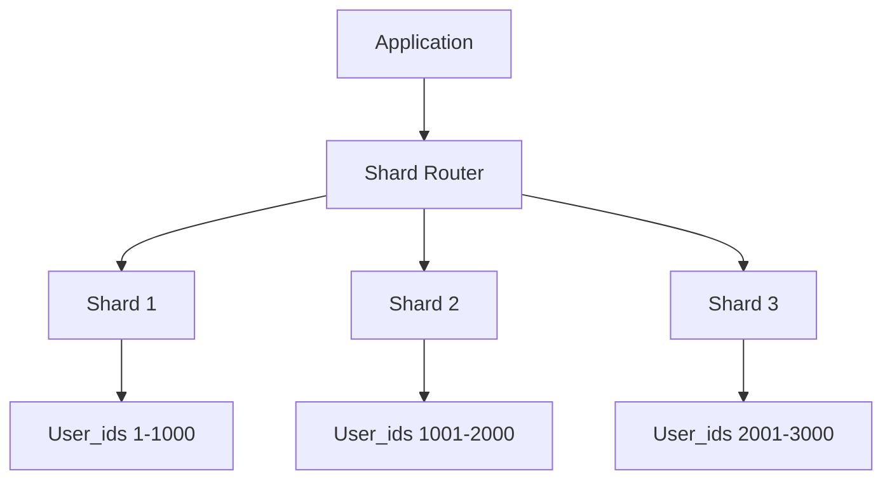
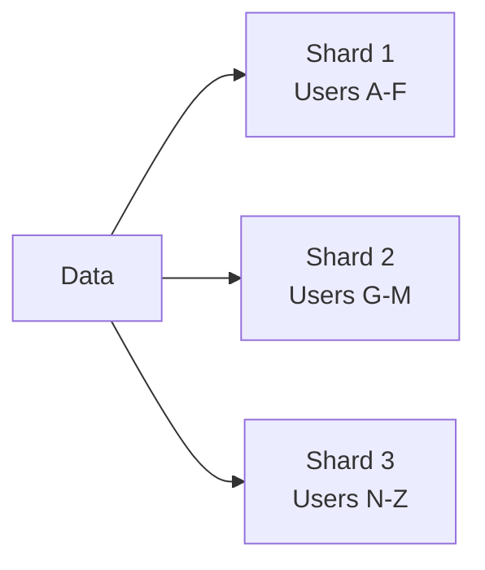
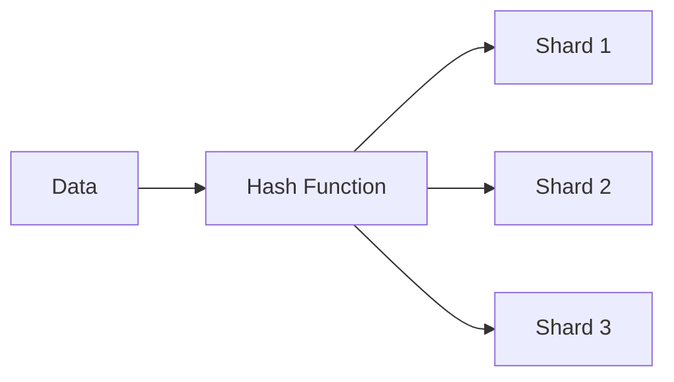
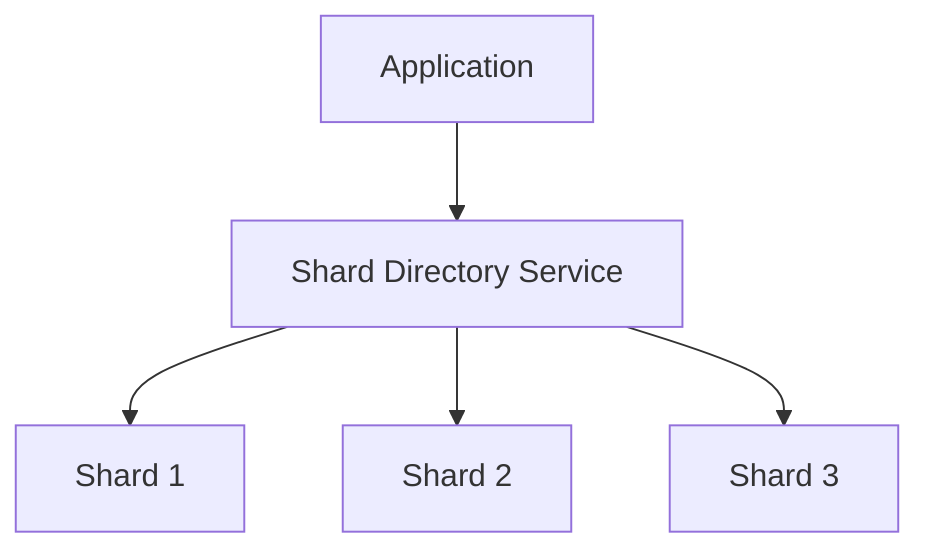

# Database Sharding

## Introduction

As applications grow and data volumes expand, traditional database solutions often struggle to keep up with increasing demands. Database sharding is a powerful technique for scaling databases horizontally by breaking a large database into smaller, more manageable pieces called **shards**.

Unlike vertical scaling (adding more power to a single server), sharding distributes your data across multiple machines, allowing for better performance, higher availability, and improved fault tolerance. This approach is particularly valuable for applications handling massive amounts of data or requiring high throughput.

## What is Database Sharding?

Sharding is a type of horizontal partitioning that splits a single database into multiple smaller databases, each running on separate servers. Each shard contains a distinct subset of the data, determined by a sharding key.



### Key Concepts

- **Shard**: A separate database instance that holds a portion of the total dataset
- **Sharding Key**: The attribute used to determine which shard should store a particular piece of data
- **Shard Router**: A component that directs queries to the appropriate shard based on the sharding key

## Why Use Database Sharding?

Sharding offers several significant benefits:

1. **Improved Performance**: Queries run on smaller datasets, and work is distributed across multiple machines
2. **Increased Storage Capacity**: Combined storage across all shards exceeds what's possible on a single server
3. **Higher Availability**: If one shard fails, only a portion of your data is affected
4. **Better Scalability**: Add more shards as your data grows instead of migrating to entirely new systems

## Sharding Strategies

Choosing the right sharding strategy is crucial for effective implementation. Let's explore the most common approaches:

### 1. Range-Based Sharding

In range-based sharding, data is distributed based on ranges of a sharding key.



**Example implementation:**

```javascript
function determineShardByUsername(username) {
  const firstChar = username.charAt(0).toUpperCase();
  
  if (firstChar >= 'A' && firstChar <= 'F') {
    return 'shard1';
  } else if (firstChar >= 'G' && firstChar <= 'M') {
    return 'shard2';
  } else {
    return 'shard3';
  }
}

// Example usage
console.log(determineShardByUsername('alice')); // Output: shard1
console.log(determineShardByUsername('bob'));   // Output: shard1
console.log(determineShardByUsername('karen')); // Output: shard2
console.log(determineShardByUsername('zack'));  // Output: shard3
```

**Advantages:**
- Simple to implement and understand
- Good for queries that select ranges of data

**Disadvantages:**
- Can lead to uneven data distribution if values aren't uniformly distributed
- May require rebalancing as data grows

### 2. Hash-Based Sharding

Hash-based sharding applies a hash function to the sharding key to determine which shard should store the data.



**Example implementation:**

```javascript
function determineShardByUserId(userId) {
  // Simple hash function: modulo operation
  const shardNumber = userId % 3;
  
  return `shard${shardNumber + 1}`;
}

// Example usage
console.log(determineShardByUserId(123)); // Output: shard1
console.log(determineShardByUserId(124)); // Output: shard2
console.log(determineShardByUserId(125)); // Output: shard3
console.log(determineShardByUserId(126)); // Output: shard1
```

**Advantages:**
- Distributes data more evenly
- Reduces the chance of hotspots

**Disadvantages:**
- Range queries become inefficient as related data may be spread across multiple shards
- Adding/removing shards requires significant data redistribution

### 3. Directory-Based Sharding

Directory-based sharding uses a lookup service to map sharding keys to specific shards.



**Example implementation:**

```javascript
class ShardDirectory {
  constructor() {
    // This would typically be stored in a database or configuration service
    this.directory = {
      'product_electronics': 'shard1',
      'product_clothing': 'shard2',
      'product_furniture': 'shard3',
      'product_books': 'shard1',
      'product_toys': 'shard2'
    };
  }
  
  getShardForProductCategory(category) {
    const key = `product_${category}`;
    return this.directory[key] || 'shard1'; // Default to shard1 if not found
  }
}

// Example usage
const directory = new ShardDirectory();
console.log(directory.getShardForProductCategory('electronics')); // Output: shard1
console.log(directory.getShardForProductCategory('clothing'));    // Output: shard2
console.log(directory.getShardForProductCategory('furniture'));   // Output: shard3
```

**Advantages:**
- Extremely flexible - any item can be assigned to any shard
- Allows for easy rebalancing without changing the sharding logic

**Disadvantages:**
- Additional complexity and overhead of maintaining the directory service
- The directory service can become a single point of failure

## Implementing Sharding in a Real Application

Let's walk through a practical example of implementing database sharding in a Node.js application with MySQL, focusing on a user management system.

### Setting Up the Shards

First, we need to set up multiple database instances. For simplicity, we'll use separate databases on the same MySQL server.

```sql
-- Create three separate databases for our shards
CREATE DATABASE user_shard_1;
CREATE DATABASE user_shard_2;
CREATE DATABASE user_shard_3;

-- Create identical table structures in each shard
USE user_shard_1;
CREATE TABLE users (
  id INT PRIMARY KEY,
  username VARCHAR(50) NOT NULL,
  email VARCHAR(100) NOT NULL,
  created_at TIMESTAMP DEFAULT CURRENT_TIMESTAMP
);

-- Repeat for user_shard_2 and user_shard_3
```

### Shard Router Implementation

Next, we'll create a shard router in Node.js that directs queries to the appropriate shard:

```javascript
const mysql = require('mysql2/promise');

class UserShardRouter {
  constructor() {
    // Connection pools for each shard
    this.shardPools = {
      shard1: mysql.createPool({
        host: 'localhost',
        user: 'root',
        password: 'password',
        database: 'user_shard_1'
      }),
      shard2: mysql.createPool({
        host: 'localhost',
        user: 'root',
        password: 'password',
        database: 'user_shard_2'
      }),
      shard3: mysql.createPool({
        host: 'localhost',
        user: 'root',
        password: 'password',
        database: 'user_shard_3'
      })
    };
  }

  // Determine shard by user ID using hash-based sharding
  getShardByUserId(userId) {
    const shardNumber = userId % 3;
    return `shard${shardNumber + 1}`;
  }

  // Get connection pool for a specific user ID
  getPoolForUserId(userId) {
    const shardName = this.getShardByUserId(userId);
    return this.shardPools[shardName];
  }

  // Example: Create a new user
  async createUser(userId, username, email) {
    const pool = this.getPoolForUserId(userId);
    
    try {
      await pool.execute(
        'INSERT INTO users (id, username, email) VALUES (?, ?, ?)',
        [userId, username, email]
      );
      return { success: true };
    } catch (error) {
      console.error('Error creating user:', error);
      return { success: false, error };
    }
  }

  // Example: Get user by ID
  async getUserById(userId) {
    const pool = this.getPoolForUserId(userId);
    
    try {
      const [rows] = await pool.execute(
        'SELECT * FROM users WHERE id = ?',
        [userId]
      );
      return rows[0] || null;
    } catch (error) {
      console.error('Error fetching user:', error);
      return null;
    }
  }
  
  // Close all connections when done
  async close() {
    await Promise.all(
      Object.values(this.shardPools).map(pool => pool.end())
    );
  }
}

// Example usage:
async function main() {
  const router = new UserShardRouter();
  
  // Create users across different shards
  await router.createUser(1, 'alice', 'alice@example.com');  // Goes to shard2
  await router.createUser(2, 'bob', 'bob@example.com');      // Goes to shard3
  await router.createUser(3, 'charlie', 'charlie@example.com'); // Goes to shard1
  
  // Retrieve a user
  const user = await router.getUserById(1);
  console.log('Retrieved user:', user);
  
  await router.close();
}

main().catch(console.error);
```

## Challenges and Considerations

While sharding offers substantial benefits, it also introduces complexities that must be carefully managed:

### 1. Cross-Shard Operations

One of the biggest challenges in sharded databases is handling operations that span multiple shards.

**Solutions:**
- Minimize cross-shard operations through proper sharding key selection
- Implement application-level joins
- Consider eventual consistency for some operations

### 2. Distributed Transactions

Maintaining ACID properties across shards is difficult but often necessary.

**Solutions:**
- Two-phase commit protocols
- Saga patterns for complex transactions
- Eventual consistency where appropriate

### 3. Schema Changes

Updating database schemas becomes more complex with sharding.

**Solutions:**
- Rolling deployments of schema changes
- Backward-compatible schema design
- Database migration tools that support sharded environments

### 4. Rebalancing Data

As data volumes change, you may need to rebalance data across shards.

**Solutions:**
- Consistent hashing algorithms
- Directory-based sharding with dynamic mapping
- Automated rebalancing tools

## When to Implement Sharding

Sharding isn't always the right solution. Consider these factors:

- **Data Volume**: Are you handling terabytes of data?
- **Query Performance**: Are queries becoming too slow despite optimization?
- **Vertical Scaling Limits**: Have you reached the practical limits of vertical scaling?
- **Geographic Distribution**: Do you need to locate data close to users in different regions?

If you're just starting out, consider these alternatives before implementing sharding:
- **Database optimization**: Proper indexing and query optimization
- **Caching**: Implementing Redis or Memcached
- **Read replicas**: For read-heavy workloads
- **Vertical scaling**: Upgrading to more powerful hardware

## Summary

Database sharding is a powerful technique for horizontally scaling databases beyond the capabilities of single-server solutions. By distributing data across multiple shards, you can achieve improved performance, higher availability, and better scalability.

We've explored different sharding strategies including range-based, hash-based, and directory-based approaches, each with its own advantages and trade-offs. We've also reviewed real-world implementation examples and the challenges you might face when implementing sharding.

Remember that sharding introduces complexity and should be considered after exhausting simpler scaling options. When implemented properly, however, it can help your application handle massive growth in data volume and user traffic.

## Practice Exercises

1. Design a sharding strategy for an e-commerce platform with millions of products and users
2. Implement a simple hash-based sharding router using your preferred programming language
3. Develop a plan for migrating an existing monolithic database to a sharded architecture
4. Create a solution for handling transactions that span multiple shards in your application

## Additional Resources

- Database systems like MongoDB, MySQL Cluster, and PostgreSQL all offer built-in sharding capabilities
- Popular sharding libraries include Vitess for MySQL and Citus for PostgreSQL
- Consider managed database services like Amazon DynamoDB or Google Cloud Spanner that handle sharding automatically