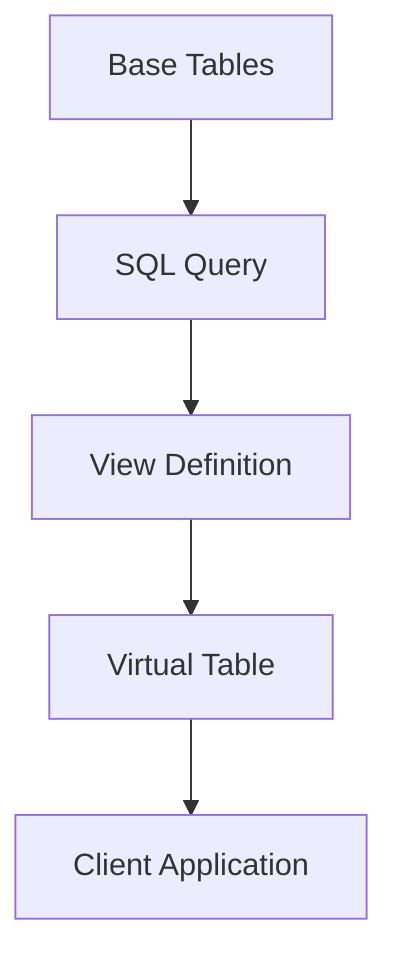

# Database Views

## Introduction

In the world of databases, a **view** is a virtual table based on the result set of a SQL statement. Unlike regular tables that store data physically, views don't store data themselves but rather provide a way to look at data stored in other tables. Think of views as "saved queries" or "virtual tables" that you can reference just like you would a regular table.

Views serve as an abstraction layer on top of your database schema, allowing you to:
- Simplify complex queries
- Restrict access to sensitive data
- Present data in a format that's easier for users to understand

Let's explore how views work and why they're a powerful tool in your database toolkit.

## Understanding Database Views

### What is a Database View?

A database view is essentially a stored query that appears as a virtual table in your database. When you query a view, the database engine executes the underlying SQL statement and returns the result set as if it were coming from an actual table.



### Key Characteristics of Views

- Views do not store data physically
- Views are dynamic (they reflect the current data in the base tables)
- Views can join multiple tables into a single virtual table
- Views can contain calculated columns
- Views can filter rows and columns from the base tables

## Creating Database Views

The basic syntax for creating a view is:

```sql
CREATE VIEW view_name AS
SELECT column1, column2, ...
FROM table_name
WHERE condition;
```

Let's look at some examples:

### Example 1: Simple View

Imagine we have a `customers` table with many columns, but we often only need to access a few of them:

```sql
CREATE VIEW customer_contact_info AS
SELECT customer_id, first_name, last_name, email, phone
FROM customers;
```

Now we can query this view just like a regular table:

```sql
SELECT * FROM customer_contact_info
WHERE last_name = 'Smith';
```

**Output:**
```
customer_id | first_name | last_name | email               | phone
------------+------------+-----------+---------------------+------------
1001        | John       | Smith     | john.s@example.com  | 555-123-4567
1042        | Mary       | Smith     | mary.s@example.com  | 555-987-6543
```

### Example 2: View with Joins

Views are especially useful when you need to frequently join multiple tables:

```sql
CREATE VIEW order_details AS
SELECT 
    o.order_id,
    c.customer_id,
    c.first_name,
    c.last_name,
    o.order_date,
    p.product_name,
    oi.quantity,
    p.price,
    (oi.quantity * p.price) AS total_price
FROM orders o
JOIN customers c ON o.customer_id = c.customer_id
JOIN order_items oi ON o.order_id = oi.order_id
JOIN products p ON oi.product_id = p.product_id;
```

Now we can easily query complex order information:

```sql
SELECT * FROM order_details
WHERE order_date > '2023-01-01'
ORDER BY total_price DESC
LIMIT 5;
```

**Output:**
```
order_id | customer_id | first_name | last_name | order_date | product_name | quantity | price | total_price
---------+-------------+------------+-----------+------------+--------------+----------+-------+-------------
10053    | 1025        | Emma       | Johnson   | 2023-02-15 | Laptop Pro   | 2        | 1200  | 2400
10078    | 1042        | Mary       | Smith     | 2023-03-22 | 4K TV        | 1        | 1899  | 1899
10091    | 1001        | John       | Smith     | 2023-04-05 | Smartphone X | 2        | 899   | 1798
10112    | 1015        | David      | Lee       | 2023-05-18 | Gaming PC    | 1        | 1650  | 1650
10124    | 1003        | Sarah      | Williams  | 2023-06-02 | Tablet Ultra | 3        | 499   | 1497
```

### Example 3: View with Aggregation

Views can also contain aggregated data:

```sql
CREATE VIEW sales_by_month AS
SELECT 
    EXTRACT(YEAR FROM order_date) AS year,
    EXTRACT(MONTH FROM order_date) AS month,
    SUM(order_total) AS total_sales,
    COUNT(*) AS number_of_orders
FROM orders
GROUP BY 
    EXTRACT(YEAR FROM order_date),
    EXTRACT(MONTH FROM order_date);
```

Query the view to get monthly sales figures:

```sql
SELECT * FROM sales_by_month
WHERE year = 2023
ORDER BY month;
```

**Output:**
```
year | month | total_sales | number_of_orders
-----+-------+-------------+------------------
2023 | 1     | 45680.25    | 128
2023 | 2     | 52470.50    | 145
2023 | 3     | 61250.75    | 160
2023 | 4     | 58920.30    | 155
2023 | 5     | 63450.60    | 172
2023 | 6     | 67890.40    | 183
```

## Types of Views

Different database systems support various types of views:

### 1. Simple Views
- Based on a single table
- Contains no aggregate functions
- Allows for INSERT, UPDATE, and DELETE operations

### 2. Complex Views
- Can join multiple tables
- May contain aggregate functions
- Often read-only (no data modification)

### 3. Indexed Views (Materialized Views)
- Some database systems (like SQL Server, Oracle) allow views to be physically stored and indexed
- Improves query performance but requires storage space
- Needs to be refreshed when underlying data changes

### 4. Updatable vs. Read-Only Views
Most simple views are updatable, meaning you can perform INSERT, UPDATE, and DELETE operations through them. However, views become read-only when they:
- Contain aggregate functions (SUM, AVG, COUNT, etc.)
- Use GROUP BY, DISTINCT, or HAVING clauses
- Join multiple tables
- Contain subqueries in the SELECT list

## Benefits of Using Views

### 1. Simplifying Complex Queries

Instead of writing complex joins every time, you can create a view once and query it with simple syntax.

### 2. Data Security

Views can restrict access to specific columns or rows:

```sql
CREATE VIEW employee_public_info AS
SELECT employee_id, first_name, last_name, department, position
FROM employees;
-- Notice salary and personal information are excluded
```

### 3. Data Abstraction

Views can present a consistent interface even if the underlying tables change:

```sql
CREATE VIEW customer_info AS
SELECT 
    c.customer_id,
    c.name,
    c.email,
    a.street,
    a.city,
    a.state,
    a.zip_code
FROM customers c
JOIN addresses a ON c.address_id = a.address_id;
```

If later we restructure our tables, we can simply update the view definition while applications continue to query the same view.

### 4. Calculated Fields

Views can contain calculated columns:

```sql
CREATE VIEW product_pricing AS
SELECT 
    product_id,
    product_name,
    price,
    price * 1.08 AS price_with_tax,
    price * 0.85 AS discounted_price
FROM products;
```

## Practical Applications

### Example 1: Customer Dashboard

A dashboard application needs to display customer information and their purchase history:

```sql
CREATE VIEW customer_dashboard AS
SELECT 
    c.customer_id,
    c.first_name || ' ' || c.last_name AS full_name,
    c.email,
    COUNT(o.order_id) AS total_orders,
    SUM(o.order_total) AS lifetime_value,
    MAX(o.order_date) AS last_order_date
FROM customers c
LEFT JOIN orders o ON c.customer_id = o.customer_id
GROUP BY c.customer_id, c.first_name, c.last_name, c.email;
```

### Example 2: Data Analysis View

For data analysts who need to track product performance:

```sql
CREATE VIEW product_performance AS
SELECT 
    p.product_id,
    p.product_name,
    p.category,
    COUNT(oi.order_id) AS times_ordered,
    SUM(oi.quantity) AS units_sold,
    SUM(oi.quantity * p.price) AS total_revenue,
    AVG(r.rating) AS average_rating
FROM products p
LEFT JOIN order_items oi ON p.product_id = oi.product_id
LEFT JOIN orders o ON oi.order_id = o.order_id
LEFT JOIN product_reviews r ON p.product_id = r.product_id
GROUP BY p.product_id, p.product_name, p.category;
```

### Example 3: Reporting System

For generating monthly reports:

```sql
CREATE VIEW monthly_sales_report AS
SELECT 
    TO_CHAR(order_date, 'YYYY-MM') AS month,
    COUNT(*) AS total_orders,
    SUM(order_total) AS total_revenue,
    COUNT(DISTINCT customer_id) AS unique_customers,
    SUM(order_total) / COUNT(*) AS average_order_value
FROM orders
GROUP BY TO_CHAR(order_date, 'YYYY-MM');
```

## Managing Views

### Altering a View

To modify an existing view:

```sql
CREATE OR REPLACE VIEW customer_contact_info AS
SELECT customer_id, first_name, last_name, email, phone, address
FROM customers;
-- Added the address column
```

### Dropping a View

To remove a view:

```sql
DROP VIEW customer_contact_info;
```

### Viewing Metadata

To see information about existing views:

```sql
-- PostgreSQL
SELECT * FROM information_schema.views
WHERE table_schema = 'public';

-- MySQL
SHOW FULL TABLES 
WHERE table_type = 'VIEW';

-- SQL Server
SELECT * FROM sys.views;
```

## View Performance Considerations

While views are powerful, there are some performance considerations:

1. **Query Complexity**: Views that join many tables or use complex logic may be slower than direct table queries.

2. **Nested Views**: Be cautious when creating views that reference other views, as this can lead to performance issues.

3. **Indexed/Materialized Views**: For frequently accessed views with complex queries, consider using materialized views if your database system supports them.

4. **View Expansion**: Most database systems expand view definitions into the original query, which means the query optimizer still sees the full complexity.

## Best Practices

1. **Use Meaningful Names**: Name views clearly to indicate their purpose.

2. **Document Views**: Add comments to explain what each view does.

3. **Keep Views Simple**: Avoid overly complex logic in views when possible.

4. **Consider Performance**: Use materialized views for performance-critical scenarios.

5. **Grant Appropriate Permissions**: Restrict view access based on security requirements.

6. **Test View Updates**: If views are updatable, thoroughly test UPDATE, INSERT, and DELETE operations.

## Summary

Database views provide a powerful abstraction layer that simplifies complex queries, enhances security, and makes your database schema more flexible. By creating well-designed views, you can:

- Simplify complex queries for application developers
- Provide security by restricting access to sensitive data
- Create consistent interfaces regardless of database structure changes
- Improve code reusability by encapsulating common query logic

Views are an essential tool for creating maintainable, secure, and user-friendly database applications.

## Exercises

1. Create a view that joins a `students` table and a `courses` table to show all students and the courses they are enrolled in.

2. Create a view that shows product sales data including the total revenue generated by each product.

3. Create a view that restricts access to employee data by showing only non-sensitive information.

4. Create a view that uses aggregate functions to show customer purchase statistics.

5. Try to update data through a view and observe when it works and when it doesn't.

## Additional Resources

- Your database system's documentation on views (PostgreSQL, MySQL, SQL Server, Oracle, etc.)
- Database design books that cover advanced view usage
- Online practice environments where you can create and test views