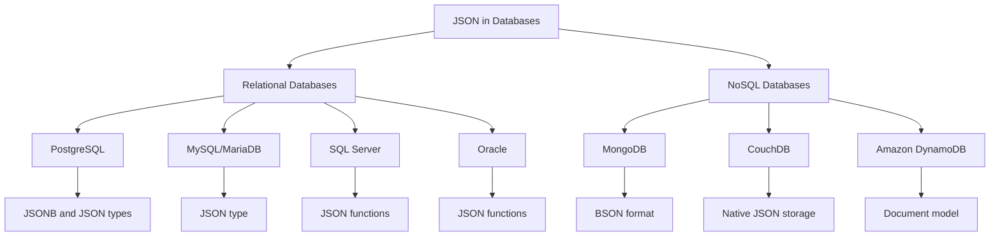

# JSON in Databases

## Introduction

JavaScript Object Notation (JSON) has become an essential data format in modern application development. As web and mobile applications increasingly exchange data in JSON format, database systems have evolved to provide native support for storing, querying, and manipulating JSON data. This article explores how modern databases handle JSON data, the advantages of JSON data types, implementation differences across database systems, and practical examples of when to use JSON in your database design.

## What is JSON?

JSON (JavaScript Object Notation) is a lightweight data interchange format that is easy for humans to read and write, and easy for machines to parse and generate. It consists of:

- **Objects**: Collections of key/value pairs enclosed in curly braces `{}`
- **Arrays**: Ordered lists of values enclosed in square brackets `[]`
- **Values**: Strings, numbers, booleans, null, objects, or arrays

Here's a simple JSON example:

```json
{
  "id": 101,
  "name": "Alice Smith",
  "active": true,
  "skills": ["Python", "SQL", "JavaScript"],
  "address": {
    "city": "Boston",
    "state": "MA",
    "zip": "02108"
  }
}
```

## JSON Support in Databases

### Types of JSON Database Support

Databases support JSON in different ways:

1. **Native JSON Data Types**: Dedicated types with specialized functions and operators
2. **Document Stores**: Databases designed specifically for JSON-like documents 
3. **Text Storage**: Basic storage as text/strings with limited JSON capabilities

Let's see how different database systems implement JSON support:



## JSON in Relational Databases

### PostgreSQL

PostgreSQL offers the most advanced JSON support among relational databases with two data types:

- `JSON`: Stores exact copy of input text
- `JSONB`: Stores binary format for more efficient processing

#### Basic Operations in PostgreSQL

Creating a table with a JSON column:

```sql
CREATE TABLE users (
  id SERIAL PRIMARY KEY,
  data JSONB
);
```

Inserting JSON data:

```sql
INSERT INTO users (data) VALUES (
  '{"name": "John Doe", "email": "john@example.com", "tags": ["developer", "python"]}'
);
```

Querying JSON data:

```sql
-- Retrieve a JSON property using -> operator
SELECT data->'name' FROM users;

-- Retrieve a JSON property as text using ->> operator
SELECT data->>'name' FROM users;

-- Filter based on a JSON property
SELECT * FROM users WHERE data->>'name' = 'John Doe';

-- Filter based on a JSON array element
SELECT * FROM users WHERE data->'tags' ? 'python';
```

### MySQL/MariaDB

MySQL provides JSON data type with various functions for manipulation:

```sql
-- Create a table with JSON column
CREATE TABLE products (
  id INT AUTO_INCREMENT PRIMARY KEY,
  details JSON
);

-- Insert JSON data
INSERT INTO products (details) VALUES (
  '{"name": "Smartphone", "price": 699.99, "specs": {"ram": "8GB", "storage": "128GB"}}'
);

-- Extract value from JSON
SELECT JSON_EXTRACT(details, '$.name') FROM products;
-- or using the -> operator
SELECT details->'$.name' FROM products;

-- Update a JSON value
UPDATE products SET details = JSON_SET(details, '$.price', 649.99);
```

### SQL Server

Microsoft SQL Server includes JSON functions but doesn't have a native JSON data type:

```sql
-- Create a table storing JSON as NVARCHAR
CREATE TABLE customers (
  id INT IDENTITY PRIMARY KEY,
  profile NVARCHAR(MAX) CHECK (ISJSON(profile) = 1)
);

-- Query JSON properties
SELECT 
  JSON_VALUE(profile, '$.name') AS name,
  JSON_VALUE(profile, '$.email') AS email
FROM customers
WHERE JSON_VALUE(profile, '$.city') = 'Seattle';
```

## Document Databases and JSON

Document databases are designed specifically for JSON-like document storage.

### MongoDB

MongoDB stores data in BSON (Binary JSON) format:

```javascript
// Creating a collection (similar to a table)
db.createCollection("employees")

// Inserting a document
db.employees.insertOne({
  name: "Sarah Johnson",
  department: "Engineering",
  skills: ["JavaScript", "React", "Node.js"],
  contact: {
    email: "sarah@company.com",
    phone: "555-1234"
  },
  projects: [
    { id: "P001", name: "Website Redesign" },
    { id: "P002", name: "API Integration" }
  ]
})

// Querying nested data
db.employees.find({ "contact.email": "sarah@company.com" })

// Querying array elements
db.employees.find({ skills: "React" })

// Updating nested fields
db.employees.updateOne(
  { name: "Sarah Johnson" },
  { $set: { "contact.phone": "555-5678" } }
)
```

## Advantages of JSON in Databases

1. **Schema Flexibility**: Store varying data structures without schema migrations
2. **Complex Data Structures**: Natural representation of nested data
3. **Application Integration**: Direct compatibility with web applications
4. **Reduced Impedance Mismatch**: Less translation between application and database models
5. **Evolutionary Development**: Adapt data models as requirements evolve

## When to Use JSON in Databases

### Good Use Cases

- **Semi-structured data**: Data with varying attributes
- **Nested/hierarchical data**: Complex objects with nested structures
- **Rapid prototyping**: Applications with evolving data models
- **Document storage**: Content management, user profiles, configurations
- **API data storage**: Storing responses from external APIs

### Example: Product Catalog

A product catalog with varying attributes per product category:

```sql
CREATE TABLE products (
  id SERIAL PRIMARY KEY,
  name VARCHAR(100),
  price DECIMAL(10, 2),
  category VARCHAR(50),
  attributes JSONB  -- Varying attributes per category
);

-- Electronics product
INSERT INTO products VALUES (
  1, 
  'Laptop Pro', 
  1299.99, 
  'Electronics',
  '{"processor": "Intel i7", "ram": "16GB", "storage": "512GB SSD", "screen": "15.6 inch"}'
);

-- Clothing product
INSERT INTO products VALUES (
  2, 
  'Casual Shirt', 
  39.99, 
  'Clothing',
  '{"size": ["S", "M", "L", "XL"], "color": ["Blue", "Black", "White"], "material": "Cotton"}'
);
```

## Performance Considerations

When working with JSON in databases, consider these performance aspects:

1. **Indexing**: Create indexes on frequently queried JSON properties

```sql
-- PostgreSQL JSON indexing example
CREATE INDEX idx_products_brand ON products ((attributes->>'brand'));

-- Creating a GIN index for complex queries
CREATE INDEX idx_products_attributes ON products USING GIN (attributes);
```

2. **Query Performance**: JSON queries can be slower than queries on relational columns
3. **Storage Size**: JSON storage may be larger due to repeated key names
4. **Validation**: Database may offer limited validation compared to relational schemas

## Design Patterns and Best Practices

### Hybrid Approach

A balanced approach combining relational and JSON data:

```sql
CREATE TABLE orders (
  id SERIAL PRIMARY KEY,
  customer_id INTEGER REFERENCES customers(id),
  order_date DATE,
  status VARCHAR(20),
  -- Frequently queried fields as columns
  total_amount DECIMAL(10, 2),
  -- Structured data as JSON
  shipping_address JSONB,
  -- Variable data as JSON
  metadata JSONB
);
```

### When to Avoid JSON

- **Highly structured data** with consistent attributes
- **Data requiring complex joins** across multiple tables
- **Reporting and analytics** use cases demanding optimized query performance
- **Multi-column indexing** requirements
- **Transaction processing** with strict data integrity requirements

## Practical Example: User Profile System

Let's design a user profile system that stores core information relationally while keeping flexible profile data in JSON:

```sql
-- Core user table with essential fields
CREATE TABLE users (
  id SERIAL PRIMARY KEY,
  username VARCHAR(50) UNIQUE,
  email VARCHAR(100) UNIQUE,
  created_at TIMESTAMP DEFAULT CURRENT_TIMESTAMP
);

-- Profile information with flexible schema
CREATE TABLE profiles (
  user_id INTEGER PRIMARY KEY REFERENCES users(id),
  basic_info JSONB,  -- Name, bio, avatar, etc.
  preferences JSONB,  -- App settings, preferences
  social_links JSONB  -- Variable social media links
);

-- Sample data
INSERT INTO users (username, email) 
VALUES ('johndoe', 'john@example.com');

INSERT INTO profiles (user_id, basic_info, preferences, social_links)
VALUES (
  1,
  '{"first_name": "John", "last_name": "Doe", "bio": "Software developer", "avatar_url": "/avatars/johndoe.jpg"}',
  '{"theme": "dark", "notifications": {"email": true, "push": false}, "language": "en"}',
  '{"twitter": "johndoe", "github": "jdoe", "linkedin": "john-doe-12345"}'
);

-- Query combining relational and JSON data
SELECT 
  u.username,
  u.email,
  p.basic_info->>'first_name' AS first_name,
  p.basic_info->>'last_name' AS last_name,
  p.preferences->>'theme' AS theme,
  p.social_links->>'github' AS github
FROM users u
JOIN profiles p ON u.id = p.user_id
WHERE p.preferences->>'language' = 'en';
```

## Common JSON Operations

Here's a reference of common JSON operations across different database systems:

| Operation | PostgreSQL | MySQL | MongoDB |
|-----------|------------|-------|---------|
| Access property | `data->'name'` | `data->'$.name'` | `data.name` |
| Access as text | `data->>'name'` | `data->>'$.name'` | `data.name` |
| Check property exists | `data ? 'name'` | `JSON_CONTAINS_PATH(data, 'one', '$.name')` | `{name: {$exists: true}}` |
| Array contains | `data->'tags' ? 'python'` | `JSON_CONTAINS(data->'$.tags', '"python"')` | `{tags: 'python'}` |
| Update property | `jsonb_set(data, '{name}', '"New name"')` | `JSON_SET(data, '$.name', 'New name')` | `{$set: {'name': 'New name'}}` |
| Add property | `jsonb_set(data, '{newprop}', '"value"')` | `JSON_INSERT(data, '$.newprop', 'value')` | `{$set: {'newprop': 'value'}}` |
| Remove property | `data - 'name'` | `JSON_REMOVE(data, '$.name')` | `{$unset: {'name': ''}}` |

## Summary

JSON in databases provides a flexible way to store, query, and manage semi-structured data. Key takeaways include:

- Different database systems offer varying levels of JSON support
- PostgreSQL provides the most comprehensive JSON support among relational databases
- Document databases like MongoDB are built around JSON-like documents
- JSON data types are ideal for variable schemas, complex hierarchies, and rapid development
- A hybrid approach (relational + JSON) often provides the best balance
- Properly indexing and optimizing JSON data is crucial for performance

When designing database schemas, consider whether your data fits better in a structured relational format, a flexible JSON format, or a combination of both.

## Exercises

1. Create a table for storing blog posts with core fields (title, author ID, publication date) as columns and variable content (body, tags, comments) as JSON.
2. Write a query to find all products in a catalog where the JSON attributes contain a specific value (e.g., color is "red").
3. Design a database schema for an e-commerce system that uses JSON for product variations while keeping the core product data relational.
4. Implement indexes on JSON fields for a product catalog and test query performance with and without indexes.
5. Practice converting between a fully relational model and a JSON-enhanced model for user profiles with variable fields.

## Additional Resources

- PostgreSQL JSON documentation: [https://www.postgresql.org/docs/current/datatype-json.html](https://www.postgresql.org/docs/current/datatype-json.html)
- MySQL JSON Functions: [https://dev.mysql.com/doc/refman/8.0/en/json-functions.html](https://dev.mysql.com/doc/refman/8.0/en/json-functions.html)
- MongoDB Query Documentation: [https://www.mongodb.com/docs/manual/tutorial/query-documents/](https://www.mongodb.com/docs/manual/tutorial/query-documents/)
- "Designing Data-Intensive Applications" by Martin Kleppmann - includes excellent coverage of document databases and JSON data models