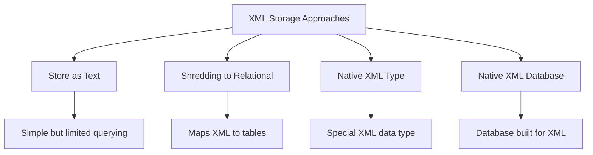

# XML in Databases

## Introduction

XML (eXtensible Markup Language) has become a fundamental technology for storing and exchanging structured data across different platforms and applications. As applications increasingly work with XML data, database systems have evolved to provide native support for XML storage, validation, and querying.

In this guide, we'll explore how modern database systems handle XML data, allowing you to leverage the flexibility of XML while maintaining the robust data management capabilities of a database.

## What is XML?

Before diving into databases, let's quickly review what XML is. XML is a markup language that defines rules for encoding documents in a format that is both human-readable and machine-readable. 

Here's a simple example of XML:

```xml
<?xml version="1.0" encoding="UTF-8"?>
<book>
  <title>Database Fundamentals</title>
  <author>John Smith</author>
  <year>2023</year>
  <chapters>
    <chapter id="1">Introduction to Databases</chapter>
    <chapter id="2">Relational Model</chapter>
    <chapter id="3">SQL Basics</chapter>
  </chapters>
</book>
```

Key characteristics of XML:
- Self-descriptive with custom tags
- Hierarchical structure with nested elements
- Support for attributes
- Schema validation capabilities

## Why XML in Databases?

Traditional relational databases are designed for structured data that fits neatly into tables with rows and columns. However, many modern applications work with:

1. **Semi-structured data** - data with a flexible structure
2. **Hierarchical data** - naturally nested information
3. **Document-oriented data** - complete documents that should be stored as a unit

XML provides a solution for these cases, and database systems have implemented various approaches to handle XML data effectively.

## Approaches to Storing XML in Databases

There are several ways databases handle XML data:



### 1. Storing XML as Text

The simplest approach is storing XML documents as text or CLOB (Character Large Object) fields in a database.

```sql
CREATE TABLE documents (
  doc_id INT PRIMARY KEY,
  doc_name VARCHAR(100),
  xml_content TEXT
);

INSERT INTO documents VALUES (1, 'sample.xml', '<book><title>Database Fundamentals</title>...</book>');
```

**Pros:**
- Simple implementation
- Preserves the complete document

**Cons:**
- Limited querying capabilities
- No validation
- Inefficient for partial updates

### 2. Shredding XML to Relational Tables

This approach maps XML elements to relational tables.

For our book example, we might create:

```sql
CREATE TABLE books (
  book_id INT PRIMARY KEY,
  title VARCHAR(200),
  author VARCHAR(100),
  year INT
);

CREATE TABLE chapters (
  chapter_id INT PRIMARY KEY,
  book_id INT,
  chapter_number INT,
  chapter_title VARCHAR(200),
  FOREIGN KEY (book_id) REFERENCES books(book_id)
);
```

**Pros:**
- Leverages standard SQL querying
- Good performance for predefined queries

**Cons:**
- Loss of original XML structure
- Schema changes require database changes
- Complex for deeply nested XML

### 3. Native XML Data Types

Many modern database systems include a dedicated XML data type with specialized functions.

#### Microsoft SQL Server Example

```sql
-- Create a table with an XML column
CREATE TABLE documents (
  doc_id INT PRIMARY KEY,
  doc_name VARCHAR(100),
  xml_content XML
);

-- Insert XML data
INSERT INTO documents (doc_id, doc_name, xml_content)
VALUES (
  1, 
  'book.xml',
  '<book>
    <title>Database Fundamentals</title>
    <author>John Smith</author>
    <year>2023</year>
    <chapters>
      <chapter id="1">Introduction to Databases</chapter>
      <chapter id="2">Relational Model</chapter>
    </chapters>
   </book>'
);

-- Query XML using XQuery expressions
SELECT 
  doc_id,
  doc_name,
  xml_content.value('(/book/title)[1]', 'VARCHAR(100)') AS BookTitle,
  xml_content.value('(/book/author)[1]', 'VARCHAR(100)') AS Author
FROM documents;
```

**Output:**
```
doc_id | doc_name  | BookTitle             | Author
-------|-----------|------------------------|------------
1      | book.xml  | Database Fundamentals | John Smith
```

#### Oracle Example

```sql
-- Create a table with XMLType
CREATE TABLE documents (
  doc_id NUMBER PRIMARY KEY,
  doc_name VARCHAR2(100),
  xml_content XMLTYPE
);

-- Insert XML data
INSERT INTO documents VALUES (
  1,
  'book.xml',
  XMLTYPE('<book>
    <title>Database Fundamentals</title>
    <author>John Smith</author>
    <year>2023</year>
    <chapters>
      <chapter id="1">Introduction to Databases</chapter>
      <chapter id="2">Relational Model</chapter>
    </chapters>
   </book>')
);

-- Query using XMLTable
SELECT d.doc_id, d.doc_name, x.title, x.author
FROM documents d,
  XMLTable('/book' PASSING d.xml_content
    COLUMNS
      title VARCHAR2(100) PATH 'title',
      author VARCHAR2(100) PATH 'author'
  ) x;
```

**Pros:**
- Preserves XML structure
- Specialized XML indexing
- Powerful XML querying capabilities

**Cons:**
- Performance may be less optimal than pure relational
- Database-specific implementations

### 4. Native XML Databases

These are databases specifically designed to store and process XML data. Examples include BaseX, eXist-DB, and MarkLogic.

```javascript
// Example using BaseX (XQuery)
for $book in collection('books')/book
where $book/year > 2020
return {
  'title': $book/title/text(),
  'author': $book/author/text()
}
```

## XML Schema Validation in Databases

Many databases that support XML also support XML Schema validation to enforce data integrity.

### PostgreSQL Example

```sql
-- Create a table with XML schema validation
CREATE TABLE validated_documents (
  doc_id SERIAL PRIMARY KEY,
  doc_name VARCHAR(100),
  xml_content XML,
  CONSTRAINT validate_xml CHECK (
    xml_content IS DOCUMENT AND
    xmlvalidate(xml_content AGAINST XMLSCHEMA '/path/to/schema.xsd')
  )
);
```

## Querying XML in Databases

The ability to query XML data is crucial. Most databases supporting XML implement either XPath, XQuery, or both.

### XPath Examples

XPath provides a way to navigate through elements and attributes in an XML document.

```sql
-- SQL Server XPath example
SELECT 
  doc_id,
  xml_content.value('(/book/title)[1]', 'VARCHAR(100)') AS Title,
  xml_content.query('/book/chapters/chapter') AS Chapters
FROM documents
WHERE xml_content.exist('/book[year>2020]') = 1;
```

### XQuery Examples

XQuery is a more powerful language designed specifically for querying XML data.

```sql
-- PostgreSQL XQuery example
SELECT 
  doc_id,
  xpath('//title/text()', xml_content) AS Title,
  xpath_exists('/book/chapters/chapter[@id="3"]', xml_content) AS HasChapter3
FROM documents;
```

## Practical Example: Product Catalog

Let's build a more comprehensive example for a real-world use case - a product catalog system that stores product information as XML.

```sql
-- Create a products table with XML content
CREATE TABLE products (
  product_id INT PRIMARY KEY,
  xml_data XML
);

-- Insert sample product data
INSERT INTO products VALUES (
  1,
  '<product category="electronics">
    <name>Smartphone X10</name>
    <brand>TechCorp</brand>
    <price currency="USD">699.99</price>
    <specifications>
      <screen>6.5 inches</screen>
      <processor>Octa-core 2.8GHz</processor>
      <ram>8GB</ram>
      <storage>128GB</storage>
      <camera>
        <rear>48MP</rear>
        <front>12MP</front>
      </camera>
      <battery>4500mAh</battery>
    </specifications>
    <colors>
      <color>Black</color>
      <color>Silver</color>
      <color>Blue</color>
    </colors>
  </product>'
);

INSERT INTO products VALUES (
  2,
  '<product category="electronics">
    <name>Laptop Pro</name>
    <brand>ComputeMaster</brand>
    <price currency="USD">1299.99</price>
    <specifications>
      <screen>15.6 inches</screen>
      <processor>Quad-core 3.2GHz</processor>
      <ram>16GB</ram>
      <storage>512GB SSD</storage>
      <graphics>Dedicated 6GB</graphics>
      <battery>10 hours</battery>
    </specifications>
    <colors>
      <color>Silver</color>
      <color>Space Gray</color>
    </colors>
  </product>'
);
```

### Querying the Product Catalog

Now, let's run some useful queries on our product catalog:

```sql
-- SQL Server query to list all products with prices
SELECT 
  product_id,
  xml_data.value('(/product/name)[1]', 'VARCHAR(100)') AS ProductName,
  xml_data.value('(/product/brand)[1]', 'VARCHAR(100)') AS Brand,
  xml_data.value('(/product/price)[1]', 'DECIMAL(10,2)') AS Price,
  xml_data.value('(/product/@category)[1]', 'VARCHAR(50)') AS Category
FROM products;

-- Find products with specific features
SELECT 
  product_id,
  xml_data.value('(/product/name)[1]', 'VARCHAR(100)') AS ProductName
FROM products
WHERE xml_data.exist('/product/specifications/ram[contains(text(), "16GB")]') = 1;

-- Extract all available colors for a product
SELECT 
  product_id,
  xml_data.value('(/product/name)[1]', 'VARCHAR(100)') AS ProductName,
  c.value('.', 'VARCHAR(50)') AS Color
FROM products
CROSS APPLY xml_data.nodes('/product/colors/color') AS colors(c);
```

## Updating XML Data

Most databases with XML support provide methods to update portions of XML documents.

### SQL Server Example

```sql
-- Update the price of a product
UPDATE products
SET xml_data.modify('
  replace value of (/product/price/text())[1]
  with "749.99"
')
WHERE product_id = 1;

-- Add a new color option
UPDATE products
SET xml_data.modify('
  insert <color>Red</color>
  into (/product/colors)[1]
')
WHERE product_id = 1;
```

## XML Indexing

For performance optimization, many databases offer indexing capabilities specific to XML data.

```sql
-- SQL Server XML index example
CREATE PRIMARY XML INDEX idx_xml_primary ON products(xml_data);

-- Create a secondary path index
CREATE XML INDEX idx_xml_path ON products(xml_data)
USING XML INDEX idx_xml_primary FOR PATH;
```

## Advantages and Limitations

### Advantages of XML in Databases

1. **Flexibility**: Can store complex hierarchical data structures
2. **Self-describing**: Data includes meta-information
3. **Schema Evolution**: Can adapt to changing data requirements
4. **Standard Format**: Widely used for data interchange

### Limitations

1. **Performance Overhead**: XML processing can be resource-intensive
2. **Storage Space**: XML documents require more storage than optimized relational data
3. **Complexity**: Querying can be more complex than standard SQL
4. **Learning Curve**: Additional languages (XPath/XQuery) to learn

## Best Practices

1. **Use XML appropriately**: Only for data that benefits from hierarchical structure
2. **Create proper indexes**: Important for performance
3. **Validate with schemas**: Ensure data integrity
4. **Consider shredding**: For frequently queried elements
5. **Benchmark performance**: Test XML operations against requirements

## Summary

XML in databases provides a powerful way to store, validate, and query hierarchical and semi-structured data. Modern database systems offer various approaches, from simple text storage to specialized XML types with powerful querying capabilities.

When working with XML in databases:
- Choose the appropriate storage approach based on your needs
- Leverage XML schemas for data validation
- Use XPath and XQuery for efficient data retrieval
- Apply indexing strategies for performance
- Consider the trade-offs between XML flexibility and relational efficiency

## Exercises

1. Create a database table that stores book information as XML, including title, authors, chapters, and publication details.
2. Write XPath queries to extract:
   - All books published after 2020
   - Books with more than 10 chapters
   - Authors who have written multiple books
3. Implement XML schema validation for your book XML
4. Compare the performance of storing book data as XML versus in a normalized relational structure

## Additional Resources

- [W3C XML Specification](https://www.w3.org/XML/)
- [XQuery Language Specification](https://www.w3.org/TR/xquery/)
- [XML Schema Definition](https://www.w3.org/XML/Schema)
- Your database's documentation for XML features:
  - [SQL Server XML Documentation](https://docs.microsoft.com/en-us/sql/relational-databases/xml/xml-data-sql-server)
  - [PostgreSQL XML Functions](https://www.postgresql.org/docs/current/functions-xml.html)
  - [Oracle XML DB Developer's Guide](https://docs.oracle.com/en/database/oracle/oracle-database/19/adxdb/)