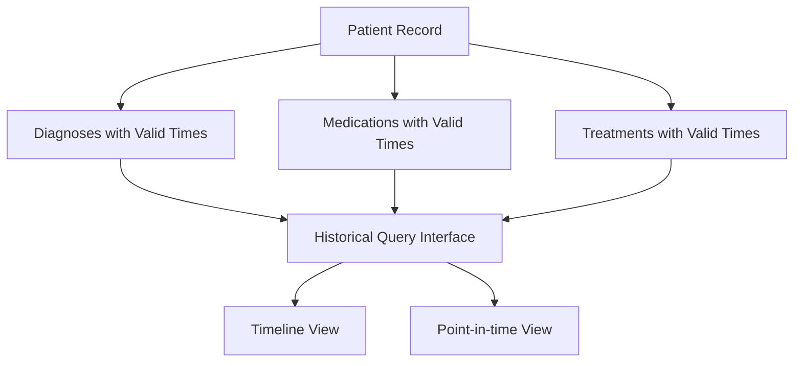
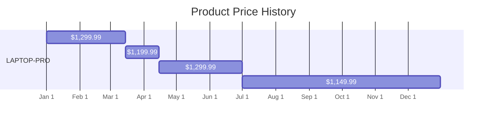

# Temporal Databases

## Introduction

Have you ever needed to track how data changes over time? Or wanted to see what a database looked like at a specific moment in the past? These are challenges that regular databases struggle with, but temporal databases excel at solving.

A **temporal database** is specifically designed to store and query data that changes over time. Unlike traditional databases that only store the current state of data, temporal databases maintain historical states, allowing you to query both current and past information.

In this article, we'll explore how temporal databases work, their key features, and how you can use them in real-world applications.

## What Makes a Database "Temporal"?

Traditional databases operate on the principle of **destructive updates** - when you modify a record, the previous value is overwritten and lost forever. This approach is simple but discards valuable historical information.

Temporal databases, on the other hand, use **non-destructive updates** - they preserve the history of data changes by adding time dimensions to the data. This allows you to:

- See what the data looked like at any point in time
- Track how data evolved over time
- Determine when changes occurred and who made them
- Restore data to previous states

## Time Dimensions in Temporal Databases

Temporal databases typically work with three distinct dimensions of time:

1. **Valid Time**: When a fact is true in the real world
2. **Transaction Time**: When a fact is recorded in the database
3. **Decision Time**: When a decision about the data was made

Let's explore each of these concepts with examples.

### Valid Time

Valid time represents when information is true in the real world, regardless of when it was recorded in the database.

For example, consider an employee's department history:

```sql
-- Sample temporal table with valid time
CREATE TABLE employee_department (
  employee_id INTEGER,
  department_name VARCHAR(100),
  valid_from DATE,
  valid_to DATE
);

-- Employee 101 worked in Engineering from Jan 1, 2023 to May 31, 2023
INSERT INTO employee_department VALUES 
  (101, 'Engineering', '2023-01-01', '2023-05-31');

-- Then transferred to Marketing from June 1, 2023 onwards
INSERT INTO employee_department VALUES 
  (101, 'Marketing', '2023-06-01', NULL);
```

The `valid_from` and `valid_to` columns define when each record is considered true in reality. A `NULL` in `valid_to` typically means "until further notice" or "current".

### Transaction Time

Transaction time captures when data was actually recorded in the database system.

```sql
CREATE TABLE employee_department_system (
  employee_id INTEGER,
  department_name VARCHAR(100),
  system_from TIMESTAMP,  -- When this record was inserted
  system_to TIMESTAMP     -- When this record was logically deleted
);

-- Record inserted on Jan 5, 2023 (maybe with retroactive valid date)
INSERT INTO employee_department_system VALUES 
  (101, 'Engineering', '2023-01-05 14:30:00', NULL);

-- Record updated on June 2, 2023
-- First, close the previous record:
UPDATE employee_department_system 
SET system_to = '2023-06-02 09:15:00'
WHERE employee_id = 101 AND system_to IS NULL;

-- Then insert the new record:
INSERT INTO employee_department_system VALUES 
  (101, 'Marketing', '2023-06-02 09:15:00', NULL);
```

This tracks when changes were actually made in the database system, which might differ from when the change became valid in the real world.

### Bitemporal Data

A database that supports both valid time and transaction time is called a **bitemporal database**. This powerful combination allows you to:

1. See what the database recorded at any point in time
2. See what was believed to be true at any point in time
3. Correct historical records while maintaining an audit trail

```sql
CREATE TABLE employee_bitemporal (
  employee_id INTEGER,
  department_name VARCHAR(100),
  valid_from DATE,        -- When this became true in reality
  valid_to DATE,          -- When this stopped being true in reality
  system_from TIMESTAMP,  -- When this record was inserted
  system_to TIMESTAMP     -- When this record was logically deleted
);
```

With this design, you can ask complex questions like "What did we think last year about which department this employee worked in during 2020?"

## Temporal Query Examples

Let's explore how to query temporal data with some examples:

### Find Current State

```sql
-- Find current department for employee 101
SELECT department_name
FROM employee_department
WHERE employee_id = 101
AND valid_from <= CURRENT_DATE
AND (valid_to IS NULL OR valid_to > CURRENT_DATE);
```

### Historical Query

```sql
-- What department was employee 101 in on March 15, 2023?
SELECT department_name
FROM employee_department
WHERE employee_id = 101
AND valid_from <= '2023-03-15'
AND (valid_to IS NULL OR valid_to > '2023-03-15');
```

### Finding Changes Over Time

```sql
-- List all departments employee 101 has worked in, with duration
SELECT 
  department_name,
  valid_from,
  COALESCE(valid_to, CURRENT_DATE) as effective_to,
  DATEDIFF(day, valid_from, COALESCE(valid_to, CURRENT_DATE)) as days_in_dept
FROM employee_department
WHERE employee_id = 101
ORDER BY valid_from;
```

## Implementing Temporal Features

There are several ways to work with temporal data:

1. **Use a database with built-in temporal features**
   - SQL Server Temporal Tables
   - PostgreSQL with temporal extensions
   - Oracle Flashback Technology

2. **Design your own temporal schema**
   - Add valid_from/valid_to columns
   - Implement triggers for transaction time tracking
   - Create temporal query functions

Let's see how SQL Server implements temporal tables:

```sql
-- SQL Server temporal table example
CREATE TABLE employee_temporal (
  employee_id INT PRIMARY KEY,
  department_name VARCHAR(100),
  salary DECIMAL(10, 2),
  
  -- Period columns for system versioning
  valid_from DATETIME2 GENERATED ALWAYS AS ROW START,
  valid_to DATETIME2 GENERATED ALWAYS AS ROW END,
  
  -- Specify the period
  PERIOD FOR SYSTEM_TIME (valid_from, valid_to)
)
WITH (SYSTEM_VERSIONING = ON);
```

With this setup, SQL Server automatically:
- Maintains a history table
- Updates the time period columns
- Provides syntax for temporal queries

## Querying Temporal Data

SQL:2011 introduced standardized syntax for temporal queries:

```sql
-- Current data (default behavior)
SELECT * FROM employee_temporal;

-- Data as of a specific point in time
SELECT * FROM employee_temporal
FOR SYSTEM_TIME AS OF '2023-03-15';

-- Data within a time range
SELECT * FROM employee_temporal
FOR SYSTEM_TIME FROM '2023-01-01' TO '2023-06-30';

-- All historical versions of a row
SELECT * FROM employee_temporal
FOR SYSTEM_TIME ALL
WHERE employee_id = 101
ORDER BY valid_from;
```

## Real-World Applications

Temporal databases are valuable in many domains:

### Financial Systems

Banks and financial institutions use temporal databases to:

- Maintain audit trails for compliance
- Track account balances over time
- Record the history of transactions and corrections

```sql
-- Find account balance at end of each month in 2023
SELECT 
  FORMAT(valid_from, 'yyyy-MM') as month,
  balance
FROM account_balance_history
WHERE account_id = 'A12345'
AND valid_from >= '2023-01-01' AND valid_from <= '2023-12-31'
AND (valid_to IS NULL OR valid_to > LAST_DAY(valid_from))
ORDER BY valid_from;
```

### Healthcare Records

Medical systems use temporal databases to:

- Record patient medical history
- Track medication changes over time
- Ensure accurate billing for services



### Inventory and Supply Chain

Retail and logistics companies use temporal data to:

- Track inventory levels over time
- Analyze seasonal patterns
- Monitor price changes

```sql
-- Find when a product fell below minimum stock level
SELECT product_id, valid_from as stock_drop_date
FROM inventory_history
WHERE product_id = 'P789'
AND quantity < minimum_quantity
AND valid_from >= '2023-01-01'
ORDER BY valid_from;
```

## Designing a Simple Temporal System

Let's walk through creating a simplified temporal system for tracking product prices:

### 1. Create the temporal table structure

```sql
CREATE TABLE product_prices (
  product_id VARCHAR(20),
  price DECIMAL(10, 2),
  valid_from DATE NOT NULL,
  valid_to DATE,
  
  -- Ensure there are no overlapping valid time periods
  CONSTRAINT no_overlap CHECK (valid_to IS NULL OR valid_from < valid_to),
  
  -- Composite primary key including time dimension
  PRIMARY KEY (product_id, valid_from)
);
```

### 2. Create functions for inserting temporal data

```sql
-- Function to add a new price with automatic handling of valid_to
CREATE OR REPLACE FUNCTION update_product_price(
  p_product_id VARCHAR(20),
  p_price DECIMAL(10, 2),
  p_valid_from DATE
)
RETURNS VOID AS $$
BEGIN
  -- Close the current price period if one exists
  UPDATE product_prices
  SET valid_to = p_valid_from
  WHERE product_id = p_product_id
    AND valid_to IS NULL
    AND valid_from < p_valid_from;
  
  -- Insert the new price
  INSERT INTO product_prices (product_id, price, valid_from, valid_to)
  VALUES (p_product_id, p_price, p_valid_from, NULL);
END;
$$ LANGUAGE plpgsql;
```

### 3. Add data and query it

```sql
-- Set initial price
SELECT update_product_price('LAPTOP-PRO', 1299.99, '2023-01-01');

-- Price change for spring sale
SELECT update_product_price('LAPTOP-PRO', 1199.99, '2023-03-15');

-- Price back to normal
SELECT update_product_price('LAPTOP-PRO', 1299.99, '2023-04-15');

-- Summer discount
SELECT update_product_price('LAPTOP-PRO', 1149.99, '2023-07-01');

-- Query the price at different points in time
SELECT product_id, price
FROM product_prices
WHERE product_id = 'LAPTOP-PRO'
  AND valid_from <= '2023-02-01'
  AND (valid_to IS NULL OR valid_to > '2023-02-01');

-- Result: 1299.99

SELECT product_id, price
FROM product_prices
WHERE product_id = 'LAPTOP-PRO'
  AND valid_from <= '2023-04-01'
  AND (valid_to IS NULL OR valid_to > '2023-04-01');

-- Result: 1199.99
```

### 4. View the complete price history

```sql
SELECT 
  product_id,
  price,
  valid_from,
  COALESCE(valid_to, 'Present') as valid_until,
  CASE 
    WHEN valid_to IS NOT NULL 
    THEN valid_to - valid_from
    ELSE CURRENT_DATE - valid_from
  END as days_active
FROM product_prices
WHERE product_id = 'LAPTOP-PRO'
ORDER BY valid_from;
```

## Visualization: Price Changes Over Time

We can visualize the price changes using a simple chart:



## Performance Considerations

Temporal databases come with some performance challenges:

1. **Increased storage requirements** - Storing history naturally requires more space
2. **Query complexity** - Temporal queries are more complex and may be slower
3. **Index design** - Need careful index planning for temporal columns

To optimize performance:

- Create appropriate indexes on temporal columns
- Consider partitioning large temporal tables by time periods
- Implement data retention policies for very old historical data
- Use materialized views for common temporal queries

```sql
-- Create indexes to optimize temporal queries
CREATE INDEX idx_product_prices_temporal 
ON product_prices (product_id, valid_from, valid_to);

-- Create index specifically for "as-of" queries
CREATE INDEX idx_product_prices_asof
ON product_prices (product_id, valid_from);
```

## Summary

Temporal databases provide powerful capabilities for tracking data changes over time, enabling historical analysis, auditing, and point-in-time recovery. Key takeaways include:

- Temporal databases track data across valid time, transaction time, or both
- They enable non-destructive updates, preserving historical information
- SQL:2011 introduced standardized syntax for temporal queries
- Real-world applications include finance, healthcare, and supply chain management
- Implementing temporal features requires careful schema design and query patterns
- Performance optimization is important for large temporal datasets

By incorporating temporal concepts into your database design, you gain the ability to answer not just "what" but also "when" and "how" data has changed—a capability that's increasingly valuable in today's data-driven world.

## Exercises

1. Design a temporal database schema for tracking employee salary history.
2. Write a query to find what an employee's salary was on a specific date.
3. Implement a function that updates a temporal record while maintaining history.
4. Create a visualization of how a particular data point has changed over time.
5. Implement a bitemporal table that tracks both when changes were valid and when they were recorded.

## Further Resources

- SQL:2011 standard documentation
- "Developing Time-Oriented Database Applications in SQL" by Richard T. Snodgrass
- "Managing Time in Relational Databases" by Tom Johnston
- Database-specific documentation:
  - PostgreSQL Temporal Tables
  - SQL Server Temporal Tables
  - Oracle Flashback Technology