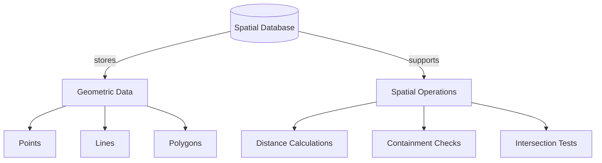

# Spatial Databases

## Introduction

Spatial databases are specialized database systems designed to store, manage, and query data that represents objects defined in a geometric space. Unlike traditional databases that primarily handle alphanumeric data, spatial databases are optimized for storing and querying data that represents objects like points, lines, polygons, and more complex geometric shapes.

Think of a spatial database as a regular database with superpowers - it not only stores what something is but also where it is. This geographic aspect opens up powerful possibilities for applications ranging from mapping services to location-based analytics.

## What Makes Spatial Databases Special?

Spatial databases extend traditional database systems with:

1. **Spatial Data Types** - Special data types for representing geometric objects
2. **Spatial Indexing** - Optimized structures to quickly retrieve spatial data
3. **Spatial Functions** - Operations that can be performed on geometric data
4. **Spatial Query Language** - Extensions to SQL for spatial operations

## Common Spatial Data Types

Spatial databases support various geometric data types:

- **Point** - A single location (e.g., a city on a map)
- **LineString** - A sequence of points (e.g., a road or river)
- **Polygon** - A closed area (e.g., a lake or country boundary)
- **MultiPoint** - A collection of points
- **MultiLineString** - A collection of linestrings
- **MultiPolygon** - A collection of polygons
- **GeometryCollection** - A collection of different geometries

## Popular Spatial Database Systems

Several database systems provide spatial capabilities:

1. **PostGIS** - A spatial extension for PostgreSQL
2. **Oracle Spatial** - Oracle's spatial database component
3. **SQL Server Spatial** - Microsoft's implementation
4. **MySQL Spatial** - MySQL's spatial extension
5. **MongoDB Geospatial** - Document database with spatial support
6. **Neo4j Spatial** - Graph database with spatial capabilities

For our examples, we'll focus primarily on PostGIS as it's open-source and widely used.

## Setting Up a Spatial Database

Let's look at how to set up PostGIS (assuming PostgreSQL is already installed):

```sql
-- Create a database
CREATE DATABASE spatial_examples;

-- Connect to the database
\c spatial_examples

-- Add the PostGIS extension
CREATE EXTENSION postgis;

-- Verify the installation
SELECT PostGIS_version();
```

Output:
```
            postgis_version            
---------------------------------------
 3.1 USE_GEOS=1 USE_PROJ=1 USE_STATS=1
```

## Creating and Inserting Spatial Data

Let's create a table to store some spatial data:

```sql
-- Create a table for storing locations of coffee shops
CREATE TABLE coffee_shops (
    id SERIAL PRIMARY KEY,
    name VARCHAR(100) NOT NULL,
    location GEOGRAPHY(POINT) NOT NULL,
    opening_date DATE,
    rating DECIMAL(3,2)
);

-- Insert some sample data (using WKT format)
INSERT INTO coffee_shops (name, location, opening_date, rating)
VALUES 
    ('Beans & Brews', ST_GeographyFromText('POINT(-122.331429 47.609772)'), '2019-03-15', 4.7),
    ('Coffee Haven', ST_GeographyFromText('POINT(-122.336226 47.605356)'), '2018-01-10', 4.3),
    ('Espresso Express', ST_GeographyFromText('POINT(-122.335560 47.618697)'), '2020-06-22', 4.9);
```

In the example above:
- We create a table with a GEOGRAPHY column that stores POINT data
- We use the `ST_GeographyFromText` function to convert Well-Known Text (WKT) format into geometry
- The coordinates are in longitude/latitude format (longitude first, then latitude)

## Basic Spatial Queries

Now, let's run some basic spatial queries:

### Finding all coffee shops within a certain distance

```sql
-- Find all coffee shops within 1km of a specific location (Seattle Central Library)
SELECT name, 
       rating, 
       ST_Distance(location, ST_GeographyFromText('POINT(-122.332709 47.606503)')) AS distance_meters
FROM coffee_shops
WHERE ST_DWithin(location, ST_GeographyFromText('POINT(-122.332709 47.606503)'), 1000)
ORDER BY distance_meters;
```

Potential output:
```
      name       | rating | distance_meters
-----------------+--------+-----------------
 Beans & Brews   |   4.70 |         354.65
 Coffee Haven    |   4.30 |         572.83
```

### Finding the nearest coffee shop

```sql
-- Find the nearest coffee shop to a specific location
SELECT name, 
       rating,
       ST_Distance(location, ST_GeographyFromText('POINT(-122.332709 47.606503)')) AS distance_meters
FROM coffee_shops
ORDER BY location <-> ST_GeographyFromText('POINT(-122.332709 47.606503)')
LIMIT 1;
```

Potential output:
```
      name      | rating | distance_meters
----------------+--------+-----------------
 Beans & Brews  |   4.70 |         354.65
```

## Spatial Indexing

For larger datasets, spatial queries can become slow without proper indexing. Spatial databases use special index structures (like R-trees) to speed up spatial searches:

```sql
-- Add a spatial index to the location column
CREATE INDEX idx_coffee_shops_location ON coffee_shops USING GIST(location);
```

With this index, spatial queries that use the location column will run much faster, especially with larger datasets.

## Spatial Relationships

Spatial databases can determine relationships between geometric objects:

```sql
-- Create a table for neighborhoods
CREATE TABLE neighborhoods (
    id SERIAL PRIMARY KEY,
    name VARCHAR(100) NOT NULL,
    boundary GEOGRAPHY(POLYGON) NOT NULL
);

-- Insert sample data
INSERT INTO neighborhoods (name, boundary)
VALUES ('Downtown', ST_GeographyFromText('POLYGON((-122.345 47.612, -122.320 47.612, -122.320 47.602, -122.345 47.602, -122.345 47.612))'));

-- Find which neighborhood a coffee shop is in
SELECT c.name AS coffee_shop, n.name AS neighborhood
FROM coffee_shops c
JOIN neighborhoods n ON ST_Contains(n.boundary, c.location)
ORDER BY c.name;
```

Potential output:
```
   coffee_shop   | neighborhood
-----------------+-------------
 Beans & Brews   | Downtown
 Coffee Haven    | Downtown
```

## Visualizing Spatial Data with Mermaid

We can use Mermaid to create simple visualizations:



## Real-world Applications

Spatial databases power many applications we use daily:

### 1. Location-based Services

Mobile apps use spatial databases to find nearby restaurants, stores, or services:

```sql
-- Find the 5 nearest coffee shops to a user's location
SELECT name, 
       rating,
       ST_Distance(location, ST_GeographyFromText('POINT(-122.335 47.610)')) AS distance_meters
FROM coffee_shops
ORDER BY location <-> ST_GeographyFromText('POINT(-122.335 47.610)')
LIMIT 5;
```

### 2. Logistics and Route Planning

Delivery companies use spatial databases to optimize routes:

```sql
-- Find delivery destinations within a driver's zone
SELECT address, customer_name
FROM deliveries
WHERE ST_Contains(
    (SELECT zone_boundary FROM delivery_zones WHERE driver_id = 123),
    location
);
```

### 3. Environmental Analysis

Environmental scientists use spatial databases to analyze geographic patterns:

```sql
-- Find areas where pollution levels exceed thresholds
SELECT region_name, pollution_level
FROM environmental_readings
WHERE pollution_level > 50
AND ST_Intersects(
    location,
    (SELECT boundary FROM protected_areas WHERE name = 'National Park')
);
```

### 4. Real Estate

Property websites use spatial databases to search for homes in specific areas:

```sql
-- Find properties in a school district with specific amenities
SELECT p.address, p.price, p.bedrooms
FROM properties p
JOIN school_districts sd ON ST_Contains(sd.boundary, p.location)
WHERE sd.name = 'Westside School District'
AND p.price < 500000
AND ST_DWithin(p.location, 
    (SELECT location FROM amenities WHERE type = 'Park' ORDER BY p.location <-> location LIMIT 1),
    1000);
```

## Advanced Spatial Concepts

### Coordinate Reference Systems (CRS)

Spatial data needs a coordinate system to define locations. Common systems include:

- **WGS84** (EPSG:4326) - Used for GPS, longitude/latitude in degrees
- **Web Mercator** (EPSG:3857) - Used by Google Maps, Bing Maps, etc.

You can transform between different systems:

```sql
-- Transform a point from WGS84 to Web Mercator
SELECT ST_Transform(
    ST_SetSRID(ST_MakePoint(-122.335, 47.610), 4326),
    3857
);
```

### Spatial Analysis

Spatial databases enable complex analysis:

```sql
-- Create a buffer around a point (all areas within 1km)
SELECT ST_Buffer(ST_GeographyFromText('POINT(-122.335 47.610)'), 1000);

-- Find the area where two regions overlap
SELECT ST_Intersection(
    (SELECT boundary FROM regions WHERE name = 'Region A'),
    (SELECT boundary FROM regions WHERE name = 'Region B')
);

-- Calculate the total area of a polygon in square kilometers
SELECT ST_Area(boundary)/1000000 AS area_sq_km
FROM regions
WHERE name = 'Downtown';
```

## Summary

Spatial databases extend traditional database systems with the ability to store and manipulate geometric data. They provide:

- Specialized data types for points, lines, polygons, and other geometries
- Functions for spatial operations like distance calculation and containment
- Spatial indexing for efficient queries
- Support for various coordinate systems

With these capabilities, spatial databases power a wide range of applications from mapping services and location-based apps to complex geographical analysis tools.

## Exercises

1. Create a table to store the locations of restaurants in your city.
2. Write a query to find all restaurants within 500 meters of your home.
3. Create a polygon representing your neighborhood and find all restaurants within it.
4. Calculate the distance between the furthest two restaurants in your dataset.
5. Create a buffer of 1km around a river (linestring) and find all properties that fall within this buffer.

## Additional Resources

- [PostGIS Documentation](https://postgis.net/docs/)
- [Introduction to GIS Concepts](https://docs.qgis.org/3.16/en/docs/gentle_gis_introduction/)
- [Open Geospatial Consortium (OGC) Standards](https://www.ogc.org/standards/)
- [QGIS - Open Source Geographic Information System](https://qgis.org/)