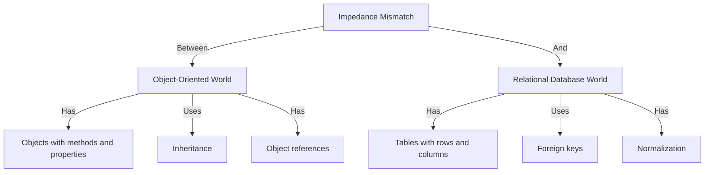
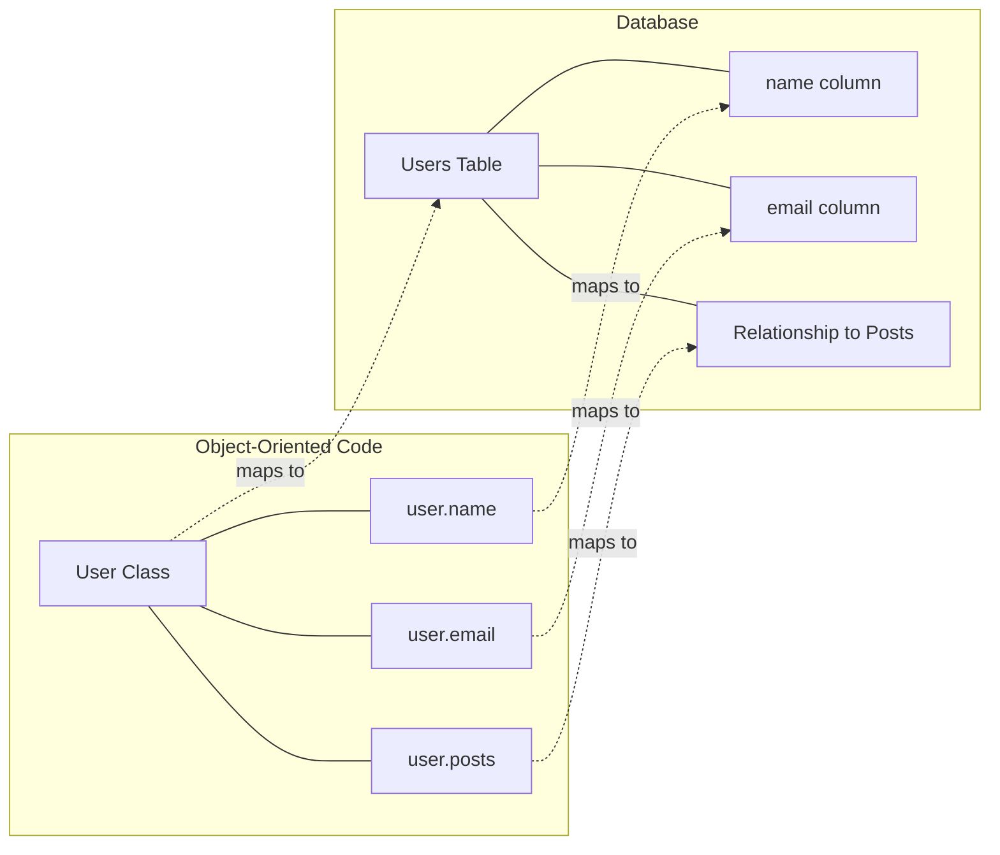

# Object-Relational Mapping

## Introduction

Have you ever struggled with writing SQL queries in your object-oriented application? Or found yourself constantly converting between database rows and your application's objects? **Object-Relational Mapping (ORM)** is the solution to these common challenges.

ORM is a programming technique that creates a "virtual object database" that can be used from within your programming language. It essentially acts as a bridge between relational databases and object-oriented programming languages, allowing developers to work with databases using familiar object-oriented concepts rather than SQL.

## The Object-Relational Impedance Mismatch

Before diving into ORM, it's important to understand the problem it solves: the **object-relational impedance mismatch**.

This term describes the difficulties that occur when trying to use relational database systems with programming languages that are based on object-oriented programming concepts:



The mismatch comes from fundamental differences between these two paradigms:

1. **Objects vs. Tables**: Objects encapsulate both data and behavior, while database tables only store data.
2. **Inheritance**: Object-oriented languages support inheritance hierarchies, while relational databases typically don't.
3. **Identity**: Object identity vs. primary key values.
4. **Associations**: Object references vs. foreign keys.
5. **Data Navigation**: Traversing object graphs vs. joining tables.

## How ORM Works

ORMs solve this mismatch by:

1. **Mapping classes to tables**: Your Java/Python/C# classes map to database tables.
2. **Mapping objects to rows**: Each object instance corresponds to a row in that table.
3. **Mapping attributes to columns**: Object properties/fields map to table columns.
4. **Handling relationships**: Object references become foreign key relationships.

Let's visualize this:



## Popular ORM Frameworks

Different programming languages have their own ORM frameworks:

- **Java**: Hibernate, JPA
- **Python**: SQLAlchemy, Django ORM
- **JavaScript/Node.js**: Sequelize, TypeORM
- **Ruby**: Active Record (Rails)
- **C#/.NET**: Entity Framework
- **PHP**: Doctrine, Eloquent (Laravel)

## ORM in Practice

Let's see a practical example of using ORM compared to traditional SQL:

### Example 1: Without ORM (using SQL and manual mapping)

```javascript
// Using raw SQL in JavaScript
const db = require('some-database-library');

// Creating a user
function createUser(name, email) {
  const query = 'INSERT INTO users (name, email) VALUES (?, ?)';
  db.execute(query, [name, email]);
}

// Finding a user
function findUserById(id) {
  const query = 'SELECT * FROM users WHERE id = ?';
  const result = db.execute(query, [id]);
  
  // Manual mapping from row to object
  if (result.rows.length > 0) {
    const row = result.rows[0];
    return {
      id: row.id,
      name: row.name,
      email: row.email
    };
  }
  return null;
}

// Usage
createUser('Alice', 'alice@example.com');
const user = findUserById(1);
console.log(user.name); // Alice
```

### Example 2: With ORM (using Sequelize for JavaScript)

```javascript
// Using Sequelize ORM
const { Sequelize, DataTypes } = require('sequelize');
const sequelize = new Sequelize('database', 'username', 'password', {
  host: 'localhost',
  dialect: 'mysql'
});

// Define model
const User = sequelize.define('User', {
  name: {
    type: DataTypes.STRING,
    allowNull: false
  },
  email: {
    type: DataTypes.STRING,
    allowNull: false,
    unique: true
  }
});

// Sync model with database
sequelize.sync();

// Usage
async function example() {
  // Create user
  await User.create({
    name: 'Alice',
    email: 'alice@example.com'
  });
  
  // Find user
  const user = await User.findByPk(1);
  console.log(user.name); // Alice
}

example();
```

Notice how:
1. We're working directly with `User` objects, not SQL queries
2. Model definition happens once, then is reused
3. Common operations like CRUD are simplified to method calls

## Adding Relationships

One of ORM's strengths is handling relationships between objects:

### Example: One-to-Many Relationship

```javascript
// Define models with a one-to-many relationship
const User = sequelize.define('User', {
  name: DataTypes.STRING,
  email: DataTypes.STRING
});

const Post = sequelize.define('Post', {
  title: DataTypes.STRING,
  content: DataTypes.TEXT
});

// Define the relationship
User.hasMany(Post);
Post.belongsTo(User);

// Usage
async function example() {
  const user = await User.create({
    name: 'Bob',
    email: 'bob@example.com'
  });
  
  // Create a post associated with the user
  await Post.create({
    title: 'My First Post',
    content: 'Hello world!',
    UserId: user.id  // The foreign key is automatically named
  });
  
  // Find user with their posts
  const userWithPosts = await User.findByPk(user.id, {
    include: Post
  });
  
  console.log(userWithPosts.name); // Bob
  console.log(userWithPosts.Posts[0].title); // My First Post
}
```

## Advantages of ORM

1. **Productivity**: Reduces boilerplate code for database operations.
2. **Maintainability**: Centralizes database schema and business logic.
3. **Abstraction**: Hides SQL complexity behind object-oriented interfaces.
4. **Database Agnosticism**: Easily switch between different database systems.
5. **Security**: Many ORMs include features to prevent SQL injection.

## Disadvantages of ORM

1. **Performance Overhead**: Can generate inefficient SQL for complex queries.
2. **Learning Curve**: You need to learn the ORM's specific way of doing things.
3. **Loss of Control**: You might lose direct control over the SQL being executed.
4. **Complexity**: For very simple applications, an ORM might be overkill.

## When to Use ORM

ORM is most beneficial when:

- You're building a medium to large scale application
- Your application is heavily object-oriented
- You need to maintain complex entity relationships
- You want to focus on business logic rather than database operations
- You might need to change database providers in the future

ORM might not be necessary when:

- Your application is very small or simple
- You have very specific performance requirements
- You need fine-grained control over SQL generation
- You're working with a legacy database with a complex schema

## Common ORM Patterns

### Active Record Pattern

The Active Record pattern merges the database access logic with the domain model. The entity object knows how to save itself to the database.

```python
# Python example with Django ORM (Active Record pattern)
from django.db import models

class User(models.Model):
    name = models.CharField(max_length=100)
    email = models.EmailField(unique=True)
    
    def __str__(self):
        return self.name

# Usage
user = User(name="Charlie", email="charlie@example.com")
user.save()  # The object knows how to save itself

found_user = User.objects.get(id=1)  # The class knows how to query
```

### Data Mapper Pattern

The Data Mapper pattern separates the domain model from the database access logic. A separate mapper class handles the database operations.

```java
// Java example with a Data Mapper approach
// Domain class
public class User {
    private Long id;
    private String name;
    private String email;
    
    // Getters and setters
    public Long getId() { return id; }
    public void setId(Long id) { this.id = id; }
    public String getName() { return name; }
    // ...
}

// Mapper class
public class UserMapper {
    public void save(User user) {
        // Database operations to save the user
    }
    
    public User findById(Long id) {
        // Database operations to find the user
        return user;
    }
}

// Usage
User user = new User();
user.setName("David");
user.setEmail("david@example.com");

UserMapper mapper = new UserMapper();
mapper.save(user);

User found = mapper.findById(1L);
```

## Implementing an ORM System

Let's implement a very simple ORM system in JavaScript to understand the core concepts:

```javascript
// A very simple ORM implementation

class Model {
  constructor(attributes = {}) {
    // Set initial attributes
    this._attributes = {};
    
    // Assign properties from attributes
    for (const key in attributes) {
      this[key] = attributes[key];
      this._attributes[key] = attributes[key];
    }
  }
  
  // Save the model to the database
  async save() {
    if (this.id) {
      // Update existing record
      return await this.constructor._update(this.id, this._attributes);
    } else {
      // Create new record
      const result = await this.constructor._create(this._attributes);
      this.id = result.id;
      return this;
    }
  }
  
  // Find a model by ID
  static async findById(id) {
    const data = await this._query(`SELECT * FROM ${this.tableName} WHERE id = ?`, [id]);
    if (data.length === 0) return null;
    
    return new this(data[0]);
  }
  
  // Find all models
  static async findAll() {
    const data = await this._query(`SELECT * FROM ${this.tableName}`);
    return data.map(item => new this(item));
  }
  
  // Private methods for database operations
  static async _query(sql, params = []) {
    // Implementation depends on your database library
    return db.query(sql, params);
  }
  
  static async _create(attributes) {
    const fields = Object.keys(attributes).join(', ');
    const placeholders = Object.keys(attributes).map(() => '?').join(', ');
    const values = Object.values(attributes);
    
    const sql = `INSERT INTO ${this.tableName} (${fields}) VALUES (${placeholders})`;
    const result = await this._query(sql, values);
    
    return { id: result.insertId, ...attributes };
  }
  
  static async _update(id, attributes) {
    const sets = Object.keys(attributes).map(key => `${key} = ?`).join(', ');
    const values = Object.values(attributes);
    
    const sql = `UPDATE ${this.tableName} SET ${sets} WHERE id = ?`;
    await this._query(sql, [...values, id]);
    
    return { id, ...attributes };
  }
}

// Example usage of our simple ORM
class User extends Model {
  static tableName = 'users';
}

// Now we can use it
async function example() {
  // Create a user
  const user = new User({ name: 'Eve', email: 'eve@example.com' });
  await user.save();
  
  // Find a user
  const foundUser = await User.findById(1);
  console.log(foundUser.name); // Eve
  
  // Update a user
  foundUser.name = 'Eve Updated';
  await foundUser.save();
  
  // Find all users
  const allUsers = await User.findAll();
  console.log(allUsers.length);
}
```

This simple implementation demonstrates the core concepts behind an ORM system. Real ORM frameworks are much more sophisticated, but they follow similar principles.

## Best Practices When Using ORM

1. **Understand the generated SQL**: Use debugging tools to view the SQL that your ORM generates.
2. **Don't treat the ORM as a black box**: Learn how it works under the hood.
3. **Use eager loading for relationships**: Avoid the N+1 query problem.
4. **Consider raw SQL for complex queries**: Sometimes raw SQL is more efficient.
5. **Keep your models thin**: Avoid putting too much business logic in your models.
6. **Use migrations for schema changes**: Track database changes with migration scripts.
7. **Set up proper indexing**: ORMs don't automatically optimize your database schema.

## Summary

Object-Relational Mapping (ORM) is a powerful technique that bridges the gap between relational databases and object-oriented programming. It allows developers to work with database data using familiar object-oriented paradigms, increasing productivity and maintainability.

Key takeaways:

1. ORM solves the object-relational impedance mismatch
2. It maps classes to tables, objects to rows, and attributes to columns
3. Popular frameworks include Hibernate, SQLAlchemy, Sequelize, and Entity Framework
4. ORM offers significant productivity benefits but may have performance implications
5. Understanding the underlying SQL generation is crucial for effective ORM use

## Exercises

1. Choose an ORM framework for your preferred programming language and implement a simple blog system with `User` and `Post` models.
2. Compare the SQL generated by an ORM with the SQL you would write manually for the same operations.
3. Implement a simple ORM system from scratch (similar to our example but more robust).
4. Research and compare the performance of raw SQL queries versus ORM-generated queries for a complex join operation.

## Additional Resources

- **Documentation for Popular ORMs**:
  - [Sequelize (JavaScript)](https://sequelize.org/)
  - [Hibernate (Java)](https://hibernate.org/)
  - [SQLAlchemy (Python)](https://www.sqlalchemy.org/)
  - [Entity Framework (C#)](https://docs.microsoft.com/en-us/ef/)

- **Books**:
  - "Database Design for Mere Mortals" by Michael J. Hernandez
  - "SQL Antipatterns" by Bill Karwin
  - "Patterns of Enterprise Application Architecture" by Martin Fowler

- **Online Courses**:
  - Search for courses on ORM, database design, and specific ORM frameworks on platforms like Coursera, Udemy, and Pluralsight