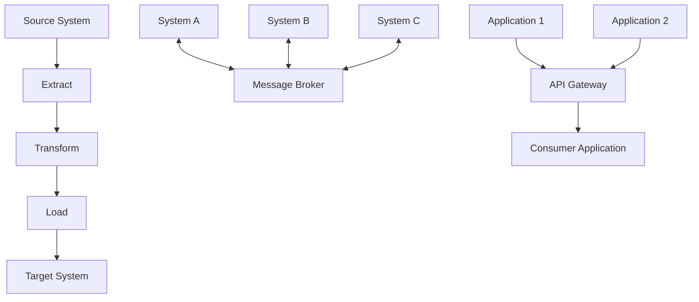
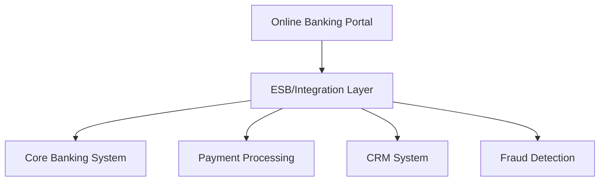

# Enterprise Application Integration (EAI)

## Introduction

Enterprise Application Integration (EAI) is a strategic approach to connecting disparate applications and systems within an organization to allow them to work together seamlessly. In today's business environment, companies often rely on numerous specialized applications for different business processes—from accounting and inventory management to customer relationship management and human resources. The challenge arises when these systems need to communicate with each other but were not originally designed to do so.

EAI solves this problem by providing frameworks, technologies, and methodologies that enable different applications to share data and business processes without requiring extensive manual intervention or custom point-to-point connections.

## Why EAI is Important

Enterprise Application Integration addresses several critical business challenges:

1. **Eliminating Data Silos**: Without integration, data remains trapped in separate systems, limiting its value.
2. **Reducing Manual Processes**: Integration automates data transfer between systems, reducing error-prone manual data entry.
3. **Enabling Business Process Automation**: Connected systems allow for end-to-end automation of complex business workflows.
4. **Supporting Business Agility**: Well-integrated systems can adapt more quickly to changing business requirements.
5. **Maximizing Return on Investment**: Integration extends the useful life of legacy systems by connecting them with newer applications.

## Core EAI Concepts

### Integration Styles

EAI solutions typically implement one or more of the following integration styles:

<div className="integration-styles">

1. **Data Integration**: Focuses on moving data between multiple sources
2. **Application Interface Integration**: Connects applications via their APIs or interfaces
3. **Business Process Integration**: Coordinates processes across multiple applications
4. **Presentation Integration**: Unifies user interfaces across different applications

</div>

### Common EAI Patterns



1. **Point-to-Point Integration**: Direct connections between two systems
2. **Hub-and-Spoke Integration**: A central system (hub) manages connections to multiple systems
3. **Bus/Message-Based Integration**: Systems communicate via a common message bus
4. **Middleware Integration**: Uses specialized software to facilitate communication
5. **Service-Oriented Architecture (SOA)**: Systems expose functionality as services
6. **API Integration**: Systems connect through standardized Application Programming Interfaces
7. **ETL (Extract, Transform, Load)**: Batch processing to move data between systems

## Key EAI Technologies and Tools

### Integration Platforms

Many organizations use specialized integration platforms to implement EAI solutions:

- **Enterprise Service Buses (ESB)**: Middleware designed to facilitate communication between applications
- **Integration Platform as a Service (iPaaS)**: Cloud-based integration platforms
- **API Management Platforms**: Tools for creating, publishing, and managing APIs

### Messaging Systems

Messaging systems play a crucial role in many EAI solutions:

- **Message Queues**: Enable asynchronous communication between systems
- **Publish/Subscribe Systems**: Allow systems to subscribe to relevant events
- **Stream Processing Platforms**: Process data streams in real-time

### Data Integration Tools

These tools focus on moving and transforming data:

- **ETL/ELT Tools**: Extract, transform, and load data between systems
- **Data Virtualization**: Provides a unified view of data across systems
- **Change Data Capture (CDC)**: Tracks changes in source systems for incremental updates

## Implementing EAI: A Step-by-Step Approach

### 1. Assessment and Planning

Before implementing an EAI solution, organizations should:

1. Identify all applications that need to be integrated
2. Document existing data flows and business processes
3. Define integration requirements and objectives
4. Conduct a gap analysis to identify missing capabilities

### 2. Architecture Design

Design considerations for EAI architecture include:

1. Choosing appropriate integration patterns
2. Selecting integration technologies
3. Defining data transformation rules
4. Establishing error handling and monitoring strategies

### 3. Implementation Example

Let's look at a simplified example of integration between an e-commerce system and an inventory management system using a message-based approach:

```javascript
// E-commerce system: Send order to message queue when a new order is placed
function placeOrder(orderDetails) {
  // Process order in e-commerce system
  const orderRecord = saveOrderToDatabase(orderDetails);
  
  // Send message to inventory system via message queue
  const message = {
    type: 'NEW_ORDER',
    timestamp: new Date().toISOString(),
    orderId: orderRecord.id,
    items: orderRecord.items.map(item => ({
      productId: item.productId,
      quantity: item.quantity
    }))
  };
  
  messageBroker.publish('orders.new', message);
  
  return orderRecord;
}
```

```javascript
// Inventory system: Subscribe to new order messages
messageBroker.subscribe('orders.new', (message) => {
  console.log(`Processing new order: ${message.orderId}`);
  
  // Update inventory for each item in the order
  message.items.forEach(item => {
    updateInventoryLevel(item.productId, -item.quantity);
  });
  
  // Acknowledge successful processing
  messageBroker.acknowledge(message.id);
});
```

This simple example demonstrates:
1. Loose coupling between systems (they only need to know the message format, not details about each other)
2. Asynchronous processing (the e-commerce system doesn't wait for inventory updates)
3. Clear separation of concerns (each system handles its specific responsibilities)

### 4. Testing and Deployment

Proper testing of EAI solutions includes:

1. Unit testing of integration components
2. Integration testing across systems
3. Performance testing to ensure scalability
4. Error handling testing

### 5. Monitoring and Maintenance

After deployment, ongoing activities include:

1. Monitoring message flows and system performance
2. Tracking error rates and failed integrations
3. Updating integrations as underlying systems change

## Real-World EAI Examples

### Example 1: Banking Systems Integration

A bank needs to integrate its customer-facing online banking platform with its core banking system, payment processing system, and customer relationship management (CRM) system.



When a customer initiates a funds transfer:

1. The online banking portal sends the transfer request to the integration layer
2. The integration layer validates the request format
3. The request is sent to the core banking system to check available funds
4. If approved, the payment processing system executes the transfer
5. The CRM system is updated with the transaction details
6. The fraud detection system analyzes the transaction

### Example 2: Supply Chain Integration

A manufacturing company integrates its ERP system with supplier systems, warehouse management, and shipping providers.

```javascript
// API-based integration with supplier system
async function checkPartAvailability(partId, quantity) {
  // Call supplier API to check availability
  const response = await fetch(`https://supplier-api.example.com/inventory/${partId}`, {
    headers: {
      'Authorization': `Bearer ${API_KEY}`,
      'Content-Type': 'application/json'
    }
  });
  
  const data = await response.json();
  
  if (data.availableQuantity >= quantity) {
    return {
      available: true,
      leadTime: data.leadTimeDays,
      unitPrice: data.unitPrice
    };
  } else {
    return {
      available: false,
      availableQuantity: data.availableQuantity,
      backorderDays: data.backorderDays
    };
  }
}

// Integration with internal ERP system using database connection
function updateProductionSchedule(partId, expectedDeliveryDate) {
  const affectedOrders = database.query(`
    SELECT order_id FROM production_orders 
    WHERE part_id = ? AND status = 'WAITING_PARTS'
  `, [partId]);
  
  affectedOrders.forEach(order => {
    workflowEngine.trigger('UpdateProductionSchedule', {
      orderId: order.order_id,
      partId: partId,
      expectedDeliveryDate: expectedDeliveryDate
    });
  });
}
```

## Challenges and Best Practices

### Common EAI Challenges

1. **Complexity**: Integrating multiple systems with different technologies
2. **Data Quality**: Ensuring consistent data across systems
3. **Performance**: Maintaining responsiveness as integration volume grows
4. **Security**: Protecting data as it moves between systems
5. **Maintenance**: Updating integrations as systems change

### Best Practices

1. **Create Standardized Interfaces**: Develop consistent APIs for integration
2. **Implement Error Handling**: Design robust exception management
3. **Document Everything**: Maintain clear documentation of all integrations
4. **Use Loose Coupling**: Minimize dependencies between systems
5. **Adopt a Layered Approach**: Separate concerns in your integration architecture
6. **Start Small**: Begin with critical integrations and expand gradually
7. **Consider Event-Driven Architecture**: Use events to trigger actions across systems

## EAI Implementation with Modern Tools

### Integration Using Apache Camel

Apache Camel is a powerful open-source integration framework. Here's a simple example:

```java
// Define an integration route in Apache Camel
from("file:incoming")
  .log("Processing file: ${header.CamelFileName}")
  .choice()
    .when(xpath("/order/customerType = 'premium'"))
      .to("jms:queue:priority-orders")
    .otherwise()
      .to("jms:queue:standard-orders")
  .end()
  .to("file:processed");
```

This route:
1. Monitors an "incoming" directory for new files
2. Logs the file name
3. Routes orders from premium customers to a priority queue
4. Routes other orders to a standard queue
5. Moves the processed file to a "processed" directory

### REST API Integration

Many modern integrations use REST APIs:

```javascript
// Express.js middleware that integrates with a CRM system
app.post('/api/customers', async (req, res) => {
  try {
    // Validate input
    const { name, email, phone } = req.body;
    if (!name || !email) {
      return res.status(400).json({ error: 'Name and email are required' });
    }
    
    // Create record in local system
    const localRecord = await database.customers.create({
      name,
      email,
      phone,
      createdAt: new Date()
    });
    
    // Integrate with CRM system
    const crmResponse = await fetch('https://crm-api.example.com/contacts', {
      method: 'POST',
      headers: {
        'Authorization': `Bearer ${process.env.CRM_API_KEY}`,
        'Content-Type': 'application/json'
      },
      body: JSON.stringify({
        contactName: name,
        contactEmail: email,
        contactPhone: phone,
        source: 'web_application',
        externalId: localRecord.id
      })
    });
    
    if (!crmResponse.ok) {
      console.error('CRM integration failed:', await crmResponse.text());
      // Local record is created even if CRM fails
      // Could add to a retry queue here
    }
    
    return res.status(201).json(localRecord);
  } catch (error) {
    console.error('Error creating customer:', error);
    return res.status(500).json({ error: 'Internal server error' });
  }
});
```

## Summary

Enterprise Application Integration is a critical discipline for organizations with multiple systems that need to work together. By implementing appropriate EAI strategies and technologies, businesses can break down data silos, automate processes, and create a more agile IT environment.

Key takeaways include:

1. EAI connects disparate systems to enable data sharing and process integration
2. Various integration patterns (point-to-point, hub-and-spoke, bus) suit different scenarios
3. Modern integration technologies include ESBs, iPaaS, APIs, and messaging systems
4. Successful EAI requires careful planning, appropriate architecture, and ongoing maintenance
5. Integration challenges include complexity, data quality, performance, and security

## Exercises

1. Identify three applications in a typical business that would benefit from integration and describe the data they would need to share.
2. Compare and contrast point-to-point integration with hub-and-spoke integration, listing pros and cons of each.
3. Design a simple integration scenario between an e-commerce system and a shipping provider using a REST API.
4. Research an open-source integration tool (like Apache Camel, Mule ESB, or Talend) and create a simple integration flow diagram.
5. Consider a legacy system with no API. What integration approaches could you use to connect it with modern applications?

## Further Learning Resources

- Enterprise Integration Patterns by Gregor Hohpe and Bobby Woolf
- The Practice of Enterprise Architecture by Svyatoslav Kotusev
- Apache Camel Documentation
- MuleSoft's Integration Guides
- Spring Integration Framework Documentation