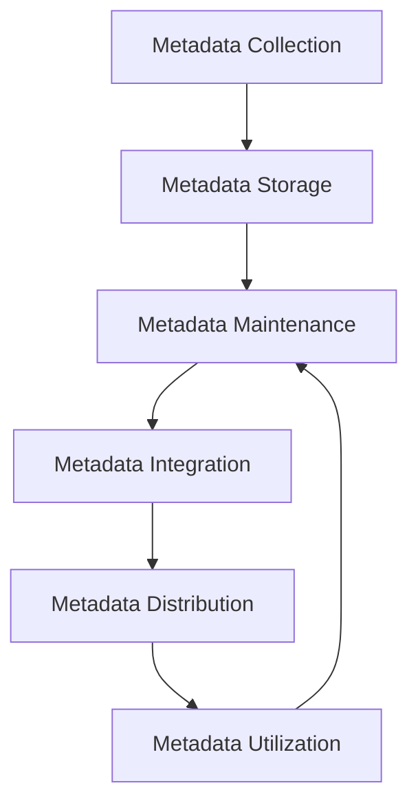

# Metadata Management

## Introduction

Metadata is often described as "data about data." It provides information about the characteristics, structure, and context of data. In data integration projects, metadata management is crucial for maintaining data quality, ensuring consistency, and enabling effective data governance.

Think of metadata as the labels on food products in a supermarket. Those labels tell you what's inside the package (ingredients), nutritional information, expiration dates, and more. Similarly, data metadata tells you what fields are in your dataset, data types, relationships, lineage, and other essential information.

## Understanding Metadata Types

Metadata can be categorized into several types:

### 1. Technical Metadata

Technical metadata describes the structure and format of data. It includes:

- Data types
- Table structures
- Column definitions
- Primary and foreign keys
- Index information

**Example of Technical Metadata:**

```json
{
  "tableName": "customers",
  "columns": [
    {
      "name": "customer_id",
      "dataType": "INTEGER",
      "isPrimaryKey": true,
      "isNullable": false
    },
    {
      "name": "first_name",
      "dataType": "VARCHAR(50)",
      "isPrimaryKey": false,
      "isNullable": false
    },
    {
      "name": "email",
      "dataType": "VARCHAR(100)",
      "isPrimaryKey": false,
      "isNullable": true
    }
  ]
}
```

### 2. Business Metadata

Business metadata provides context about the data's business usage and meaning. It includes:

- Business definitions
- Data owners
- Data stewards
- Usage policies
- Business rules

**Example of Business Metadata:**

```json
{
  "dataElement": "customer_id",
  "businessDefinition": "Unique identifier for each customer",
  "owner": "Customer Relations Department",
  "sensitivity": "Confidential",
  "retentionPeriod": "7 years",
  "usagePolicies": ["No sharing with third parties without consent"]
}
```

### 3. Operational Metadata

Operational metadata tracks how and when data is processed. It includes:

- Data source information
- ETL job execution details
- Data processing timestamps
- Data lineage
- Transformation rules

**Example of Operational Metadata:**

```json
{
  "jobName": "customer_data_load",
  "sourceSystem": "CRM",
  "executionStart": "2023-05-10T08:15:30",
  "executionEnd": "2023-05-10T08:16:45",
  "recordsProcessed": 1250,
  "recordsRejected": 3,
  "nextScheduledRun": "2023-05-11T08:00:00"
}
```

## Why Metadata Management Matters

Proper metadata management offers several benefits:

1. **Improved Data Discovery**: Users can easily find the data they need.
2. **Better Data Quality**: Understanding data structure helps to maintain quality.
3. **Enhanced Data Governance**: Metadata supports compliance and governance initiatives.
4. **Efficient Troubleshooting**: When data issues arise, metadata helps identify the source.
5. **Impact Analysis**: Before making changes, you can understand potential impacts.

## Metadata Management Process

Managing metadata effectively involves the following steps:



### 1. Metadata Collection

The first step is collecting metadata from various sources:

- Database catalogs
- ETL tools
- Data modeling tools
- APIs
- Manual documentation

**Example of Collecting Database Metadata in Python:**

```python
import sqlite3

# Connect to the database
conn = sqlite3.connect('sample.db')
cursor = conn.cursor()

# Query for table metadata
cursor.execute("SELECT name FROM sqlite_master WHERE type='table';")
tables = cursor.fetchall()

# Collect column metadata for each table
metadata = {}
for table in tables:
    table_name = table[0]
    cursor.execute(f"PRAGMA table_info({table_name});")
    columns = cursor.fetchall()
    
    # Store metadata
    metadata[table_name] = []
    for col in columns:
        metadata[table_name].append({
            'column_id': col[0],
            'column_name': col[1],
            'data_type': col[2],
            'not_null': col[3],
            'default_value': col[4],
            'is_primary_key': col[5]
        })

# Output metadata
for table, columns in metadata.items():
    print(f"Table: {table}")
    for col in columns:
        print(f"  Column: {col['column_name']}, Type: {col['data_type']}")
```

Output:
```
Table: users
  Column: id, Type: INTEGER
  Column: username, Type: TEXT
  Column: email, Type: TEXT
  Column: create_date, Type: DATE
Table: orders
  Column: order_id, Type: INTEGER
  Column: user_id, Type: INTEGER
  Column: order_date, Type: DATE
  Column: total_amount, Type: REAL
```

### 2. Metadata Storage

Once collected, metadata needs to be stored in a centralized repository:

- Dedicated metadata repositories
- Data catalogs
- Databases or data warehouses
- Version-controlled files (for smaller projects)

**Example of a Simple Metadata Repository Structure:**

```json
{
  "databases": [
    {
      "name": "ProductionDB",
      "type": "PostgreSQL",
      "version": "13.4",
      "tables": [
        {
          "name": "customers",
          "description": "Contains all customer information",
          "columns": [
            {
              "name": "customer_id",
              "type": "INTEGER",
              "description": "Unique customer identifier",
              "constraints": "PRIMARY KEY"
            },
            // More columns...
          ]
        },
        // More tables...
      ]
    }
  ],
  "etlProcesses": [
    {
      "name": "daily_customer_load",
      "description": "Loads new customer data daily",
      "source": "CRM API",
      "destination": "ProductionDB.customers",
      "schedule": "Daily at 2:00 AM",
      "owner": "Data Integration Team"
    }
  ]
}
```

### 3. Metadata Maintenance

Metadata must be kept up-to-date to remain useful:

- Regular audits
- Change management processes
- Automated updates
- Version control

**Example of Metadata Version Control:**

```python
import json
import datetime
import hashlib

def update_metadata(metadata_file, updates):
    # Load current metadata
    with open(metadata_file, 'r') as f:
        metadata = json.load(f)
    
    # Create version history if it doesn't exist
    if 'version_history' not in metadata:
        metadata['version_history'] = []
    
    # Calculate hash of current content for version tracking
    current_hash = hashlib.md5(json.dumps(metadata, sort_keys=True).encode()).hexdigest()
    
    # Apply updates
    for path, value in updates.items():
        parts = path.split('.')
        target = metadata
        for part in parts[:-1]:
            if part.isdigit():
                part = int(part)
            target = target[part]
        target[parts[-1]] = value
    
    # Add version history entry
    metadata['version_history'].append({
        'timestamp': datetime.datetime.now().isoformat(),
        'previous_hash': current_hash,
        'changes': list(updates.keys())
    })
    
    # Save updated metadata
    with open(metadata_file, 'w') as f:
        json.dump(metadata, f, indent=2)
    
    return metadata

# Example usage
updates = {
    'databases.0.tables.0.columns.1.description': 'Updated description for this column'
}
updated_metadata = update_metadata('metadata.json', updates)
```

### 4. Metadata Integration

For maximum value, metadata from different sources needs to be integrated:

- Mapping between different metadata formats
- Resolving conflicts
- Creating unified views

**Example of Integrating Metadata from Different Sources:**

```python
def integrate_metadata(source1, source2):
    # Assuming source1 and source2 are dictionaries with potentially overlapping keys
    integrated = {}
    
    # First, add all metadata from source1
    for key, value in source1.items():
        integrated[key] = value
    
    # Then, integrate metadata from source2
    for key, value in source2.items():
        if key in integrated:
            # If the key exists in both sources, we need to merge
            if isinstance(integrated[key], dict) and isinstance(value, dict):
                # Recursively merge dictionaries
                integrated[key] = integrate_metadata(integrated[key], value)
            elif isinstance(integrated[key], list) and isinstance(value, list):
                # For lists, we'll use a simple approach of merging by a key
                # This assumes list items are dictionaries with an 'id' or 'name' field
                if all('id' in item for item in integrated[key] + value):
                    # Create a lookup of existing items
                    existing = {item['id']: item for item in integrated[key]}
                    
                    # Update existing items and add new ones
                    for item in value:
                        if item['id'] in existing:
                            existing[item['id']].update(item)
                        else:
                            integrated[key].append(item)
                else:
                    # If we can't safely merge, just append the new values
                    integrated[key].extend(value)
            else:
                # For other types, source2 takes precedence
                integrated[key] = value
        else:
            # If the key only exists in source2, just add it
            integrated[key] = value
    
    return integrated

# Example usage
source1 = {
    'table_name': 'customers',
    'columns': [
        {'id': 1, 'name': 'customer_id', 'type': 'int'},
        {'id': 2, 'name': 'name', 'type': 'varchar'}
    ]
}

source2 = {
    'table_name': 'customers',
    'columns': [
        {'id': 1, 'name': 'customer_id', 'type': 'int', 'description': 'Primary key'},
        {'id': 3, 'name': 'email', 'type': 'varchar'}
    ],
    'owner': 'Sales Department'
}

integrated = integrate_metadata(source1, source2)
print(json.dumps(integrated, indent=2))
```

Output:
```json
{
  "table_name": "customers",
  "columns": [
    {
      "id": 1,
      "name": "customer_id",
      "type": "int",
      "description": "Primary key"
    },
    {
      "id": 2,
      "name": "name",
      "type": "varchar"
    },
    {
      "id": 3,
      "name": "email",
      "type": "varchar"
    }
  ],
  "owner": "Sales Department"
}
```

### 5. Metadata Distribution

Metadata needs to be made available to users and systems:

- APIs
- User interfaces
- Reports
- System integrations

**Example of a Simple Metadata API:**

```python
from flask import Flask, jsonify, request

app = Flask(__name__)

# In a real implementation, this would be stored in a database
metadata_store = {
    'tables': [
        {
            'name': 'customers',
            'description': 'Customer information',
            'columns': [
                {'name': 'customer_id', 'type': 'int', 'description': 'Unique ID'},
                {'name': 'name', 'type': 'varchar', 'description': 'Customer name'},
                {'name': 'email', 'type': 'varchar', 'description': 'Email address'}
            ]
        },
        {
            'name': 'orders',
            'description': 'Customer orders',
            'columns': [
                {'name': 'order_id', 'type': 'int', 'description': 'Unique ID'},
                {'name': 'customer_id', 'type': 'int', 'description': 'Reference to customers'},
                {'name': 'order_date', 'type': 'date', 'description': 'Date of order'}
            ]
        }
    ]
}

@app.route('/metadata/tables', methods=['GET'])
def get_tables():
    return jsonify(metadata_store['tables'])

@app.route('/metadata/tables/<table_name>', methods=['GET'])
def get_table(table_name):
    for table in metadata_store['tables']:
        if table['name'] == table_name:
            return jsonify(table)
    return jsonify({'error': 'Table not found'}), 404

@app.route('/metadata/search', methods=['GET'])
def search_metadata():
    query = request.args.get('q', '').lower()
    results = []
    
    # Search in table names and descriptions
    for table in metadata_store['tables']:
        if query in table['name'].lower() or query in table['description'].lower():
            results.append({
                'type': 'table',
                'name': table['name'],
                'description': table['description']
            })
        
        # Search in column names and descriptions
        for column in table['columns']:
            if query in column['name'].lower() or query in column.get('description', '').lower():
                results.append({
                    'type': 'column',
                    'table': table['name'],
                    'name': column['name'],
                    'description': column.get('description', '')
                })
    
    return jsonify(results)

if __name__ == '__main__':
    app.run(debug=True)
```

### 6. Metadata Utilization

The final step is using metadata to drive value:

- Data discovery tools
- Impact analysis
- Data lineage visualization
- Automated documentation

**Example of Using Metadata for Impact Analysis:**

```python
def analyze_impact(metadata, target_object):
    """
    Analyze the impact of changing a specific object
    based on metadata relationships
    """
    impacts = {
        'direct': [],
        'indirect': []
    }
    
    # Direct impacts: objects that directly use the target object
    for table in metadata['tables']:
        for column in table['columns']:
            # Check for foreign key relationships
            if 'references' in column and column['references'] == target_object:
                impacts['direct'].append({
                    'type': 'table',
                    'name': table['name'],
                    'impact': f"Foreign key reference from {table['name']}.{column['name']}"
                })
    
    # Check ETL processes that use the target object
    for process in metadata['etl_processes']:
        if process['source'] == target_object or process['destination'] == target_object:
            impacts['direct'].append({
                'type': 'etl_process',
                'name': process['name'],
                'impact': f"ETL process {process['name']} uses {target_object}"
            })
    
    # Check reports or dashboards that use the target object
    for report in metadata.get('reports', []):
        if target_object in report.get('data_sources', []):
            impacts['direct'].append({
                'type': 'report',
                'name': report['name'],
                'impact': f"Report {report['name']} uses {target_object}"
            })
    
    # Indirect impacts: objects that use objects that are directly impacted
    for direct_impact in impacts['direct']:
        for table in metadata['tables']:
            for column in table['columns']:
                if 'references' in column and column['references'] == direct_impact['name']:
                    impacts['indirect'].append({
                        'type': 'table',
                        'name': table['name'],
                        'impact': f"Foreign key reference to {direct_impact['name']}"
                    })
    
    return impacts

# Example usage
metadata = {
    'tables': [
        {
            'name': 'customers',
            'columns': [{'name': 'customer_id'}, {'name': 'name'}]
        },
        {
            'name': 'orders',
            'columns': [
                {'name': 'order_id'},
                {'name': 'customer_id', 'references': 'customers'}
            ]
        },
        {
            'name': 'order_items',
            'columns': [
                {'name': 'item_id'},
                {'name': 'order_id', 'references': 'orders'}
            ]
        }
    ],
    'etl_processes': [
        {
            'name': 'daily_customer_load',
            'source': 'CRM.customers',
            'destination': 'customers'
        }
    ],
    'reports': [
        {
            'name': 'Customer Orders Report',
            'data_sources': ['customers', 'orders']
        }
    ]
}

impact = analyze_impact(metadata, 'customers')
print(json.dumps(impact, indent=2))
```

Output:
```json
{
  "direct": [
    {
      "type": "table",
      "name": "orders",
      "impact": "Foreign key reference from orders.customer_id"
    },
    {
      "type": "etl_process",
      "name": "daily_customer_load",
      "impact": "ETL process daily_customer_load uses customers"
    },
    {
      "type": "report",
      "name": "Customer Orders Report",
      "impact": "Report Customer Orders Report uses customers"
    }
  ],
  "indirect": [
    {
      "type": "table",
      "name": "order_items",
      "impact": "Foreign key reference to orders"
    }
  ]
}
```

## Implementing Metadata Management in a Data Integration Project

Let's walk through a practical example of implementing metadata management in a simple data integration project:

### Step 1: Define Your Metadata Requirements

Begin by defining what metadata you need to capture:

- **Technical Metadata**: Table structures, data types, constraints
- **Business Metadata**: Data owners, definitions, sensitivity
- **Operational Metadata**: ETL processes, schedules, dependencies

### Step 2: Create a Metadata Repository

For a small project, a simple JSON-based repository might be sufficient:

```python
import json
import os

class MetadataRepository:
    def __init__(self, repository_path):
        self.repository_path = repository_path
        if not os.path.exists(repository_path):
            os.makedirs(repository_path)
        
        # Create initial structure if it doesn't exist
        self.metadata_file = os.path.join(repository_path, 'metadata.json')
        if not os.path.exists(self.metadata_file):
            self._initialize_repository()
    
    def _initialize_repository(self):
        initial_metadata = {
            'tables': [],
            'etl_processes': [],
            'business_definitions': [],
            'data_quality_rules': [],
            'last_updated': None
        }
        with open(self.metadata_file, 'w') as f:
            json.dump(initial_metadata, f, indent=2)
    
    def get_metadata(self):
        with open(self.metadata_file, 'r') as f:
            return json.load(f)
    
    def update_metadata(self, section, item_id, data):
        """Update an item in a specific section of the metadata"""
        metadata = self.get_metadata()
        
        # Find the item to update
        for index, item in enumerate(metadata[section]):
            if 'id' in item and item['id'] == item_id:
                # Update the existing item
                metadata[section][index].update(data)
                break
        else:
            # Item not found, add it
            if 'id' not in data:
                data['id'] = item_id
            metadata[section].append(data)
        
        # Update the last_updated timestamp
        metadata['last_updated'] = datetime.datetime.now().isoformat()
        
        # Save the updated metadata
        with open(self.metadata_file, 'w') as f:
            json.dump(metadata, f, indent=2)
    
    def delete_metadata(self, section, item_id):
        """Delete an item from a specific section of the metadata"""
        metadata = self.get_metadata()
        
        # Find and remove the item
        metadata[section] = [item for item in metadata[section] if item.get('id') != item_id]
        
        # Update the last_updated timestamp
        metadata['last_updated'] = datetime.datetime.now().isoformat()
        
        # Save the updated metadata
        with open(self.metadata_file, 'w') as f:
            json.dump(metadata, f, indent=2)

# Example usage
repo = MetadataRepository('metadata_repository')
repo.update_metadata('tables', 'customers', {
    'name': 'customers',
    'description': 'Customer information table',
    'owner': 'Marketing Department',
    'columns': [
        {'name': 'customer_id', 'type': 'INTEGER', 'primary_key': True},
        {'name': 'name', 'type': 'VARCHAR(100)'},
        {'name': 'email', 'type': 'VARCHAR(100)'}
    ]
})
```

### Step 3: Collect Metadata Automatically

Automate metadata collection where possible:

```python
import sqlite3

def collect_database_metadata(db_path, repository):
    """Collect metadata from a SQLite database"""
    conn = sqlite3.connect(db_path)
    cursor = conn.cursor()
    
    # Get list of tables
    cursor.execute("SELECT name FROM sqlite_master WHERE type='table';")
    tables = cursor.fetchall()
    
    for table in tables:
        table_name = table[0]
        
        # Skip SQLite system tables
        if table_name.startswith('sqlite_'):
            continue
        
        # Get table columns
        cursor.execute(f"PRAGMA table_info({table_name});")
        columns_data = cursor.fetchall()
        
        columns = []
        primary_keys = []
        
        for col in columns_data:
            col_id, col_name, col_type, not_null, default_val, is_pk = col
            columns.append({
                'name': col_name,
                'type': col_type,
                'nullable': not not_null,
                'default': default_val,
                'primary_key': bool(is_pk)
            })
            
            if is_pk:
                primary_keys.append(col_name)
        
        # Get foreign keys
        cursor.execute(f"PRAGMA foreign_key_list({table_name});")
        foreign_keys = []
        
        for fk in cursor.fetchall():
            id, seq, target_table, from_col, to_col, on_update, on_delete, match = fk
            foreign_keys.append({
                'column': from_col,
                'references': {
                    'table': target_table,
                    'column': to_col
                }
            })
        
        # Get indexes
        cursor.execute(f"PRAGMA index_list({table_name});")
        indexes = []
        
        for idx in cursor.fetchall():
            idx_name = idx[1]
            cursor.execute(f"PRAGMA index_info({idx_name});")
            idx_columns = [col[2] for col in cursor.fetchall()]
            
            indexes.append({
                'name': idx_name,
                'columns': idx_columns
            })
        
        # Get approximate row count
        cursor.execute(f"SELECT COUNT(*) FROM {table_name};")
        row_count = cursor.fetchone()[0]
        
        # Store collected metadata
        table_metadata = {
            'name': table_name,
            'columns': columns,
            'primary_keys': primary_keys,
            'foreign_keys': foreign_keys,
            'indexes': indexes,
            'row_count': row_count,
            'collection_date': datetime.datetime.now().isoformat()
        }
        
        repository.update_metadata('tables', table_name, table_metadata)
    
    conn.close()

# Example usage
collect_database_metadata('sample.db', repo)
```

### Step 4: Enrich with Business Metadata

Add business context to your technical metadata:

```python
def add_business_metadata(repository):
    """Add business metadata to technical metadata"""
    # This would typically come from business users or documentation
    business_metadata = {
        'customers': {
            'owner': 'Customer Relations',
            'description': 'Master table for all customer information',
            'sensitivity': 'Medium',
            'columns': {
                'customer_id': {
                    'description': 'Unique identifier for the customer',
                    'business_rules': ['Must be unique', 'Cannot be changed once assigned']
                },
                'email': {
                    'description': 'Primary contact email for the customer',
                    'sensitivity': 'High',
                    'business_rules': ['Must be valid email format']
                }
            }
        }
    }
    
    # Get current technical metadata
    metadata = repository.get_metadata()
    
    # Enrich technical metadata with business metadata
    for table in metadata['tables']:
        table_name = table['name']
        if table_name in business_metadata:
            # Add table-level business metadata
            for key, value in business_metadata[table_name].items():
                if key != 'columns':
                    table[key] = value
            
            # Add column-level business metadata
            if 'columns' in business_metadata[table_name]:
                for column in table['columns']:
                    col_name = column['name']
                    if col_name in business_metadata[table_name]['columns']:
                        column.update(business_metadata[table_name]['columns'][col_name])
    
    # Save updated metadata
    with open(repository.metadata_file, 'w') as f:
        json.dump(metadata, f, indent=2)

# Example usage
add_business_metadata(repo)
```

### Step 5: Track Data Lineage

Record how data flows through your integration processes:

```python
def record_etl_lineage(repository, etl_id, source_tables, target_tables, transformations):
    """Record lineage information for an ETL process"""
    lineage_data = {
        'id': etl_id,
        'name': f"ETL Process {etl_id}",
        'sources': source_tables,
        'targets': target_tables,
        'transformations': transformations,
        'last_run': datetime.datetime.now().isoformat()
    }
    
    repository.update_metadata('etl_processes', etl_id, lineage_data)

# Example usage
record_etl_lineage(
    repo,
    'etl_daily_customer_update',
    ['source_crm.customers'],
    ['customers'],
    [
        {
            'source': 'source_crm.customers.first_name + source_crm.customers.last_name',
            'target': 'customers.name',
            'description': 'Concatenate first and last name'
        },
        {
            'source': 'source_crm.customers.email',
            'target': 'customers.email',
            'description': 'Direct mapping'
        }
    ]
)
```

### Step 6: Visualize Data Lineage

Create a visualization of your data lineage to help understand data flows:

```python
def generate_lineage_diagram(metadata):
    """Generate a Mermaid diagram showing data lineage"""
    # Start mermaid graph definition
    diagram = ["graph LR"]
    
    # Add nodes for tables
    for table in metadata['tables']:
        diagram.append(f"  {table['name']}[{table['name']}]")
    
    # Add connections for ETL processes
    for etl in metadata['etl_processes']:
        # Add ETL process node
        diagram.append(f"  etl_{etl['id']}({etl['name']})")
        
        # Connect sources to ETL
        for source in etl['sources']:
            # Handle sources that might be from external systems
            if '.' in source:
                system, table = source.split('.')
                diagram.append(f"  ext_{system}[{system}] --> etl_{etl['id']}")
            else:
                diagram.append(f"  {source} --> etl_{etl['id']}")
        
        # Connect ETL to targets
        for target in etl['targets']:
            diagram.append(f"  etl_{etl['id']} --> {target}")
    
    return "
".join(diagram)

# Example usage
metadata = repo.get_metadata()
lineage_diagram = generate_lineage_diagram(metadata)
print(lineage_diagram)
```

Output (Mermaid diagram code):
```
graph LR
  customers[customers]
  etl_etl_daily_customer_update(ETL Process etl_daily_customer_update)
  ext_source_crm[source_crm] --> etl_etl_daily_customer_update
  etl_etl_daily_customer_update --> customers
```

## Common Metadata Management Tools

Several tools can help with metadata management:

1. **Apache Atlas**: Open-source metadata management and governance framework
2. **Collibra**: Enterprise data governance and catalog platform
3. **Alation**: Data catalog with collaboration features
4. **Informatica Metadata Manager**: Part of Informatica's data management platform
5. **Talend Metadata Manager**: Component of Talend's data integration suite

For beginners, you might start with simpler options:

1. **Custom solutions** (like the examples in this guide)
2. **Version-controlled JSON/YAML files**
3. **Database-backed repositories**
4. **Open-source data catalogs** like Apache Atlas

## Best Practices for Metadata Management

1. **Automate Where Possible**: Reduce manual effort through automation.
2. **Establish Governance**: Define clear ownership and processes.
3. **Start Small**: Begin with critical metadata and expand gradually.
4. **Focus on Quality**: Ensure metadata is accurate and up-to-date.
5. **Integration First**: Connect metadata from different sources.
6. **Make Metadata Accessible**: Provide easy-to-use interfaces.
7. **Measure Value**: Track how metadata improves data processes.

## Summary

Metadata management is a critical aspect of data integration projects. It helps maintain data quality, ensures consistency, and enables effective data governance. By properly managing metadata, you gain visibility into your data landscape, improve data discovery, and enhance decision-making.

In this guide, we've covered:

- Different types of metadata (technical, business, operational)
- The metadata management process
- Practical examples of implementing metadata management
- Tools and best practices

Remember that effective metadata management is an ongoing process, not a one-time project. As your data integration efforts evolve, your metadata management approach should also adapt and grow.

## Exercises

1. **Basic Metadata Collection**: Write a script to collect metadata from a sample database of your choice.
2. **Metadata Repository**: Create a simple metadata repository using JSON files or a database.
3. **Lineage Visualization**: Generate a data lineage visualization for a simple ETL process.
4. **Impact Analysis**: Implement a basic impact analysis function that identifies affected components when a data element changes.
5. **Metadata API**: Build a simple API to expose your metadata repository to other applications.

## Additional Resources

- [DAMA Data Management Body of Knowledge (DMBOK)](https://www.dama.org/cpages/body-of-knowledge)
- [The Data Warehouse Toolkit](https://www.kimballgroup.com/data-warehouse-business-intelligence-resources/books/data-warehouse-dw-toolkit/)
- [Metadata Management for Better Data Governance](https://www.oreilly.com/library/