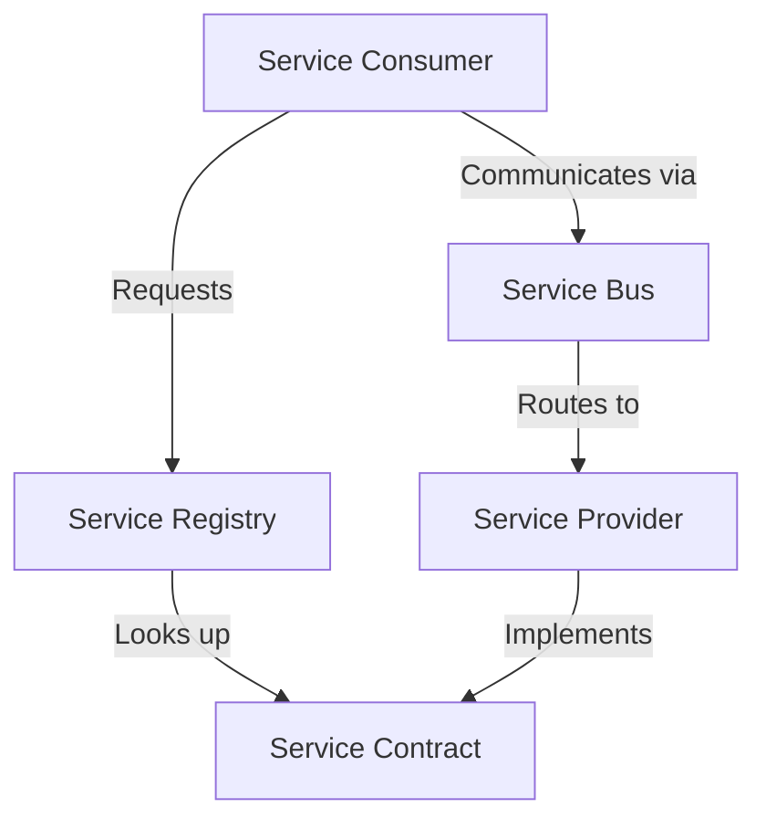

# Service-Oriented Architecture

## Introduction

Service-Oriented Architecture (SOA) is a design approach where different software components provide services to other components via a network communication protocol. In simpler terms, it's like building your application as a collection of mini-applications (services) that work together.

If you've ever used a website that pulls together information from different sources - like a travel site that shows flights, hotels, and car rentals all in one place - you've experienced SOA in action. Each of these functionalities might be provided by separate services working together.

SOA is particularly important in data integration because it allows different systems to communicate and share data efficiently, even if they were built using completely different technologies.

## Key Principles of SOA

SOA is guided by several core principles:

1. **Loose Coupling**: Services minimize their dependencies on each other. They interact through well-defined interfaces without needing to know how other services are implemented.

2. **Service Abstraction**: Services hide their internal logic. The outside world only sees what the service does, not how it does it.

3. **Service Reusability**: Services are designed to be reused across different applications.

4. **Service Autonomy**: Services control their own environment and resources.

5. **Service Discoverability**: Services can be found and accessed through a discovery mechanism.

6. **Service Composability**: Services can be composed into new services or applications.

7. **Standardized Service Contract**: Services adhere to communication agreements defined by service description documents.

## Components of SOA

A typical SOA implementation includes these main components:



### Service Provider

The service provider creates and publishes a service, making it available for consumers to use. It:

- Implements the service functionality
- Defines the service contract/interface
- Publishes the service to a registry
- Processes requests and returns responses

### Service Consumer

The service consumer uses the services provided by service providers. It:

- Discovers services from the registry
- Binds to the service provider
- Invokes the service functionality

### Service Registry/Repository

The service registry acts as a directory of available services. It:

- Contains information about available services
- Helps consumers find appropriate services
- Stores service contracts and policies

### Service Contract

The service contract defines how to interact with a service, including:

- Data formats and types
- Available operations
- Communication protocols
- Non-functional requirements (security, performance)

### Enterprise Service Bus (ESB)

An ESB is the communication backbone in many SOA implementations. It:

- Routes messages between services
- Transforms data formats between different systems
- Handles protocol conversion
- Provides monitoring and management capabilities

## Implementing SOA

Let's walk through a simple example of implementing SOA principles in a basic system.

### Example: Online Bookstore

Imagine we're building an online bookstore that needs to:
- Display book information
- Process orders
- Handle payments
- Manage inventory

In an SOA approach, we would create separate services for each of these functions.

### Step 1: Define Service Contracts

First, let's define a simple service contract for our Book Information Service using REST:

```javascript
// Book Information Service API
// GET /api/books - Get all books
// GET /api/books/{id} - Get book by ID
// Response format:
{
  "id": "12345",
  "title": "Introduction to SOA",
  "author": "Jane Developer",
  "price": 29.99,
  "category": "Technology",
  "inStock": true
}
```

### Step 2: Implement Services

Now let's implement a simple Book Service in Node.js:

```javascript
// bookService.js
const express = require('express');
const app = express();
const port = 3000;

// Our simple "database"
const books = [
  {
    id: "12345",
    title: "Introduction to SOA",
    author: "Jane Developer",
    price: 29.99,
    category: "Technology",
    inStock: true
  },
  {
    id: "67890",
    title: "Advanced Data Integration",
    author: "John Architect",
    price: 39.99,
    category: "Technology",
    inStock: false
  }
];

// GET all books
app.get('/api/books', (req, res) => {
  res.json(books);
});

// GET book by id
app.get('/api/books/:id', (req, res) => {
  const book = books.find(b => b.id === req.params.id);
  if (book) {
    res.json(book);
  } else {
    res.status(404).json({ error: "Book not found" });
  }
});

app.listen(port, () => {
  console.log(`Book service running on port ${port}`);
});
```

### Step 3: Create a Service Consumer

Now let's create a simple web app that consumes our Book Service:

```javascript
// bookstoreApp.js
const express = require('express');
const axios = require('axios');
const app = express();
const port = 8080;

app.set('view engine', 'ejs');
app.use(express.static('public'));

// This app consumes the Book Service
app.get('/', async (req, res) => {
  try {
    // Call the Book Service
    const response = await axios.get('http://localhost:3000/api/books');
    const books = response.data;
    
    res.render('index', { books });
  } catch (error) {
    res.status(500).send('Error fetching books');
  }
});

app.listen(port, () => {
  console.log(`Bookstore app running on port ${port}`);
});
```

The HTML template might look like:

```html
<!-- views/index.ejs -->
<!DOCTYPE html>
<html>
<head>
  <title>Online Bookstore</title>
</head>
<body>
  <h1>Available Books</h1>
  <ul>
    <% books.forEach(book => { %>
      <li>
        <h3><%= book.title %></h3>
        <p>Author: <%= book.author %></p>
        <p>Price: $<%= book.price %></p>
        <p>Availability: <%= book.inStock ? 'In Stock' : 'Out of Stock' %></p>
      </li>
    <% }); %>
  </ul>
</body>
</html>
```

## Real-World SOA Examples

### Example 1: E-commerce Platform

A modern e-commerce platform might use SOA to integrate:

- Product catalog service
- Inventory management service
- Shopping cart service
- Payment processing service
- Order fulfillment service
- Customer management service
- Reviews and ratings service

Each service can be developed, deployed, and scaled independently. If the payment service needs more security updates or the catalog service needs performance optimization, teams can work on these without affecting the entire system.

### Example 2: Banking System

A banking system might use SOA to integrate:

- Account management service
- Transaction processing service
- Loan approval service
- Credit scoring service
- Customer notification service
- Fraud detection service

Using SOA, the bank can:
- Integrate with external credit bureaus through well-defined interfaces
- Add new features (like mobile banking) without redesigning the core system
- Ensure high availability of critical services

## Advantages of SOA for Data Integration

SOA offers several benefits when integrating data across systems:

1. **Interoperability**: Services can communicate regardless of their underlying technologies.

2. **Flexibility**: New services can be added or existing ones modified without disrupting the entire system.

3. **Reusability**: Services can be reused across multiple applications, reducing development time.

4. **Scalability**: Individual services can be scaled independently based on demand.

5. **Reliability**: Failure in one service doesn't necessarily bring down the entire system.

6. **Business Alignment**: Services can be designed around business capabilities, making it easier to align IT with business needs.

## Challenges of SOA

While SOA offers many benefits, there are also challenges:

1. **Complexity**: Managing multiple services, their dependencies, and interactions can be complex.

2. **Performance Overhead**: Network communication between services introduces latency.

3. **Service Design**: Properly designing service boundaries and interfaces requires expertise.

4. **Versioning**: Managing changes to services while maintaining backward compatibility can be difficult.

5. **Testing**: Testing service interactions and dependencies is more complex than in monolithic applications.

## SOA vs. Microservices

Many beginners confuse SOA with microservices. While related, they have key differences:

| Aspect | SOA | Microservices |
|--------|-----|---------------|
| Size | Typically larger services | Smaller, focused services |
| Communication | Often uses ESB and complex protocols | Typically uses simple REST/HTTP |
| Data Storage | Often shares databases | Each service has its own database |
| Governance | Centralized | Decentralized |
| Purpose | Enterprise-wide integration | Application architecture |

Think of SOA as a broader architectural concept that focuses on enterprise integration, while microservices is an architectural style for building individual applications.

## Implementing SOA: Best Practices

1. **Start with business capabilities**: Design services around business functions rather than technical components.

2. **Define clear contracts**: Ensure service interfaces are well-documented and stable.

3. **Plan for versioning**: Design services to handle changes without breaking consumers.

4. **Implement proper governance**: Establish standards for service design, security, and monitoring.

5. **Use appropriate granularity**: Services should be neither too large (monolithic) nor too small (excessive network overhead).

6. **Design for failure**: Assume services can fail and implement appropriate error handling and fallback mechanisms.

7. **Monitor service performance**: Implement comprehensive monitoring to detect issues early.

## Summary

Service-Oriented Architecture (SOA) is an architectural approach that structures applications as collections of loosely coupled, independently deployable services. SOA is particularly valuable for data integration scenarios where systems built on different technologies need to communicate and share data.

Key takeaways:
- SOA helps achieve interoperability between disparate systems
- Services are designed to be loosely coupled and reusable
- SOA consists of service providers, consumers, and a discovery mechanism
- While powerful, SOA introduces complexity that must be managed

As you continue learning about data integration, understanding SOA principles will help you design more flexible, maintainable, and scalable systems.

## Exercises

1. Design a simple SOA for a library management system. What services would you create and how would they interact?

2. Create a REST API service using Express.js (similar to our book service example) and a simple client that consumes it.

3. Compare and contrast SOA with microservices for a specific application scenario.

4. Research how major platforms like Amazon or Netflix implement SOA principles.

5. Identify potential SOA services for a healthcare data integration scenario.

## Further Learning Resources

- [SOA Patterns](https://soapatterns.org/)
- [Enterprise Integration Patterns](https://www.enterpriseintegrationpatterns.com/)
- [REST API Design Best Practices](https://restfulapi.net/)
- [Understanding Web Services Specifications](https://www.w3.org/standards/webofservices/)
- [SOAP vs. REST](https://www.redhat.com/en/topics/integration/whats-the-difference-between-soap-rest)