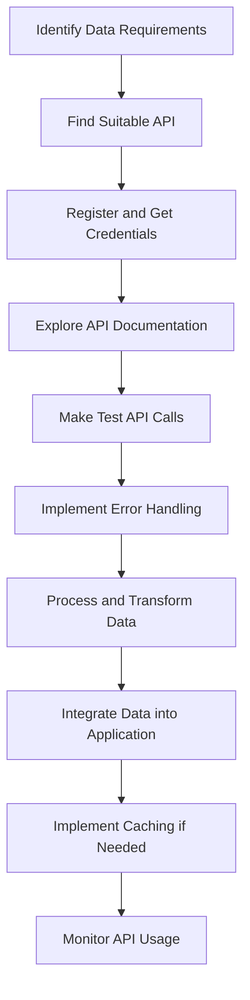

# API for Data Access

## Introduction

Application Programming Interfaces (APIs) are powerful tools that serve as bridges between different software systems, allowing them to communicate and exchange data. In the context of data integration, APIs provide structured methods to access, manipulate, and transfer data across applications, services, and platforms.

Think of an API as a waiter in a restaurant. You (the client) don't need to know how the kitchen (server) prepares your meal. You simply place an order using a standard menu (API documentation), and the waiter (API) delivers your request to the kitchen and brings back what you ordered.

In this guide, we'll explore how to use APIs for data access, a fundamental skill for modern developers working with data integration.

## Why Use APIs for Data Access?

APIs offer several advantages for accessing data:

- **Standardized Access**: APIs provide consistent methods to interact with data sources
- **Security**: They implement authentication and authorization controls
- **Efficiency**: APIs often offer optimized data retrieval with filtering capabilities
- **Real-time Data**: Many APIs provide access to current data without manual downloads
- **Integration Possibilities**: They enable connections between different systems and services

## Understanding API Basics

Before diving into implementation, let's understand the core components of API-based data access:

### API Types for Data Access

Several types of APIs are commonly used for data access:

1. **REST APIs**: Use standard HTTP methods (GET, POST, PUT, DELETE) to perform operations on data
2. **GraphQL APIs**: Allow clients to request exactly the data they need
3. **SOAP APIs**: Use XML-based messaging protocol for exchanging structured information
4. **Database APIs**: Provide direct access to databases (e.g., JDBC, ODBC)

### Key API Concepts

- **Endpoints**: Specific URLs that represent different data resources
- **Request Methods**: Define the type of operation (GET, POST, PUT, DELETE)
- **Parameters**: Additional data sent with requests to filter or modify results
- **Headers**: Contain metadata about the request or response
- **Authentication**: Ensures only authorized users can access the API
- **Response Formats**: Common formats include JSON and XML

## Making Your First API Request

Let's start with a simple example using JavaScript to request data from a REST API:

```javascript
// Making a GET request to fetch user data
async function fetchUserData(userId) {
  try {
    // Make the API request
    const response = await fetch(`https://api.example.com/users/${userId}`);
    
    // Check if the request was successful
    if (!response.ok) {
      throw new Error(`HTTP error! Status: ${response.status}`);
    }
    
    // Parse the JSON response
    const userData = await response.json();
    
    // Use the data
    console.log('User data:', userData);
    return userData;
  } catch (error) {
    console.error('Error fetching user data:', error);
  }
}

// Call the function
fetchUserData('12345');
```

This example demonstrates:
1. Making a request to an API endpoint
2. Handling the response
3. Processing the returned data

### Example Output

```json
User data: {
  "id": "12345",
  "name": "Jane Smith",
  "email": "jane.smith@example.com",
  "role": "developer",
  "created_at": "2023-05-15T10:30:45Z"
}
```

## Authentication Methods

Most APIs require authentication to protect data. Common authentication methods include:

### API Keys

```javascript
async function fetchDataWithApiKey() {
  const apiKey = 'your_api_key_here';
  const response = await fetch('https://api.example.com/data', {
    headers: {
      'Authorization': `ApiKey ${apiKey}`
    }
  });
  
  const data = await response.json();
  return data;
}
```

### OAuth 2.0

```javascript
async function fetchDataWithOAuth() {
  const accessToken = 'your_oauth_token_here';
  
  const response = await fetch('https://api.example.com/protected-data', {
    headers: {
      'Authorization': `Bearer ${accessToken}`
    }
  });
  
  const data = await response.json();
  return data;
}
```

## Working with REST APIs

REST (Representational State Transfer) APIs are the most common type for data access. Let's see how to perform CRUD (Create, Read, Update, Delete) operations:

### Reading Data (GET)

```javascript
// Fetch a list of products
async function getProducts() {
  const response = await fetch('https://api.example.com/products');
  return await response.json();
}

// Fetch a specific product
async function getProduct(productId) {
  const response = await fetch(`https://api.example.com/products/${productId}`);
  return await response.json();
}
```

### Creating Data (POST)

```javascript
// Add a new product
async function createProduct(productData) {
  const response = await fetch('https://api.example.com/products', {
    method: 'POST',
    headers: {
      'Content-Type': 'application/json'
    },
    body: JSON.stringify(productData)
  });
  
  return await response.json();
}

// Example usage
createProduct({
  name: 'Wireless Headphones',
  price: 99.99,
  category: 'Electronics'
});
```

### Updating Data (PUT/PATCH)

```javascript
// Update a product
async function updateProduct(productId, updatedData) {
  const response = await fetch(`https://api.example.com/products/${productId}`, {
    method: 'PUT', // or 'PATCH' for partial updates
    headers: {
      'Content-Type': 'application/json'
    },
    body: JSON.stringify(updatedData)
  });
  
  return await response.json();
}
```

### Deleting Data (DELETE)

```javascript
// Delete a product
async function deleteProduct(productId) {
  const response = await fetch(`https://api.example.com/products/${productId}`, {
    method: 'DELETE'
  });
  
  return response.status === 204; // No content response is common for successful deletion
}
```

## Handling API Responses

When working with APIs, it's important to properly handle responses:

```javascript
async function fetchData(endpoint) {
  try {
    const response = await fetch(`https://api.example.com/${endpoint}`);
    
    // Check for HTTP errors
    if (!response.ok) {
      if (response.status === 404) {
        console.error('Resource not found');
        return null;
      } else if (response.status === 401) {
        console.error('Authentication required');
        // Handle authentication
      } else {
        console.error(`API error: ${response.status}`);
      }
      throw new Error(`HTTP error! Status: ${response.status}`);
    }
    
    // Check content type
    const contentType = response.headers.get('content-type');
    if (contentType && contentType.includes('application/json')) {
      return await response.json();
    } else {
      return await response.text();
    }
    
  } catch (error) {
    console.error('Failed to fetch data:', error);
    throw error;
  }
}
```

## Pagination and Filtering

Most APIs that return large collections implement pagination and filtering:

```javascript
// Fetch paginated data
async function fetchPaginatedData(page = 1, limit = 10) {
  const response = await fetch(`https://api.example.com/products?page=${page}&limit=${limit}`);
  return await response.json();
}

// Fetch filtered data
async function fetchFilteredData(category, minPrice, maxPrice) {
  const url = new URL('https://api.example.com/products');
  
  // Add query parameters
  if (category) url.searchParams.append('category', category);
  if (minPrice) url.searchParams.append('minPrice', minPrice);
  if (maxPrice) url.searchParams.append('maxPrice', maxPrice);
  
  const response = await fetch(url);
  return await response.json();
}

// Example usage
fetchFilteredData('Electronics', 50, 200);
```

## Real-world Example: Integrating Weather Data

Let's create a practical example of using an API to integrate weather data into an application:

```javascript
async function getWeatherData(city) {
  // We're using a public weather API for this example
  const apiKey = 'your_weather_api_key';
  const url = `https://api.weatherapi.com/v1/current.json?key=${apiKey}&q=${encodeURIComponent(city)}`;
  
  try {
    const response = await fetch(url);
    
    if (!response.ok) {
      throw new Error(`Weather API error: ${response.status}`);
    }
    
    const data = await response.json();
    
    // Extract relevant weather information
    const weatherInfo = {
      location: data.location.name,
      country: data.location.country,
      temperature: data.current.temp_c,
      condition: data.current.condition.text,
      humidity: data.current.humidity,
      windSpeed: data.current.wind_kph
    };
    
    return weatherInfo;
  } catch (error) {
    console.error('Failed to fetch weather data:', error);
    throw error;
  }
}

// Display weather information
async function displayWeather(city) {
  try {
    const weatherData = await getWeatherData(city);
    
    console.log(`Current weather in ${weatherData.location}, ${weatherData.country}:`);
    console.log(`Temperature: ${weatherData.temperature}°C`);
    console.log(`Condition: ${weatherData.condition}`);
    console.log(`Humidity: ${weatherData.humidity}%`);
    console.log(`Wind Speed: ${weatherData.windSpeed} kph`);
    
  } catch (error) {
    console.log('Unable to display weather information');
  }
}

// Get weather for a city
displayWeather('London');
```

### Example Output:

```
Current weather in London, United Kingdom:
Temperature: 12.5°C
Condition: Partly cloudy
Humidity: 76%
Wind Speed: 14.4 kph
```

## API Data Integration Flow

The general flow for integrating data through APIs follows these steps:



## Best Practices for API Data Access

When working with APIs for data access, follow these best practices:

1. **Read the Documentation**: Understand the API's capabilities, endpoints, and limitations
2. **Implement Error Handling**: Always account for potential API failures
3. **Use Rate Limiting**: Respect API rate limits to avoid being blocked
4. **Implement Caching**: Cache API responses when appropriate to reduce requests
5. **Secure Credentials**: Never expose API keys or tokens in client-side code
6. **Validate Data**: Always validate data received from external APIs
7. **Use HTTPS**: Only connect to APIs over secure connections
8. **Implement Retry Logic**: Add retry mechanisms for temporary failures
9. **Monitor Usage**: Keep track of API usage to stay within limits

## Example: Implementing a Basic Cache

```javascript
// Simple in-memory cache for API responses
class ApiCache {
  constructor(ttlMinutes = 10) {
    this.cache = new Map();
    this.ttl = ttlMinutes * 60 * 1000; // Convert to milliseconds
  }
  
  set(key, value) {
    this.cache.set(key, {
      value,
      timestamp: Date.now()
    });
  }
  
  get(key) {
    const item = this.cache.get(key);
    
    // Return null if item doesn't exist
    if (!item) return null;
    
    // Check if the item has expired
    if (Date.now() - item.timestamp > this.ttl) {
      this.cache.delete(key);
      return null;
    }
    
    return item.value;
  }
}

// Using the cache with an API request
const apiCache = new ApiCache(30); // Cache for 30 minutes

async function fetchDataWithCache(endpoint) {
  // Check cache first
  const cachedData = apiCache.get(endpoint);
  if (cachedData) {
    console.log('Using cached data');
    return cachedData;
  }
  
  // If not in cache, fetch from API
  console.log('Fetching fresh data');
  const response = await fetch(`https://api.example.com/${endpoint}`);
  const data = await response.json();
  
  // Store in cache
  apiCache.set(endpoint, data);
  
  return data;
}
```

## Troubleshooting Common API Issues

When working with APIs, you might encounter these common issues:

| Issue | Possible Cause | Solution |
|-------|----------------|----------|
| 401 Unauthorized | Invalid or expired credentials | Check API key or refresh access token |
| 403 Forbidden | Insufficient permissions | Verify account access levels |
| 429 Too Many Requests | Rate limit exceeded | Implement backoff strategy and respect rate limits |
| 500 Server Error | API provider issue | Implement retry logic with exponential backoff |
| CORS errors | Cross-origin restrictions | Use proper CORS headers or a backend proxy |
| Timeout errors | Slow network or API response | Set appropriate timeout values and handle cases |

## Summary

APIs provide a powerful and standardized way to access and integrate data from various sources. By understanding how to properly authenticate, make requests, handle responses, and implement best practices, you can effectively use APIs to enhance your applications with external data.

Key takeaways:
- APIs provide structured access to data from external sources
- REST APIs use standard HTTP methods for data operations
- Authentication secures API access
- Proper error handling is essential for robust applications
- Caching can improve performance and reduce API calls
- Following API documentation and best practices ensures successful integration

## Exercises

1. Choose a public API (like [OpenWeatherMap](https://openweathermap.org/api) or [JSONPlaceholder](https://jsonplaceholder.typicode.com/)) and write code to fetch and display data from it.

2. Create a function that handles pagination automatically for an API that returns large datasets.

3. Implement a more advanced caching system that stores API responses in localStorage instead of in-memory.

4. Build a small web application that integrates data from multiple APIs and combines the results.

5. Create an error handling system that implements retry logic with exponential backoff.

## Additional Resources

- [MDN Web Docs: Fetch API](https://developer.mozilla.org/en-US/docs/Web/API/Fetch_API)
- [REST API Design Best Practices](https://restfulapi.net/)
- [Public APIs Directory](https://github.com/public-apis/public-apis)
- [Understanding OAuth 2.0](https://oauth.net/2/)
- [API Security Best Practices](https://owasp.org/www-project-api-security/)