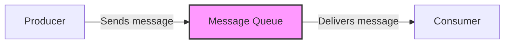
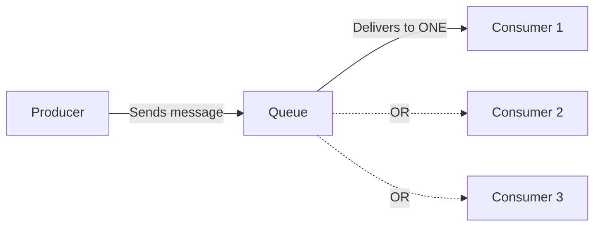
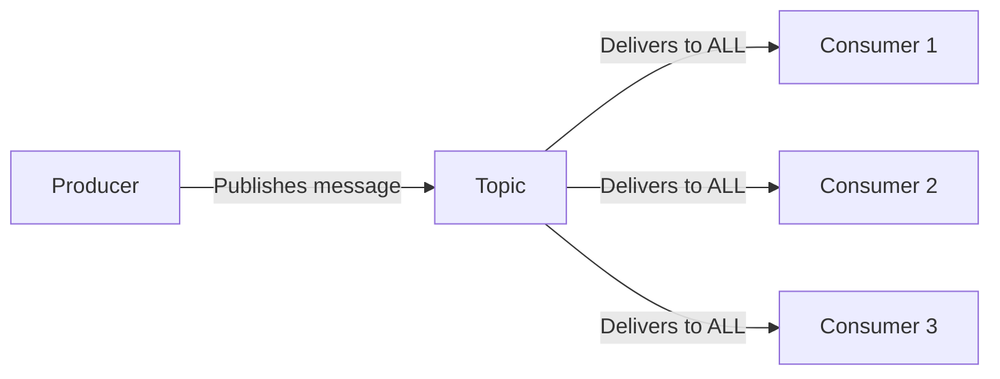
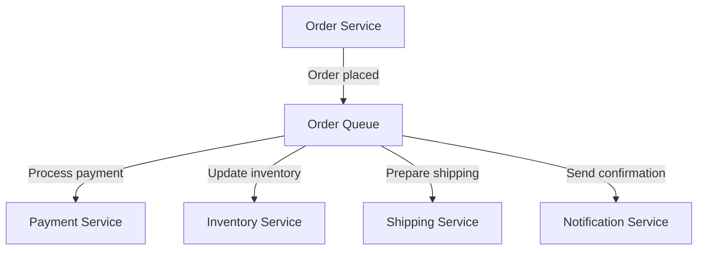

# Message Queues

## Introduction

Message queues are a fundamental concept in modern software architecture, especially when building distributed systems. At their core, message queues provide a way for different parts of an application or different applications to communicate with each other without having to interact directly.

Think of a message queue like a post office. When you want to send a letter to someone, you don't personally deliver it—you drop it off at the post office, which handles routing it to the recipient. Similarly, in software, a message queue acts as an intermediary that reliably delivers messages between services.

## What Are Message Queues?

A message queue is a form of asynchronous service-to-service communication. When a sender (or producer) needs to send information to a receiver (or consumer), it places a message on the queue and can then continue its processing without waiting for a response. The consumer processes the message when it's ready, not necessarily immediately after the message is sent.

### Key Components

- **Producer**: The application or service that creates messages and adds them to the queue
- **Consumer**: The application or service that reads and processes messages from the queue
- **Queue**: The buffer that stores messages until they are processed
- **Message**: A piece of data transmitted through the queue (can be commands, information, or events)
- **Broker**: The message queue server that manages the queues and message delivery

## Why Use Message Queues?

Message queues offer several important benefits for application architecture:

1. **Decoupling**: Services don't need to know about each other, just about the queue interface
2. **Scalability**: Producers and consumers can scale independently
3. **Resilience**: If a consumer fails, messages remain in the queue until processing is possible
4. **Load leveling**: Queues can handle traffic spikes by buffering messages
5. **Asynchronous processing**: Senders don't have to wait for receivers to process messages

## How Message Queues Work

Let's visualize the basic flow of a message queue system:



1. **Message Creation**: The producer creates a message, typically consisting of the data payload and metadata.
2. **Publishing**: The producer publishes the message to a specific queue.
3. **Storage**: The message queue stores the message until a consumer is ready to process it.
4. **Consumption**: A consumer connects to the queue and retrieves the message.
5. **Processing**: The consumer processes the message according to its business logic.
6. **Acknowledgment**: The consumer acknowledges that the message has been successfully processed, and the queue removes it.

## Basic Message Queue Patterns

### Point-to-Point

In a point-to-point model, messages are routed to one consumer only, even if multiple consumers are listening to the queue.



### Publish-Subscribe

In a publish-subscribe (pub-sub) model, messages are broadcasted to all consumers that have subscribed to the topic.



## Code Example: Using RabbitMQ

Let's implement a simple message queue using RabbitMQ, one of the most popular message brokers.

First, install the required package:

```bash
npm install amqplib
```

### Producer Code (sender.js)

```javascript
const amqp = require('amqplib');

async function sendMessage() {
  try {
    // Connect to RabbitMQ server
    const connection = await amqp.connect('amqp://localhost');
    
    // Create a channel
    const channel = await connection.createChannel();
    
    // Declare a queue
    const queue = 'tasks';
    await channel.assertQueue(queue, { durable: true });
    
    // Send a message
    const message = {
      taskId: 123,
      action: 'process_data',
      payload: { userId: 456, dataPoints: [1, 2, 3] }
    };
    
    channel.sendToQueue(
      queue, 
      Buffer.from(JSON.stringify(message)),
      { persistent: true }
    );
    
    console.log(`[x] Sent task ${message.taskId} to queue`);
    
    // Close the connection after 1 second
    setTimeout(() => {
      connection.close();
      process.exit(0);
    }, 1000);
  } catch (error) {
    console.error("Error in producer:", error);
  }
}

sendMessage();
```

### Consumer Code (receiver.js)

```javascript
const amqp = require('amqplib');

async function receiveMessages() {
  try {
    // Connect to RabbitMQ server
    const connection = await amqp.connect('amqp://localhost');
    
    // Create a channel
    const channel = await connection.createChannel();
    
    // Declare the same queue as the producer
    const queue = 'tasks';
    await channel.assertQueue(queue, { durable: true });
    
    // Tell RabbitMQ to give only one message at a time
    channel.prefetch(1);
    
    console.log(`[*] Waiting for messages in ${queue}. To exit press CTRL+C`);
    
    // Start consuming messages
    channel.consume(queue, (msg) => {
      if (msg !== null) {
        const content = JSON.parse(msg.content.toString());
        console.log(`[x] Received task ${content.taskId}`);
        
        // Simulate processing time
        const processingTime = content.taskId % 5 * 1000;
        setTimeout(() => {
          console.log(`[x] Task ${content.taskId} processed`);
          
          // Acknowledge that we processed the message
          channel.ack(msg);
        }, processingTime);
      }
    });
  } catch (error) {
    console.error("Error in consumer:", error);
  }
}

receiveMessages();
```

### Running the Example

To run this example:

1. Make sure RabbitMQ is installed and running
2. Open two terminal windows
3. In the first window, run the consumer: `node receiver.js`
4. In the second window, run the producer: `node sender.js`

Output from the producer:
```
[x] Sent task 123 to queue
```

Output from the consumer:
```
[*] Waiting for messages in tasks. To exit press CTRL+C
[x] Received task 123
[x] Task 123 processed
```

## Real-World Applications

Message queues are used in many real-world scenarios:

### 1. E-commerce Order Processing

When a customer places an order, the order service puts a message in a queue. Different services (inventory, payment, shipping, notification) consume messages from this queue to perform their specific functions without blocking the customer's checkout process.



### 2. Image Processing

When users upload images to a photo-sharing application, the images are placed in a queue. Worker services take images from the queue and perform operations like resizing, applying filters, or generating thumbnails.

### 3. Log Processing

Application logs are sent to a queue to be processed by analytics systems without impacting the performance of the main application.

## Popular Message Queue Technologies

Several technologies implement message queuing:

1. **RabbitMQ**: Feature-rich, supports multiple messaging protocols
2. **Apache Kafka**: High-throughput, distributed streaming platform
3. **Amazon SQS**: Simple cloud-based message queuing service
4. **Redis**: In-memory data structure store that can be used as a message broker
5. **Azure Service Bus**: Microsoft's cloud messaging service

## Best Practices

1. **Handle Failures**: Implement proper error handling and retries
2. **Message Persistence**: Configure queues to persist messages for system recovery
3. **Idempotent Consumers**: Design consumers to handle duplicate messages safely
4. **TTL (Time To Live)**: Set expiration for messages that become irrelevant after a certain time
5. **Monitoring**: Monitor queue lengths, processing times, and error rates

## Challenges with Message Queues

While message queues offer many benefits, they also introduce challenges:

1. **Increased Complexity**: More moving parts in your system
2. **Eventual Consistency**: Data might not be immediately consistent across all services
3. **Debugging**: Distributed processing can make debugging more difficult
4. **Order Guarantees**: Some message queue systems don't guarantee message order

## Summary

Message queues are a powerful tool for building resilient, scalable, and decoupled systems. They enable asynchronous communication between different parts of your application or between different applications entirely.

By separating the sending of a message from its processing, message queues help create more robust systems that can handle increased load, component failures, and evolving requirements. Understanding message queues is essential for anyone building modern distributed applications.

## Exercises

1. **Basic Queue Implementation**: Implement a simple message queue using Redis as the broker.
2. **Pattern Practice**: Create a small application using the publish-subscribe pattern where multiple consumers receive the same messages.
3. **Error Handling**: Extend the RabbitMQ example to include proper error handling and message retries.
4. **Dead Letter Queue**: Implement a dead letter queue where failed messages are sent after multiple processing attempts.

## Further Reading

- Message Queue Design Patterns
- Event-Driven Architecture
- Competing Consumers Pattern
- AMQP, MQTT, and STOMP Protocols
- Exactly-Once Delivery Semantics