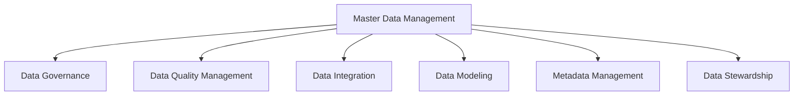
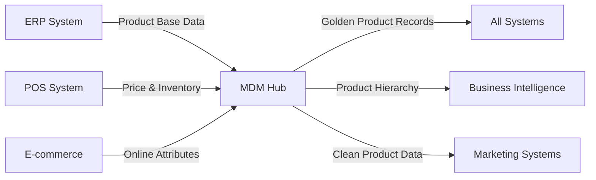

# Master Data Management

## Introduction

Master Data Management (MDM) is a critical discipline in the world of data integration that focuses on creating and maintaining a single, accurate, and consistent set of master data across an organization. Master data represents the core business entities that are shared across multiple systems - such as customers, products, employees, suppliers, and locations.

Think of MDM as the process of creating a single source of truth for your most important business data. Without proper MDM, organizations often struggle with duplicate records, inconsistent data formats, and conflicting information across different systems - leading to poor decision-making and operational inefficiencies.

## Why Master Data Management Matters

For beginners stepping into data integration, understanding MDM is crucial because:

1. **Data Quality**: MDM helps ensure data accuracy, completeness, and consistency
2. **Decision Support**: Reliable master data leads to better business intelligence and analytics
3. **Operational Efficiency**: Reduces duplicate work and reconciliation efforts
4. **Regulatory Compliance**: Helps meet data governance and privacy requirements
5. **System Integration**: Simplifies data exchange between different applications

## Core Components of MDM

A comprehensive MDM solution typically includes these essential components:



### Data Governance

Data governance establishes the policies, procedures, and standards for managing master data. This includes:

- Defining ownership and responsibilities
- Creating data policies and standards
- Establishing data access controls
- Implementing compliance measures

### Data Quality Management

Data quality management ensures that master data meets defined quality standards through:

- Data profiling to identify quality issues
- Data cleansing to fix errors and inconsistencies
- Data enrichment to enhance existing data
- Data validation to verify accuracy

### Data Integration

Data integration connects master data across different systems and sources:

- Extract, Transform, Load (ETL) processes
- API-based integration
- Event-driven synchronization
- Batch processing

### Data Modeling

Data modeling creates the structure for master data:

- Entity relationship diagrams
- Data attribute definitions
- Hierarchical relationships
- Data domain specifications

### Metadata Management

Metadata management documents the context around master data:

- Data lineage tracking
- Business definitions
- Technical specifications
- Usage information

### Data Stewardship

Data stewardship involves the ongoing management of master data:

- Data entry and maintenance
- Change management processes
- Issue resolution
- Data quality monitoring

## MDM Implementation Approaches

There are several common approaches to implementing MDM:

### 1. Registry Style

The registry approach creates a central index of master data while leaving the actual data in source systems.

```javascript
// Example of a registry-style MDM lookup
function lookupCustomerInRegistry(customerId) {
  // Connect to MDM registry
  const registry = connectToMDMRegistry();
  
  // Find the customer in the registry
  const customerReference = registry.findCustomer(customerId);
  
  // The registry returns references to where the actual data lives
  return {
    customerSystemOfRecord: customerReference.systemOfRecord,
    customerIdInSource: customerReference.sourceId,
    lastUpdated: customerReference.lastUpdated
  };
}

// Output example:
// {
//   customerSystemOfRecord: "CRM_SYSTEM",
//   customerIdInSource: "CRM-1234",
//   lastUpdated: "2025-03-15T10:30:45Z" 
// }
```

**Advantages**: Less complex, minimal disruption to source systems<br />
**Disadvantages**: Does not resolve data quality issues, only points to source systems

### 2. Centralized (Hub and Spoke)

The centralized approach creates a master data hub that serves as the system of record.

```javascript
// Example of retrieving customer data from a centralized MDM hub
async function getCustomerFromMDMHub(customerId) {
  // Connect to the central MDM hub
  const mdmHub = connectToMDMHub();
  
  // Retrieve the golden record from the hub
  const customerMasterRecord = await mdmHub.getCustomer(customerId);
  
  // Return the authoritative customer data
  return customerMasterRecord;
}

// Output example:
// {
//   customerId: "GLOBAL-1234",
//   firstName: "Jane",
//   lastName: "Smith",
//   email: "jane.smith@example.com",
//   addresses: [...],
//   phones: [...],
//   segments: ["PREMIUM", "LOYAL"],
//   createdDate: "2020-05-10",
//   lastModified: "2025-02-28T15:20:10Z"
// }
```

**Advantages**: Strong governance, single source of truth<br />
**Disadvantages**: More complex implementation, requires significant change management

### 3. Coexistence

The coexistence approach maintains master data in both the MDM system and source systems with bidirectional synchronization.

```javascript
// Example of synchronizing data in a coexistence MDM model
async function updateCustomerAcrossSystems(customerId, updatedData) {
  // Connect to MDM hub
  const mdmHub = connectToMDMHub();
  
  // Update the master record
  const updatedMasterRecord = await mdmHub.updateCustomer(customerId, updatedData);
  
  // MDM system automatically propagates changes to connected systems
  const syncStatus = await mdmHub.synchronizeWithSources(customerId);
  
  return {
    masterRecord: updatedMasterRecord,
    synchronizationStatus: syncStatus
  };
}

// Output example:
// {
//   masterRecord: { customerId: "GLOBAL-1234", ... },
//   synchronizationStatus: {
//     CRM_SYSTEM: "SUCCESS",
//     ERP_SYSTEM: "SUCCESS",
//     ECOMMERCE_SYSTEM: "PENDING"
//   }
// }
```

**Advantages**: Flexible, balances centralization with system-specific needs<br />
**Disadvantages**: Complex synchronization logic, potential for conflicts

## Data Matching and Consolidation

A critical aspect of MDM is identifying and resolving duplicate records through data matching techniques:

### Exact Matching

The simplest approach that looks for exact matches in key fields:

```javascript
function findExactMatches(records, matchFields) {
  const matchGroups = {};
  
  records.forEach(record => {
    // Create a composite key from all match fields
    const matchKey = matchFields.map(field => record[field]).join('|');
    
    // Group records by match key
    if (!matchGroups[matchKey]) {
      matchGroups[matchKey] = [];
    }
    matchGroups[matchKey].push(record);
  });
  
  // Return only groups with multiple records (matches)
  return Object.values(matchGroups).filter(group => group.length > 1);
}

// Example usage:
// const duplicates = findExactMatches(customerRecords, ['email', 'phone']);
```

### Fuzzy Matching

More sophisticated approach using algorithms to find similar but not identical records:

```javascript
function calculateJaroWinklerSimilarity(str1, str2) {
  // Simplified implementation of Jaro-Winkler string similarity
  // Returns a value between 0 (completely different) and 1 (identical)
  
  // ... algorithm implementation ...
  
  return similarityScore; // Value between 0 and 1
}

function findFuzzyMatches(records, threshold = 0.9) {
  const matches = [];
  
  // Compare each record with every other record
  for (let i = 0; i < records.length; i++) {
    for (let j = i + 1; j < records.length; j++) {
      const record1 = records[i];
      const record2 = records[j];
      
      // Calculate name similarity
      const nameSimilarity = calculateJaroWinklerSimilarity(
        `${record1.firstName} ${record1.lastName}`,
        `${record2.firstName} ${record2.lastName}`
      );
      
      // Calculate address similarity
      const addressSimilarity = calculateJaroWinklerSimilarity(
        record1.address,
        record2.address
      );
      
      // Calculate overall similarity
      const overallSimilarity = (nameSimilarity * 0.7) + (addressSimilarity * 0.3);
      
      // If similarity exceeds threshold, consider it a match
      if (overallSimilarity >= threshold) {
        matches.push({
          record1,
          record2,
          similarity: overallSimilarity
        });
      }
    }
  }
  
  return matches;
}

// Example usage:
// const potentialDuplicates = findFuzzyMatches(customerRecords, 0.85);
```

### Record Consolidation

Once duplicates are identified, they must be consolidated into a "golden record":

```javascript
function createGoldenRecord(matchedRecords, rules) {
  // Start with an empty golden record
  const goldenRecord = {};
  
  // Apply survivorship rules to each field
  Object.keys(rules).forEach(field => {
    const rule = rules[field];
    
    switch (rule) {
      case 'MOST_RECENT':
        // Find the record with the most recent update timestamp
        const mostRecentRecord = matchedRecords.reduce((latest, current) => {
          return (new Date(current.lastUpdated) > new Date(latest.lastUpdated)) ? current : latest;
        }, matchedRecords[0]);
        goldenRecord[field] = mostRecentRecord[field];
        break;
        
      case 'MOST_COMPLETE':
        // Choose the value that is not null or empty
        matchedRecords.forEach(record => {
          if (record[field] && (!goldenRecord[field] || goldenRecord[field].length < record[field].length)) {
            goldenRecord[field] = record[field];
          }
        });
        break;
        
      case 'LONGEST':
        // Choose the longest value
        matchedRecords.forEach(record => {
          if (record[field] && (!goldenRecord[field] || goldenRecord[field].length < record[field].length)) {
            goldenRecord[field] = record[field];
          }
        });
        break;
        
      // Other rules like MOST_FREQUENT, TRUSTED_SOURCE, etc.
    }
  });
  
  return goldenRecord;
}

// Example usage:
// const survivorshipRules = {
//   firstName: 'MOST_COMPLETE',
//   lastName: 'MOST_COMPLETE',
//   email: 'MOST_RECENT',
//   phone: 'LONGEST',
//   address: 'TRUSTED_SOURCE'
// };
// const goldenRecord = createGoldenRecord(matchedRecords, survivorshipRules);
```

## Practical MDM Implementation Example

Let's walk through a simplified example of implementing MDM for a customer domain:

### 1. Define Data Model

First, define the master data model for customers:

```javascript
// Customer master data model
const customerDataModel = {
  customerId: {
    type: "string",
    required: true,
    unique: true,
    description: "Global unique identifier for the customer"
  },
  personalInfo: {
    firstName: {
      type: "string",
      required: true,
      description: "Customer's first name"
    },
    lastName: {
      type: "string",
      required: true,
      description: "Customer's last name"
    },
    email: {
      type: "string",
      required: true,
      pattern: "^[^@]+@[^@]+\\.[^@]+$",
      description: "Customer's primary email address"
    }
  },
  addresses: {
    type: "array",
    items: {
      addressType: {
        type: "string",
        enum: ["BILLING", "SHIPPING", "HOME", "WORK"],
        description: "Type of address"
      },
      street: { type: "string", required: true },
      city: { type: "string", required: true },
      state: { type: "string", required: true },
      postalCode: { type: "string", required: true },
      country: { type: "string", required: true },
      isPrimary: { type: "boolean", default: false }
    }
  },
  // Additional fields...
  metadata: {
    sourceSystem: { type: "string", description: "Original system of record" },
    createdDate: { type: "datetime" },
    lastModified: { type: "datetime" },
    dataQualityScore: { type: "number", min: 0, max: 100 }
  }
};
```

### 2. Create Data Integration Flow

Implement a data integration flow to collect customer data from different sources:

```javascript
// Example of a simplified MDM data integration process
async function integrateCustomerData() {
  try {
    // 1. Extract data from source systems
    const crmCustomers = await extractFromCRM();
    const erpCustomers = await extractFromERP();
    const ecommerceCustomers = await extractFromEcommerce();
    
    // 2. Transform data to conform to the master data model
    const transformedCrmCustomers = transformToMdmModel(crmCustomers, 'CRM');
    const transformedErpCustomers = transformToMdmModel(erpCustomers, 'ERP');
    const transformedEcomCustomers = transformToMdmModel(ecommerceCustomers, 'ECOMMERCE');
    
    // 3. Combine all sources
    const allCustomers = [
      ...transformedCrmCustomers,
      ...transformedErpCustomers,
      ...transformedEcomCustomers
    ];
    
    // 4. Perform matching to identify duplicates
    const matchResults = performMatching(allCustomers);
    
    // 5. Create golden records by consolidating matches
    const goldenRecords = createGoldenRecords(matchResults);
    
    // 6. Load golden records into the MDM hub
    await loadToMdmHub(goldenRecords);
    
    // 7. Publish updates to subscribing systems
    await publishToSubscribingSystems(goldenRecords);
    
    return {
      processedRecords: allCustomers.length,
      uniqueCustomers: goldenRecords.length,
      matchGroups: matchResults.length
    };
  } catch (error) {
    console.error("MDM integration process failed:", error);
    throw error;
  }
}
```

### 3. Implement Data Governance

Create governance processes to maintain data quality:

```javascript
// Example of a data validation function
function validateCustomerRecord(customer, dataModel) {
  const validationErrors = [];
  
  // Check required fields
  Object.entries(dataModel).forEach(([fieldName, fieldDef]) => {
    if (fieldDef.required && !customer[fieldName]) {
      validationErrors.push(`Missing required field: ${fieldName}`);
    }
    
    // Type validation
    if (customer[fieldName] && typeof customer[fieldName] !== fieldDef.type) {
      validationErrors.push(`Field ${fieldName} has wrong type. Expected ${fieldDef.type}`);
    }
    
    // Pattern validation (for strings)
    if (
      fieldDef.pattern && 
      customer[fieldName] && 
      typeof customer[fieldName] === 'string' &&
      !new RegExp(fieldDef.pattern).test(customer[fieldName])
    ) {
      validationErrors.push(`Field ${fieldName} doesn't match required pattern`);
    }
    
    // Enum validation
    if (
      fieldDef.enum && 
      customer[fieldName] && 
      !fieldDef.enum.includes(customer[fieldName])
    ) {
      validationErrors.push(`Field ${fieldName} must be one of: ${fieldDef.enum.join(', ')}`);
    }
  });
  
  return validationErrors;
}

// Example of a data quality scoring function
function calculateDataQualityScore(customer) {
  let score = 100; // Start with perfect score
  
  // Check for completeness
  const requiredFields = ['customerId', 'firstName', 'lastName', 'email'];
  requiredFields.forEach(field => {
    if (!customer[field]) {
      score -= 15; // Deduct points for missing required fields
    }
  });
  
  // Check for valid email format
  if (customer.email && !/^[^@]+@[^@]+\.[^@]+$/.test(customer.email)) {
    score -= 10;
  }
  
  // Check for address completeness
  if (!customer.addresses || customer.addresses.length === 0) {
    score -= 10;
  } else {
    // Check if primary address has all fields
    const primaryAddress = customer.addresses.find(addr => addr.isPrimary);
    if (!primaryAddress) {
      score -= 5;
    } else {
      const requiredAddressFields = ['street', 'city', 'state', 'postalCode', 'country'];
      requiredAddressFields.forEach(field => {
        if (!primaryAddress[field]) {
          score -= 2;
        }
      });
    }
  }
  
  // Ensure score doesn't go below 0
  return Math.max(0, score);
}
```

## Real-World MDM Examples

### Example 1: Retail Product MDM

A retail company implementing MDM for their product catalog:



In this scenario, the MDM system:
- Consolidates product information from multiple sources
- Creates consistent product hierarchies and categorizations
- Ensures pricing and inventory data is synchronized
- Provides clean product data for marketing and analytics

### Example 2: Healthcare Patient MDM

A healthcare provider implementing patient MDM:

```javascript
// Example of patient matching in a healthcare MDM system
function matchPatientRecords(patientA, patientB) {
  let matchScore = 0;
  
  // Exact matches on key identifiers earn high points
  if (patientA.ssn && patientB.ssn && patientA.ssn === patientB.ssn) {
    matchScore += 50;
  }
  
  if (patientA.dateOfBirth && patientB.dateOfBirth && 
      patientA.dateOfBirth === patientB.dateOfBirth) {
    matchScore += 25;
  }
  
  // Name matching with fuzzy logic
  const nameMatch = calculateNameSimilarity(
    `${patientA.firstName} ${patientA.lastName}`,
    `${patientB.firstName} ${patientB.lastName}`
  );
  matchScore += nameMatch * 20;
  
  // Address matching
  if (patientA.address && patientB.address) {
    const addressMatch = calculateAddressSimilarity(
      patientA.address,
      patientB.address
    );
    matchScore += addressMatch * 15;
  }
  
  // Consider gender as a match criterion
  if (patientA.gender && patientB.gender && 
      patientA.gender === patientB.gender) {
    matchScore += 5;
  }
  
  // Determine if it's a match based on a threshold
  return {
    isMatch: matchScore >= 70,
    confidenceScore: matchScore
  };
}

// Example output:
// {
//   isMatch: true,
//   confidenceScore: 85
// }
```

Benefits in healthcare:
- Prevents duplicate patient records that can lead to medical errors
- Creates a holistic view of patient history across different departments
- Improves billing accuracy
- Enhances reporting capabilities

## Best Practices for MDM Implementation

1. **Start Small**
   - Begin with a single domain (e.g., customers or products)
   - Choose a limited scope for your first implementation
   - Expand incrementally based on business priorities

2. **Focus on Business Value**
   - Identify specific business problems MDM will solve
   - Set measurable objectives (e.g., reduction in duplicate records)
   - Calculate ROI to justify investment

3. **Establish Strong Governance**
   - Define clear roles and responsibilities
   - Create data standards and policies
   - Implement data stewardship processes
   - Set up regular data quality reviews

4. **Choose the Right MDM Style**
   - Select appropriate implementation style (registry, centralized, coexistence)
   - Consider organizational readiness and technical capabilities
   - Balance ideal approach with practical constraints

5. **Invest in Data Quality**
   - Implement data quality checks at entry points
   - Create automated data cleansing processes
   - Establish data quality metrics and monitoring

6. **Plan for Change Management**
   - Communicate benefits to stakeholders
   - Provide training on new processes
   - Address cultural resistance to data sharing

## Common MDM Challenges and Solutions

| Challenge | Solution |
|-----------|----------|
| Data silos and ownership disputes | Establish clear data governance with executive sponsorship |
| Poor data quality in source systems | Implement data quality firewall and source system improvements |
| Resistance to change | Focus on business benefits and involve stakeholders early |
| Technology complexity | Start with simpler implementation styles and expand gradually |
| Ongoing maintenance | Automate processes and establish clear data stewardship |
| Integration with legacy systems | Use flexible integration patterns (APIs, ESB, etc.) |

## MDM Tools and Technologies

When implementing MDM, organizations typically use specialized tools:

1. **Commercial MDM Platforms**
   - Informatica MDM
   - IBM InfoSphere MDM
   - SAP Master Data Governance
   - Oracle Enterprise Data Management

2. **Open Source Options**
   - Apache Unomi (customer data)
   - Talend Open Studio (with MDM capabilities)
   - Apache Atlas (metadata and governance)

3. **Custom MDM Solutions**
   - Built on data integration platforms
   - Using database technologies with custom logic
   - Microservices-based architectures

## Summary

Master Data Management is a critical discipline for organizations seeking to create a trusted, single version of the truth for their core business data. By implementing MDM, you can:

- Eliminate duplicate and inconsistent records
- Improve data quality and decision-making
- Enhance operational efficiency
- Support regulatory compliance
- Enable more effective system integration

Successful MDM implementation requires a balance of technology, processes, and people. By starting small, focusing on business value, establishing strong governance, and following best practices, organizations can achieve significant benefits from their MDM initiatives.

## Exercises

1. **Data Model Design**
   - Design a simple master data model for a product domain, including core attributes, relationships, and validation rules.

2. **Matching Algorithm**
   - Implement a basic fuzzy matching algorithm to identify potential duplicate customer records based on name and address similarity.

3. **Governance Process**
   - Create a data governance plan for a fictional company implementing customer MDM, including roles, responsibilities, and standard processes.

4. **MDM Architecture Selection**
   - For a given scenario, evaluate which MDM implementation style (registry, centralized, or coexistence) would be most appropriate and explain why.

5. **Integration Planning**
   - Map out how an MDM system would integrate with CRM, ERP, and e-commerce systems in a retail organization, including data flows and synchronization approaches.

## Additional Resources

- **Books**
  - "Master Data Management in Practice" by Dalton Cervo and Mark Allen
  - "Enterprise Master Data Management" by Allen Dreibelbis

- **Online Courses**
  - Data Management Association (DAMA) courses
  - MDM certification programs from major vendors

- **Communities**
  - Data Governance Professionals Organization
  - MDM & Data Governance Summit

- **Frameworks**
  - DAMA Data Management Body of Knowledge (DMBOK)
  - The MDM Institute's best practices