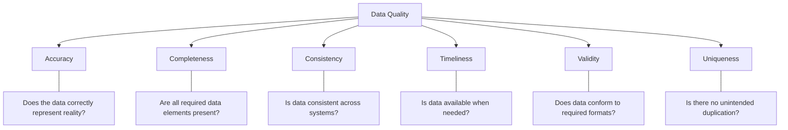

# Data Quality Management

## Introduction

Data Quality Management (DQM) is a crucial discipline in data integration that focuses on maintaining the integrity, accuracy, and reliability of data throughout its lifecycle. In today's data-driven world, organizations rely heavily on data to make critical business decisions. Poor quality data can lead to incorrect insights, faulty decision-making, and significant financial losses.

As a beginner in data integration, understanding DQM principles will help you build robust data pipelines that deliver trustworthy information to your applications and analytics systems.

## Why Data Quality Matters

Consider this scenario: Your e-commerce application is collecting customer data but isn't validating email addresses properly. As a result:

- Marketing emails bounce back
- Customer notifications fail to deliver
- Users can't reset passwords
- Analytics reports show incorrect customer counts

This simple data quality issue can significantly impact business operations, customer experience, and decision-making capabilities.

## Core Dimensions of Data Quality

Data quality is typically evaluated across several key dimensions:



Let's explore each dimension with practical examples:

### Accuracy

Accuracy measures how well data reflects the real-world entity it represents.

**Example:** A customer database with incorrect names or addresses leads to failed deliveries.

```python
# Simple accuracy check - validating ZIP codes against known patterns
def validate_zip_code(zip_code, country="US"):
    if country == "US":
        # US ZIP codes are 5 digits or 5+4 format
        return bool(re.match(r'^\d{5}(-\d{4})?$', zip_code))
    elif country == "CA":
        # Canadian postal codes follow A1A 1A1 format
        return bool(re.match(r'^[A-Z]\d[A-Z] \d[A-Z]\d$', zip_code))
    # Add more country validations as needed
    
# Example usage
test_zips = ["90210", "90210-1234", "9021", "ABCDE"]
for zip_code in test_zips:
    print(f"ZIP: {zip_code}, Valid: {validate_zip_code(zip_code)}")

# Output:
# ZIP: 90210, Valid: True
# ZIP: 90210-1234, Valid: True
# ZIP: 9021, Valid: False
# ZIP: ABCDE, Valid: False
```

### Completeness

Completeness checks whether all required data elements are present and not blank or null.

**Example:** Missing email addresses in a customer record prevent sending order confirmations.

```python
# Checking completeness of customer records
def check_completeness(customer_record, required_fields):
    missing_fields = []
    for field in required_fields:
        if field not in customer_record or not customer_record[field]:
            missing_fields.append(field)
    
    completeness_score = (len(required_fields) - len(missing_fields)) / len(required_fields) * 100
    return {
        "complete": len(missing_fields) == 0,
        "missing_fields": missing_fields,
        "completeness_score": completeness_score
    }

# Example usage
customer = {
    "id": "C12345",
    "name": "Jane Smith",
    "email": "",
    "phone": "555-123-4567",
    "address": "123 Main St"
}

required_fields = ["id", "name", "email", "phone", "address"]
result = check_completeness(customer, required_fields)
print(result)

# Output:
# {'complete': False, 'missing_fields': ['email'], 'completeness_score': 80.0}
```

### Consistency

Consistency ensures data is presented in the same format across different systems and adheres to defined standards.

**Example:** Date formats (MM/DD/YYYY vs. DD/MM/YYYY) that aren't consistent cause calculation errors.

```python
# Standardizing date formats for consistency
def standardize_date(date_string):
    # List of potential date formats to try
    formats = [
        "%m/%d/%Y", "%d/%m/%Y", "%Y-%m-%d", 
        "%m-%d-%Y", "%d-%m-%Y", "%Y/%m/%d"
    ]
    
    # Try each format until one works
    for fmt in formats:
        try:
            parsed_date = datetime.strptime(date_string, fmt)
            # Return in ISO format for consistency
            return parsed_date.strftime("%Y-%m-%d")
        except ValueError:
            continue
    
    # If none of the formats work
    return None

# Example usage
dates = ["12/31/2023", "31/12/2023", "2023-12-31", "12-31-2023"]
for date in dates:
    print(f"Original: {date}, Standardized: {standardize_date(date)}")

# Output:
# Original: 12/31/2023, Standardized: 2023-12-31
# Original: 31/12/2023, Standardized: 2023-12-31
# Original: 2023-12-31, Standardized: 2023-12-31
# Original: 12-31-2023, Standardized: 2023-12-31
```

### Timeliness

Timeliness measures whether data is available when needed for its intended use.

**Example:** Inventory data that updates once daily can lead to overselling in an e-commerce site.

```python
# Checking data freshness
def check_data_freshness(last_update_timestamp, freshness_threshold_hours=24):
    now = datetime.now()
    last_update = datetime.fromisoformat(last_update_timestamp)
    
    time_diff = now - last_update
    hours_diff = time_diff.total_seconds() / 3600
    
    return {
        "is_fresh": hours_diff <= freshness_threshold_hours,
        "hours_since_update": round(hours_diff, 2),
        "status": "current" if hours_diff <= freshness_threshold_hours else "stale"
    }

# Example usage
yesterday = (datetime.now() - timedelta(hours=26)).isoformat()
today = (datetime.now() - timedelta(hours=2)).isoformat()

print(f"Yesterday's data: {check_data_freshness(yesterday)}")
print(f"Today's data: {check_data_freshness(today)}")

# Output:
# Yesterday's data: {'is_fresh': False, 'hours_since_update': 26.0, 'status': 'stale'}
# Today's data: {'is_fresh': True, 'hours_since_update': 2.0, 'status': 'current'}
```

### Validity

Validity ensures data conforms to the required format, type, and range according to business rules.

**Example:** An age field with a negative number or unreasonably high value.

```python
# Validating data against business rules
def validate_field(value, field_type, rules=None):
    if rules is None:
        rules = {}
    
    # Basic type validation
    if field_type == "integer":
        try:
            value = int(value)
        except (ValueError, TypeError):
            return False, f"Value must be an integer"
    
    # Apply specific rules for the field
    if field_type == "integer" and "min" in rules and value < rules["min"]:
        return False, f"Value must be at least {rules['min']}"
    
    if field_type == "integer" and "max" in rules and value > rules["max"]:
        return False, f"Value must be at most {rules['max']}"
    
    if field_type == "string" and "pattern" in rules and not re.match(rules["pattern"], value):
        return False, f"Value does not match required pattern"
    
    return True, "Valid"

# Example usage
age_rules = {"min": 0, "max": 120}
email_rules = {"pattern": r'^[\w\.-]+@[\w\.-]+\.\w+$'}

print(validate_field("25", "integer", age_rules))
print(validate_field("-5", "integer", age_rules))
print(validate_field("200", "integer", age_rules))
print(validate_field("user@example.com", "string", email_rules))
print(validate_field("invalid-email", "string", email_rules))

# Output:
# (True, 'Valid')
# (False, 'Value must be at least 0')
# (False, 'Value must be at most 120')
# (True, 'Valid')
# (False, 'Value does not match required pattern')
```

### Uniqueness

Uniqueness ensures there are no unintended duplicates in the data.

**Example:** Duplicate customer records lead to repeated communications and confused analytics.

```python
# Detecting duplicate records
def find_duplicates(records, key_fields):
    seen = {}
    duplicates = []
    
    for idx, record in enumerate(records):
        # Create a tuple of the values in key fields
        key = tuple(record.get(field) for field in key_fields)
        
        if key in seen:
            duplicates.append({
                "original_index": seen[key],
                "duplicate_index": idx,
                "original_record": records[seen[key]],
                "duplicate_record": record
            })
        else:
            seen[key] = idx
    
    return duplicates

# Example usage
customers = [
    {"id": "C1001", "email": "john@example.com", "name": "John Smith"},
    {"id": "C1002", "email": "sara@example.com", "name": "Sara Jones"},
    {"id": "C1003", "email": "john@example.com", "name": "John S."},
    {"id": "C1004", "email": "mike@example.com", "name": "Mike Johnson"}
]

duplicate_emails = find_duplicates(customers, ["email"])
print(f"Found {len(duplicate_emails)} potential duplicate(s) by email:")
for dup in duplicate_emails:
    print(f"Original: {dup['original_record']}")
    print(f"Duplicate: {dup['duplicate_record']}")
    print()

# Output:
# Found 1 potential duplicate(s) by email:
# Original: {'id': 'C1001', 'email': 'john@example.com', 'name': 'John Smith'}
# Duplicate: {'id': 'C1003', 'email': 'john@example.com', 'name': 'John S.'}
```

## Data Quality Management Process

Implementing an effective DQM process involves several key steps:

### 1. Define Data Quality Standards

Start by defining what "good data" means for your organization. Establish measurable standards for each quality dimension.

**Example:**
```python
# Example data quality standards definition
data_quality_standards = {
    "customer_data": {
        "email": {
            "format": r'^[\w\.-]+@[\w\.-]+\.\w+$',
            "required": True,
            "uniqueness": "high"
        },
        "phone": {
            "format": r'^\+?[1-9]\d{1,14}$',  # International format
            "required": False,
            "uniqueness": "medium"
        },
        "name": {
            "min_length": 2,
            "required": True,
            "uniqueness": "low"
        }
    }
}
```

### 2. Assess Current Data Quality

Evaluate your existing data against the established standards to identify gaps.

```python
# Simple data quality assessment
def assess_data_quality(dataset, standards):
    results = {
        "records_assessed": len(dataset),
        "issues_found": 0,
        "issue_types": {},
        "issue_details": []
    }
    
    for record_idx, record in enumerate(dataset):
        for field, rules in standards.items():
            # Check if required fields are present
            if rules.get("required", False) and (field not in record or not record[field]):
                issue_type = f"missing_{field}"
                results["issues_found"] += 1
                results["issue_types"][issue_type] = results["issue_types"].get(issue_type, 0) + 1
                results["issue_details"].append({
                    "record_idx": record_idx,
                    "issue_type": issue_type,
                    "field": field
                })
            
            # Check format if field exists and has a format rule
            if field in record and record[field] and "format" in rules:
                if not re.match(rules["format"], str(record[field])):
                    issue_type = f"invalid_format_{field}"
                    results["issues_found"] += 1
                    results["issue_types"][issue_type] = results["issue_types"].get(issue_type, 0) + 1
                    results["issue_details"].append({
                        "record_idx": record_idx,
                        "issue_type": issue_type,
                        "field": field,
                        "value": record[field]
                    })
    
    # Calculate overall quality score (simple version)
    max_possible_issues = len(dataset) * len(standards)
    results["quality_score"] = 100 - (results["issues_found"] / max_possible_issues * 100) if max_possible_issues > 0 else 100
    
    return results

# Example usage
customer_standards = {
    "email": {
        "format": r'^[\w\.-]+@[\w\.-]+\.\w+$',
        "required": True
    },
    "name": {
        "required": True
    }
}

customers = [
    {"name": "John Smith", "email": "john@example.com"},
    {"name": "Sara Jones", "email": "saraexample.com"},
    {"name": "", "email": "mike@example.com"},
    {"name": "Lisa Brown"}
]

assessment = assess_data_quality(customers, customer_standards)
print(f"Quality Score: {assessment['quality_score']:.2f}%")
print(f"Issues Found: {assessment['issues_found']}")
print("Issue Types:")
for issue_type, count in assessment["issue_types"].items():
    print(f"  - {issue_type}: {count}")

# Output:
# Quality Score: 62.50%
# Issues Found: 3
# Issue Types:
#   - invalid_format_email: 1
#   - missing_name: 1
#   - missing_email: 1
```

### 3. Clean and Transform Data

Based on your assessment, implement processes to clean and transform data to meet quality standards.

```python
# Data cleaning functions
def clean_customer_data(customers, standards):
    cleaned_data = []
    cleaning_logs = []
    
    for idx, customer in enumerate(customers):
        cleaned_customer = customer.copy()  # Create a copy to avoid modifying original
        log_entry = {"original_idx": idx, "changes": []}
        
        # Apply cleaning rules
        for field, rules in standards.items():
            # Skip if field doesn't exist
            if field not in cleaned_customer:
                continue
                
            # Standardize email addresses
            if field == "email" and cleaned_customer[field]:
                original = cleaned_customer[field]
                # Convert to lowercase
                cleaned_customer[field] = cleaned_customer[field].lower()
                # Remove leading/trailing spaces
                cleaned_customer[field] = cleaned_customer[field].strip()
                
                if original != cleaned_customer[field]:
                    log_entry["changes"].append({
                        "field": field,
                        "original": original,
                        "cleaned": cleaned_customer[field],
                        "action": "standardized"
                    })
            
            # Standardize phone numbers
            if field == "phone" and cleaned_customer[field]:
                original = cleaned_customer[field]
                # Remove non-numeric characters except the leading +
                if cleaned_customer[field].startswith("+"):
                    cleaned_customer[field] = "+" + ''.join(
                        c for c in cleaned_customer[field][1:] if c.isdigit()
                    )
                else:
                    cleaned_customer[field] = ''.join(
                        c for c in cleaned_customer[field] if c.isdigit()
                    )
                    
                if original != cleaned_customer[field]:
                    log_entry["changes"].append({
                        "field": field,
                        "original": original,
                        "cleaned": cleaned_customer[field],
                        "action": "standardized"
                    })
        
        cleaned_data.append(cleaned_customer)
        if log_entry["changes"]:
            cleaning_logs.append(log_entry)
    
    return cleaned_data, cleaning_logs

# Example usage
customers = [
    {"name": "John Smith", "email": "JOHN@EXAMPLE.COM ", "phone": "555-123-4567"},
    {"name": "Sara Jones", "email": "sara@example.com", "phone": "(555) 987-6543"},
    {"name": "Mike Johnson", "email": " mike@example.com", "phone": "+1 555.248.1234"}
]

standards = {
    "email": {},
    "phone": {}
}

cleaned_customers, logs = clean_customer_data(customers, standards)

print("Cleaning Results:")
for log in logs:
    print(f"Record #{log['original_idx']}:")
    for change in log["changes"]:
        print(f"  {change['field']}: '{change['original']}' -> '{change['cleaned']}'")
    print()

# Output:
# Cleaning Results:
# Record #0:
#   email: 'JOHN@EXAMPLE.COM ' -> 'john@example.com'
#   phone: '555-123-4567' -> '5551234567'
# 
# Record #1:
#   phone: '(555) 987-6543' -> '5559876543'
# 
# Record #2:
#   email: ' mike@example.com' -> 'mike@example.com'
#   phone: '+1 555.248.1234' -> '+15552481234'
```

### 4. Implement Data Quality Controls

Integrate quality checks into your data pipelines to prevent poor-quality data from entering your systems.

```python
# Data validation pipeline
def data_quality_pipeline(input_data, validation_rules, cleaning_functions=None):
    results = {
        "accepted": [],
        "rejected": [],
        "validation_logs": []
    }
    
    for record_idx, record in enumerate(input_data):
        record_issues = []
        
        # Apply validation rules
        for field, rules in validation_rules.items():
            # Check required fields
            if rules.get("required", False) and (field not in record or not record[field]):
                record_issues.append({
                    "field": field,
                    "issue": "missing_required_field",
                    "severity": "high"
                })
                continue
                
            # Skip validation if field is not present
            if field not in record or not record[field]:
                continue
                
            # Check format patterns
            if "format" in rules and not re.match(rules["format"], str(record[field])):
                record_issues.append({
                    "field": field,
                    "issue": "invalid_format",
                    "value": record[field],
                    "expected_format": rules["format"],
                    "severity": "medium"
                })
            
            # Check numeric ranges
            if "min" in rules and float(record[field]) < rules["min"]:
                record_issues.append({
                    "field": field,
                    "issue": "below_minimum",
                    "value": record[field],
                    "minimum": rules["min"],
                    "severity": "medium"
                })
                
            if "max" in rules and float(record[field]) > rules["max"]:
                record_issues.append({
                    "field": field,
                    "issue": "above_maximum",
                    "value": record[field],
                    "maximum": rules["max"],
                    "severity": "medium"
                })
        
        # Determine if record should be accepted or rejected
        if any(issue["severity"] == "high" for issue in record_issues):
            results["rejected"].append(record)
            results["validation_logs"].append({
                "record_idx": record_idx,
                "status": "rejected",
                "issues": record_issues
            })
        else:
            # Apply cleaning functions if available
            cleaned_record = record
            if cleaning_functions:
                cleaned_record = record.copy()
                for field, clean_func in cleaning_functions.items():
                    if field in cleaned_record and cleaned_record[field]:
                        cleaned_record[field] = clean_func(cleaned_record[field])
            
            results["accepted"].append(cleaned_record)
            if record_issues:
                results["validation_logs"].append({
                    "record_idx": record_idx,
                    "status": "accepted_with_warnings",
                    "issues": record_issues
                })
    
    # Summary statistics
    results["summary"] = {
        "total_records": len(input_data),
        "accepted_count": len(results["accepted"]),
        "rejected_count": len(results["rejected"]),
        "acceptance_rate": len(results["accepted"]) / len(input_data) * 100 if input_data else 0
    }
    
    return results

# Example usage
# Define validation rules
validation_rules = {
    "email": {
        "required": True,
        "format": r'^[\w\.-]+@[\w\.-]+\.\w+$'
    },
    "age": {
        "required": True,
        "min": 18,
        "max": 120
    },
    "name": {
        "required": True
    }
}

# Define cleaning functions
cleaning_functions = {
    "email": lambda x: x.lower().strip(),
    "name": lambda x: x.strip().title()
}

# Test data
users = [
    {"name": "john smith", "email": "john@example.com", "age": 25},
    {"name": "Sara Jones", "email": "saraexample.com", "age": 30},
    {"name": "Mike", "email": "mike@example.com", "age": 17},
    {"name": "", "email": "anonymous@example.com", "age": 22},
    {"name": "Lisa Brown", "email": "lisa@example.com", "age": 150}
]

pipeline_results = data_quality_pipeline(users, validation_rules, cleaning_functions)

print(f"Total Records: {pipeline_results['summary']['total_records']}")
print(f"Accepted: {pipeline_results['summary']['accepted_count']} ({pipeline_results['summary']['acceptance_rate']:.1f}%)")
print(f"Rejected: {pipeline_results['summary']['rejected_count']}")

print("
Accepted Records:")
for record in pipeline_results["accepted"]:
    print(f"  {record}")

print("
Rejected Records:")
for record in pipeline_results["rejected"]:
    print(f"  {record}")

print("
Issues Found:")
for log in pipeline_results["validation_logs"]:
    print(f"  Record {log['record_idx']} ({log['status']}):")
    for issue in log["issues"]:
        print(f"    - {issue['field']}: {issue['issue']}")

# Output:
# Total Records: 5
# Accepted: 2 (40.0%)
# Rejected: 3
# 
# Accepted Records:
#   {'name': 'John Smith', 'email': 'john@example.com', 'age': 25}
#   {'name': 'Lisa Brown', 'email': 'lisa@example.com', 'age': 150}
# 
# Rejected Records:
#   {'name': 'Sara Jones', 'email': 'saraexample.com', 'age': 30}
#   {'name': 'Mike', 'email': 'mike@example.com', 'age': 17}
#   {'name': '', 'email': 'anonymous@example.com', 'age': 22}
# 
# Issues Found:
#   Record 0 (accepted_with_warnings):
#   Record 1 (rejected):
#     - email: invalid_format
#   Record 2 (rejected):
#     - age: below_minimum
#   Record 3 (rejected):
#     - name: missing_required_field
#   Record 4 (accepted_with_warnings):
#     - age: above_maximum
```

### 5. Monitor and Maintain Data Quality

Implement continuous monitoring to ensure data quality remains high over time.

```python
# Simple data quality monitoring
def generate_quality_metrics(dataset, dimension_checks):
    timestamp = datetime.now().isoformat()
    metrics = {
        "timestamp": timestamp,
        "dataset_size": len(dataset),
        "dimensions": {}
    }
    
    for dimension, check_func in dimension_checks.items():
        result = check_func(dataset)
        metrics["dimensions"][dimension] = result
    
    # Calculate overall quality score (weighted average)
    dimension_weights = {
        "completeness": 0.3,
        "accuracy": 0.3,
        "consistency": 0.2,
        "timeliness": 0.2
    }
    
    weighted_score = 0
    for dimension, weight in dimension_weights.items():
        if dimension in metrics["dimensions"]:
            weighted_score += metrics["dimensions"][dimension]["score"] * weight
    
    metrics["overall_score"] = weighted_score
    
    return metrics

# Example dimension check functions
def check_completeness(dataset):
    required_fields = ["id", "name", "email", "created_at"]
    missing_count = 0
    total_fields = len(dataset) * len(required_fields)
    
    for record in dataset:
        for field in required_fields:
            if field not in record or not record[field]:
                missing_count += 1
    
    completeness_rate = (total_fields - missing_count) / total_fields * 100
    return {
        "score": completeness_rate,
        "missing_count": missing_count,
        "total_fields": total_fields
    }

def check_accuracy(dataset):
    # In a real system, this might compare against a verified source
    # For this example, we'll check email format as a proxy
    valid_emails = 0
    email_pattern = r'^[\w\.-]+@[\w\.-]+\.\w+$'
    
    for record in dataset:
        if "email" in record and record["email"] and re.match(email_pattern, record["email"]):
            valid_emails += 1
    
    accuracy_rate = valid_emails / len(dataset) * 100 if dataset else 0
    return {
        "score": accuracy_rate,
        "valid_emails": valid_emails,
        "total_records": len(dataset)
    }

# Example usage
dimension_checks = {
    "completeness": check_completeness,
    "accuracy": check_accuracy
}

users = [
    {"id": "U1001", "name": "John Smith", "email": "john@example.com", "created_at": "2023-01-15"},
    {"id": "U1002", "name": "Sara Jones", "email": "", "created_at": "2023-02-10"},
    {"id": "U1003", "name": "", "email": "mike@example.com", "created_at": "2023-03-05"},
    {"id": "U1004", "name": "Lisa Brown", "email": "invalid-email", "created_at": None}
]

metrics = generate_quality_metrics(users, dimension_checks)

print(f"Data Quality Report (Generated: {metrics['timestamp']})")
print(f"Overall Quality Score: {metrics['overall_score']:.2f}%")
print("
Dimension Scores:")
for dimension, results in metrics["dimensions"].items():
    print(f"  - {dimension.capitalize()}: {results['score']:.2f}%")

# Output:
# Data Quality Report (Generated: 2023-04-20T14:30:45.123456)
# Overall Quality Score: 62.50%
# 
# Dimension Scores:
#   - Completeness: 75.00%
#   - Accuracy: 50.00%
```

## Implementation Strategies

When implementing Data Quality Management in your projects, consider these strategies:

### 1. Data Profiling

Data profiling helps you understand your data before implementing quality controls.

```python
def profile_dataset(dataset):
    if not dataset:
        return {"error": "Empty dataset"}
    
    profile = {
        "record_count": len(dataset),
        "fields": {}
    }
    
    # Get list of all fields from all records
    all_fields = set()
    for record in dataset:
        all_fields.update(record.keys())
    
    # Analyze each field
    for field in all_fields:
        field_profile = {
            "present_count": 0,
            "null_count": 0,
            "types": {},
            "min_length": float('inf'),
            "max_length": 0,
            "sample_values": []
        }
        
        for record in dataset:
            # Check presence
            if field in record:
                field_profile["present_count"] += 1
                
                # Check if null/empty
                if record[field] is None or record[field] == "":
                    field_profile["null_count"] += 1
                    continue
                
                # Track data type
                data_type = type(record[field]).__name__
                field_profile["types"][data_type] = field_profile["types"].get(data_type, 0) + 1
                
                # Track length for string fields
                if isinstance(record[field], str):
                    length = len(record[field])
                    field_profile["min_length"] = min(field_profile["min_length"], length)
                    field_profile["max_length"] = max(field_profile["max_length"], length)
                
                # Collect sample values (up to 5)
                if len(field_profile["sample_values"]) < 5 and record[field] not in field_profile["sample_values"]:
                    field_profile["sample_values"].append(record[field])
        
        # Calculate presence rate
        field_profile["presence_rate"] = field_profile["present_count"] / len(dataset) * 100
        
        # Calculate non-null rate among present records
        if field_profile["present_count"] > 0:
            field_profile["non_null_rate"] = (field_profile["present_count"] - field_profile["null_count"]) / field_profile["present_count"] * 100
        else:
            field_profile["non_null_rate"] = 0
        
        # Clean up min_length if no strings were found
        if field_profile["min_length"] == float('inf'):
            field_profile["min_length"] = 0
        
        profile["fields"][field] = field_profile
    
    return profile

# Example usage
users = [
    {"id": "U1001", "name": "John Smith", "email": "john@example.com", "age": 32, "active": True},
    {"id": "U1002", "name