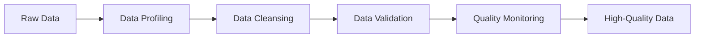
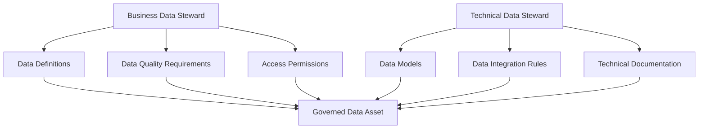
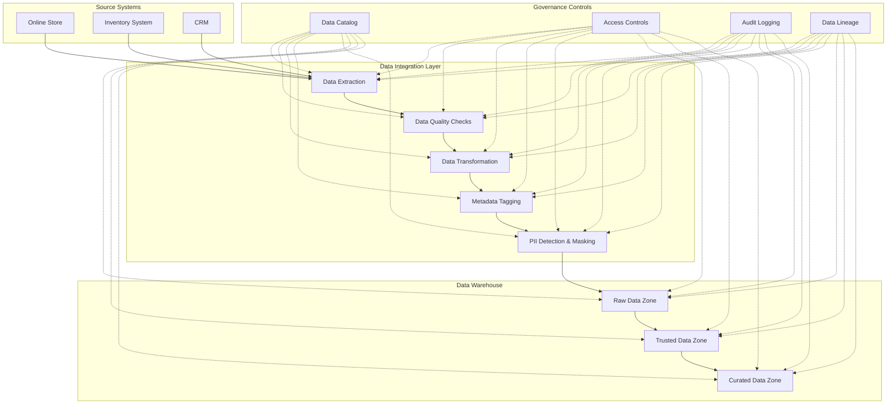

# Data Governance

## Introduction

Data governance is a crucial component of any successful data integration strategy. It refers to the overall management of the availability, usability, integrity, and security of data used within an organization. Think of data governance as the set of rules, policies, standards, and metrics that ensure data is used correctly and responsibly throughout its lifecycle.

For beginners venturing into data integration, understanding data governance principles is essential. Without proper governance, your integrated data might become inconsistent, insecure, or unusable—potentially leading to incorrect analysis and poor decision-making.

## Core Components of Data Governance

Data governance consists of several key components that work together to ensure your data remains valuable and trustworthy:

### 1. Data Quality Management

Data quality management focuses on ensuring that data is accurate, complete, consistent, and relevant for its intended use.



Let's implement a simple data quality check in Python:

```python
import pandas as pd

# Sample function to check data quality
def check_data_quality(dataframe):
    quality_report = {
        "total_rows": len(dataframe),
        "missing_values": dataframe.isnull().sum().to_dict(),
        "duplicates": dataframe.duplicated().sum(),
        "numeric_columns_stats": {}
    }
    
    # Check statistics for numeric columns
    for column in dataframe.select_dtypes(include=['int64', 'float64']).columns:
        quality_report["numeric_columns_stats"][column] = {
            "min": dataframe[column].min(),
            "max": dataframe[column].max(),
            "mean": dataframe[column].mean(),
            "outliers": len(dataframe[dataframe[column] > dataframe[column].mean() + 3*dataframe[column].std()])
        }
    
    return quality_report

# Example usage
data = pd.DataFrame({
    'user_id': [1, 2, 3, 4, 5, None],
    'name': ['Alice', 'Bob', 'Charlie', 'Dave', 'Eve', 'Frank'],
    'age': [25, 30, 22, 150, 28, 35],  # Note: 150 is likely an outlier
    'email': ['alice@example.com', 'bob@example.com', 'charlie@example.com', 
              'dave@example.com', 'eve@example.com', None]
})

quality_report = check_data_quality(data)
print(quality_report)
```

Example output:

```
{
  'total_rows': 6,
  'missing_values': {'user_id': 1, 'name': 0, 'age': 0, 'email': 1},
  'duplicates': 0,
  'numeric_columns_stats': {
    'user_id': {'min': 1.0, 'max': 5.0, 'mean': 3.0, 'outliers': 0},
    'age': {'min': 22, 'max': 150, 'mean': 48.33, 'outliers': 1}
  }
}
```

### 2. Metadata Management

Metadata is "data about data." It provides context to your data, making it easier to find, understand, and use. Proper metadata management includes documenting data sources, transformations, business definitions, and relationships.

```python
# Example metadata for a dataset
dataset_metadata = {
    "dataset_name": "customer_transactions",
    "description": "Daily customer transaction records",
    "owner": "Finance Department",
    "created_date": "2023-05-15",
    "last_updated": "2023-10-28",
    "update_frequency": "Daily",
    "source_systems": ["POS", "E-commerce Platform"],
    "data_dictionary": {
        "customer_id": {
            "description": "Unique identifier for customer",
            "data_type": "INT",
            "constraints": "PRIMARY KEY"
        },
        "transaction_date": {
            "description": "Date of transaction",
            "data_type": "DATE",
            "constraints": "NOT NULL"
        },
        "amount": {
            "description": "Transaction amount in USD",
            "data_type": "DECIMAL(10,2)",
            "constraints": "NOT NULL"
        }
    }
}
```

### 3. Data Security and Privacy

Data security and privacy ensure that sensitive data is protected from unauthorized access and that its use complies with relevant regulations (like GDPR, CCPA, or HIPAA).

```python
# Example implementation of data masking for PII
def mask_personal_data(dataframe, columns_to_mask):
    masked_df = dataframe.copy()
    
    for column in columns_to_mask:
        if column in masked_df.columns:
            # Different masking strategies for different data types
            if masked_df[column].dtype == 'object':  # For strings
                masked_df[column] = masked_df[column].apply(
                    lambda x: x[:2] + '*' * (len(x)-4) + x[-2:] if isinstance(x, str) else x
                )
            else:  # For numeric data
                # Replace with random value within acceptable range
                min_val = masked_df[column].min()
                max_val = masked_df[column].max()
                masked_df[column] = masked_df[column].apply(
                    lambda x: int(min_val + (max_val - min_val) * 0.3) if not pd.isna(x) else x
                )
    
    return masked_df

# Example usage
customer_data = pd.DataFrame({
    'customer_id': [1001, 1002, 1003, 1004],
    'name': ['John Smith', 'Jane Doe', 'Robert Johnson', 'Sarah Williams'],
    'email': ['john.smith@example.com', 'jane.doe@example.com', 
              'robert.j@example.com', 'sarah.w@example.com'],
    'ssn': ['123-45-6789', '987-65-4321', '456-78-9012', '789-01-2345'],
    'balance': [15000, 25000, 5000, 35000]
})

# Mask sensitive columns
columns_to_mask = ['name', 'email', 'ssn', 'balance']
masked_data = mask_personal_data(customer_data, columns_to_mask)
print(masked_data)
```

Example output:

```
   customer_id              name                      email             ssn  balance
0         1001        Jo******th        jo************.com      12*******89    11000
1         1002        Ja******oe        ja************.com      98*******21    11000
2         1003     Ro*********on        ro************.com      45*******12    11000
3         1004    Sa***********ms        sa************.com      78*******45    11000
```

### 4. Data Stewardship

Data stewards are individuals responsible for managing and overseeing data assets. They ensure data policies are followed and serve as a point of contact for data-related questions.



## Implementing Data Governance in Integration Projects

Now that we understand the core components, let's explore how to implement data governance in data integration projects:

### Step 1: Define Data Governance Policies

Start by defining clear policies that specify how data should be handled:

```python
# Example of a data governance policy structure (pseudo-code)
data_governance_policies = {
    "data_quality": {
        "acceptable_completeness": "95% per dataset",
        "duplicate_threshold": "0% for master data",
        "validation_frequency": "Daily for transactional data, Weekly for master data"
    },
    "data_access": {
        "sensitive_data_approval_process": "Two-level approval required",
        "role_based_access": {
            "data_scientist": ["anonymized_customer_data", "product_data"],
            "finance_analyst": ["sales_data", "cost_data"],
            "customer_support": ["customer_contact_info", "order_history"]
        }
    },
    "data_retention": {
        "transaction_data": "7 years",
        "log_files": "90 days",
        "backups": "1 year rolling window"
    }
}
```

### Step 2: Establish Data Lineage Tracking

Data lineage traces data from its origin to its destination, including all transformations along the way. This is crucial for understanding data provenance and debugging issues.

```python
import networkx as nx
import matplotlib.pyplot as plt

# Create a data lineage graph
def create_data_lineage_graph():
    G = nx.DiGraph()
    
    # Add source systems
    G.add_node("CRM", node_type="source_system")
    G.add_node("ERP", node_type="source_system")
    G.add_node("Website", node_type="source_system")
    
    # Add ETL processes
    G.add_node("Customer Extract", node_type="etl_process")
    G.add_node("Sales Extract", node_type="etl_process")
    G.add_node("Web Analytics Extract", node_type="etl_process")
    G.add_node("Customer Transform", node_type="etl_process")
    G.add_node("Sales Transform", node_type="etl_process")
    G.add_node("Data Merge Process", node_type="etl_process")
    
    # Add target data
    G.add_node("Customer Dimension", node_type="target_data")
    G.add_node("Sales Fact", node_type="target_data")
    G.add_node("Marketing Dashboard", node_type="business_application")
    
    # Add edges (data flows)
    G.add_edge("CRM", "Customer Extract")
    G.add_edge("ERP", "Sales Extract")
    G.add_edge("Website", "Web Analytics Extract")
    G.add_edge("Customer Extract", "Customer Transform")
    G.add_edge("Sales Extract", "Sales Transform")
    G.add_edge("Web Analytics Extract", "Sales Transform")
    G.add_edge("Customer Transform", "Customer Dimension")
    G.add_edge("Customer Transform", "Data Merge Process")
    G.add_edge("Sales Transform", "Data Merge Process")
    G.add_edge("Data Merge Process", "Sales Fact")
    G.add_edge("Customer Dimension", "Marketing Dashboard")
    G.add_edge("Sales Fact", "Marketing Dashboard")
    
    return G

# You would typically visualize this, but for a website example,
# we'll just create the graph object
lineage_graph = create_data_lineage_graph()
```

### Step 3: Implement Data Quality Monitoring

Ongoing monitoring ensures your data continues to meet quality standards over time:

```python
# Example of a simple data quality monitoring schedule
def schedule_data_quality_checks():
    monitoring_schedule = {
        "hourly_checks": [
            {
                "dataset": "real_time_transactions",
                "checks": ["schema_validation", "business_rule_compliance"],
                "alert_threshold": "Critical",
                "notification_channel": "Operations Team Slack"
            }
        ],
        "daily_checks": [
            {
                "dataset": "customer_master",
                "checks": ["completeness", "uniqueness", "consistency"],
                "alert_threshold": "High",
                "notification_channel": "Data Steward Email"
            },
            {
                "dataset": "product_inventory",
                "checks": ["accuracy", "freshness"],
                "alert_threshold": "Medium",
                "notification_channel": "Data Quality Dashboard"
            }
        ],
        "weekly_checks": [
            {
                "dataset": "sales_aggregates",
                "checks": ["trend_analysis", "outlier_detection"],
                "alert_threshold": "Low",
                "notification_channel": "Weekly Report"
            }
        ]
    }
    return monitoring_schedule

# Define what happens when issues are found
def quality_issue_handling_workflow(issue_details):
    # This would typically connect to ticketing systems, notification services, etc.
    severity = issue_details["severity"]
    dataset = issue_details["dataset"]
    issue_type = issue_details["type"]
    
    # Pseudo-code for handling process
    if severity == "Critical":
        # Create high-priority ticket and send immediate notification
        print(f"CRITICAL ALERT: {issue_type} issue found in {dataset}")
        # notify_team("operations", issue_details)
        # create_ticket(priority="P1", details=issue_details)
    elif severity == "High":
        # Create medium-priority ticket within business hours
        print(f"HIGH SEVERITY: {issue_type} issue found in {dataset}")
        # notify_data_steward(dataset, issue_details)
        # create_ticket(priority="P2", details=issue_details)
    else:
        # Log for weekly review
        print(f"Quality issue logged: {issue_type} in {dataset}")
        # add_to_quality_report(issue_details)
```

### Step 4: Create a Data Catalog

A data catalog makes data discoverable and understandable across the organization:

```python
# Simplified example of a data catalog entry
class DataCatalogEntry:
    def __init__(self, dataset_name, description, owner, tags=None):
        self.dataset_name = dataset_name
        self.description = description
        self.owner = owner
        self.tags = tags or []
        self.columns = []
        self.usage_examples = []
        self.related_datasets = []
        
    def add_column(self, name, description, data_type, is_pii=False):
        self.columns.append({
            "name": name,
            "description": description,
            "data_type": data_type,
            "is_pii": is_pii
        })
        
    def add_usage_example(self, purpose, query_example):
        self.usage_examples.append({
            "purpose": purpose,
            "query_example": query_example
        })
        
    def add_related_dataset(self, dataset_name, relationship_type):
        self.related_datasets.append({
            "dataset_name": dataset_name,
            "relationship_type": relationship_type
        })
        
    def to_dict(self):
        return {
            "dataset_name": self.dataset_name,
            "description": self.description,
            "owner": self.owner,
            "tags": self.tags,
            "columns": self.columns,
            "usage_examples": self.usage_examples,
            "related_datasets": self.related_datasets
        }

# Example usage:
customer_dataset = DataCatalogEntry(
    "customer_360",
    "Comprehensive view of customer information from multiple systems",
    "Customer Data Team",
    ["customer", "master data", "frequently used"]
)

customer_dataset.add_column(
    "customer_id", 
    "Unique identifier for the customer", 
    "VARCHAR(20)",
    False
)

customer_dataset.add_column(
    "email", 
    "Customer's primary email address", 
    "VARCHAR(100)",
    True
)

customer_dataset.add_usage_example(
    "Find high-value customers",
    """
    SELECT customer_id, lifetime_value
    FROM customer_360
    WHERE lifetime_value > 10000
    ORDER BY lifetime_value DESC
    """
)

customer_dataset.add_related_dataset(
    "customer_transactions", 
    "One-to-many: each customer has multiple transactions"
)

print(customer_dataset.to_dict())
```

## Real-World Data Governance Example

Let's explore a practical example of data governance in action. Imagine you're building a data integration pipeline for an e-commerce company:



Let's implement some key aspects of this system:

```python
# Simplified implementation of a data integration pipeline with governance
class GovernedDataPipeline:
    def __init__(self, pipeline_name, data_owner, sensitivity_level):
        self.pipeline_name = pipeline_name
        self.data_owner = data_owner
        self.sensitivity_level = sensitivity_level  # High, Medium, Low
        self.processing_steps = []
        self.audit_log = []
        
    def add_step(self, step_name, function_to_execute):
        """Add a processing step to the pipeline"""
        self.processing_steps.append({
            "step_name": step_name,
            "function": function_to_execute
        })
        
    def _log_activity(self, step_name, status, details=None):
        """Internal method to log activities for auditing"""
        import datetime
        
        log_entry = {
            "timestamp": datetime.datetime.now().isoformat(),
            "pipeline": self.pipeline_name,
            "step": step_name,
            "status": status,
            "details": details or {}
        }
        self.audit_log.append(log_entry)
        
    def execute(self, input_data):
        """Execute the pipeline with governance controls"""
        result = input_data
        
        # Check authorization (simplified)
        # In a real system, this would validate the current user's permissions
        if self.sensitivity_level == "High":
            print("High sensitivity data detected - validating special permissions")
            # would_check_permissions_here()
        
        for step in self.processing_steps:
            step_name = step["step_name"]
            function = step["function"]
            
            try:
                # Log the start of the step
                self._log_activity(step_name, "STARTED")
                
                # Execute the actual processing function
                result = function(result)
                
                # Check data quality (simplified)
                if "quality" in step_name.lower():
                    quality_score = len(result) > 0  # Simplified check
                    
                    if not quality_score:
                        self._log_activity(step_name, "QUALITY_FAILURE", 
                                          {"reason": "Data quality threshold not met"})
                        raise Exception("Data quality check failed")
                
                # Log successful completion
                self._log_activity(step_name, "COMPLETED", 
                                  {"records_processed": len(result) if hasattr(result, "__len__") else 0})
                
            except Exception as e:
                # Log failure
                self._log_activity(step_name, "FAILED", {"error": str(e)})
                raise
                
        return result

# Example usage:
def extract_data(input_data):
    # Simulating extraction from source
    print("Extracting data from source systems...")
    return input_data + [{"order_id": 1005, "customer_email": "new@example.com"}]

def quality_check(data):
    print("Performing data quality checks...")
    # In a real system, would perform actual validations
    valid_data = [item for item in data if "order_id" in item and "customer_email" in item]
    return valid_data

def mask_pii(data):
    print("Masking personally identifiable information...")
    for item in data:
        if "customer_email" in item:
            email = item["customer_email"]
            username, domain = email.split("@")
            item["customer_email"] = username[0] + "***@" + domain
    return data

# Create and use the governed pipeline
sample_data = [
    {"order_id": 1001, "customer_email": "user1@example.com"},
    {"order_id": 1002, "customer_email": "user2@example.com"},
    {"order_id": 1003, "customer_name": "John Doe"},  # Missing email
    {"order_id": 1004, "customer_email": "user4@example.com"}
]

pipeline = GovernedDataPipeline(
    "order_processing", 
    "Data Integration Team", 
    "Medium"
)

pipeline.add_step("extract", extract_data)
pipeline.add_step("quality_validation", quality_check)
pipeline.add_step("pii_protection", mask_pii)

try:
    processed_data = pipeline.execute(sample_data)
    print("
Processed data:")
    for item in processed_data:
        print(item)
        
    print("
Audit trail:")
    for log in pipeline.audit_log:
        print(f"{log['timestamp']} - {log['step']} - {log['status']}")
        
except Exception as e:
    print(f"Pipeline failed: {str(e)}")
```

## Benefits of Data Governance in Integration Projects

Implementing proper data governance in your data integration efforts provides several key benefits:

1. **Improved Data Quality**: By enforcing standards and checks, you ensure that integrated data is reliable and fit for purpose.

2. **Enhanced Security and Compliance**: Proper controls help protect sensitive data and meet regulatory requirements.

3. **Better Decision Making**: When users trust the data, they make better-informed decisions based on that data.

4. **Reduced Costs**: Preventing data quality issues is less expensive than fixing them later.

5. **Increased Efficiency**: Well-documented and properly managed data is easier to find and use.

## Common Data Governance Challenges

Despite its benefits, implementing data governance comes with challenges:

1. **Cultural Resistance**: Many organizations struggle with changing data handling practices.

2. **Balancing Governance and Agility**: Excessive controls can slow down projects.

3. **Resource Constraints**: Proper governance requires dedicated time and effort.

4. **Technical Complexity**: Implementing governance controls across diverse systems can be difficult.

5. **Measuring Success**: Quantifying the ROI of governance efforts isn't always straightforward.

## Best Practices for Data Governance

To overcome these challenges:

1. **Start Small**: Begin with critical data domains rather than trying to govern everything at once.

2. **Get Executive Buy-in**: Leadership support is crucial for successful governance initiatives.

3. **Focus on Business Value**: Tie governance to business outcomes, not just technical concerns.

4. **Automate Where Possible**: Use tools to automate governance tasks like data quality checks.

5. **Foster Data-Aware Culture**: Educate stakeholders about the importance of data governance.

## Summary

Data governance is a foundational element of successful data integration. By implementing proper policies, controls, and practices, you ensure that your integrated data remains high-quality, secure, and valuable to your organization.

Key takeaways include:
- Data governance encompasses data quality, metadata, security, and stewardship
- Implementing governance requires clear policies, lineage tracking, quality monitoring, and cataloging
- Proper governance leads to better data quality, enhanced security, and improved decision-making
- Start small, focus on business value, and automate where possible

## Exercises

1. Create a simple data quality assessment script that checks for completeness, accuracy, and consistency in a dataset of your choice.

2. Draft a data governance policy for a fictional company, covering data quality, security, privacy, and retention requirements.

3. Design a metadata schema for documenting datasets in your organization, including business and technical metadata.

4. Implement a basic data lineage tracking system for a simple ETL pipeline, showing how data flows from source to destination.

5. Create a data masking function that protects personally identifiable information (PII) in a customer dataset while preserving analytical value.

## Additional Resources

- **Books**:
  - "Data Governance: How to Design, Deploy, and Sustain an Effective Data Governance Program"
  - "Non-Invasive Data Governance"

- **Online Courses**:
  - Data Governance Fundamentals
  - Implementing Data Quality Solutions

- **Standards and Frameworks**:
  - DAMA-DMBOK (Data Management Body of Knowledge)
  - ISO/IEC 38500 (IT Governance)