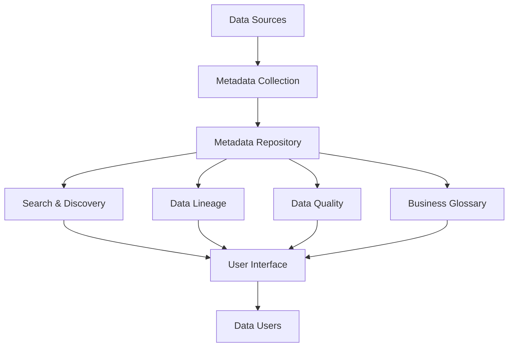

# Data Cataloging

## Introduction

Data cataloging is a crucial aspect of modern data management, serving as the organized inventory system for all your data assets. Think of it as a digital library card catalog, but for your databases, files, APIs, and other data sources. In the world of data integration, a well-maintained data catalog helps you understand what data you have, where it's located, how it's structured, and who has access to it.

As the volume and variety of data continue to grow exponentially, data catalogs have become essential tools for organizations looking to leverage their data effectively. Without proper cataloging, valuable data assets can remain hidden, leading to duplicate work, missed opportunities, and potential compliance issues.

## What is a Data Catalog?

A data catalog is a centralized metadata repository that helps organizations discover, understand, organize, and manage their data assets. It collects metadata (data about data) from various sources and provides a searchable interface for users to find and understand available data resources.

Key components of a data catalog include:

1. **Metadata collection** - Technical and business metadata about data assets
2. **Search functionality** - Ability to locate data assets based on various criteria
3. **Data lineage** - Tracking how data flows through systems
4. **Data quality metrics** - Information about the reliability of data
5. **Business context** - Descriptions, definitions, and business rules
6. **Access controls** - Information about who can access what data

## Why Do We Need Data Catalogs?

For beginners embarking on data integration projects, understanding the importance of data catalogs is fundamental:

- **Discover available data** - Find what data exists across your organization
- **Understand data context** - Learn what the data means and how it's used
- **Improve data quality** - Identify and resolve inconsistencies
- **Enable self-service** - Allow users to find and use data independently
- **Support compliance** - Track sensitive data and maintain regulatory compliance
- **Enhance collaboration** - Share knowledge about data assets
- **Prevent duplication** - Avoid creating redundant data sets

## Data Catalog Architecture

A typical data catalog implementation follows this architecture:



## Building a Simple Data Catalog

Let's walk through creating a basic data catalog using Python. We'll build a simplified version that catalogs CSV files in a directory.

### Step 1: Set Up Your Environment

First, we need to install the necessary packages:

```python
# Install required packages
# pip install pandas numpy

import os
import json
import pandas as pd
import datetime
import hashlib
```

### Step 2: Create the Metadata Collector

This function will scan a directory for CSV files and extract metadata:

```python
def catalog_csv_files(directory_path):
    catalog = []
    
    for filename in os.listdir(directory_path):
        if filename.endswith('.csv'):
            file_path = os.path.join(directory_path, filename)
            
            # Basic file metadata
            file_stats = os.stat(file_path)
            file_size = file_stats.st_size
            last_modified = datetime.datetime.fromtimestamp(file_stats.st_mtime).isoformat()
            
            # Calculate a hash for the file (for tracking changes)
            file_hash = calculate_file_hash(file_path)
            
            # Extract data schema by reading the CSV
            try:
                df = pd.read_csv(file_path, nrows=5)  # Read just a few rows for schema
                
                # Get column information
                columns = []
                for col in df.columns:
                    column_info = {
                        "name": col,
                        "data_type": str(df[col].dtype),
                        "sample_values": df[col].head(3).tolist()
                    }
                    columns.append(column_info)
                
                # Compile all metadata
                metadata = {
                    "filename": filename,
                    "filepath": file_path,
                    "size_bytes": file_size,
                    "last_modified": last_modified,
                    "file_hash": file_hash,
                    "row_count_estimate": len(pd.read_csv(file_path)),
                    "columns": columns
                }
                
                catalog.append(metadata)
                
            except Exception as e:
                print(f"Error processing {filename}: {str(e)}")
    
    return catalog

def calculate_file_hash(file_path):
    """Calculate MD5 hash of a file to track changes"""
    hash_md5 = hashlib.md5()
    with open(file_path, "rb") as f:
        for chunk in iter(lambda: f.read(4096), b""):
            hash_md5.update(chunk)
    return hash_md5.hexdigest()
```

### Step 3: Save and Update the Catalog

```python
def save_catalog(catalog, output_file="data_catalog.json"):
    """Save the catalog to a JSON file"""
    with open(output_file, 'w') as f:
        json.dump(catalog, f, indent=2)
    print(f"Catalog saved to {output_file}")

def update_catalog(directory_path, catalog_file="data_catalog.json"):
    """Update an existing catalog with new or changed files"""
    if os.path.exists(catalog_file):
        with open(catalog_file, 'r') as f:
            existing_catalog = json.load(f)
        
        # Create a dictionary of existing files by their path
        existing_files = {item["filepath"]: item for item in existing_catalog}
        
        # Generate new catalog
        new_catalog = catalog_csv_files(directory_path)
        
        # Merge catalogs, keeping track of changes
        merged_catalog = []
        for item in new_catalog:
            if item["filepath"] in existing_files:
                old_item = existing_files[item["filepath"]]
                if item["file_hash"] != old_item["file_hash"]:
                    item["previous_hash"] = old_item["file_hash"]
                    item["changed"] = True
                else:
                    item["changed"] = False
            else:
                item["new_file"] = True
            
            merged_catalog.append(item)
        
        save_catalog(merged_catalog, catalog_file)
    else:
        # No existing catalog, create new one
        catalog = catalog_csv_files(directory_path)
        save_catalog(catalog, catalog_file)
```

### Step 4: Create a Simple Search Interface

```python
def search_catalog(catalog, search_term, search_fields=None):
    """Search the catalog for entries matching the search term"""
    if search_fields is None:
        search_fields = ["filename", "filepath"]
    
    results = []
    search_term = search_term.lower()
    
    for entry in catalog:
        for field in search_fields:
            if field in entry and search_term in str(entry[field]).lower():
                results.append(entry)
                break
                
        # Also search in column names
        if "columns" in entry:
            for col in entry["columns"]:
                if search_term in col["name"].lower():
                    if entry not in results:
                        results.append(entry)
                    break
    
    return results
```

### Step 5: Usage Example

Here's how you can use this simple data catalog:

```python
# Initialize or update the catalog
data_directory = "./data_files"
update_catalog(data_directory)

# Load the catalog
with open("data_catalog.json", 'r') as f:
    catalog = json.load(f)

# Search for files related to "customers"
customer_data = search_catalog(catalog, "customer")

# Display search results
for item in customer_data:
    print(f"Found: {item['filename']}")
    print(f"  Last modified: {item['last_modified']}")
    print(f"  Columns: {[col['name'] for col in item['columns']]}")
    print()
```

## Real-World Applications

### Example 1: Data Discovery in a Marketing Department

Sarah, a marketing analyst, needs to analyze customer purchasing patterns. Using the data catalog, she searches for "customer purchases" and discovers three relevant datasets:

1. A transaction database maintained by the sales team
2. A customer survey dataset with preference information
3. A website clickstream dataset showing browsing behavior

Without a data catalog, Sarah might have only known about the transaction database, missing valuable context from the other datasets.

### Example 2: Regulatory Compliance

A financial company needs to comply with data privacy regulations. Their data catalog helps them:

1. Identify all locations where customer personally identifiable information (PII) is stored
2. Track who has accessed this data
3. Document data retention policies for each dataset
4. Prove compliance during audits by showing complete data lineage

### Example 3: Data Integration Project

A development team is building a new application that needs to combine data from multiple sources:

```python
# Example code showing how a data catalog assists in a data integration project

def plan_data_integration(catalog, required_fields):
    """Find appropriate data sources for an integration project"""
    
    integration_plan = {
        "data_sources": [],
        "missing_fields": [],
        "field_mapping": {}
    }
    
    # Track which fields we've found sources for
    found_fields = set()
    
    # Search the catalog for each required field
    for field in required_fields:
        sources = []
        
        for entry in catalog:
            for column in entry.get("columns", []):
                if field.lower() in column["name"].lower():
                    sources.append({
                        "source": entry["filename"],
                        "column": column["name"],
                        "data_type": column["data_type"]
                    })
        
        if sources:
            found_fields.add(field)
            integration_plan["field_mapping"][field] = sources
            
            # Add unique sources to our data sources list
            for source in sources:
                if source["source"] not in [s["name"] for s in integration_plan["data_sources"]]:
                    integration_plan["data_sources"].append({
                        "name": source["source"],
                        "fields_used": [source["column"]]
                    })
                else:
                    # Update existing source
                    for s in integration_plan["data_sources"]:
                        if s["name"] == source["source"] and source["column"] not in s["fields_used"]:
                            s["fields_used"].append(source["column"])
    
    # Check for missing fields
    integration_plan["missing_fields"] = [f for f in required_fields if f not in found_fields]
    
    return integration_plan

# Example usage
required_fields = ["customer_id", "purchase_date", "product_category", "payment_method"]
integration_plan = plan_data_integration(catalog, required_fields)

print(f"Data sources needed: {len(integration_plan['data_sources'])}")
print(f"Missing fields: {integration_plan['missing_fields']}")
```

## Popular Data Catalog Tools

Several tools can help you implement a robust data catalog:

1. **Open-source options**:
   - Apache Atlas
   - Amundsen (by Lyft)
   - DataHub (by LinkedIn)

2. **Commercial solutions**:
   - Alation
   - Collibra
   - Informatica Enterprise Data Catalog
   - Microsoft Azure Data Catalog

## Best Practices for Data Cataloging

1. **Automate metadata collection** - Reduce manual entry to keep the catalog up-to-date
2. **Include business context** - Technical metadata alone isn't enough
3. **Implement data governance** - Define roles and responsibilities for catalog maintenance
4. **Start small and expand** - Begin with your most critical data assets
5. **Encourage collaboration** - Allow users to add comments, tags, and ratings
6. **Integrate with existing tools** - Connect your catalog with BI tools, ETL processes, etc.
7. **Measure and improve usage** - Track how the catalog is being used and make adjustments

## Summary

Data cataloging is the foundation of effective data management and integration. A well-implemented data catalog helps organizations discover, understand, and utilize their data assets efficiently. For beginners working on data integration projects, understanding how to catalog data is an essential skill that will save countless hours of searching for and interpreting data sources.

By following the steps and examples in this guide, you've learned how to:
- Create a basic data catalog with Python
- Extract and store metadata from data files
- Search and utilize the catalog for data discovery
- Apply data cataloging to real-world integration scenarios

As your data ecosystem grows, the value of your data catalog will increase exponentially, becoming the central knowledge repository for all your data integration needs.

## Exercises

1. **Enhance the basic catalog** - Modify the example code to extract more metadata (e.g., min/max values, null counts) from CSV files.
2. **Support more file types** - Extend the catalog to handle JSON, Excel, or database tables.
3. **Add tagging functionality** - Implement a system for adding and searching by tags.
4. **Build a simple web interface** - Create a basic Flask or Streamlit app to browse your catalog.
5. **Implement data lineage** - Track how data moves between files by analyzing column similarities.

## Further Resources

- **Books**:
  - "The Data Catalog: Sherlock Holmes Data Sleuthing for Analytics" by Bonnie K. O'Neil and Lowell Fryman
  - "Metadata Management with IBM Information Server" by Wei-Dong Zhu

- **Online Courses**:
  - Data Governance and Data Cataloging courses on platforms like Coursera and Udemy
  - Vendor-specific training for tools like Collibra, Alation, and Informatica

- **Communities**:
  - Data Management Association (DAMA)
  - Enterprise Data Management Council