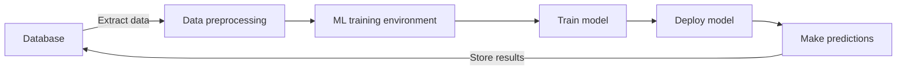
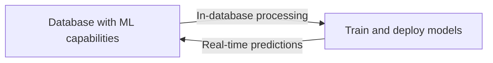

# Machine Learning in Databases

## Introduction

In today's data-driven world, the line between data storage and data analysis is increasingly blurring. Modern database systems are evolving beyond simple storage and retrieval functions to incorporate sophisticated analytical capabilities. One of the most significant advancements in this area is the integration of machine learning directly into database systems.

Machine Learning in Databases refers to the embedding of ML algorithms and capabilities within database management systems, allowing for intelligent data processing, predictive analytics, and automated decision-making without having to extract data to external systems. This integration creates more efficient workflows and enables real-time insights from your data.

## Why Combine Machine Learning and Databases?

Traditional approaches to machine learning with databases typically follow this workflow:



This approach has several drawbacks:
- Data movement is time-consuming and resource-intensive
- Maintaining separate systems adds complexity
- Real-time analysis becomes challenging
- Security concerns arise when data leaves the database

By integrating machine learning into databases, we can streamline this process:



## Key Capabilities of ML-Enabled Databases

### 1. In-Database ML Functions

Modern databases now offer built-in ML functions that can be called directly from SQL queries.

```sql
-- Example: Using a built-in clustering function in PostgreSQL with the MADlib extension
SELECT 
    madlib.kmeans(
        'customer_data',           -- source table
        'customer_clusters',       -- output table
        'behavior_features',       -- array of features to use
        5,                         -- number of clusters
        'random',                  -- initialization method
        20                         -- maximum iterations
    );

-- Then query the results
SELECT 
    cluster_id, 
    COUNT(*) as customer_count 
FROM customer_clusters 
GROUP BY cluster_id
ORDER BY cluster_id;
```

**Output:**
```
 cluster_id | customer_count
------------+----------------
          0 |            245
          1 |            312
          2 |            189
          3 |            278
          4 |            176
```

### 2. Query Optimization with ML

Database systems now use machine learning to optimize query execution plans based on historical query patterns.

```sql
-- Modern databases automatically collect query statistics
-- and use ML to optimize similar future queries
SELECT 
    c.customer_name,
    SUM(o.order_total) as total_spent
FROM 
    customers c
JOIN 
    orders o ON c.customer_id = o.customer_id
WHERE 
    o.order_date BETWEEN '2023-01-01' AND '2023-12-31'
GROUP BY 
    c.customer_name
ORDER BY 
    total_spent DESC
LIMIT 10;
```

The database engine might recognize this pattern and automatically:
- Pre-compute common joins
- Create intelligent indexes
- Allocate optimal memory resources
- Choose the best execution plan based on data distribution

### 3. Anomaly Detection

Databases can now automatically identify unusual patterns in data.

```sql
-- Example using SQL Server's built-in anomaly detection
SELECT 
    transaction_id,
    amount,
    PREDICT(anomaly_model USING amount AS feature) as is_anomaly
FROM 
    transactions
WHERE 
    transaction_date = CURRENT_DATE;
```

**Output:**
```
 transaction_id | amount  | is_anomaly
----------------+---------+------------
          10245 |   25.99 |          0
          10246 |   34.50 |          0
          10247 | 9999.99 |          1
          10248 |   12.75 |          0
```

### 4. Predictive Queries

Some databases now allow you to make predictions directly in SQL queries.

```sql
-- Example using Oracle's machine learning capabilities
SELECT 
    product_id,
    product_name,
    PREDICTION(stock_model USING current_stock AS feature) as predicted_restock_date
FROM 
    inventory
WHERE 
    category = 'electronics';
```

**Output:**
```
 product_id | product_name      | predicted_restock_date
------------+-------------------+------------------------
      P1001 | Smartphone X      | 2023-06-15
      P1002 | Wireless Earbuds  | 2023-06-02
      P1003 | Laptop Pro        | 2023-07-10
```

## Real-World Applications

### Customer Churn Prediction

A telecommunications company can use in-database machine learning to predict which customers are likely to cancel their service:

```sql
-- Create a model within the database
CREATE MODEL churn_prediction_model
USING logistic_regression
TARGET is_churned
FEATURES (
    monthly_bill,
    tenure_months,
    total_services,
    customer_service_calls,
    payment_delays
);

-- Train the model
TRAIN MODEL churn_prediction_model
FROM customer_history;

-- Use the model to identify at-risk customers
SELECT 
    customer_id,
    customer_name,
    PREDICT(churn_prediction_model USING *) as churn_probability
FROM 
    current_customers
WHERE 
    PREDICT(churn_prediction_model USING *) > 0.7
ORDER BY 
    churn_probability DESC;
```

### Fraud Detection

Financial institutions can use machine learning directly within their transaction databases:

```sql
-- Example using a hypothetical bank database with ML capabilities
SELECT 
    t.transaction_id,
    t.account_id,
    t.amount,
    t.transaction_type,
    PREDICT(fraud_model USING 
        t.amount, 
        t.location, 
        t.transaction_type,
        a.usual_transaction_pattern
    ) as fraud_score
FROM 
    transactions t
JOIN 
    accounts a ON t.account_id = a.account_id
WHERE 
    t.transaction_date = CURRENT_DATE
    AND PREDICT(fraud_model USING 
        t.amount, 
        t.location, 
        t.transaction_type,
        a.usual_transaction_pattern
    ) > 0.8;
```

## Popular Database Systems with ML Capabilities

Several major database systems now offer integrated machine learning features:

1. **PostgreSQL with MADlib**: Open-source extension that adds machine learning algorithms accessible through SQL.

2. **Microsoft SQL Server ML Services**: Allows integration with R and Python for in-database analytics.

3. **Oracle Machine Learning**: Provides in-database algorithms for classification, regression, and clustering.

4. **Amazon Redshift ML**: Enables creating and training models using SQL commands.

5. **Google BigQuery ML**: Allows creating and executing machine learning models using SQL queries.

## Benefits for Developers and Data Scientists

### For Developers
- Simplified architecture with fewer components
- Reduced data movement
- Better security with data staying in one place
- Familiar SQL interface for working with ML

### For Data Scientists
- Direct access to fresh data
- No need for extensive ETL processes
- Ability to deploy models where the data lives
- Real-time scoring and predictions

## Implementation Steps

To start implementing machine learning in your database projects:

1. **Assess your database's ML capabilities**: Check if your current database system supports ML functions.

2. **Start with simple use cases**: Begin with straightforward predictions or classifications.

3. **Understand the SQL extensions**: Each database system has specific syntax for ML functions.

4. **Monitor performance**: Ensure ML operations don't degrade database performance.

5. **Scale gradually**: Start with smaller datasets before implementing ML on your entire database.

## Code Example: Getting Started with PostgreSQL and MADlib

Here's a complete example of implementing a simple linear regression model within PostgreSQL:

```sql
-- Step 1: Install the MADlib extension (one-time setup)
CREATE EXTENSION IF NOT EXISTS plpythonu;
CREATE EXTENSION IF NOT EXISTS madlib;

-- Step 2: Prepare your data
CREATE TABLE house_data (
    id SERIAL PRIMARY KEY,
    square_feet NUMERIC,
    bedrooms INTEGER,
    bathrooms NUMERIC,
    price NUMERIC
);

-- Insert sample data
INSERT INTO house_data (square_feet, bedrooms, bathrooms, price) VALUES
    (1500, 3, 2, 320000),
    (1800, 4, 2.5, 350000),
    (2200, 4, 3, 480000),
    (1200, 2, 1, 230000),
    (3200, 5, 3.5, 650000);

-- Step 3: Train a linear regression model
SELECT madlib.linregr_train(
    'house_data',                              -- source table
    'house_price_model',                       -- output table
    'price',                                   -- dependent variable (what we're predicting)
    'ARRAY[square_feet, bedrooms, bathrooms]', -- independent variables
    NULL,                                      -- grouping columns
    NULL                                       -- options
);

-- Step 4: View the model results
SELECT * FROM house_price_model;

-- Step 5: Make predictions
SELECT 
    id,
    square_feet,
    bedrooms,
    bathrooms,
    price as actual_price,
    madlib.linregr_predict(
        ARRAY[square_feet, bedrooms, bathrooms],
        (SELECT coef FROM house_price_model),
        (SELECT intercept FROM house_price_model)
    ) as predicted_price
FROM 
    house_data;
```

**Output:**
```
 id | square_feet | bedrooms | bathrooms | actual_price | predicted_price
----+-------------+----------+-----------+--------------+----------------
  1 |        1500 |        3 |         2 |       320000 |         316432
  2 |        1800 |        4 |       2.5 |       350000 |         358740
  3 |        2200 |        4 |         3 |       480000 |         482159
  4 |        1200 |        2 |         1 |       230000 |         227982
  5 |        3200 |        5 |       3.5 |       650000 |         644687
```

## Challenges and Considerations

While integrating ML into databases offers many advantages, there are also challenges to consider:

1. **Performance Impact**: Complex ML operations can impact database performance if not properly managed.

2. **Skill Requirements**: Database administrators may need additional training in machine learning concepts.

3. **Feature Limitations**: In-database ML may not offer all the capabilities of dedicated ML platforms.

4. **Vendor Lock-in**: Each database system implements ML features differently, which can lead to portability issues.

5. **Resource Allocation**: ML operations compete with regular database operations for resources.

## Summary

Machine Learning in Databases represents a significant evolution in how we work with data. By bringing analytical capabilities directly to where data lives, we can:

- Reduce data movement and simplify architectures
- Enable real-time insights and predictions
- Create more efficient and secure data workflows
- Leverage familiar SQL interfaces for advanced analytics

As databases continue to evolve, the integration of machine learning capabilities will become increasingly seamless, allowing developers and data scientists to build more intelligent applications with less complexity.

## Additional Resources

- **Books**:
  - "Machine Learning in Databases: A New Dimension" by Jennifer Wilson
  - "SQL for Data Science: From Query to Insight" by Mark Thompson

- **Online Courses**:
  - PostgreSQL and MADlib for Data Scientists
  - Oracle Machine Learning Fundamentals
  - Microsoft SQL Server ML Services Deep Dive

- **Practice Exercises**:
  1. Implement a simple classification model in your database system of choice
  2. Create a database function that makes predictions based on new data
  3. Compare the performance of in-database ML vs. traditional approaches for a specific use case
  4. Design a database schema that supports both transactional and analytical ML workloads