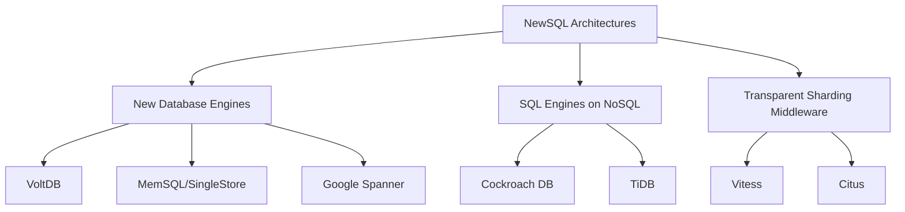

# NewSQL Databases

## Introduction

NewSQL databases represent an evolution in database technology that aims to provide the best of both worlds: the scalability and performance advantages of NoSQL systems with the ACID (Atomicity, Consistency, Isolation, Durability) guarantees and SQL interface of traditional relational database management systems (RDBMS).

As applications grew in scale and complexity during the early 2000s, many organizations found that traditional relational databases couldn't keep up with their performance and scalability needs. This led to the rise of NoSQL databases, which sacrificed consistency guarantees and the familiar SQL interface to achieve better performance and scalability. However, many applications still required strong consistency guarantees, leading to the emergence of NewSQL databases around 2011.

## Key Characteristics of NewSQL Databases

NewSQL databases are characterized by several key features:

1. **SQL Interface**: They support standard SQL as their primary interface for data manipulation.

2. **ACID Compliance**: They maintain the ACID properties of traditional databases for all transactions.

3. **Horizontal Scalability**: They can scale out across many nodes without sacrificing performance.

4. **High Availability**: They are designed to minimize downtime and maintain operation during failures.

5. **Distributed Architecture**: They utilize distributed systems design principles to achieve scale.

Let's explore how these characteristics are implemented in practice.

## NewSQL Architecture Approaches

NewSQL databases typically fall into one of three architectural categories:



### 1. New Database Engines

These are completely new database systems built from scratch to support distributed SQL processing:

- **Google Spanner**
- **CockroachDB**
- **VoltDB**
- **MemSQL/SingleStore**

### 2. SQL Engines on NoSQL Foundations

These build SQL functionality on top of distributed NoSQL architectures:

- **TiDB** (inspired by Google Spanner)
- **YugabyteDB** (combines PostgreSQL and Cassandra concepts)

### 3. Transparent Sharding Middleware

These solutions add a layer on top of traditional RDBMS systems to provide transparent sharding:

- **Vitess** (for MySQL)
- **Citus** (for PostgreSQL, now part of Azure)

## Core Technical Concepts

### Distributed Consensus

NewSQL databases often use distributed consensus algorithms to maintain consistency across nodes.

```javascript
// Example: Two-Phase Commit Protocol (conceptual pseudo-code)
function twoPhaseCommit(transaction, nodes) {
  // Phase 1: Prepare
  for (let node of nodes) {
    let ready = node.prepare(transaction);
    if (!ready) {
      abortTransaction(transaction, nodes);
      return false;
    }
  }
  
  // Phase 2: Commit
  for (let node of nodes) {
    node.commit(transaction);
  }
  
  return true;
}
```

Many NewSQL databases use more sophisticated algorithms like Paxos or Raft to achieve consensus.

### Automatic Sharding

NewSQL databases automatically distribute data across multiple nodes based on keys or other criteria:

```javascript
// Conceptual example of range-based sharding
const shards = [
  { range: [0, 1000], node: "node1" },
  { range: [1001, 2000], node: "node2" },
  { range: [2001, 3000], node: "node3" }
];

function routeQuery(key) {
  for (let shard of shards) {
    if (key >= shard.range[0] && key <= shard.range[1]) {
      return shard.node;
    }
  }
  throw new Error("No shard found for key");
}
```

### Distributed Transactions

NewSQL systems implement distributed transactions across multiple nodes:

```sql
-- Example of a distributed transaction in SQL
BEGIN TRANSACTION;

-- This might execute on Node 1
UPDATE accounts SET balance = balance - 100 WHERE id = 123;

-- This might execute on Node 2
UPDATE accounts SET balance = balance + 100 WHERE id = 456;

-- The system ensures both operations succeed or fail together
COMMIT;
```

## Practical Example: Setting Up CockroachDB

Let's walk through a practical example using CockroachDB, a popular open-source NewSQL database:

### 1. Start a Local Cluster

```bash
# Start a three-node local cluster
cockroach start --insecure --store=node1 --listen-addr=localhost:26257 --http-addr=localhost:8080 --join=localhost:26257,localhost:26258,localhost:26259 --background

cockroach start --insecure --store=node2 --listen-addr=localhost:26258 --http-addr=localhost:8081 --join=localhost:26257,localhost:26258,localhost:26259 --background

cockroach start --insecure --store=node3 --listen-addr=localhost:26259 --http-addr=localhost:8082 --join=localhost:26257,localhost:26258,localhost:26259 --background

# Initialize the cluster
cockroach init --insecure --host=localhost:26257
```

### 2. Create a Database and Table

```sql
-- Connect to the cluster
cockroach sql --insecure --host=localhost:26257

-- Create database and table
CREATE DATABASE ecommerce;
USE ecommerce;

CREATE TABLE products (
  id UUID PRIMARY KEY DEFAULT gen_random_uuid(),
  name STRING NOT NULL,
  price DECIMAL NOT NULL,
  inventory INT NOT NULL
);

-- Insert some data
INSERT INTO products (name, price, inventory) VALUES 
  ('Laptop', 999.99, 50),
  ('Smartphone', 699.99, 100),
  ('Headphones', 149.99, 200);
```

### 3. Run Queries Across Nodes

CockroachDB automatically distributes the data across your nodes. Your queries use standard SQL syntax, but behind the scenes, they're executed as distributed operations:

```sql
-- This query might touch multiple nodes
SELECT * FROM products WHERE price < 500;
```

### 4. Observe Automatic Scaling

If you monitor the cluster while running a high volume of queries, you'll see automatic load balancing and data redistribution when nodes are added or removed:

```bash
# Add a fourth node
cockroach start --insecure --store=node4 --listen-addr=localhost:26260 --http-addr=localhost:8083 --join=localhost:26257,localhost:26258,localhost:26259 --background
```

The system will automatically rebalance data to include the new node without any application changes.

## Real-World Applications

NewSQL databases are particularly valuable in several scenarios:

### 1. Financial Systems

Banks and financial institutions need both high throughput and ACID compliance for their transaction processing:

```sql
-- Example of a banking transaction in a NewSQL database
BEGIN;
  -- Debit from checking account (might be on one node)
  UPDATE accounts SET balance = balance - 500 WHERE id = 'checking-123' AND balance >= 500;
  
  -- Credit to savings account (might be on another node)
  UPDATE accounts SET balance = balance + 500 WHERE id = 'savings-456';
  
  -- Check if the debit was successful
  SELECT balance FROM accounts WHERE id = 'checking-123';
COMMIT;
```

### 2. E-commerce Platforms

Online retailers need to handle high traffic during sales events while maintaining inventory accuracy:

```sql
-- Example of an order processing transaction
BEGIN;
  -- Check inventory
  SELECT inventory FROM products WHERE id = 'product-789' FOR UPDATE;
  
  -- Update inventory (if sufficient)
  UPDATE products SET inventory = inventory - 1 
  WHERE id = 'product-789' AND inventory > 0;
  
  -- Create order (only if inventory update succeeded)
  INSERT INTO orders (product_id, user_id, quantity, status)
  VALUES ('product-789', 'user-101', 1, 'pending');
COMMIT;
```

### 3. Global SaaS Applications

Software-as-a-Service applications that operate globally need geographically distributed databases:

```sql
-- Example of configuring data locality in CockroachDB
ALTER DATABASE customer_data 
CONFIGURE ZONE USING constraints = '[+region=us-west]';

-- Queries will automatically route to the appropriate region
SELECT * FROM customers WHERE region = 'west-coast';
```

## Comparing NewSQL with Traditional RDBMS and NoSQL

Let's compare these database paradigms across key dimensions:

| Feature | Traditional RDBMS | NoSQL | NewSQL |
|---------|------------------|-------|--------|
| Data Model | Relational | Various (document, key-value, etc.) | Relational |
| Scalability | Vertical (scale-up) | Horizontal (scale-out) | Horizontal (scale-out) |
| Consistency | Strong (ACID) | Typically eventual | Strong (ACID) |
| Query Language | SQL | Database-specific APIs | SQL |
| Performance | Limited by single node | High | High |
| Distributed Transactions | Limited | Typically not supported | Supported |
| Schema Flexibility | Rigid | Flexible | Moderate to Rigid |

## Challenges and Considerations

While NewSQL databases offer impressive capabilities, they come with their own challenges:

1. **Complexity**: The distributed nature introduces operational complexity.

2. **Maturity**: Some NewSQL systems are still maturing compared to established RDBMSs.

3. **Cost**: The added capabilities often come with higher infrastructure costs.

4. **Learning Curve**: Understanding distributed database concepts requires additional expertise.

## When to Choose NewSQL

Consider NewSQL when you need:

- SQL interface and ACID guarantees
- Horizontal scalability beyond a single node
- High throughput and low latency
- Strong consistency for critical transactions
- Geographic distribution of data

## Summary

NewSQL databases represent an important evolution in database technology, bringing together the best aspects of traditional relational databases and NoSQL systems. They provide a powerful solution for applications that need both scalability and strong consistency guarantees.

By maintaining SQL as the query language and preserving ACID properties while achieving horizontal scalability, NewSQL systems are enabling a new generation of distributed applications that don't need to compromise on data consistency.

## Additional Resources

Here are some resources to continue your NewSQL learning journey:

- Explore CockroachDB's [official documentation](https://www.cockroachlabs.com/docs/)
- Learn about Google's Spanner design through their [research paper](https://research.google/pubs/pub39966/)
- Try out SingleStore's [free tier](https://www.singlestore.com/)
- Experiment with YugabyteDB using their [quick start guide](https://docs.yugabyte.com/latest/quick-start/)

## Exercises

1. Set up a local three-node CockroachDB cluster and create a simple e-commerce database with products and orders tables.

2. Implement a distributed transaction that updates inventory and creates an order atomically.

3. Simulate a node failure in your cluster and observe how the system maintains availability.

4. Benchmark query performance with different table designs and compare the results.

5. Design a data model for a global application that needs to store user data in specific geographic regions for compliance reasons.