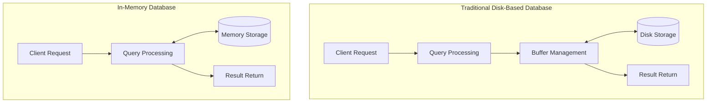

# In-Memory Databases

## Introduction

In-memory databases (IMDBs) represent a significant shift in how we think about data storage and retrieval. Unlike traditional disk-based databases, which store data primarily on hard drives, in-memory databases keep the entire dataset in the computer's main memory (RAM). This fundamental difference creates dramatic performance improvements for many use cases.

In this article, we'll explore how in-memory databases work, their advantages and limitations, and when you might want to use them in your applications.

## What Are In-Memory Databases?

An in-memory database is a database management system that primarily relies on main memory for data storage, rather than slower disk drives. By eliminating the need for disk I/O operations, these databases can process data significantly faster - often by orders of magnitude.

### Key Characteristics

- **Speed**: Operations are extremely fast due to RAM access speeds
- **Volatility**: RAM is volatile, so persistence strategies are needed
- **Resource Usage**: Requires sufficient memory to hold the entire dataset
- **Simplified Data Structures**: Can use simpler data structures optimized for memory

## How In-Memory Databases Work

To understand in-memory databases, let's compare them with traditional disk-based databases:



In traditional databases, data is stored on disk and must be loaded into memory when needed. This creates a significant bottleneck due to slow disk I/O operations. In-memory databases eliminate this bottleneck by keeping all data in RAM, making data access nearly instantaneous.

### Memory Management

In-memory databases employ sophisticated memory management techniques:

- **Memory-Optimized Data Structures**: Specialized structures designed for RAM access patterns
- **Compression**: Data compression to maximize memory efficiency
- **Garbage Collection**: Efficient memory reclamation for deleted data
- **Partitioning**: Distribution of data across memory segments

## Advantages of In-Memory Databases

### 1. Speed

The most obvious advantage is raw performance. In-memory operations can be 10-1000x faster than disk-based operations, depending on the workload.

### 2. Simplified Architecture

Without the need to optimize for disk I/O, in-memory databases can use simpler data structures and algorithms, making them easier to maintain and optimize.

### 3. Real-Time Analytics

The speed of in-memory databases makes them ideal for real-time analytics and decision-making, where immediate insights are valuable.

### 4. Lower Latency

Applications requiring extremely low latency, such as financial trading systems or online gaming, benefit immensely from in-memory processing.

## Limitations and Challenges

### 1. Persistence and Durability

Since RAM is volatile (data is lost when power is cut), in-memory databases must implement strategies for persistence:

- **Snapshotting**: Periodically writing the entire database to disk
- **Transaction Logging**: Recording all changes to be replayed after a crash
- **Replication**: Maintaining copies across multiple servers

### 2. Cost

RAM is more expensive than disk storage, making in-memory databases costlier to scale for large datasets.

### 3. Dataset Size Limitations

A database can only be fully in-memory if the dataset fits into available RAM, creating potential scaling issues.

## Code Example: Using Redis (A Popular In-Memory Database)

Let's look at a simple example using Redis, one of the most popular in-memory databases:

```javascript
// First, install Redis client: npm install redis

const redis = require('redis');
const client = redis.createClient();

// Connect to Redis
client.connect().then(() => {
  console.log('Connected to Redis');
});

// Store a simple key-value pair
async function storeData() {
  await client.set('user:1001', JSON.stringify({
    name: 'Alice Smith',
    email: 'alice@example.com',
    lastLogin: new Date().toISOString()
  }));
  console.log('User data stored');
}

// Retrieve data
async function retrieveData() {
  const userData = await client.get('user:1001');
  console.log('User data retrieved:', JSON.parse(userData));
}

// Simple benchmark
async function runBenchmark() {
  const start = process.hrtime();
  
  // Perform 10,000 read operations
  for (let i = 0; i < 10000; i++) {
    await client.get('user:1001');
  }
  
  const end = process.hrtime(start);
  const timeInMs = (end[0] * 1000) + (end[1] / 1000000);
  console.log(`10,000 reads completed in ${timeInMs.toFixed(2)}ms`);
  console.log(`Average read time: ${(timeInMs / 10000).toFixed(3)}ms`);
}

// Run our example
async function run() {
  await storeData();
  await retrieveData();
  await runBenchmark();
  await client.quit();
}

run().catch(console.error);
```

Sample output:
```
Connected to Redis
User data stored
User data retrieved: { name: 'Alice Smith', email: 'alice@example.com', lastLogin: '2025-03-18T15:30:45.123Z' }
10,000 reads completed in 352.75ms
Average read time: 0.035ms
```

This example demonstrates Redis's impressive performance, with average read times measured in microseconds.

## Popular In-Memory Database Systems

Several in-memory database systems have gained popularity:

1. **Redis**: An open-source, in-memory data structure store used as a database, cache, and message broker
2. **SAP HANA**: An enterprise-grade in-memory database for business applications
3. **MemSQL (SingleStore)**: A distributed, SQL-based in-memory database
4. **VoltDB**: A high-performance, in-memory SQL database
5. **Apache Ignite**: An in-memory computing platform that can function as a database

## Real-World Applications

### 1. Caching Layer

In-memory databases are commonly used as caching layers to accelerate applications:

```javascript
async function getUserProfile(userId) {
  // Try to get data from cache first
  const cachedData = await redisClient.get(`user:${userId}`);
  
  if (cachedData) {
    console.log('Cache hit!');
    return JSON.parse(cachedData);
  }
  
  // Cache miss - get from main database
  console.log('Cache miss, fetching from database...');
  const userData = await mainDatabase.getUserById(userId);
  
  // Store in cache for future requests (expire after 1 hour)
  await redisClient.set(`user:${userId}`, JSON.stringify(userData), {
    EX: 3600
  });
  
  return userData;
}
```

### 2. Real-Time Analytics

```javascript
// Example: Real-time web analytics tracking
async function trackPageView(pageId, userId) {
  // Increment page view counter
  await redisClient.incr(`page:${pageId}:views`);
  
  // Add to set of unique visitors
  await redisClient.sAdd(`page:${pageId}:visitors`, userId);
  
  // Add to time-series data for this hour
  const hourKey = `page:${pageId}:hour:${new Date().toISOString().slice(0,13)}`;
  await redisClient.incr(hourKey);
  
  // Get real-time statistics
  const [views, uniqueVisitors, hourlyViews] = await Promise.all([
    redisClient.get(`page:${pageId}:views`),
    redisClient.sCard(`page:${pageId}:visitors`),
    redisClient.get(hourKey)
  ]);
  
  return { 
    totalViews: parseInt(views), 
    uniqueVisitors: parseInt(uniqueVisitors), 
    hourlyViews: parseInt(hourlyViews) 
  };
}
```

### 3. Session Management

Web applications frequently use in-memory databases to store session data:

```javascript
// Express.js with Redis session store example
const express = require('express');
const session = require('express-session');
const RedisStore = require('connect-redis').default;
const { createClient } = require('redis');

const app = express();
const redisClient = createClient();
redisClient.connect().catch(console.error);

app.use(session({
  store: new RedisStore({ client: redisClient }),
  secret: 'your-secret-key',
  resave: false,
  saveUninitialized: false,
  cookie: { secure: true, maxAge: 86400000 } // 24 hours
}));

app.get('/profile', (req, res) => {
  // Session data stored in Redis
  if (!req.session.user) {
    return res.redirect('/login');
  }
  
  // User is logged in
  res.send(`Welcome back, ${req.session.user.name}!`);
});
```

## When to Use In-Memory Databases

In-memory databases are ideal for:

1. **Applications requiring ultra-low latency**: Trading platforms, gaming servers
2. **Caching layers**: Reducing load on primary databases
3. **Real-time analytics**: When insights must be immediate
4. **Session storage**: For web applications with many concurrent users
5. **Message brokers**: For high-throughput messaging systems

They may not be suitable when:

1. Your dataset is extremely large and doesn't fit in memory
2. Your budget is constrained (RAM is expensive)
3. You need extreme durability guarantees
4. Your workload is write-heavy rather than read-heavy

## Summary

In-memory databases represent a powerful approach to data management, offering extraordinary performance by keeping data in RAM rather than on disk. While they come with challenges related to persistence and cost, they enable use cases that would be impossible with traditional disk-based databases.

As hardware costs continue to decrease and memory sizes increase, in-memory databases are becoming more mainstream, particularly for applications where speed is critical.

## Exercises for Practice

1. **Redis Exploration**: Install Redis locally and experiment with different data structures (Strings, Lists, Sets, Hashes, Sorted Sets).

2. **Caching Implementation**: Implement a caching layer for a simple REST API using an in-memory database.

3. **Performance Comparison**: Create a simple benchmark comparing the performance of an in-memory database with a traditional disk-based database for common operations.

4. **Real-Time Counter**: Build a real-time visitor counter for a web application using Redis.

5. **Persistence Strategy**: Design and implement a persistence strategy for an in-memory database to ensure data isn't lost during restarts.

## Further Learning Resources

- Redis Documentation: [redis.io](https://redis.io/documentation)
- "Database Internals" by Alex Petrov (Chapters on in-memory database architecture)
- "High Performance MySQL" by Baron Schwartz (Covers MySQL memory usage)
- Stanford Course CS347: "Database System Principles" (Covers in-memory database systems)
- Online courses on Redis, SAP HANA, and other in-memory databases