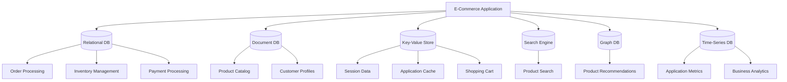

# Polyglot Persistence

## Introduction

In the past, most applications relied on a single database system (typically a relational database) to store all data regardless of its nature or access patterns. But as applications grew more complex and data more diverse, developers began to realize that **one size doesn't fit all** when it comes to data storage.

Polyglot persistence is an architectural approach where an application uses multiple database technologies, choosing the most suitable database type for each specific data storage requirement. Rather than forcing all your data into a single database, you select the best tool for each job.

## Why Polyglot Persistence?

Different types of data have different characteristics, and different databases excel at handling specific data patterns:

- **Relational databases** excel at structured data with complex relationships and transactions
- **Document databases** are great for semi-structured, document-oriented data
- **Key-value stores** provide lightning-fast access to simple data by key lookup
- **Graph databases** shine when working with heavily interconnected data
- **Time-series databases** are optimized for time-based data points
- **Column-family stores** work well for storing and querying large sets of columnar data

By selecting the most appropriate database for each part of your application, you can optimize for:

- Performance
- Scalability
- Data integrity
- Developer productivity
- Maintenance costs

## Real-World Example: E-Commerce Platform

Let's explore how polyglot persistence might work in an e-commerce application:



In this architecture:

1. **PostgreSQL** (relational database) handles order processing, inventory, and payment transactions
2. **MongoDB** (document database) stores product catalog and customer profiles
3. **Redis** (key-value store) manages session data, caching, and shopping carts
4. **Elasticsearch** powers product search functionality
5. **Neo4j** (graph database) drives product recommendations
6. **InfluxDB** (time-series database) collects metrics and analytics data

## Implementation: Simple Example

Let's see a basic implementation of polyglot persistence in a Node.js application:

```javascript
// Database connections setup
const { Pool } = require('pg'); // PostgreSQL for orders
const { MongoClient } = require('mongodb'); // MongoDB for products
const redis = require('redis'); // Redis for shopping cart

// PostgreSQL connection (for orders)
const pgPool = new Pool({
  host: 'localhost',
  database: 'ecommerce',
  user: 'app_user',
  password: 'password',
  port: 5432,
});

// MongoDB connection (for products)
const mongoClient = new MongoClient('mongodb://localhost:27017');
const mongoDB = mongoClient.db('ecommerce');
const productsCollection = mongoDB.collection('products');

// Redis connection (for shopping cart)
const redisClient = redis.createClient();

// Example function to create a new order
async function createOrder(userId, items, shippingInfo) {
  // Start PostgreSQL transaction
  const pgClient = await pgPool.connect();
  
  try {
    await pgClient.query('BEGIN');
    
    // Insert order header
    const orderResult = await pgClient.query(
      'INSERT INTO orders(user_id, order_date, status) VALUES($1, NOW(), $2) RETURNING id',
      [userId, 'PENDING']
    );
    const orderId = orderResult.rows[0].id;
    
    // Insert order items
    for (const item of items) {
      await pgClient.query(
        'INSERT INTO order_items(order_id, product_id, quantity, price) VALUES($1, $2, $3, $4)',
        [orderId, item.productId, item.quantity, item.price]
      );
    }
    
    // Insert shipping information
    await pgClient.query(
      'INSERT INTO order_shipping(order_id, address, city, state, postal_code) VALUES($1, $2, $3, $4, $5)',
      [orderId, shippingInfo.address, shippingInfo.city, shippingInfo.state, shippingInfo.postalCode]
    );
    
    await pgClient.query('COMMIT');
    
    // Clear the shopping cart in Redis
    await redisClient.del(`cart:${userId}`);
    
    return orderId;
  } catch (error) {
    await pgClient.query('ROLLBACK');
    throw error;
  } finally {
    pgClient.release();
  }
}

// Function to get product details
async function getProductDetails(productId) {
  return await productsCollection.findOne({ _id: productId });
}

// Function to add item to shopping cart
async function addToCart(userId, productId, quantity) {
  const cartKey = `cart:${userId}`;
  
  // Add or update product in user's cart
  await redisClient.hSet(cartKey, productId, quantity);
  
  // Set cart expiration (e.g., 7 days)
  await redisClient.expire(cartKey, 60 * 60 * 24 * 7);
}
```

In this example:
- PostgreSQL handles orders with ACID transactions
- MongoDB stores flexible product documents
- Redis provides fast, in-memory shopping cart operations

## Challenges of Polyglot Persistence

While polyglot persistence offers many benefits, it also introduces challenges:

1. **Increased operational complexity**: Managing multiple database systems requires broader expertise and more operational resources

2. **Data consistency**: Maintaining consistency across multiple databases can be difficult

3. **Learning curve**: Developers need to learn multiple query languages and database paradigms

4. **Data duplication**: Some data may need to be duplicated across databases

5. **Transaction management**: Distributed transactions across multiple databases are challenging

## Implementing Polyglot Persistence

To effectively implement polyglot persistence:

### 1. Domain-Driven Design

Start by analyzing your domain and identifying natural boundaries between different types of data:

```javascript
// Examples of different bounded contexts in an e-commerce system
const OrderContext = {
  // Relational data with transactional needs
  Order: {
    id: 'UUID',
    userId: 'UUID',
    status: 'ENUM',
    orderItems: [/* ... */],
    // ...
  }
};

const CatalogContext = {
  // Document-oriented data with flexible schema
  Product: {
    id: 'UUID',
    name: 'String',
    description: 'String',
    attributes: {/* Dynamic, nested attributes */},
    variants: [/* Array of options */],
    // ...
  }
};

const UserContext = {
  // User preferences, shopping history, etc.
};
```

### 2. Anti-Corruption Layers

Create services that translate between different data models:

```javascript
// Service that coordinates between different databases
class OrderProcessingService {
  constructor(orderRepository, productRepository, cartRepository) {
    this.orderRepository = orderRepository;
    this.productRepository = productRepository;
    this.cartRepository = cartRepository;
  }

  async createOrderFromCart(userId) {
    // Get cart from Redis
    const cartItems = await this.cartRepository.getCartItems(userId);
    
    // Retrieve product details from MongoDB
    const products = await Promise.all(
      cartItems.map(item => this.productRepository.findById(item.productId))
    );
    
    // Create order in PostgreSQL
    const orderItems = cartItems.map((cartItem, index) => ({
      productId: cartItem.productId,
      quantity: cartItem.quantity,
      price: products[index].price,
      name: products[index].name,
    }));
    
    const order = await this.orderRepository.createOrder(userId, orderItems);
    
    // Clear cart after successful order
    await this.cartRepository.clearCart(userId);
    
    return order;
  }
}
```

### 3. Data Synchronization

Consider options for keeping data synchronized across databases:

- **Event-driven architecture**: Use events to propagate changes
- **Change Data Capture (CDC)**: Monitor database change logs
- **Periodic synchronization**: Batch update at intervals

```javascript
// Event-driven approach example
eventBus.on('product.updated', async (productData) => {
  // Update product in MongoDB (primary source)
  await productsCollection.updateOne(
    { _id: productData.id },
    { $set: productData }
  );
  
  // Update search index in Elasticsearch
  await elasticsearchClient.index({
    index: 'products',
    id: productData.id,
    body: {
      name: productData.name,
      description: productData.description,
      categories: productData.categories,
      // Other searchable fields
    }
  });
  
  // Update cache in Redis
  await redisClient.set(
    `product:${productData.id}`,
    JSON.stringify(productData),
    'EX',
    3600 // Cache for 1 hour
  );
});
```

## When to Use Polyglot Persistence

Consider polyglot persistence when:

- Your application has diverse data storage needs
- Different parts of your application have very different query patterns
- You need specialized features from different database types
- Performance or scalability issues can't be solved with a single database

Start simple and add complexity only as needed. Many applications can begin with a single database and evolve toward polyglot persistence as requirements grow.

## Summary

Polyglot persistence is a powerful approach for modern applications, allowing you to choose the best database for each specific data storage need. While it introduces additional complexity, the benefits of optimized performance, scalability, and flexibility often outweigh the costs for complex applications.

Key takeaways:

1. Different database types excel at different data patterns
2. Match your data needs to appropriate database technologies
3. Consider operational complexity and consistency challenges
4. Use domain-driven design to identify natural boundaries
5. Implement strategies for data synchronization
6. Start simple and evolve as needed

## Further Learning

To deepen your understanding of polyglot persistence:

1. Learn about different database types (relational, document, key-value, graph, etc.)
2. Study domain-driven design and bounded contexts
3. Explore event-driven architecture for data synchronization
4. Practice building small applications using multiple databases
5. Examine case studies of large-scale systems using polyglot persistence

## Practice Exercise

Design a polyglot persistence architecture for a social media application. Consider:

1. What types of data would the application store? (user profiles, posts, comments, likes, etc.)
2. Which database would be best suited for each type of data?
3. How would data be synchronized between databases?
4. What challenges might arise with this architecture?

Draw a diagram showing your proposed architecture and explain your reasoning for each database choice.