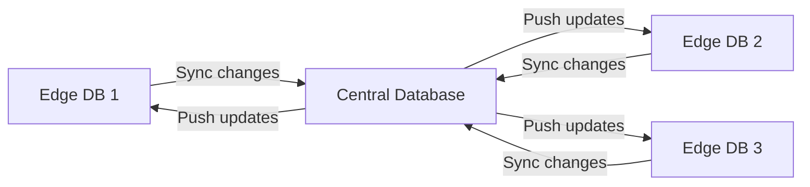
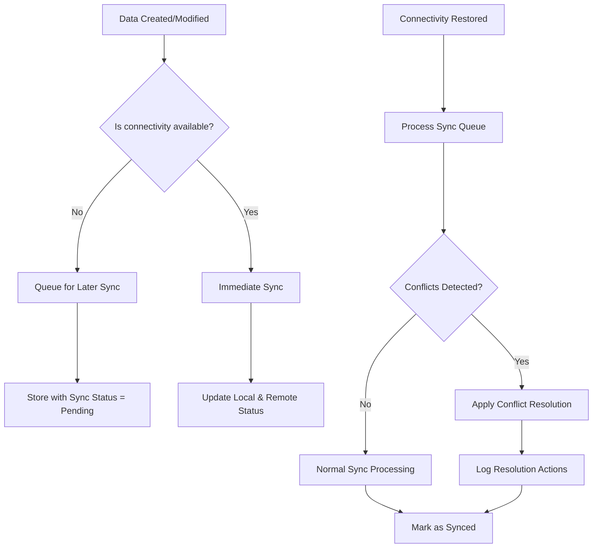

# Edge Computing Databases

## Introduction

Edge computing is revolutionizing how we process and analyze data by moving computation closer to data sources rather than relying solely on centralized cloud infrastructure. **Edge computing databases** are specialized database systems designed to operate efficiently at the "edge" of networks—on devices or local servers that are physically closer to where data is generated.

In traditional cloud computing models, data travels from endpoints (like IoT devices, mobile phones, or sensors) to centralized data centers for processing and storage. This approach introduces latency and consumes bandwidth. Edge computing flips this model by bringing database capabilities directly to or near the source of data generation.

## Why Edge Computing Databases Matter

Edge computing databases address several critical challenges in modern applications:

1. **Latency reduction** - Processing data locally eliminates network delays
2. **Bandwidth conservation** - Only relevant data needs to be sent to the cloud
3. **Offline operation** - Applications can function without continuous internet connectivity
4. **Data sovereignty** - Helps comply with regulations requiring data to stay within specific geographic boundaries
5. **Real-time processing** - Enables instant responses for time-sensitive applications

## Key Characteristics of Edge Computing Databases

Edge computing databases differ from traditional databases in several important ways:

### 1. Lightweight Footprint

Edge databases must operate within the constraints of edge devices, which often have limited resources compared to cloud servers.

```javascript
// Example configuration for a lightweight edge database instance
const edgeDBConfig = {
  memoryLimit: "64MB",
  storageLimit: "500MB",
  maxConnections: 10,
  optimizationMode: "powerSaving"
};
```

### 2. Synchronization Capabilities

Edge databases typically need to synchronize with cloud or central databases.



### 3. Conflict Resolution

When multiple edge nodes modify the same data and later synchronize, conflicts may arise.

```javascript
// Example of a simple conflict resolution strategy
function resolveConflict(localVersion, remoteVersion) {
  if (localVersion.timestamp > remoteVersion.timestamp) {
    return localVersion; // Local changes are newer
  } else if (localVersion.timestamp < remoteVersion.timestamp) {
    return remoteVersion; // Remote changes are newer
  } else {
    // Same timestamp, use version with more properties/changes
    return Object.keys(localVersion.data).length >= 
           Object.keys(remoteVersion.data).length ? 
           localVersion : remoteVersion;
  }
}
```

### 4. Data Filtering and Aggregation

Edge databases often handle large volumes of raw data but only send processed or relevant information to the cloud.

```javascript
// Example edge data processing before sending to cloud
function processEdgeData(rawReadings) {
  // Filter out readings within normal range
  const anomalies = rawReadings.filter(reading => 
    reading.value < reading.normalRangeMin || 
    reading.value > reading.normalRangeMax
  );
  
  // Aggregate normal readings
  const aggregated = {
    deviceId: rawReadings[0].deviceId,
    timestamp: new Date(),
    readingCount: rawReadings.length,
    averageValue: rawReadings.reduce((sum, r) => sum + r.value, 0) / rawReadings.length,
    minValue: Math.min(...rawReadings.map(r => r.value)),
    maxValue: Math.max(...rawReadings.map(r => r.value))
  };
  
  // Send only anomalies in full detail and aggregated summary
  return {
    anomalies: anomalies,
    summary: aggregated
  };
}
```

## Popular Edge Computing Database Solutions

Let's explore some popular edge computing database options:

### SQLite

SQLite is one of the most widely used embedded databases, perfect for edge computing scenarios.

```javascript
// Example of using SQLite in a Node.js edge application
const sqlite3 = require('sqlite3').verbose();
const db = new sqlite3.Database('./edge-device-data.db');

// Create a table for sensor readings
db.serialize(() => {
  db.run(`
    CREATE TABLE IF NOT EXISTS sensor_readings (
      id INTEGER PRIMARY KEY AUTOINCREMENT,
      sensor_id TEXT,
      timestamp INTEGER,
      temperature REAL,
      humidity REAL,
      pressure REAL,
      sync_status INTEGER DEFAULT 0
    )
  `);
  
  // Insert a new reading
  const stmt = db.prepare(`
    INSERT INTO sensor_readings 
    (sensor_id, timestamp, temperature, humidity, pressure) 
    VALUES (?, ?, ?, ?, ?)
  `);
  
  stmt.run('sensor-001', Date.now(), 22.5, 45.2, 1013.2);
  stmt.finalize();
  
  // Query recent readings
  db.all(`
    SELECT * FROM sensor_readings 
    WHERE sync_status = 0 
    ORDER BY timestamp DESC LIMIT 10
  `, (err, rows) => {
    if (err) {
      console.error('Query error:', err);
      return;
    }
    console.log('Recent readings:', rows);
  });
});

// Don't forget to close the database when done
// db.close();
```

### PouchDB/CouchDB

PouchDB is a JavaScript database that syncs with CouchDB and compatible servers.

```javascript
// Example of using PouchDB in a browser-based edge application
import PouchDB from 'pouchdb';

// Create a local database
const localDB = new PouchDB('local-sensors');

// Setup sync with remote CouchDB when online
const remoteDB = new PouchDB('https://example.com/remote-sensors');

// Function to add a reading
async function addReading(reading) {
  try {
    // Add timestamp if not present
    if (!reading.timestamp) {
      reading.timestamp = new Date().toISOString();
    }
    
    // Add a unique ID based on device and timestamp
    const id = `${reading.deviceId}-${reading.timestamp}`;
    
    // Store the reading
    const response = await localDB.put({
      _id: id,
      ...reading,
      synced: false
    });
    
    console.log('Reading stored:', response);
    return response;
  } catch (err) {
    console.error('Error storing reading:', err);
    throw err;
  }
}

// Setup synchronization with remote database
function setupSync() {
  localDB.sync(remoteDB, {
    live: true,
    retry: true,
    filter: function(doc) {
      // Only sync documents marked for syncing
      // This allows selective sync of important data
      return doc.synced !== false;
    }
  }).on('change', function(change) {
    console.log('Sync change:', change);
  }).on('error', function(err) {
    console.error('Sync error:', err);
  });
}

// Check connection and start sync if online
function checkConnectionAndSync() {
  if (navigator.onLine) {
    setupSync();
  }
}

// Initialize
checkConnectionAndSync();

// Listen for online status changes
window.addEventListener('online', checkConnectionAndSync);
```

### TinyDB

TinyDB is a lightweight document-oriented database for Python applications.

```python
# Example of using TinyDB in a Python edge application
from tinydb import TinyDB, Query
from datetime import datetime
import time

# Initialize the database
db = TinyDB('edge_data.json')
Sensor = Query()

# Function to add sensor reading
def add_sensor_reading(sensor_id, temperature, humidity):
    timestamp = datetime.now().isoformat()
    db.insert({
        'sensor_id': sensor_id,
        'timestamp': timestamp,
        'temperature': temperature,
        'humidity': humidity,
        'synced': False
    })
    print(f"Added reading from {sensor_id} at {timestamp}")

# Function to get unsynced readings
def get_unsynced_readings():
    return db.search(Sensor.synced == False)

# Function to mark readings as synced
def mark_as_synced(reading_ids):
    for id in reading_ids:
        db.update({'synced': True}, doc_ids=[id])
    print(f"Marked {len(reading_ids)} readings as synced")

# Simulate collecting and storing sensor data
for i in range(5):
    add_sensor_reading('sensor-001', 22.5 + i*0.1, 45.0 - i*0.2)
    time.sleep(1)

# Get readings that need to be synced to the cloud
unsynced = get_unsynced_readings()
print(f"Found {len(unsynced)} unsynced readings")
print(unsynced)

# In a real application, you would send these to the cloud
# and then mark them as synced
mark_as_synced([1, 2, 3])
```

### RocksDB

RocksDB is a high-performance embedded database from Facebook, optimized for fast storage.

```cpp
// Example of using RocksDB in a C++ edge application
#include <rocksdb/db.h>
#include <rocksdb/options.h>
#include <iostream>
#include <string>

int main() {
    rocksdb::DB* db;
    rocksdb::Options options;
    
    // Create the database if it doesn't exist
    options.create_if_missing = true;
    
    // Optimize for edge device with limited resources
    options.compression = rocksdb::kNoCompression; // Disable compression to save CPU
    options.write_buffer_size = 4 * 1024 * 1024;   // 4MB write buffer
    options.max_open_files = 20;                   // Limit file handles
    
    // Open database
    rocksdb::Status status = rocksdb::DB::Open(options, "/edge/data/sensors", &db);
    if (!status.ok()) {
        std::cerr << "Error opening database: " << status.ToString() << std::endl;
        return 1;
    }
    
    // Store a sensor reading
    std::string key = "sensor001:20230415T123045";
    std::string value = "{\"temperature\":22.5,\"humidity\":45.2,\"pressure\":1013}";
    
    status = db->Put(rocksdb::WriteOptions(), key, value);
    if (!status.ok()) {
        std::cerr << "Error writing to database: " << status.ToString() << std::endl;
    } else {
        std::cout << "Successfully stored reading for " << key << std::endl;
    }
    
    // Retrieve the reading
    std::string result;
    status = db->Get(rocksdb::ReadOptions(), key, &result);
    if (status.ok()) {
        std::cout << "Retrieved value: " << result << std::endl;
    } else {
        std::cerr << "Error reading from database: " << status.ToString() << std::endl;
    }
    
    // Cleanup
    delete db;
    return 0;
}
```

## Real-World Applications

Let's explore some practical use cases for edge computing databases:

### IoT Sensor Networks

A network of environmental sensors deployed across a city uses edge databases to:
- Store readings locally during network outages
- Perform initial analysis to detect anomalies
- Aggregate hourly summaries before sending to the cloud
- Respond to urgent conditions (like detecting air quality issues) with sub-second latency

### Retail Point-of-Sale Systems

Modern POS systems employ edge databases to:
- Continue operation during internet outages
- Sync inventory and sales when connectivity is restored
- Process customer loyalty information locally for fast responses
- Cache product information for quick lookups

```javascript
// Example of a retail POS system using an edge database
class RetailPOSSystem {
  constructor() {
    this.db = new PouchDB('retail-pos');
    this.setupSync();
    this.initializeSystem();
  }
  
  async initializeSystem() {
    // Load essential data
    try {
      const products = await this.db.get('product-catalog');
      const tax_rates = await this.db.get('tax-rates');
      console.log(`System initialized with ${products.items.length} products`);
    } catch (err) {
      console.error('System initialization failed:', err);
      console.log('Attempting to restore from backup...');
      await this.restoreFromBackup();
    }
  }
  
  async recordSale(items, paymentMethod) {
    const sale = {
      _id: `sale-${Date.now()}-${Math.floor(Math.random() * 1000)}`,
      timestamp: new Date().toISOString(),
      items: items,
      total: items.reduce((sum, item) => sum + (item.price * item.quantity), 0),
      payment: paymentMethod,
      synced: false
    };
    
    try {
      await this.db.put(sale);
      await this.updateInventory(items);
      return { success: true, saleId: sale._id };
    } catch (err) {
      console.error('Failed to record sale:', err);
      return { success: false, error: err.message };
    }
  }
  
  async updateInventory(soldItems) {
    try {
      const inventory = await this.db.get('inventory');
      
      soldItems.forEach(soldItem => {
        const item = inventory.items.find(i => i.sku === soldItem.sku);
        if (item) {
          item.quantity -= soldItem.quantity;
          item.lastSold = new Date().toISOString();
        }
      });
      
      // Mark inventory as needing sync
      inventory.needsSync = true;
      await this.db.put(inventory);
    } catch (err) {
      console.error('Inventory update failed:', err);
      // Queue for retry
      this.queueForRetry('inventory-update', soldItems);
    }
  }
  
  setupSync() {
    // Connect to central system when online
    if (navigator.onLine) {
      const remoteDB = new PouchDB('https://central.example.com/retail-db');
      this.syncHandler = this.db.sync(remoteDB, {
        live: true,
        retry: true,
        filter: doc => doc.synced === false || doc.needsSync === true
      }).on('complete', info => {
        console.log('Sync completed:', info);
      }).on('error', err => {
        console.error('Sync error:', err);
      });
    }
    
    // Setup listeners for online/offline events
    window.addEventListener('online', () => this.setupSync());
    window.addEventListener('offline', () => {
      if (this.syncHandler) {
        this.syncHandler.cancel();
      }
    });
  }
  
  // Other methods...
}
```

### Connected Vehicles

Modern vehicles use edge databases to:
- Store telematics data when outside cellular coverage
- Cache navigation data for offline use
- Process sensor data for immediate driver alerts
- Aggregate performance metrics before sending to the manufacturer

### Healthcare Monitoring

Medical edge devices utilize edge databases to:
- Store vital signs with guaranteed persistence
- Analyze patterns locally to detect concerning trends
- Operate independently if hospital networks are unavailable
- Ensure patient data privacy by processing sensitive information locally

## Challenges and Considerations

When implementing edge computing databases, consider these challenges:

### Resource Constraints

Edge devices often have limited CPU, memory, and storage compared to cloud infrastructure.

**Best practices:**
- Choose databases with small footprints
- Implement data retention policies to prevent storage overflow
- Use efficient data structures and indexing
- Consider data compression techniques

### Data Consistency

Managing consistency across distributed edge nodes can be complex.

**Best practices:**
- Implement proper conflict resolution strategies
- Use eventual consistency models where appropriate
- Define clear sync priorities for different data types
- Consider using CRDTs (Conflict-free Replicated Data Types) for automatic merging

### Security

Edge databases may operate in physically accessible or vulnerable environments.

**Best practices:**
- Encrypt data at rest
- Implement secure authentication for database access
- Use TLS for all synchronization traffic
- Regularly audit and update security measures

```javascript
// Example of implementing encryption for edge database
const crypto = require('crypto');

class SecureEdgeDB {
  constructor(dbPath, encryptionKey) {
    this.db = new sqlite3.Database(dbPath);
    this.encryptionKey = encryptionKey;
    this.initializeDatabase();
  }
  
  initializeDatabase() {
    this.db.serialize(() => {
      this.db.run(`
        CREATE TABLE IF NOT EXISTS encrypted_data (
          id TEXT PRIMARY KEY,
          encrypted_value TEXT,
          iv TEXT,
          created_at INTEGER,
          updated_at INTEGER
        )
      `);
    });
  }
  
  encrypt(data) {
    // Create a random initialization vector
    const iv = crypto.randomBytes(16);
    const cipher = crypto.createCipheriv(
      'aes-256-gcm', 
      Buffer.from(this.encryptionKey, 'hex'), 
      iv
    );
    
    // Encrypt the data
    let encrypted = cipher.update(JSON.stringify(data), 'utf8', 'hex');
    encrypted += cipher.final('hex');
    
    // Get the authentication tag
    const authTag = cipher.getAuthTag().toString('hex');
    
    return {
      encryptedData: encrypted,
      iv: iv.toString('hex'),
      authTag
    };
  }
  
  decrypt(encryptedData, iv, authTag) {
    const decipher = crypto.createDecipheriv(
      'aes-256-gcm',
      Buffer.from(this.encryptionKey, 'hex'),
      Buffer.from(iv, 'hex')
    );
    
    decipher.setAuthTag(Buffer.from(authTag, 'hex'));
    
    let decrypted = decipher.update(encryptedData, 'hex', 'utf8');
    decrypted += decipher.final('utf8');
    
    return JSON.parse(decrypted);
  }
  
  async put(id, data) {
    const now = Date.now();
    const { encryptedData, iv, authTag } = this.encrypt(data);
    
    return new Promise((resolve, reject) => {
      this.db.run(
        `INSERT OR REPLACE INTO encrypted_data 
         (id, encrypted_value, iv, auth_tag, created_at, updated_at) 
         VALUES (?, ?, ?, ?, ?, ?)`,
        [id, encryptedData, iv, authTag, now, now],
        function(err) {
          if (err) return reject(err);
          resolve({ id, success: true });
        }
      );
    });
  }
  
  async get(id) {
    return new Promise((resolve, reject) => {
      this.db.get(
        `SELECT encrypted_value, iv, auth_tag FROM encrypted_data WHERE id = ?`,
        [id],
        (err, row) => {
          if (err) return reject(err);
          if (!row) return resolve(null);
          
          try {
            const data = this.decrypt(row.encrypted_value, row.iv, row.auth_tag);
            resolve(data);
          } catch (decryptErr) {
            reject(new Error(`Decryption failed: ${decryptErr.message}`));
          }
        }
      );
    });
  }
}
```

## Implementing an Edge Database Strategy

Here's a step-by-step approach to implementing edge databases in your system:

### 1. Data Categorization

Start by categorizing your data based on:
- Real-time requirements
- Size and frequency of updates
- Importance and criticality
- Privacy sensitivity

### 2. Database Selection

Choose appropriate databases for edge and central components:
- Consider resource requirements
- Evaluate synchronization capabilities
- Assess community support and maturity
- Test performance under expected conditions

### 3. Synchronization Design

Develop a strategy for data synchronization:
- Determine sync frequency and triggers
- Design conflict resolution strategies
- Create data filtering mechanisms
- Implement bandwidth optimization techniques



### 4. Deployment and Monitoring

Create a robust deployment strategy:
- Implement automated deployment processes
- Develop monitoring for edge database health
- Create alerting for sync failures or anomalies
- Plan regular maintenance and updates

## Summary

Edge computing databases represent a paradigm shift in how applications manage and process data. By placing database capabilities closer to data sources, applications can achieve lower latency, reduced bandwidth usage, improved reliability, and better privacy compliance.

Key takeaways:
- Edge databases complement rather than replace cloud databases
- Different edge use cases may require different database solutions
- Proper synchronization and conflict resolution strategies are crucial
- Security must be a fundamental consideration from the beginning

As edge computing continues to grow, understanding how to effectively implement and manage edge databases will become an increasingly valuable skill for developers and architects.

## Exercises

1. **Design Challenge**: Sketch an architecture for a smart home system that uses edge databases to continue functioning during internet outages.

2. **Implementation Exercise**: Using SQLite or PouchDB, create a simple edge database application that can store sensor readings locally and sync them to a central server when connected.

3. **Research Task**: Compare three different edge database solutions not mentioned in this article and evaluate their suitability for IoT applications.

4. **Advanced Exercise**: Implement a conflict resolution strategy for a scenario where multiple users might edit the same data offline and then synchronize.

## Additional Resources

- [Edge Computing: A Comprehensive Introduction](https://www.example.com) 
- [Database Synchronization Patterns](https://www.example.com)
- [PouchDB Documentation](https://pouchdb.com/guides/)
- [SQLite Official Documentation](https://sqlite.org/docs.html)
- [Edge Computing Security Best Practices](https://www.example.com)