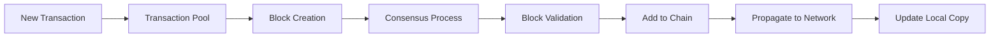

# Blockchain Databases

## Introduction

Blockchain databases represent a revolutionary approach to data storage and management. Unlike traditional databases that rely on centralized control, blockchain databases distribute data across a network of computers (nodes), creating a secure, transparent, and tamper-resistant system.

In this article, we'll explore how blockchain databases work, their key characteristics, and how they differ from conventional database systems. We'll also look at practical applications and implementation examples to help you understand when and why you might choose a blockchain database.

## What is a Blockchain Database?

A blockchain database is a type of distributed database that maintains a continuously growing list of records (blocks) that are linked using cryptography. Each block contains a timestamp, transaction data, and a reference to the previous block, forming a chain of blocks - hence the name "blockchain."

### Key Characteristics

- **Decentralization**: Data is stored across multiple nodes rather than in a single location
- **Immutability**: Once data is written to the blockchain, it cannot be altered or deleted
- **Transparency**: All participants can view the entire database and its history
- **Consensus**: Changes to the database require agreement from network participants
- **Security**: Cryptographic techniques protect data integrity and authenticity

## How Blockchain Databases Work

Let's break down the fundamental components and processes that make blockchain databases function:

### 1. Block Structure

Each block in a blockchain database typically contains:

```javascript
const block = {
  header: {
    previousBlockHash: "0x8F7...", // Reference to previous block
    timestamp: 1647948000,         // When the block was created
    merkleRoot: "0x1D7...",        // Hash of all transactions in the block
    nonce: 42361                   // Number used in mining process
  },
  transactions: [
    { from: "Alice", to: "Bob", amount: 5, signature: "0xA12..." },
    { from: "Charlie", to: "Dave", amount: 2.5, signature: "0xB34..." }
    // More transactions...
  ]
};
```

### 2. Consensus Mechanisms

Blockchain databases use various consensus algorithms to ensure all nodes agree on the state of the database:

#### Proof of Work (PoW)

Nodes compete to solve complex mathematical puzzles:

```javascript
function mineBlock(blockHeader, difficulty) {
  let nonce = 0;
  let hash;
  
  while (true) {
    blockHeader.nonce = nonce;
    hash = calculateHash(blockHeader);
    
    // Check if hash meets difficulty requirement (has leading zeros)
    if (hash.substring(0, difficulty) === '0'.repeat(difficulty)) {
      return { nonce, hash };
    }
    
    nonce++;
  }
}

// Example output:
// { nonce: 42361, hash: "0000a7c83f..." }
```

#### Proof of Stake (PoS)

Validators are selected based on the amount of cryptocurrency they hold and are willing to "stake":

```javascript
function selectValidator(validators, totalStake) {
  // Generate random number between 0 and totalStake
  const randomPosition = Math.floor(Math.random() * totalStake);
  let cumulativeStake = 0;
  
  for (const validator of validators) {
    cumulativeStake += validator.stake;
    if (randomPosition < cumulativeStake) {
      return validator;
    }
  }
}

// Example input:
// validators = [
//   { address: "0x123...", stake: 100 },
//   { address: "0x456...", stake: 50 },
//   { address: "0x789...", stake: 150 }
// ]
// totalStake = 300

// Possible output:
// { address: "0x789...", stake: 150 }
```

### 3. Data Flow in a Blockchain Database

Let's visualize how data flows through a blockchain database:



## Blockchain Databases vs. Traditional Databases

To understand when to use blockchain databases, let's compare them with traditional database systems:

| Feature | Blockchain Databases | Traditional Databases |
|---------|---------------------|----------------------|
| Architecture | Distributed | Centralized or distributed |
| Data Modification | Append-only (immutable) | CRUD operations (mutable) |
| Trust Model | Trustless (consensus-based) | Trusted authority |
| Performance | Generally slower | Generally faster |
| Scalability | Limited by consensus requirements | Highly scalable |
| Query Capabilities | Limited | Advanced (SQL, etc.) |
| Ideal Use Cases | Asset tracking, multi-party systems | General data management |

## Implementing a Simple Blockchain Database

Let's create a basic blockchain database implementation in JavaScript to understand the core concepts:

```javascript
class Block {
  constructor(timestamp, transactions, previousHash = '') {
    this.timestamp = timestamp;
    this.transactions = transactions;
    this.previousHash = previousHash;
    this.hash = this.calculateHash();
    this.nonce = 0;
  }

  calculateHash() {
    // In a real implementation, we would use a cryptographic hash function
    return JSON.stringify(this.previousHash + this.timestamp + JSON.stringify(this.transactions) + this.nonce);
  }

  mineBlock(difficulty) {
    const target = Array(difficulty + 1).join("0");
    while (this.hash.substring(0, difficulty) !== target) {
      this.nonce++;
      this.hash = this.calculateHash();
    }
    console.log(`Block mined: ${this.hash}`);
  }
}

class Blockchain {
  constructor() {
    this.chain = [this.createGenesisBlock()];
    this.difficulty = 2;
    this.pendingTransactions = [];
  }

  createGenesisBlock() {
    return new Block(Date.now(), [], "0");
  }

  getLatestBlock() {
    return this.chain[this.chain.length - 1];
  }

  addTransaction(transaction) {
    this.pendingTransactions.push(transaction);
  }

  minePendingTransactions(miningRewardAddress) {
    const block = new Block(Date.now(), this.pendingTransactions, this.getLatestBlock().hash);
    block.mineBlock(this.difficulty);

    console.log('Block successfully mined!');
    this.chain.push(block);

    // Reset pending transactions and add mining reward
    this.pendingTransactions = [
      { from: "SYSTEM", to: miningRewardAddress, amount: 10 }
    ];
  }

  isChainValid() {
    for (let i = 1; i < this.chain.length; i++) {
      const currentBlock = this.chain[i];
      const previousBlock = this.chain[i - 1];

      if (currentBlock.hash !== currentBlock.calculateHash()) {
        return false;
      }

      if (currentBlock.previousHash !== previousBlock.hash) {
        return false;
      }
    }
    return true;
  }
}

// Usage example
const myCoin = new Blockchain();

console.log('Mining block 1...');
myCoin.addTransaction({ from: 'Alice', to: 'Bob', amount: 50 });
myCoin.minePendingTransactions('miner-address');

console.log('Mining block 2...');
myCoin.addTransaction({ from: 'Bob', to: 'Charlie', amount: 25 });
myCoin.minePendingTransactions('miner-address');

console.log('Blockchain validity:', myCoin.isChainValid());
console.log(JSON.stringify(myCoin, null, 2));

// Output:
// Mining block 1...
// Block mined: 00f7a8b3d4e2c1...
// Block successfully mined!
// Mining block 2...
// Block mined: 00c5d2e9f8a3b1...
// Block successfully mined!
// Blockchain validity: true
```

## Real-World Applications

Blockchain databases have found applications in various domains:

### 1. Supply Chain Management

Tracking products from manufacturer to consumer:

```javascript
// Example of recording a product's journey
function recordSupplyChainEvent(blockchain, productId, event) {
  blockchain.addTransaction({
    productId: productId,
    timestamp: Date.now(),
    location: event.location,
    handler: event.handler,
    action: event.action,
    additionalData: event.metadata
  });
  
  blockchain.minePendingTransactions('supply-chain-validator');
}

// Usage example
recordSupplyChainEvent(supplyChainLedger, "PRD-12345", {
  location: "Warehouse B, Chicago",
  handler: "Logistics Corp",
  action: "Received shipment",
  metadata: {
    temperature: "18°C",
    humidity: "35%",
    inspectionPassed: true
  }
});
```

### 2. Financial Services

Recording and verifying financial transactions:

```javascript
// Example of a tokenized asset transfer
function transferAsset(blockchain, assetId, fromAddress, toAddress, amount) {
  // Verify ownership
  const ownershipValid = verifyOwnership(blockchain, assetId, fromAddress, amount);
  
  if (ownershipValid) {
    blockchain.addTransaction({
      type: "ASSET_TRANSFER",
      assetId: assetId,
      from: fromAddress,
      to: toAddress,
      amount: amount,
      timestamp: Date.now()
    });
    
    blockchain.minePendingTransactions('financial-validator');
    return true;
  }
  
  return false;
}
```

### 3. Healthcare

Secure sharing of patient records:

```javascript
// Example of adding a medical record
function addMedicalRecord(blockchain, patientId, record, doctorId) {
  // Encrypt sensitive data with patient's public key
  const encryptedData = encryptData(record, getPatientPublicKey(patientId));
  
  blockchain.addTransaction({
    type: "MEDICAL_RECORD",
    patientId: patientId,
    doctorId: doctorId,
    recordHash: calculateHash(record), // For verification
    encryptedRecord: encryptedData,
    timestamp: Date.now(),
    accessControl: {
      owner: patientId,
      authorizedViewers: [doctorId, "Hospital-A"]
    }
  });
  
  blockchain.minePendingTransactions('healthcare-validator');
}
```

## Challenges and Limitations

Despite their advantages, blockchain databases face several challenges:

1. **Performance**: Transaction throughput is typically much lower than traditional databases
2. **Scalability**: As the blockchain grows, storage requirements increase
3. **Energy Consumption**: Consensus mechanisms like Proof of Work require significant computational resources
4. **Complexity**: Implementing and maintaining blockchain systems is more complex than traditional databases
5. **Regulatory Concerns**: Legal frameworks for blockchain technology are still evolving

## When to Use Blockchain Databases

Blockchain databases are particularly suited for scenarios where:

- Multiple parties need to interact in an environment with limited trust
- A permanent, tamper-proof record of transactions is required
- Transparency and auditability are essential
- Disintermediation (removing middlemen) provides significant benefits

They're less suitable when:
- High transaction throughput is needed
- Data privacy is paramount
- Simplicity and operational efficiency are priorities
- A trusted central authority already exists and works well

## Summary

Blockchain databases represent a paradigm shift in data management by providing a decentralized, immutable, and transparent approach to storing and processing information. While they're not suitable for every use case, they offer compelling advantages in scenarios requiring trust among multiple parties without a central authority.

As blockchain technology continues to evolve, we're likely to see improvements in scalability, performance, and ease of implementation, potentially broadening the range of suitable applications.

## Exercises

1. Implement a simple blockchain database that stores student grades, ensuring that once recorded, grades cannot be altered.

2. Design a blockchain-based system for tracking donations to a charity, providing transparency to donors about how their contributions are used.

3. Compare the performance of a blockchain database versus a traditional SQL database for a specific use case of your choice.

4. Research and analyze a real-world implementation of blockchain databases, identifying the benefits achieved and challenges faced.

## Additional Resources

- [Bitcoin: A Peer-to-Peer Electronic Cash System](https://bitcoin.org/bitcoin.pdf) - The original Bitcoin whitepaper by Satoshi Nakamoto
- [Ethereum Documentation](https://ethereum.org/en/developers/docs/)
- [Hyperledger Fabric Documentation](https://hyperledger-fabric.readthedocs.io/)
- [BigchainDB Documentation](https://docs.bigchaindb.com/)
- [IPFS Documentation](https://docs.ipfs.io/) - For content-addressable storage