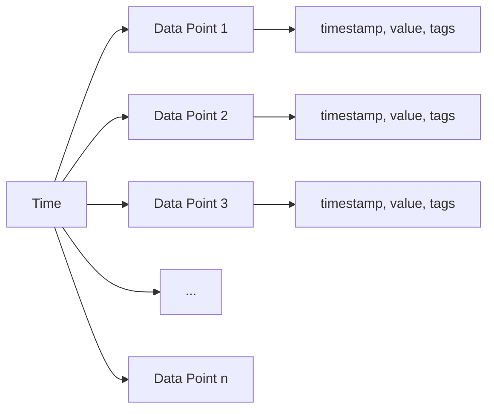

# Time Series Databases

## Introduction

Time Series Databases (TSDBs) are specialized database systems designed to store, retrieve, and process time-stamped data efficiently. Unlike traditional databases, which excel at capturing the current state of data, time series databases are optimized for tracking how data changes over time.

In today's data-driven world, we're constantly generating time-based data:
- IoT sensors recording temperature every minute
- Stock prices changing throughout the trading day
- Website traffic metrics collected hourly
- Health monitoring devices tracking vital signs continuously

Traditional databases can struggle with the volume and velocity of time-stamped data. This is where Time Series Databases come in — they're built from the ground up to handle this specific pattern of data storage and retrieval.

## What Makes a Time Series Database Different?

Time series data has unique characteristics that require specialized handling:

1. **Time-stamped records**: Each data point is associated with a specific point in time
2. **Append-only**: New data is typically added at the "now" end of the timeline
3. **Rarely updated**: Once recorded, historical data rarely changes
4. **Time-based queries**: Common operations include aggregating data by time periods
5. **High write throughput**: Many applications record data at high frequency

Let's visualize the core structure of time series data:



## Key Features of Time Series Databases

### Time-Optimized Data Model

Time series databases organize data in a time-structured way, making it efficient to:

- Insert data points with timestamps
- Query data within specific time ranges
- Aggregate data across time intervals (hourly, daily, monthly)

### Data Compression

Because time series data often follows patterns, TSDBs use specialized compression techniques:

```javascript
// Without compression, time series data might look like:
[
  { timestamp: "2023-01-01 00:00:00", value: 75.2 },
  { timestamp: "2023-01-01 00:01:00", value: 75.3 },
  { timestamp: "2023-01-01 00:02:00", value: 75.1 },
  { timestamp: "2023-01-01 00:03:00", value: 75.2 },
  // ... thousands more entries
]

// With compression, the database might store this more efficiently
// using delta encoding for timestamps and value compression
```

### Downsampling and Retention Policies

TSDBs often include built-in capabilities to:

- **Downsample**: Automatically aggregate older data (e.g., keeping minute-level data for a week, then converting to hourly averages)
- **Auto-expire**: Remove data older than a specified retention period

### Time-Based Querying

Time series databases offer powerful functions for time-based analysis:

- Aggregation by time intervals
- Moving averages
- Rate calculations
- Interpolation for missing values

## Popular Time Series Databases

### InfluxDB

InfluxDB is one of the most popular purpose-built time series databases.

**Key concepts in InfluxDB:**

- **Measurements**: Similar to tables in relational databases
- **Tags**: Indexed metadata for efficient filtering
- **Fields**: The actual data values being stored
- **Points**: Individual data entries with timestamp, measurement, tag set, and field set

Here's how to write data to InfluxDB using its line protocol:

```
# Format: <measurement>[,<tag_key>=<tag_value>] <field_key>=<field_value> [<timestamp>]
cpu,host=server01,region=us-west cpu_usage=80.3 1641024000000000000
```

And here's a basic query using InfluxQL:

```sql
SELECT mean("cpu_usage") FROM "cpu" 
WHERE "host" = 'server01' AND time >= now() - 1h 
GROUP BY time(5m)
```

### TimescaleDB

TimescaleDB extends PostgreSQL with time-series capabilities, offering the best of both worlds: time-series optimization and the full power of a relational database.

Creating a time-series table in TimescaleDB:

```sql
-- First create a regular PostgreSQL table
CREATE TABLE sensor_data (
  time TIMESTAMPTZ NOT NULL,
  sensor_id INTEGER,
  temperature DOUBLE PRECISION,
  humidity DOUBLE PRECISION
);

-- Then convert it to a TimescaleDB hypertable
SELECT create_hypertable('sensor_data', 'time');
```

Querying data with standard SQL:

```sql
-- Get hourly average temperatures for a specific sensor over the past day
SELECT 
  time_bucket('1 hour', time) AS hour,
  AVG(temperature) AS avg_temp
FROM sensor_data
WHERE 
  sensor_id = 12 AND
  time > NOW() - INTERVAL '1 day'
GROUP BY hour
ORDER BY hour;
```

### Prometheus

Prometheus is a monitoring-focused time series database with a built-in scraping and alerting system.

A simple Prometheus query using its PromQL language:

```
# Get the average CPU usage across all instances for the past hour
avg(rate(node_cpu_seconds_total{mode="user"}[5m])) by (instance)
```

## Real-World Applications

### IoT Sensor Monitoring

Imagine you're monitoring temperature sensors across multiple locations in a manufacturing plant:

```javascript
// Sample sensor data structure
{
  "timestamp": "2023-05-15T14:23:00Z",
  "sensor_id": "temp-sensor-123",
  "location": "warehouse-a",
  "temperature": 22.4,
  "humidity": 45.2
}
```

With a time series database, you can:

1. Store millions of readings efficiently
2. Query average temperatures by location and time period
3. Set up alerts for anomalies
4. Visualize trends over time

### Application Performance Monitoring

Modern applications generate numerous metrics:

- Request latency
- Error rates
- Resource utilization
- User activity

A time series database lets you:

```javascript
// Query to get 95th percentile API latency over the last 24 hours
db.query(`
  SELECT 
    time_bucket('15m', timestamp) as time_period,
    percentile_cont(0.95) WITHIN GROUP (ORDER BY response_time) as p95_latency
  FROM api_metrics
  WHERE timestamp > NOW() - INTERVAL '24 hours'
  GROUP BY time_period
  ORDER BY time_period
`)
```

### Financial Market Analysis

Time series databases are perfect for storing market data:

```javascript
// Example query to calculate a simple moving average
const result = await tsdb.query(`
  SELECT 
    date,
    symbol,
    close_price,
    AVG(close_price) OVER (
      PARTITION BY symbol 
      ORDER BY date 
      ROWS BETWEEN 9 PRECEDING AND CURRENT ROW
    ) as moving_avg_10d
  FROM stock_prices
  WHERE 
    symbol = 'AAPL' 
    AND date >= '2023-01-01'
    AND date <= '2023-12-31'
  ORDER BY date
`);
```

## Implementation Example: Building a Simple Metrics Tracker

Let's build a simple metrics tracking system using InfluxDB:

First, let's set up the database connection:

```javascript
const { InfluxDB, Point } = require('@influxdata/influxdb-client');

// Configure client
const token = 'your-influxdb-token';
const url = 'http://localhost:8086';
const org = 'your-organization';
const bucket = 'metrics';

const client = new InfluxDB({ url, token });
const writeClient = client.getWriteApi(org, bucket, 'ns');
```

Now, let's write some data:

```javascript
// Function to record a website visit
function recordPageVisit(page, userAgent, loadTime) {
  const point = new Point('page_visit')
    .tag('page', page)
    .tag('user_agent', userAgent)
    .floatField('load_time', loadTime)
    .timestamp(new Date());
  
  writeClient.writePoint(point);
}

// Record some sample data
recordPageVisit('/home', 'Mozilla/5.0...', 0.342);
recordPageVisit('/products', 'Mozilla/5.0...', 1.271);

// Make sure to flush the data
writeClient.flush();
```

Now, let's query the data:

```javascript
const { QueryApi } = require('@influxdata/influxdb-client');

const queryClient = client.getQueryApi(org);

// Query to get average load time per page for the last 24 hours
const query = `
  from(bucket: "metrics")
    |> range(start: -24h)
    |> filter(fn: (r) => r._measurement == "page_visit")
    |> group(columns: ["page"])
    |> mean(column: "load_time")
`;

queryClient.queryRows(query, {
  next(row, tableMeta) {
    const tableObject = tableMeta.toObject(row);
    console.log(`Page: ${tableObject.page}, Avg Load Time: ${tableObject._value}s`);
  },
  error(error) {
    console.error(error);
  },
  complete() {
    console.log('Query completed');
  }
});
```

## When to Use a Time Series Database

Time series databases are ideal when:

1. You're collecting time-stamped data at regular intervals
2. Your workload is primarily append-only (writing new data, not updating existing data)
3. You need to query data across time ranges and perform time-based aggregations
4. Your data volume is large and growing continuously
5. You need specialized functions for time-based analysis

## When Not to Use a Time Series Database

Time series databases might not be the best choice when:

1. Your data doesn't have a strong time component
2. You need complex relationships between entities (a graph database might be better)
3. You perform frequent updates to existing records
4. You need ACID transaction support for multiple records
5. Your primary access pattern is key-value lookup

## Summary

Time Series Databases solve a specific problem exceptionally well: storing and analyzing data points ordered by time. They offer:

- Optimized storage and retrieval of time-stamped data
- High write throughput for continuous data collection
- Powerful time-based querying capabilities
- Automatic data lifecycle management

As the volume of time-based data continues to grow with IoT, monitoring, and analytics, time series databases have become an essential tool in the modern data storage ecosystem.

## Exercises

1. Install InfluxDB locally and write a simple script to collect and store CPU usage metrics from your computer every 5 seconds.

2. Create a dashboard using Grafana to visualize the data from Exercise 1.

3. Design a schema for a time series database that could track:
   - Stock prices for multiple companies
   - Trading volume
   - News sentiment scores

4. Research how time series databases handle out-of-order data arrivals (when timestamps aren't sequential).

5. Compare query performance between a relational database and a time series database for calculating hourly averages over a month of data.

## Additional Resources

- [InfluxDB Documentation](https://docs.influxdata.com/)
- [TimescaleDB Tutorials](https://docs.timescale.com/tutorials/)
- [Prometheus Getting Started Guide](https://prometheus.io/docs/prometheus/latest/getting_started/)
- [Time Series Database Lectures (CMU Database Group)](https://www.youtube.com/watch?v=2SUBRE6wGiA)

## Key Terms

- **Retention policy**: Rules that determine how long data is kept in the database
- **Downsampling**: The process of reducing data resolution over time
- **Continuous query**: Queries that run automatically at regular intervals
- **Rollup**: Aggregation of detailed data into summary data
- **Cardinality**: The uniqueness of data points, particularly in tag values