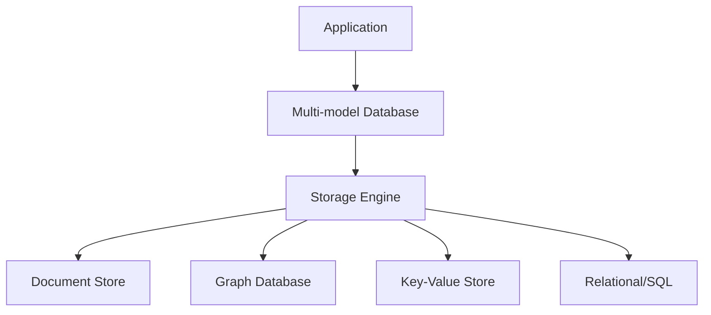

# Multi-model Databases

## Introduction

In the evolving landscape of database technologies, multi-model databases have emerged as a versatile solution to a common challenge: how to efficiently store and query different types of data without requiring multiple specialized database systems.

A multi-model database is a database management system designed to support multiple data models against a single, integrated backend. Instead of using separate databases for different data types (like documents, graphs, key-value pairs, or relational tables), a multi-model database can handle diverse data structures within one system.

## Why Multi-model Databases?

Traditional database systems were typically designed around a single data model:

- Relational databases use tables with rows and columns
- Document databases store semi-structured JSON or XML documents
- Graph databases focus on relationship-rich data
- Key-value stores maintain simple pairs of keys and values

But real-world applications rarely fit neatly into just one data model. Consider an e-commerce application that needs to:

1. Store product catalogs (document model)
2. Manage inventory (relational)
3. Track customer relationships and recommendations (graph)
4. Handle shopping carts (key-value)

Before multi-model databases, developers often had to:
- Use multiple specialized databases
- Create complex integration layers 
- Maintain data consistency across systems
- Deal with operational overhead

Multi-model databases solve these challenges by supporting various data models in a unified system.

## How Multi-model Databases Work

Multi-model databases typically implement one of two approaches:

### 1. Native Multi-model

These databases are built from the ground up to support multiple data models. They have a storage layer that can efficiently represent different data structures and query engines that understand how to work with each model.

### 2. Extended Single-model

These start as a single-model database (often document or graph) and add capabilities to support other models. The additional models are implemented on top of the original storage format.



## Key Features of Multi-model Databases

### 1. Unified Query Language

Most multi-model databases provide a unified query language or API that works across different data models. For example, ArangoDB uses AQL (ArangoDB Query Language) that can query documents, graphs, and key-value data in a single query.

```javascript
// Query that combines document and graph operations in ArangoDB
FOR user IN users
  FILTER user.age > 30
  FOR friend IN 1..1 OUTBOUND user friends
    RETURN { user: user.name, friend: friend.name }
```

### 2. Consistent Transactions

Multi-model databases typically support ACID transactions across different data models, ensuring data consistency when operations span multiple models.

### 3. Flexible Schema

They generally offer schema flexibility, allowing you to adapt your data model as application requirements change.

### 4. Unified Administration

Instead of managing multiple database systems, you have a single system to monitor, back up, and maintain.

## Popular Multi-model Databases

### ArangoDB

ArangoDB supports document, graph, and key-value models natively. It uses a JSON-based storage format and provides AQL for querying across models.

```javascript
// Creating a document collection in ArangoDB
db._createDocumentCollection("products");

// Creating a graph in the same database
var graph_module = require("@arangodb/general-graph");
var graph = graph_module._create("productRelations");
```

### OrientDB

OrientDB combines document and graph models with support for SQL-like querying.

```sql
-- Creating a document class in OrientDB
CREATE CLASS Product EXTENDS V;

-- Adding a document
INSERT INTO Product SET name = "Laptop", price = 999;

-- Creating a graph relationship
CREATE EDGE Purchased FROM (SELECT FROM Customer WHERE name = 'John') 
                        TO (SELECT FROM Product WHERE name = 'Laptop');
```

### Couchbase

Couchbase integrates key-value, document, and N1QL (SQL for JSON) capabilities.

```sql
-- Key-value operation
UPSERT INTO `mybucket` VALUES ("user::1234", {"name": "John", "email": "john@example.com"});

-- Document query using N1QL
SELECT * FROM `mybucket` WHERE type = "user" AND age > 30;
```

### FaunaDB

FaunaDB combines relational, document, graph, and temporal features with a unified query language called FQL.

```javascript
// Creating a collection in FaunaDB
Create(Collection("products"))

// Query that combines document access and relationship traversal
Map(
  Paginate(Match(Index("products_by_category"), "electronics")),
  Lambda("productRef", 
    Let({
      product: Get(Var("productRef")),
      reviews: Map(
        Paginate(Match(Index("reviews_by_product"), Var("productRef"))),
        Lambda("reviewRef", Get(Var("reviewRef")))
      )
    },
    {
      product: Var("product"),
      reviews: Var("reviews")
    })
  )
)
```

## Practical Example: Building a Social Media Application

Let's consider how a multi-model database could power a social media application:

### User Profiles (Document Model)

```javascript
// User document
{
  "userId": "user123",
  "name": "Alice Johnson",
  "email": "alice@example.com",
  "interests": ["photography", "travel", "technology"],
  "joinDate": "2023-01-15"
}
```

### Friend Relationships (Graph Model)

```javascript
// Creating friendship relationships
CREATE EDGE friendship FROM user123 TO user456;
CREATE EDGE friendship FROM user123 TO user789;
```

### User Sessions (Key-Value Model)

```javascript
// Session storage
SET "session:abc123" {
  "userId": "user123",
  "loginTime": "2023-06-01T10:15:30Z",
  "expiryTime": "2023-06-01T12:15:30Z"
}
```

### Content Engagement (Relational/SQL Model)

```sql
-- Tracking post interactions
CREATE TABLE post_interactions (
  userId STRING,
  postId STRING,
  interactionType STRING,
  timestamp DATETIME,
  PRIMARY KEY (userId, postId)
);
```

With a multi-model database, we can query across these different data structures:

```javascript
// Find friends of Alice who liked her recent travel posts
FOR user IN users
  FILTER user.userId == "user123"
  FOR friend IN 1..1 OUTBOUND user friendships
    FOR post IN posts
      FILTER post.userId == user.userId
      AND "travel" IN post.tags
      FOR interaction IN post_interactions
        FILTER interaction.postId == post.id
        AND interaction.userId == friend.userId
        AND interaction.type == "like"
        RETURN { 
          friend: friend.name, 
          postTitle: post.title 
        }
```

This query traverses document data, graph relationships, and relational-like structures in a single operation.

## Advantages of Multi-model Databases

1. **Reduced Complexity**: One database system to learn, deploy, and maintain
2. **Data Consistency**: Simplified transaction management across different data types
3. **Performance**: Less data movement between systems; optimized queries across models
4. **Flexibility**: Adapt to changing application requirements without changing databases
5. **Cost Efficiency**: Lower infrastructure and operational costs

## Challenges and Considerations

1. **Performance Trade-offs**: Multi-model databases may not match the peak performance of specialized systems for a single data model
2. **Learning Curve**: Understanding how to effectively use multiple models requires broader knowledge
3. **Maturity**: Some multi-model solutions are newer than established single-model databases
4. **Migration Complexity**: Moving from multiple specialized databases requires careful planning

## When to Use Multi-model Databases

Multi-model databases are particularly well-suited for:

- Applications with diverse data requirements
- Microservices architectures that need to store different data types
- Projects where future data model needs are uncertain
- Development teams looking to simplify their technology stack
- Applications where relationships between different types of data are important

## Summary

Multi-model databases represent a significant evolution in database technology, offering a unified approach to handling diverse data structures. By supporting multiple data models within a single system, they reduce complexity, improve data consistency, and provide flexibility for modern applications.

As applications continue to grow in complexity and handle increasingly diverse types of data, multi-model databases provide a compelling solution that balances specialized functionality with operational simplicity.

## Additional Resources

- Experiment with ArangoDB's free sandbox environment to try multi-model queries
- Read the research paper "Multi-model Databases: A New Journey to Handle the Variety of Data" for a deeper technical understanding
- Try implementing a simple application that uses different data models in a system like FaunaDB or OrientDB

## Exercises

1. Design a multi-model schema for an online learning platform that needs to store courses (documents), user progress (key-value), learning paths (graphs), and quiz results (relational).

2. Write a query for a multi-model database that finds all users who purchased products that were recommended to them by friends (combining document, graph, and transactional data).

3. Compare the implementation of the same application feature using separate specialized databases versus a multi-model approach. Consider factors like code complexity, query performance, and data consistency.