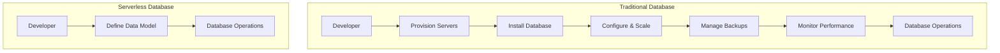
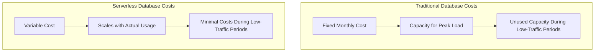

# Serverless Databases

## Introduction

Serverless databases represent a significant evolution in database technology, aligning with the broader serverless computing paradigm that has transformed how developers build and deploy applications. Despite the name, serverless databases aren't actually "server-less" - the servers still exist, but all the server management, provisioning, scaling, and maintenance are handled automatically by the cloud provider rather than by you, the developer.

In a traditional database setup, you need to provision servers, configure them, manage scaling, handle backups, and monitor performance. With serverless databases, these operational tasks are abstracted away, allowing you to focus exclusively on your data and application logic.

## What Makes a Database "Serverless"?

A serverless database typically has the following characteristics:

1. **Auto-scaling**: Capacity adjusts automatically based on the workload.
2. **Pay-per-use pricing**: You're charged based on actual usage (queries, storage, etc.) rather than pre-provisioned capacity.
3. **Zero infrastructure management**: No need to provision, patch, or maintain servers.
4. **High availability**: Built-in redundancy and fault tolerance.
5. **On-demand accessibility**: Resources are available immediately when needed and scale down when not in use.

Let's visualize the architectural differences:



## Popular Serverless Database Options

### 1. Amazon DynamoDB

DynamoDB is a NoSQL serverless database from AWS that offers single-digit millisecond performance at any scale.

**Key features:**
- NoSQL key-value and document database
- Seamless scaling
- Built-in security and backup
- ACID transactions support

**Example: Creating a Table in DynamoDB using AWS SDK for JavaScript**

```javascript
const AWS = require('aws-sdk');
AWS.config.update({ region: 'us-west-2' });

const dynamodb = new AWS.DynamoDB();

const params = {
  TableName: 'Users',
  KeySchema: [
    { AttributeName: 'userId', KeyType: 'HASH' } // Partition key
  ],
  AttributeDefinitions: [
    { AttributeName: 'userId', AttributeType: 'S' }
  ],
  ProvisionedThroughput: {
    ReadCapacityUnits: 5,
    WriteCapacityUnits: 5
  }
};

dynamodb.createTable(params, (err, data) => {
  if (err) {
    console.error('Error creating table:', err);
  } else {
    console.log('Table created successfully:', data);
  }
});
```

**Output:**
```
Table created successfully: {
  TableDescription: {
    TableName: 'Users',
    TableStatus: 'CREATING',
    ...
  }
}
```

### 2. Azure Cosmos DB

Microsoft's globally distributed, multi-model database service with serverless capabilities.

**Key features:**
- Multiple API options (SQL, MongoDB, Cassandra, Gremlin, Table)
- Global distribution
- 99.999% availability SLA
- Automatic indexing

### 3. Firebase Firestore

Google's flexible, scalable NoSQL cloud database for mobile, web, and server development.

**Example: Adding Data to Firestore**

```javascript
import { initializeApp } from 'firebase/app';
import { getFirestore, collection, addDoc } from 'firebase/firestore';

// Initialize Firebase
const firebaseConfig = {
  apiKey: "YOUR_API_KEY",
  authDomain: "YOUR_PROJECT.firebaseapp.com",
  projectId: "YOUR_PROJECT_ID",
  storageBucket: "YOUR_PROJECT.appspot.com",
  messagingSenderId: "YOUR_SENDER_ID",
  appId: "YOUR_APP_ID"
};

const app = initializeApp(firebaseConfig);
const db = getFirestore(app);

// Add a document to a collection
async function addUser(userObj) {
  try {
    const docRef = await addDoc(collection(db, "users"), userObj);
    console.log("Document written with ID: ", docRef.id);
    return docRef.id;
  } catch (e) {
    console.error("Error adding document: ", e);
    throw e;
  }
}

// Example usage
addUser({
  name: "Ada Lovelace",
  email: "ada@example.com",
  birthYear: 1815
});
```

**Output:**
```
Document written with ID: JQH7UnVPgxc2wdHrEbqM
```

### 4. MongoDB Atlas Serverless

A fully managed, on-demand version of MongoDB with pay-as-you-go pricing.

## Benefits of Serverless Databases

### 1. Cost Efficiency

With serverless databases, you only pay for what you use. There are no costs for idle capacity or over-provisioning to handle peak loads.

**Example Cost Comparison:**



### 2. Simplified Developer Experience

Developers can focus on application logic instead of database administration tasks:

```javascript
// Traditional: Need to handle connection pooling, reconnects, etc.
const pool = new ConnectionPool({
  max: 10,
  min: 2,
  idleTimeoutMillis: 30000
});

// Serverless: Just connect and query
const db = serverlessDBConnect();
const result = await db.collection('users').find({age: {$gt: 21}});
```

### 3. Automatic Scaling

Serverless databases automatically scale to handle varying workloads without manual intervention.

### 4. Reduced Time to Market

By eliminating infrastructure management, development teams can build and deploy applications faster.

### 5. Built-in High Availability

Most serverless database offerings include automatic replication and failover mechanisms.

## Limitations and Considerations

Despite their advantages, serverless databases aren't perfect for every use case:

### 1. Cold Start Latency

After periods of inactivity, there may be a slight delay when the database "wakes up" to handle requests.

### 2. Limited Customization

You have less control over the underlying infrastructure and configuration than with traditional databases.

### 3. Potential for Higher Costs at Scale

For applications with predictable, high-volume workloads, traditional databases might be more cost-effective.

### 4. Vendor Lock-in

Serverless databases often use proprietary APIs and features that can make migration difficult.

### 5. Connection Limits

Some serverless databases have limitations on the number of concurrent connections.

## Real-World Applications

### 1. Mobile Applications

Serverless databases like Firebase are ideal for mobile apps due to their real-time synchronization capabilities and built-in authentication.

**Example: Real-time Chat Application with Firestore**

```javascript
import { onSnapshot, collection } from 'firebase/firestore';

// Set up real-time listener for chat messages
function subscribeToChat(roomId, callback) {
  const messagesRef = collection(db, "rooms", roomId, "messages");
  
  return onSnapshot(messagesRef, (snapshot) => {
    const messages = [];
    snapshot.forEach((doc) => {
      messages.push({
        id: doc.id,
        ...doc.data()
      });
    });
    
    // Pass the updated messages to the callback
    callback(messages);
  });
}

// Example usage
const unsubscribe = subscribeToChat("room1", (messages) => {
  console.log("New messages:", messages);
  updateChatUI(messages);
});

// Later, when leaving the chat
unsubscribe();
```

### 2. Microservices Architecture

Serverless databases complement microservices by providing independent data stores that can scale with individual services.

### 3. IoT Applications

IoT devices generating time-series data can benefit from the auto-scaling capabilities of serverless databases.

**Example: Storing IoT Sensor Data in DynamoDB**

```javascript
const AWS = require('aws-sdk');
const docClient = new AWS.DynamoDB.DocumentClient();

async function storeSensorReading(sensorId, reading) {
  const params = {
    TableName: 'SensorReadings',
    Item: {
      sensorId: sensorId,
      timestamp: Date.now(),
      temperature: reading.temperature,
      humidity: reading.humidity,
      batteryLevel: reading.batteryLevel
    }
  };
  
  try {
    await docClient.put(params).promise();
    console.log("Sensor reading stored successfully");
  } catch (err) {
    console.error("Error storing reading:", err);
  }
}

// Example usage
storeSensorReading("kitchen-sensor-01", {
  temperature: 22.5,
  humidity: 45,
  batteryLevel: 87
});
```

### 4. Web Applications with Variable Traffic

E-commerce sites or event-based applications that experience traffic spikes can leverage the auto-scaling capabilities.

## How to Choose a Serverless Database

When selecting a serverless database for your project, consider these factors:

1. **Data model requirements**: Document, key-value, relational, graph?
2. **Query patterns**: What types of queries will your application perform?
3. **Consistency requirements**: Do you need strong consistency or is eventual consistency acceptable?
4. **Ecosystem integration**: How well does it integrate with your existing tech stack?
5. **Cost structure**: Understand the pricing model and how it aligns with your usage patterns.

## Implementing Your First Serverless Database

Let's walk through a simple example of building a REST API with Node.js and a serverless database (Firebase Firestore):

### Step 1: Set Up Your Firebase Project

1. Create a Firebase project at [firebase.google.com](https://firebase.google.com)
2. Enable Firestore in your project
3. Set up security rules for your database

### Step 2: Create an Express API

```javascript
const express = require('express');
const { initializeApp } = require('firebase-admin/app');
const { getFirestore } = require('firebase-admin/firestore');

// Initialize Firebase Admin
initializeApp();
const db = getFirestore();

const app = express();
app.use(express.json());

// Create a new product
app.post('/products', async (req, res) => {
  try {
    const product = req.body;
    const productRef = db.collection('products').doc();
    await productRef.set({
      id: productRef.id,
      name: product.name,
      price: product.price,
      description: product.description,
      createdAt: new Date()
    });
    
    res.status(201).json({ id: productRef.id });
  } catch (error) {
    res.status(500).json({ error: error.message });
  }
});

// Get all products
app.get('/products', async (req, res) => {
  try {
    const productsSnapshot = await db.collection('products').get();
    const products = [];
    
    productsSnapshot.forEach(doc => {
      products.push(doc.data());
    });
    
    res.json(products);
  } catch (error) {
    res.status(500).json({ error: error.message });
  }
});

// Get a single product
app.get('/products/:id', async (req, res) => {
  try {
    const productDoc = await db.collection('products').doc(req.params.id).get();
    
    if (!productDoc.exists) {
      return res.status(404).json({ error: 'Product not found' });
    }
    
    res.json(productDoc.data());
  } catch (error) {
    res.status(500).json({ error: error.message });
  }
});

const PORT = process.env.PORT || 3000;
app.listen(PORT, () => {
  console.log(`Server running on port ${PORT}`);
});
```

This example demonstrates a simple product catalog API using Firestore. The key benefit here is that you can focus entirely on your application logic while Firestore handles all database operations and scaling.

## Future Trends in Serverless Databases

The serverless database landscape continues to evolve rapidly:

1. **Enhanced SQL support**: More robust SQL capabilities in serverless offerings.
2. **Multi-model databases**: Databases that support multiple data models (document, graph, relational) in a single serverless solution.
3. **Edge-enabled serverless databases**: Data stored and processed closer to end-users for lower latency.
4. **Improved migration tools**: Better tools to migrate from traditional to serverless databases.
5. **AI integration**: Built-in AI capabilities for data analysis and querying.

## Summary

Serverless databases represent a paradigm shift in how developers interact with database systems. By abstracting away the operational complexities of database management, they allow development teams to focus on delivering value through their applications rather than spending time on infrastructure concerns.

Key takeaways:
- Serverless databases eliminate the need to provision, scale, and maintain database servers
- They offer pay-per-use pricing, automatic scaling, and high availability
- Popular options include DynamoDB, Cosmos DB, Firestore, and MongoDB Atlas Serverless
- While not suitable for every use case, they excel for applications with variable workloads
- The serverless database ecosystem continues to mature and expand its capabilities

## Exercises

1. **Beginner**: Create a simple to-do list application using Firebase Firestore as the backend.
2. **Intermediate**: Compare the performance and cost of a serverless database versus a traditionally provisioned database for a specific workload.
3. **Advanced**: Implement a multi-region serverless database solution with automated failover and analyze its resilience against regional outages.

## Additional Resources

- [AWS DynamoDB Developer Guide](https://docs.aws.amazon.com/amazondynamodb/latest/developerguide/)
- [Azure Cosmos DB Documentation](https://docs.microsoft.com/en-us/azure/cosmos-db/)
- [Firebase Firestore Documentation](https://firebase.google.com/docs/firestore)
- [MongoDB Atlas Serverless Documentation](https://www.mongodb.com/cloud/atlas/serverless)
- Interactive online courses on platforms like Pluralsight, Udemy, and Coursera